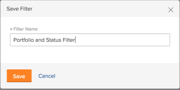

# Gegevens filteren in de bronnenplanner

<!--

(AL:*Iterate on this article: filtering by custom data. Other enhancements? Special characters caveat might change - follow the story to know when. It originally came in Beta 3 17.3.)

-->

Gebruikend filters, kunt u wijzigen welke informatie in de Planner van het Middel van alle informatie toont die in het systeem wordt opgeslagen.

## Toegangsvereisten

U moet het volgende hebben:

<table style="table-layout:auto"> 
 <col> 
 <col> 
 <tbody> 
  <tr> 
   <td role="rowheader">Adobe Workfront-abonnement*</td> 
   <td> 
Pro en hoger
 </td> 
  </tr> 
  <tr> 
   <td role="rowheader">Adobe Workfront-licentie*</td> 
   <td> 
Controleren of hoger<!--
      <MadCap:conditionalText data-mc-conditions="QuicksilverOrClassic.Draft mode">
        (this seems to be the case in NWE only, not classic. Waiting on Vazgen's response for this)
      </MadCap:conditionalText>
     -->
 </td> 
  </tr> 
  <tr> 
   <td role="rowheader">Configuraties op toegangsniveau*</td> 
   <td> 
De mening of hogere toegang tot Projecten, Gebruikers, en het Beheer van het Middel 
 
<b>OPMERKING</b>

Als u nog steeds geen toegang hebt, vraagt u de Workfront-beheerder of deze aanvullende beperkingen op uw toegangsniveau instelt. Voor informatie over hoe een beheerder van Workfront uw toegangsniveau kan veranderen, zie <a href="../../administration-and-setup/add-users/configure-and-grant-access/create-modify-access-levels.md" class="MCXref xref">Aangepaste toegangsniveaus maken of wijzigen</a>.
 </td>
</tr> 
  <tr> 
   <td role="rowheader">Objectmachtigingen</td> 
   <td> 
Toestemmingen of hoger van de mening voor projecten
 
Voor informatie over het aanvragen van aanvullende toegang raadpleegt u <a href="../../workfront-basics/grant-and-request-access-to-objects/request-access.md" class="MCXref xref">Toegang tot objecten aanvragen </a>.
 </td> 
  </tr> 
 </tbody> 
</table>

*Neem contact op met uw Workfront-beheerder om te weten te komen welk abonnement, licentietype of toegang u hebt.

## Overzicht van de filters Bronnen

Om de hoeveelheid informatie te minimaliseren die in de Planner van het Middel wordt getoond, verstrekt Adobe Workfront een StandaardFilter met vooraf geconfigureerde criteria. Zie de sectie voor informatie over het standaardfilter [Overzicht van het standaardfilter in de bronnenplanner](#overview-of-the-default-filter-in-the-resource-planner) in dit artikel.

U kunt ook aangepaste filters maken. Zie de sectie voor informatie over het aanpassen van filters in de functie Bronnen [Bronplannerfilters maken](#create-resource-planner-filters) in dit artikel.

Overweeg het volgende wanneer het gebruiken van filters in de Planner van het Middel:

* De filters die u maakt, zijn alleen voor u zichtbaar. U kunt filters delen om deze beschikbaar te maken voor andere gebruikers.
* Als Workfront-beheerder kunt u alleen filters zien die u maakt of die met u worden gedeeld.
* De gefilterde resultaten veranderen niet wanneer u een verschillende mening voor de Planner van het Middel selecteert.\
  Voor meer informatie over het veranderen van de mening in de Planner van het Middel, zie de de selectiesectie van de &quot;van het Project/van de Rol/van de mening van de Gebruiker&quot;in [Overzicht van de navigatie in de bronnenplanner](../../resource-mgmt/resource-planning/resource-planner-navigation.md).

* Het toepassen van een filter verandert niet de toewijzing en beschikbaarheidsgegevens in de Planner van het Middel voor projecten, rollen, of gebruikers. Een filter wijzigt alleen het aantal objecten dat u in de functie Bronnen ziet.
* Filteren is van toepassing op alle voorwerpen die tezelfdertijd in de Planner van het Middel tonen. Als u bijvoorbeeld voor een specifieke gebruiker filtert, geeft de functie Bronnen alleen de volgende resultaten weer:

   * Projecten waarbij die gebruiker deel uitmaakt van de bronnenpool (voor de projectweergave en de weergave Rol) of een toewijzing heeft voor het project (voor de weergave Gebruiker)
   * Rollen verbonden aan de gebruiker op die projecten\
     Andere rollen of gebruikers op de projecten waaraan de gebruiker wordt geassocieerd tonen niet.

## Overzicht van het standaardfilter in de bronnenplanner {#overview-of-the-default-filter-in-the-resource-planner}

Als u de functie Bronnen voor het eerst opent, past Workfront het filter Standaard toe. U kunt het filter Standaard bewerken en alleen filteren op de items die u wilt weergeven. Zie de sectie voor informatie over het wijzigen van filters [Een filter bewerken in de functie Bronnen](#edit-a-filter-in-the-resource-planner) in dit artikel.

Houd rekening met het volgende wanneer u het filter Standaard gebruikt:

* De standaardfilter wint informatie slechts van projecten met het volgende terug:

   * Een geplande afsluitdatum die valt na de eerste datum van de huidige maand
   * Een geplande begindatum die valt vóór de laatste dag van de vierde maand vanaf de huidige datum
   * Status van huidige of geplande

  >[!IMPORTANT]
  >
  >Het standaardfilter wint informatie van de projecten terug die altijd binnen vier maanden beginnen met de eerste dag van de huidige maand, ongeacht het tijdkader u aan de vertoning in de Planner van het Middel selecteert.

* In de Mening van de Gebruiker, tonen alle gebruikers in de systeemvertoning maar slechts de gebruikers verbonden aan de gefiltreerde projecten uurinformatie.
* U kunt de informatie in het standaardfilter bewerken zonder het filter op te slaan.
* U kunt een kopie van het filter Standaard dupliceren en bewerken, de gewenste criteria erin wijzigen en deze vervolgens opslaan als een nieuw filter.
* U kunt het standaardfilter niet verwijderen of delen.

  

## Bronplannerfilters maken {#create-resource-planner-filters}

<!--

(Alina: **^ This section is somewhat duplicated (format more than content) from the "Filtering Utilization Information" section in "Viewing Utilization Information for Projects, Programs, and Portfolios.")

-->

Het maken van een filter in de Planner van het Middel is identiek voor alle meningen.

Zorg ervoor dat de eerste vereisten voor het weergeven van de juiste informatie in de functie Bronnen aanwezig zijn voordat u een filter maakt.\
Voor informatie over het voldoen aan de noodzakelijke eerste vereisten voor het werken met de Planner van het Middel, zie de &quot;Vereisten voor het werken in de Planner van het Middel&quot;sectie in [Overzicht van de bronnenplanner](../../resource-mgmt/resource-planning/get-started-resource-planner.md) artikel.

Houd rekening met het volgende wanneer u een filter maakt:

* Er is geen limiet voor het aantal objecten waarvoor u in één keer kunt filteren.
* De beschikbare velden die u aan een filterwijziging kunt toevoegen, zijn afhankelijk van het object van de weergave die u op de functie Bronnen toepast. U kunt bijvoorbeeld alleen in de weergave Gebruiker filteren op de velden Uitgave of Taak, omdat deze objecten alleen in de weergave Gebruiker worden weergegeven. Als u een filter voor Kwesties of Taken in de mening van de Gebruiker bouwt en dan het op de mening van het Project of van de Rol toepast, wordt het genegeerd omdat de gebieden niet in de mening van het Project of van de Rol bestaan. In dit geval lijkt het filter niet beschikbaar.

Een filter maken in de bronnenplanner:

1. Klik op de knop **Hoofdmenu** pictogram  rechtsboven in Adobe Workfront.

1. Klikken **Bronnen**.

   De **Planner** worden standaard weergegeven.

   De eerste keer dat u toegang krijgt tot de functie Bronnen, <strong>Standaardfilter</strong> wordt toegepast. Zie voor meer informatie over het filter Standaard het dialoogvenster <a href="#overview-of-the-default-filter-in-the-resource-planner" class="MCXref xref">Overzicht van het standaardfilter in de bronnenplanner</a> in dit artikel.

1. Klik in de linkerbovenhoek van het dialoogvenster op de knop **Filter** pictogram.\
   \
   of\
   Breid uit **Filter** vervolgkeuzelijst en klik op **Nieuw filter toevoegen**.\
   

1. Als u een filter wilt maken aan de hand van de ingebouwde criteria, geeft u een van de volgende velden op:

   * **Portfolio**: Typ de naam van het portfolio dat de gegevens bevat die u wilt opnemen in de bronnenplanner en klik vervolgens op de naam wanneer deze wordt weergegeven in de lijst.\
     Herhaal dit proces om informatie uit meerdere portfolio&#39;s op te nemen.

   * **Projectstatus**: Vouw het vervolgkeuzemenu Projectstatus uit en selecteer een of meerdere projectstatussen in de lijst.
   * **Team**: Typ de naam van een of meerdere teams die zijn gekoppeld aan de gebruikers die zijn toegewezen aan taken in de projecten die u wilt weergeven.
   * **Functie**: Typ de naam van een of meerdere taakrollen die zijn gekoppeld aan de gebruikers die zijn toegewezen aan taken in de projecten die u wilt weergeven.
   * **Pools**: Begin typend de naam van één of veelvoudige Pools van het Middel die met de projecten (voor de Mening van het Project), de gebruikers (voor de Mening van de Gebruiker) worden geassocieerd, of met zowel de projecten als de gebruikers (voor de Mening van de Rol) die u wilt bekijken.
   * **Groep**: Typ de naam van een of meerdere groepen die zijn gekoppeld aan de gebruikers (in de weergave Gebruiker) of projecten (in de weergave Project en Rol) die u wilt weergeven.

1. Klikken **Filterregel toevoegen** typt u vervolgens de veldnaam waarop u wilt filteren in het dialoogvenster **Tekst om items te filteren** doos. Als het veld beschikbaar is, wordt het gevuld voor elk object waaraan het kan worden gekoppeld.

   >[!IMPORTANT]
   >
   >Wanneer u naar aangepaste velden verwijst, moet u de veldnaam en niet het veldlabel typen. Het veldlabel wordt weergegeven op een aangepast formulier dat is gekoppeld aan een object. Zie voor informatie over het verschil tussen het label en de naam van een aangepast veld  [Een aangepast formulier maken of bewerken](../../administration-and-setup/customize-workfront/create-manage-custom-forms/create-or-edit-a-custom-form.md) .

1. Klik op de naam van het veld om het aan het filter toe te voegen wanneer het in de lijst wordt weergegeven.\
   Voor meer informatie over de velden die u in de lijst ziet, raadpleegt u [Woordenlijst met Adobe Workfront-terminologie](../../workfront-basics/navigate-workfront/workfront-navigation/workfront-terminology-glossary.md).

1. (Optioneel) Selecteer de filter- en voorwaardomstandigheden voor het filter. De beschikbare modifiers worden beschreven in [Filter- en voorwaardenmodificatoren](../../reports-and-dashboards/reports/reporting-elements/filter-condition-modifiers.md).

   U kunt op gebruiker-gebaseerde of op datum-gebaseerde vervangingen gebruiken om voor informatie te filtreren verbonden aan het het programma geopende gebruiker.\
   Zie voor informatie over ondersteunde jokertekens in filters [Overzicht van jokertekenfiltervariabelen](../../reports-and-dashboards/reports/reporting-elements/understand-wildcard-filter-variables.md).

1. Klikken **Opslaan** om de filterregel op te slaan.
1. (Optioneel) Klik op **Filterregel toevoegen** om een nieuwe regel toe te voegen voor een ander object of veld.
1. Klikken **Toepassen** om het filter toe te passen zonder het op te slaan.

   of

   Klikken **Filter opslaan** het filter opslaan.\
   

1. (Voorwaardelijk) Nadat u klikt **Opslaan** geeft u een naam op voor het filter in het dialoogvenster **Filternaam** in de **Filter opslaan** in. Dit is een verplicht veld.\
   

   >[!NOTE]
   >
   >Als uw filternaam speciale tekens bevat, gebruikt u alleen de volgende tekens:
   >
   >* Komma
   >* Snede
   >* Afbreekstreepje
   >* Onderstrepingsteken

1. Klikken **Opslaan**.

   De resultaten in de Planner van het Middel worden nu gefiltreerd door de informatie u in de filterregels omvatte.

## Een bestaand filter toepassen

Wanneer u of iemand met toegang tot de Planner van het Middel een filter opslaat, wordt het beschikbaar aan iedereen die de Planner van het Middel gebruikt.

Een bestaand filter toepassen:

1. Ga naar de bronnenplanner.
1. Vouw in de linkerbovenhoek de **Filter** vervolgkeuzelijst.

   In dit menu ziet u filters die u hebt gemaakt of andere filters die met u zijn gemaakt en gedeeld.\
   

1. Selecteer een filter in het vervolgkeuzemenu. U kunt filters zien die u of andere gebruikers in dit menu hebben gemaakt.\
   Wanneer u een filter selecteert, vermindert het automatisch de hoeveelheid informatie die in de Planner van het Middel toont.

## Een filter bewerken in de functie Bronnen {#edit-a-filter-in-the-resource-planner}

U kunt een filter in de Planner van het Middel uitgeven door één van het volgende te doen:

* [De naam van een filter wijzigen](#rename-a-filter)
* [De informatie in een filter bewerken](#edit-the-information-in-a-filter)
* [Een filter dupliceren](#duplicate-a-filter)

Wanneer u een filter bewerkt, wordt het bijgewerkt voor alle gebruikers in het systeem die toegang hebben tot de functie voor het toewijzen van bronnen.

### De naam van een filter wijzigen {#rename-a-filter}

U kunt de naam van een filter wijzigen zonder de criteria te wijzigen. We raden u aan andere gebruikers in het systeem op de hoogte te stellen van deze wijziging, aangezien filters zichtbaar zijn voor andere gebruikers. Deze wijziging is van invloed op de lijsten met filters voor iedereen die de functie Bronnen kan zien.

1. Ga naar de functie Bronnen en vouw de **Filter** een opgeslagen filter te selecteren.
1. Breid uit **Filter** vervolgkeuzelijst. Zoek het filter waarvan u de naam wilt wijzigen en houd het boven de naam.
1. Selecteer de **Naam filter wijzigen** naast de naam van het filter.

   

1. Geef een nieuwe naam voor het filter op in het dialoogvenster **Filternaam** doos.
1. Klikken **Opslaan**.\
   De informatie in het filter is gelijk en de naam wordt bijgewerkt.

### De informatie in een filter bewerken {#edit-the-information-in-a-filter}

U kunt de gegevens die u in een filter opneemt, wijzigen zonder de naam ervan te wijzigen. We raden u aan andere gebruikers in het systeem op de hoogte te stellen van deze wijziging, aangezien filters voor hen zichtbaar zijn. Deze wijziging is van invloed op de lijsten met filters voor iedereen die de functie Bronnen kan zien.

1. Ga naar de functie Bronnen en vouw de **Filter** in de linkerbovenhoek.
1. Selecteer een bestaand filter dat u wilt bewerken.
1. Klik op de knop **Filter** pictogram.\
   

1. Voeg nieuwe velden toe aan het filter.\
   Voor informatie over het bouwen van filters, zie [Bronplannerfilters maken](#create-resource-planner-filters).

1. Houd de aanwijzer boven de bestaande velden die voor het filter zijn geselecteerd en klik op de knop **Bewerken** pictogram om een ander veld te selecteren, of **Verwijderen** pictogram om het veld te verwijderen.\
   

1. (Optioneel) Klik op **Filterregel toevoegen** om nieuwe velden aan het filter toe te voegen.\
   Zie voor meer informatie over het definiëren van filtercriteria [Bronplannerfilters maken](#create-resource-planner-filters).

1. Klikken **Toepassen** om het filter toe te passen zonder het op te slaan.

   of

   Klikken **Opslaan** het filter opslaan.\
   Het filter wordt met dezelfde naam maar met nieuwe filtercriteria opgeslagen.

### Een filter dupliceren {#duplicate-a-filter}

U kunt een bestaand filter dupliceren. De oorspronkelijke filtercriteria blijven hetzelfde in het gedupliceerde filter en u kunt het nieuwe filter onder een andere naam opslaan.

1. Ga naar de functie Bronnen en vouw de **Filter** in de linkerbovenhoek.
1. Houd de muis boven de naam van een opgeslagen filter dat u wilt dupliceren.
1. Klik op de knop **Dupliceren** pictogram.

   \
   Het vak Filter dupliceren wordt weergegeven.

1. In de **Filternaam** geeft u een nieuwe naam voor het gedupliceerde filter op.\
   De standaardnaam voor het nieuwe filter is *`<Original Filter Name>`(kopie)*.

1. Klikken **Opslaan**. Er wordt een nieuw filter gemaakt met dezelfde criteria als het oorspronkelijke filter en met een nieuwe naam.

   >[!NOTE]
   >
   >Hoewel u 2 filters door de zelfde naam en met identieke criteria kunt hebben, adviseren wij dat u filters met unieke het filtreren criteria en namen in uw Planner van het Middel bewaart om verwarring te vermijden.

## Een filter verwijderen

U kunt een filter verwijderen wanneer het niet meer nodig is. U kunt het standaardfilter niet verwijderen.

Voor informatie over het standaardfilter raadpleegt u de [Overzicht van het standaardfilter in de bronnenplanner](#overview-of-the-default-filter-in-the-resource-planner) in dit artikel.

Wanneer u een filter verwijdert, wordt het filter verwijderd voor alle Workfront-gebruikers die toegang hebben tot de Resource Planner. Voordat u het filter verwijdert, moet u ervoor zorgen dat het filter dat u wilt verwijderen niet meer wordt gebruikt door iemand anders die in de Resource Planner werkt. Een verwijderd filter kan niet worden hersteld.

Een filter verwijderen:

1. Ga naar de bronnenplanner.
1. Breid uit **Filter** vervolgkeuzelijst.
1. Zoek het filter dat u wilt verwijderen en houd de muisaanwijzer boven de naam van het filter.
1. Selecteer de **Filter verwijderen** naast de naam van het filter.

   

1. Klikken **Verwijderen** in de **Filter verwijderen** in.

1. Het filter wordt verwijderd uit de bronnenplanner.

## Een filter delen

U kunt een filter delen dat u hebt gemaakt of dat u toegang hebt om met andere gebruikers te delen. U kunt het standaardfilter niet delen, maar u kunt het wel dupliceren en de kopie delen.

>[!NOTE]
>
>Alle gebruikers, inclusief Workfront-beheerders, hebben alleen toegang tot filters die ze hebben gemaakt of die met hen zijn gedeeld. U kunt een filter met specifieke gebruikers delen om een filter ter beschikking te stellen van alle gebruikers van de Planner van het Middel.

Voor informatie over het standaardfilter raadpleegt u de [Overzicht van het standaardfilter in de bronnenplanner](#overview-of-the-default-filter-in-the-resource-planner) in dit artikel.

Voor informatie over het dupliceren van filters raadpleegt u de [Een filter dupliceren](#duplicate-a-filter) in dit artikel.

1. Ga naar de bronnenplanner.
1. Breid uit **Filter** vervolgkeuzelijst.
1. Zoek het filter dat u wilt delen en houd de muisaanwijzer boven de naam van het filter.
1. Selecteer de **Delen, filter** naast de naam van het filter.

   

   Het dialoogvenster Filtertoegang wordt weergegeven.

1. (Optioneel) Als u het filter beschikbaar wilt maken voor alle gebruikers van de Resource Planner, klikt u op de knop **Instellingen** pictogram, dan selecteren **Dit voor het hele systeem zichtbaar maken**.

   

1. In de **Toegang tot het bronnenplannerfilter verlenen aan:** typt u de namen van gebruikers, teams, rollen, groepen of bedrijven waarmee u het filter wilt delen.
1. Selecteer een van de volgende machtigingsniveaus:

   * Weergave
   * Beheren

     Zie voor informatie over machtigingen in Workfront [Overzicht van het delen van machtigingen voor objecten](../../workfront-basics/grant-and-request-access-to-objects/sharing-permissions-on-objects-overview.md)

1. (Optioneel) Klik op **Geavanceerde instelling** s om toestemmingen voor elk niveau toe te voegen door hen te selecteren of toestemmingen voor elk niveau te verwijderen door hen te schrappen.

   

1. Klikken **Opslaan**.

   Het filter wordt gedeeld met de entiteiten die u hebt geselecteerd en wordt weergegeven in het dialoogvenster **Gedeeld met mij** gebied.

   
