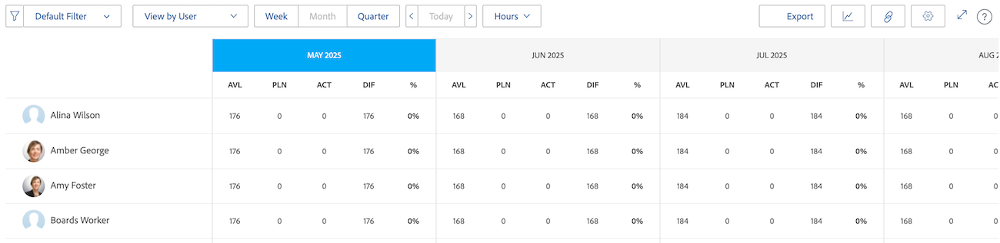

# Overzicht van de navigatie in de bronnenplanner

<!-- Audited: 5/2025 -->

Met de Adobe Workfront Resource Planner kunt u eenvoudig de beschikbaarheid van uw bronnen en de geplande tijd die nodig is om de werkzaamheden aan uw projecten te voltooien, begrijpen. U kunt de toewijzing van uw gebruikers en hun baanrollen op de projecten dan beheren zij aan worden toegewezen.

>[!TIP]
>
>U kunt niet de toewijzing van teams op de taken beheren zij aan in de Planner van het Middel worden toegewezen.

U moet aan de eerste vereisten voldoen nodig om de Planner van het Middel volledig te gebruiken. Voor meer informatie over de Planner van het Middel, zie [ Overzicht van de Planner van het Middel ](../../resource-mgmt/resource-planning/get-started-resource-planner.md).

In de volgende secties worden alle gebieden van de bronnenplanner beschreven.

## Tijdlijn van projecten

Gebruik de kalender bij de bovenkant van de Planner van het Middel om de chronologie van de projecten te navigeren u bekijkt. De tijdlijn begint standaard met de maand van vandaag.

Voor meer informatie over het veranderen van het tijdframe van de chronologie u in de Planner van het Middel toont, zie de sectie [ selectie van het Tijdkader ](#timeframe-selection) in dit artikel.

## Tijdlijnselectie  {#timeframe-selection}

Door gebrek, toont de Planner van het Middel middelinformatie 3 of 4 maanden in een tijd, die met de huidige maand begint. Het aantal weergegeven tijdsperiodes is afhankelijk van de breedte van het scherm.

>[!TIP]
>
>U kunt niet meer dan vier tijdsperioden tegelijkertijd in de Planner van het Middel tonen.

Als u door de tijdlijn wilt navigeren, klikt u op de achterste en voorwaartse pijlen om naar achteren en naar voren te gaan op de tijdlijn. U kunt dan uit de volgende opties van de datumwaaier in de Planner van het Middel selecteren door de aangewezen knopen te klikken:

<table style="table-layout:auto"> 
    <col> 
    <col> 
    <tbody> 
     <tr> 
      <td role="rowheader">Week</td> 
      <td>Geeft informatie per week weer.  het aantal van de weekvertoningen naast de data in de kolomkopbal. </td> 
     </tr> 
     <tr> 
      <td role="rowheader">Maand</td> 
      <td> Geeft informatie per maand weer.</td> 
     </tr> 
     <tr> 
      <td role="rowheader">Kwart</td> 
      <td>Geeft informatie per kwartaal weer.  het aantal van de kwartvertoningen naast de data in de kolomkopbal.  de kwarten van de Douane tonen niet in de Planner van het Middel. </td> 
     </tr> 
     <tr> 
      <td role="rowheader">Vandaag</td> 
      <td>Keert terug naar de maand, de week, of het kwartaal van vandaag.</td> 
     </tr> 
    </tbody> 
   </table>

## Project/ Rol/ Selectie van gebruikersweergave

U kunt de weergave in de functie Bronnen wijzigen, afhankelijk van de manier waarop de informatie moet worden weergegeven.

Door gebrek, toont de Planner van het Middel in de Mening van de Gebruiker. U kunt de weergave wijzigen in de project- of rolweergaven. Wanneer u de weergave wijzigt in een andere weergave, wordt uw keuze de standaardweergave.

Wanneer u de weergave wijzigt, verandert ook de volgende informatie:

* De objecthiërarchie (informatie in de rijen van de functie Bronnen).
* De informatie van de uurtoewijzing (informatie in de kolommen van de Planner van het Middel).

  Voor meer informatie over wat de kolommen in de Planner van het Middel afhankelijk tonen van welke mening u selecteert, zie [ het middelbeschikbaarheid en de toewijzing van het Overzicht gebruikend de Planner van het Middel van Adobe Workfront ](../../resource-mgmt/resource-planning/resource-availability-allocation-resource-planner.md).

Om nauwkeurige informatie in de Planner van het Middel te tonen, moet u aan een reeks eerste vereisten voldoen. Voor meer informatie over de eerste vereisten, zie de Eerste vereisten voor het werken in de sectie van de Planner van het Middel in het [ overzicht van de Planner van het Middel ](../../resource-mgmt/resource-planning/get-started-resource-planner.md) artikel.

Als u de weergave in de functie Bronnen wilt wijzigen, selecteert u een van de volgende weergaven in het vervolgkeuzemenu Weergeven op:

* [Weergeven op project](#view-by-project)
* [Weergeven op rol](#view-by-role)
* [Weergeven op gebruiker](#view-by-user)

### Weergeven op project {#view-by-project}

Overweeg het volgende wanneer het selecteren van de Mening van het Project in de Planner van het Middel:

* U kunt projecten zien die u toestemmingen aan mening hebt.
* Wanneer u tot de Planner van het Middel voor het eerst toegang hebt, kunt u projecten zien die door de StandaardFilter worden gefilterd.\
  Voor meer informatie, zie [ informatie van de Filter in de Planner van het Middel ](../../resource-mgmt/resource-planning/filter-resource-planner.md).

* Het aantal items dat u vanuit de projectweergave weergeeft of kunt exporteren, is beperkt om de prestaties te verbeteren.\
  Voor meer informatie, zie de Beperkingen in de sectie van de Mening van het Project in het [ de vertoningsbeperkingen van de Planner van het Middel ](../../resource-mgmt/resource-planning/resource-planner-display-limitations.md) artikel.

* De projecten worden vermeld in de orde van hun prioriteit in de Mening van het Project.\
  Voor meer informatie, zie de [ sectie van de Prioriteit van de Planning van het Project ](#project-planning-priority) in dit artikel.

* Terwijl u elk project uitbreidt, kunt u de bijbehorende taakrollen weergeven.

* Wanneer u elke rol uitbreidt, kunt u gebruikers weergeven die aan de rol zijn gekoppeld. Schuif om meer rollen en gebruikers onder elk project te laden.

* Als deze weergave wordt toegepast, worden de Roluren, VTE of Kosten opgeteld bij de projecturen, VTE of Kosten.

* U kunt het volgende uur, FTE, of de informatie van Kosten in de mening van het Project bekijken:

   * Beschikbaar
   * Geplant
   * begroot
   * Variantie
   * Netto

     Voor meer informatie, zie [ middelen van de Begroting in de Planner van het Middel gebruikend de meningen van het Project en van de Rol ](../../resource-mgmt/resource-planning/budget-resources-project-role-views-resource-planner.md).

### Weergeven op rol {#view-by-role}

Houd rekening met het volgende wanneer u de weergave Rol selecteert in de functie voor insteekmodule:

* U moet minstens de toegang van de Mening tot het Beheer van het Middel en meningstoestemmingen op projecten hebben om de rollen te bekijken verbonden aan die projecten.
* U kunt elke rol uitbreiden om een lijst van projecten, en elk project te tonen om een lijst van gebruikers te tonen die die rollen op de projecten kunnen vervullen.
* Het aantal items dat u vanuit de weergave Rol weergeeft of kunt exporteren, is beperkt om de prestaties te verbeteren.\
  Voor meer informatie, zie de Beperkingen in de sectie van de Mening van de Rol in [ de vertoningsbeperkingen van de Planner van het Middel ](../../resource-mgmt/resource-planning/resource-planner-display-limitations.md).

* De projecten worden vermeld onder de baanrol in de zelfde orde van prioriteit zoals zij in de Mening van het Project worden vermeld.
* Als deze weergave wordt toegepast, worden de projecturen, VTE of Kosten opgeteld bij de Roluren, VTE of Kosten.
* U kunt het volgende uur, FTE, of de informatie van Kosten in de mening van de Rol bekijken:

   * Beschikbaar
   * Geplant
   * begroot
   * Variantie
   * Netto

     Voor meer informatie, zie [ middelen van de Begroting in de Planner van het Middel gebruikend de meningen van het Project en van de Rol ](../../resource-mgmt/resource-planning/budget-resources-project-role-views-resource-planner.md).

### Weergeven op gebruiker {#view-by-user}

U kunt de Planner van het Middel in de Mening van de Gebruiker tonen om het verschil tussen Gepland en Beschikbare Uren of FTE voor uw gebruikers te begrijpen of de hoeveelheid Werkelijke Uren te zien zij het programma hebben geopend.

U kunt uw middelen niet begroten wanneer het toepassen van de Mening van de Gebruiker op de Planner van het Middel. U moet uw middelen gebruikend de mening van het Project of van de Rol begroeten, en de mening van de Gebruiker gebruiken om de toewijzing en de beschikbaarheid van uw gebruikers met betrekking tot het geplande werk te herzien.

De gebruikersweergave is de standaardweergave van de bronnenplanner.

Houd rekening met het volgende wanneer u de gebruikersweergave in de functie voor middelenplanning selecteert:

* U kunt alle gebruikers zien u toestemmingen aan Mening, tot 2.000 gebruikers hebt, die actief zijn en aan Adobe Workfront minstens eens hebben het programma geopend. Filter de gebruikerslijst op Team, de Rol van de Baan, of Groepen om gebruikers te zien verbonden slechts met die entiteiten.
* Als u de lijst van gebruikers door projecten hebt gefilterd, slechts kunnen de gebruikers verbonden aan de gefiltreerde projecten worden uitgebreid en de informatie van het vertoningsuur.\
  Voor meer informatie, zie [ informatie van de Filter in de Planner van het Middel ](../../resource-mgmt/resource-planning/filter-resource-planner.md).

* Het aantal objecten dat u vanuit de gebruikersweergave weergeeft of kunt exporteren, is beperkt om de prestaties te verbeteren.\
  Voor meer informatie, zie de Beperkingen in de sectie van de Mening van de Gebruiker in [ de vertoningsbeperkingen van de Planner van het Middel ](../../resource-mgmt/resource-planning/resource-planner-display-limitations.md).

* De projecten worden vermeld onder de naam van de gebruiker in de zelfde orde van prioriteit zoals zij in de Mening van het Project worden vermeld.\
  Voor meer informatie, zie de [ sectie van de Prioriteit van de Planning van het Project ](#project-planning-priority) in dit artikel.

* Als gebruikers geen taakrol hebben die aan hen is gekoppeld, worden de waarden voor Uren of FTE vermeld onder de sectie Geen rol.
* Wanneer deze mening wordt toegepast, voegen de Uren van het Project of FTE tot de Uren van de Gebruiker of FTE toe.

  >[!TIP]
  >
  >U kunt niet de toewijzing en de beschikbaarheid van de gebruikers door Kosten in de Mening van de Gebruiker tonen.

* Uw project en taaktoestemmingen bepalen wat onder de namen van gebruikers wordt getoond u in de Mening van de Gebruiker ziet.

  De volgende scenario&#39;s bestaan:

   * Wanneer u geen toestemmingen hebt om projecten en de taken of kwesties te zien die aan de gebruikers worden toegewezen die in de Planner van het Middel worden getoond, zijn die punten vermeld onder de Ontoegankelijke secties van Punten. In dit geval vervangen deze secties het project of de taaksecties.

   * Wanneer u geen toestemmingen hebt om de projecten te zien, maar u hebt toegang om de taken of de kwesties op de projecten te zien, zijn de projecten, de taken, en de kwesties vermeld onder de namen van de gebruikers die aan hen worden toegewezen.
   * Wanneer u toestemmingen hebt om de projecten, maar geen taken of kwesties op de projecten te zien, de vertoningen van de projectnaam, en de taken en de kwesties zijn vermeld onder de Ontoegankelijke sectie van Punten.

     Voor meer informatie, zie [ Overzicht van het delen van toestemmingen op voorwerpen ](../../workfront-basics/grant-and-request-access-to-objects/sharing-permissions-on-objects-overview.md).

* U kunt het volgende uur en FTE informatie in de mening van de Gebruiker bekijken:

   * Beschikbaar
   * Geplant
   * Werkelijk
   * Verschil tussen Gepland en Werkelijk
   * Percentage van de geplande toewijzing

     Voor meer informatie, zie [ Beschikbare Mening, Geplant, en Ware Uren of VTE in de Planner van het Middel wanneer het gebruiken van de mening van de Gebruiker ](../../resource-mgmt/resource-planning/view-hours-fte-user-view-resource-planner.md)

## Projectnaam

U kunt de volgende projecten in de Planner van het Middel zien:

* Projecten die u kunt weergeven. U moet ook toegang tot het Beheer van het Middel van de Mening in uw toegangsniveau hebben.

  Voor informatie, zie [ Toegang nodig aan begrotingsmiddelen in Adobe Workfront ](../../resource-mgmt/resource-planning/access-needed-to-budget-resources.md).

* Projecten die worden beperkt door het filter dat wordt toegepast op de bronnenplanner.

  Voor meer informatie, zie [ informatie van de Filter in de Planner van het Middel ](../../resource-mgmt/resource-planning/filter-resource-planner.md).

  >[!NOTE]
  >
  >Wij adviseren gebruikend filters om het aantal projecten te verminderen u in de Planner van het Middel toont.

## Prioriteit projectplanning {#project-planning-priority}

De projecten zijn vermeld in orde van prioriteit in de Planner van het Middel met het belangrijkste project bij de bovenkant. De prioriteit wordt aangegeven door een getal vóór de projectnaam.

U kunt een instelling ook inschakelen om de projectprioriteiten weer te geven op basis van hun portfolio&#39;s wanneer deze aan een portfolio zijn gekoppeld. Voor informatie, zie [ projecten in de Planner van het Middel voorrang geven ](../../resource-mgmt/resource-planning/prioritize-projects-resource-planner.md).

## Functienaam

De volgende categorieën van baanrollen zijn vermeld in de Planner van het Middel:

* De taakrollen die aan taken worden toegewezen.
* De baanrollen die niet aan taken worden toegewezen, maar zijn de primaire baanrollen van de gebruikers verbonden aan de middelgroepen van de projecten.
* De secundaire baanrollen van gebruikers die aan taken in die baanrollen worden toegewezen.
* De secundaire baanrollen van gebruikers die een geldig Percentage van VTE Beschikbaarheid in hun profiel hebben.\
  Voor meer informatie over het Percentage van VTE Beschikbaarheid voor baanrollen, zie [ het profiel van een gebruiker ](../../administration-and-setup/add-users/create-and-manage-users/edit-a-users-profile.md) uitgeven.

>[!NOTE]
>
>De rollen van de baan die aan kwesties worden toegewezen worden ook vermeld wanneer Include uren van het plaatsen van de Uitgave wordt toegelaten. Voor meer informatie over het toelaten van uitgeven uren in de Planner van het Middel, zie de [ sectie van Montages ](#settings).

## Gebruikersnaam

De gebruikers die in de mening van het Project en van de Rol in de Planner van het Middel worden vermeld behoren tot de middelgroepen verbonden aan de projecten.\
Voor meer informatie, zie [ hulpmiddelpools met gebruikers ](../../resource-mgmt/resource-planning/resource-pools/associate-resource-pools-with-users.md) associëren.

Alle gebruikers die u toegang hebt tot Weergave en die zich minstens één keer hebben aangemeld bij Workfront, worden weergegeven in de Gebruikersweergave.

In de weergaven Project en Rol kunnen gebruikers worden vermeld onder de volgende typen taakrollen:

* Hun primaire functie
* Hun secundaire functie, in de volgende scenario&#39;s:

   * Als de secundaire baanrol een geldig aantal voor het Percentage van Beschikbaarheid FTE in hun gebruikersprofiel heeft.
   * Als de gebruiker aan taken in die rollen wordt toegewezen.
Voor meer informatie over het Percentage van VTE Beschikbaarheid voor een baanrol, zie [ het profiel van een gebruiker ](../../administration-and-setup/add-users/create-and-manage-users/edit-a-users-profile.md) uitgeven.

## Geen rol en geen gebruikerssecties

### Geen rolsectie  {#no-role-section}

Wanneer een gebruiker tot een middelpool verbonden aan een project behoort, maar zij hebben geen baanrol verbonden aan hen, verschijnen zij in de sectie van de Rol van Geen in plaats van onder een specifieke baanrol.

U kunt geen uren begroten voor een gebruiker in een sectie Geen rol. De gebruiker moet ten minste één functie hebben die aan hem is gekoppeld om in de begroting te worden opgenomen voor het werk.

### Geen sectie Gebruiker  {#no-user-section}

Wanneer u een taak aan een team toewijst, of u het niet toegewezen verlaat, verschijnen de Geplande Uren onder de sectie van Geen Gebruiker die onder de sectie van de Rol van Geen in de Planner van het Middel verschijnt. Deze taken verschijnen niet in de Planner van het Middel wanneer het gebruiken van de Mening door de mening van de Gebruiker.

U kunt de hoeveelheid geplande uren zien die aan taken op het project in de sectie Geen gebruiker in de Planner van het Middel worden toegewezen, maar u kunt niet voor deze toewijzingen budget toewijzen.

## Filters

Met behulp van filters kunt u de informatie beperken die u weergeeft in de functie Bronnen.

Voor meer informatie over het filtreren in de Planner van het Middel, zie [ informatie van de Filter in de Planner van het Middel ](../../resource-mgmt/resource-planning/filter-resource-planner.md).

## Instellingen {#settings}

In het gedeelte Instellingen kunt u opties in- of uitschakelen om informatie in de functie Bronnen weer te geven of te verbergen. Klik op het pictogram Instellingen in de rechterbovenhoek van de pagina om het dialoogvenster Instellingen voor de bronnenplanner te openen.

Van hieruit kunt u een van de volgende instellingen of beide instellingen inschakelen:

* **omvat uren van Kwesties**: Dit toont Geplande Uren van kwesties.

  Houd rekening met het volgende wanneer u deze instelling inschakelt:

   * De naam van de gebruiker die aan de uitgaven wordt toegewezen wordt getoond onder de baanrol verbonden aan hen op de kwestie. U kunt begrotingsuren voor de gebruiker en de baanrol in de mening van het Project en van de Rol specificeren.
   * De kwesties de gebruikers worden toegewezen aan zijn vermeld onder de namen van de baanrollen in de mening van de Gebruiker.

     >[!IMPORTANT]
     >
     >Wanneer de geplande datum voor het starten en voltooien van de uitgave buiten de tijdlijn van het project valt, worden de geplande uren voor de uitgave weergegeven volgens de datum van de uitgave. Als de projecttijdlijn bijvoorbeeld loopt van januari tot maart, maar de tijdlijn voor de problemen ligt in augustus, worden de geplande uren voor de problemen weergegeven in de tijdsperiode augustus.

* **Prioriteiten van Portfolio van de Vertoning**: Toont de projectprioriteiten volgens Portfolio zij aan worden toegewezen.

  Voor informatie over het prioriteren van projecten in de Planner van het Middel, zie [ projecten in de Planner van het Middel ](../../resource-mgmt/resource-planning/prioritize-projects-resource-planner.md) Prioritiseren.

  

## Optie Volledig scherm

U kunt de Planner van het Middel in het volledige scherm tonen om de hoeveelheid informatie te vergroten u op het scherm kunt bekijken. Deze optie is beschikbaar voor alle weergaven.

Klik op het pictogram Volledig scherm in de rechterbovenhoek van de pagina om de bronnenplanner op volledig scherm weer te geven.

Nadat het scherm is uitgevouwen, kunt u op het pictogram Volledig scherm sluiten klikken om terug te keren naar de vorige weergave.

## Exporteren, optie

U kunt informatie naar een dossier van Excel (.xlsx) van om het even welke mening van de Planner van het Middel uitvoeren.

Voor informatie over het uitvoeren van informatie van de Planner van het Middel, zie [ informatie van de Uitvoer van de Planner van het Middel ](../../resource-mgmt/resource-planning/export-resource-planner.md).

U kunt de hoeveelheid informatie en de weergave van het geëxporteerde bestand beheren.

Voor informatie over welke informatie u van de Planner van het Middel kunt uitvoeren en hoe te om het blik en gevoel van het uitgevoerde dossier te beheren, zie {de vertoningsbeperkingen van de Planner van 0} Middel [&#128279;](../../resource-mgmt/resource-planning/resource-planner-display-limitations.md).
