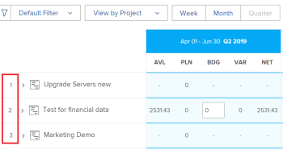
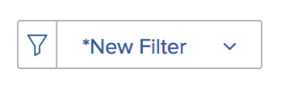

# Overzicht van de navigatie in de bronnenplanner

Met de Adobe Workfront Resource Planner kunt u eenvoudig de beschikbaarheid van uw bronnen en de geplande tijd die nodig is om het werk aan uw projecten te voltooien, begrijpen. U kunt de toewijzing van uw gebruikers en hun baanrollen op de projecten dan beheren zij aan worden toegewezen.

>[!TIP]
>
>U kunt niet de toewijzing van teams op de taken beheren zij aan in de Planner van het Middel worden toegewezen.

U moet aan de eerste vereisten voldoen nodig om de Planner van het Middel volledig te gebruiken. Voor meer informatie over de Planner van het Middel, zie [Overzicht van de bronnenplanner](../../resource-mgmt/resource-planning/get-started-resource-planner.md).

In de volgende secties worden alle gebieden van de bronnenplanner beschreven.

## Tijdlijn van projecten

Gebruik de kalender bij de bovenkant van de Planner van het Middel om de chronologie van de projecten te navigeren u bekijkt. De tijdlijn begint standaard met de maand van vandaag.\
Zie de sectie voor meer informatie over het wijzigen van het tijdframe van de tijdlijn die u in de functie Bronnen weergeeft [Tijdlijnselectie](#timeframe-selection) in dit artikel.

## Tijdlijnselectie  {#timeframe-selection}

Door gebrek, toont de Planner van het Middel middelinformatie voor drie of vier maanden tegelijkertijd, die met de huidige maand beginnen. Het aantal weergegeven tijdsperiodes is afhankelijk van de breedte van het scherm.

>[!TIP]
>
>U kunt niet meer dan vier tijdsperioden tegelijkertijd in de Planner van het Middel tonen.

Navigeren door de tijdlijn:

1. Klik op de achterste en de voorste pijlen om naar achteren en naar voren te gaan op de tijdlijn.
1. Selecteer een van de volgende datumbereikopties in de functie Bronnen door op de desbetreffende knoppen te klikken:

   <table style="table-layout:auto"> 
    <col> 
    <col> 
    <tbody> 
     <tr> 
      <td role="rowheader">Week</td> 
      <td>Geeft informatie per week weer. Het nummer van de week wordt weergegeven naast de datums in de kolomkop. </td> 
     </tr> 
     <tr> 
      <td role="rowheader">Maand</td> 
      <td> Geeft informatie per maand weer.</td> 
     </tr> 
     <tr> 
      <td role="rowheader">Kwart</td> 
      <td>Geeft informatie per kwartaal weer. Het aantal van het kwart toont naast de data in de kolomkopbal. Aangepaste kwarten worden niet weergegeven in de bronnenplanner. </td> 
     </tr> 
     <tr> 
      <td role="rowheader">Vandaag</td> 
      <td>Keert terug naar de maand, de week, of het kwartaal van vandaag.</td> 
     </tr> 
    </tbody> 
   </table>

## Project/ Rol/ Selectie van gebruikersweergave

U kunt de weergave in de functie Bronnen wijzigen, afhankelijk van de manier waarop de informatie moet worden weergegeven.

Door gebrek, toont de Planner van het Middel in de Mening van de Gebruiker. U kunt de weergave wijzigen in de project- of rolweergaven. Wanneer u de weergave wijzigt in een andere weergave, wordt uw keuze de standaardweergave.

Wanneer u de weergave wijzigt, verandert ook de volgende informatie:

* De objecthiërarchie (informatie in de rijen van de functie Bronnen).
* De informatie van de uurtoewijzing (informatie in de kolommen van de Planner van het Middel).

   Voor meer informatie over wat de kolommen in de Planner van het Middel tonen afhankelijk van welke mening u selecteert, zie [Beschikbaarheid en toewijzing van bronnen controleren met de Adobe Workfront Resource Planner](../../resource-mgmt/resource-planning/resource-availability-allocation-resource-planner.md).

Om nauwkeurige informatie in de Planner van het Middel te tonen, moet u aan een reeks eerste vereisten voldoen. Voor meer informatie over de eerste vereisten, zie de &quot;Eerste vereisten voor het werken in de Planner van het Middel&quot;sectie in [Overzicht van de bronnenplanner](../../resource-mgmt/resource-planning/get-started-resource-planner.md) artikel.  De weergave wijzigen in de bronnenplanner:

1. Ga naar de **Resource Planner**.\
   Voor meer informatie over de toegang tot van de Planner van het Middel, zie [Bronnen zoeken](../../resource-mgmt/resource-planning/get-started-resource-planner.md#accessing-the-resource-planner) in de [Overzicht van de bronnenplanner](../../resource-mgmt/resource-planning/get-started-resource-planner.md) artikel.

1. In de **Weergeven op** selecteert u een van de volgende weergaven:

   * [Weergeven op project](#view-by-project)
   * [Weergeven op rol](#view-by-role)
   * [Weergeven op gebruiker](#view-by-user)

### Weergeven op project {#view-by-project}

Overweeg het volgende wanneer het selecteren van de Mening van het Project in de Planner van het Middel:

* U kunt projecten zien die u toestemmingen aan minstens mening hebt.
* Wanneer u tot de Planner van het Middel voor het eerst toegang hebt, kunt u projecten zien die door de StandaardFilter worden gefilterd.\
   Voor meer informatie over het filtreren van informatie in de Planner van het Middel, zie [Gegevens filteren in de bronnenplanner](../../resource-mgmt/resource-planning/filter-resource-planner.md).

* Het aantal items dat u vanuit de projectweergave weergeeft of kunt exporteren, is beperkt om de prestaties te verbeteren.\
   Voor meer informatie over beperkingen wanneer het bekijken van de Planner van het Middel in de Mening van het Project, zie [Beperkingen in de projectweergave](../../resource-mgmt/resource-planning/resource-planner-display-limitations.md#project-view-limits) in de [Weergavebeperkingen van de functie Bronnen](../../resource-mgmt/resource-planning/resource-planner-display-limitations.md) artikel.

* De projecten worden vermeld in de orde van hun prioriteit in de Mening van het Project.\
   Voor meer informatie over projectprioriteit in de Planner van het Middel, zie [Prioriteit projectplanning](#project-planning-priority) in dit artikel.

* Terwijl u elk project uitbreidt, kunt u de bijbehorende taakrollen weergeven.\
   Wanneer u elke rol uitbreidt, kunt u gebruikers weergeven die aan de rol zijn gekoppeld.\
   Schuif om meer rollen en gebruikers onder elk project te laden.

* Als deze weergave wordt toegepast, worden de Roluren, VTE of Kosten opgeteld bij de projecturen, VTE of Kosten.\
   

* U kunt het volgende uur, FTE, of de informatie van Kosten in de mening van het Project bekijken:

   * Beschikbaar
   * Geplant
   * begroot
   * Variantie
   * Netto

      Zie voor meer informatie [De middelen van de begroting in de Planner van het Middel gebruikend de meningen van het Project en van de Rol](../../resource-mgmt/resource-planning/budget-resources-project-role-views-resource-planner.md).

### Weergeven op rol {#view-by-role}

Houd rekening met het volgende wanneer u de weergave Rol selecteert in de functie voor insteekmodule:

* U moet minstens de toegang van de Mening tot het Beheer van het Middel en meningstoestemmingen op projecten hebben om de rollen te bekijken verbonden aan die projecten.
* U kunt elke rol uitbreiden om een lijst van projecten, en elk project te tonen om een lijst van gebruikers te tonen die die rollen op de projecten kunnen vervullen.
* Het aantal items dat u vanuit de weergave Rol weergeeft of kunt exporteren, is beperkt om de prestaties te verbeteren.\
   Voor meer informatie over beperkingen wanneer het bekijken van de Planner van het Middel in de Mening van de Rol, zie [Beperkingen in de weergave Rol](../../resource-mgmt/resource-planning/resource-planner-display-limitations.md#role-view-limits) sectie in [Weergavebeperkingen van de functie Bronnen](../../resource-mgmt/resource-planning/resource-planner-display-limitations.md) .

* De projecten worden vermeld onder de baanrol in de zelfde orde van prioriteit zoals zij in de Mening van het Project worden vermeld.
* Als deze weergave wordt toegepast, worden de projecturen, VTE of Kosten opgeteld bij de Roluren, VTE of Kosten.\
   

* U kunt het volgende uur, FTE, of de informatie van Kosten in de mening van de Rol bekijken:

   * Beschikbaar
   * Geplant
   * begroot
   * Variantie
   * Netto

      Zie voor meer informatie [De middelen van de begroting in de Planner van het Middel gebruikend de meningen van het Project en van de Rol](../../resource-mgmt/resource-planning/budget-resources-project-role-views-resource-planner.md).

### Weergeven op gebruiker {#view-by-user}

U kunt de Planner van het Middel in de Mening van de Gebruiker tonen om het verschil tussen Gepland en Beschikbare Uren of FTE voor uw gebruikers te begrijpen of de hoeveelheid Werkelijke Uren te zien zij het programma hebben geopend.

U kunt uw middelen niet begroten wanneer het toepassen van de Mening van de Gebruiker op de Planner van het Middel. U moet uw middelen gebruikend de mening van het Project of van de Rol begroeten, en de mening van de Gebruiker gebruiken om de toewijzing en de beschikbaarheid van uw gebruikers met betrekking tot het geplande werk te herzien.* *

De gebruikersweergave is de standaardweergave van de bronnenplanner.

Houd rekening met het volgende wanneer u de gebruikersweergave in de functie voor middelenplanning selecteert:

* U kunt alle gebruikers zien u toestemmingen aan Mening, tot 2000 gebruikers hebt, die actief zijn en aan Adobe Workfront minstens eens hebben het programma geopend.\
   Filter de gebruikerslijst op Team, de Rol van de Baan, of Groepen om gebruikers te zien verbonden slechts met die entiteiten.
* Als u de lijst van gebruikers door projecten hebt gefilterd, slechts kunnen de gebruikers verbonden aan de gefiltreerde projecten worden uitgebreid en ook de informatie van het vertoningsuur.\
   Voor meer informatie over het filtreren van informatie in de Planner van het Middel, zie [Gegevens filteren in de bronnenplanner](../../resource-mgmt/resource-planning/filter-resource-planner.md) .

* Het aantal objecten dat u vanuit de gebruikersweergave weergeeft of kunt exporteren, is beperkt om de prestaties te verbeteren.\
   Voor meer informatie over beperkingen wanneer het bekijken van het Plan van het Middel in de Mening van de Gebruiker, zie [Beperkingen in de weergave Gebruiker](../../resource-mgmt/resource-planning/resource-planner-display-limitations.md#user-view-limits) sectie in [Weergavebeperkingen van de functie Bronnen](../../resource-mgmt/resource-planning/resource-planner-display-limitations.md) .

* De projecten zijn vermeld onder de naam van de gebruiker in de zelfde orde van prioriteit zoals zij in de Mening van het Project worden vermeld.\
   Voor meer informatie over projectprioriteit in de Planner van het Middel, zie [Prioriteit projectplanning](#project-planning-priority) in dit artikel.

* Als gebruikers geen taakrol hebben die aan hen is gekoppeld, worden de waarden Uren of FTE vermeld onder de **Geen rol** sectie.
* Wanneer deze mening wordt toegepast, voegen de Uren van het Project of FTE tot de Uren van de Gebruiker of FTE toe.

   >[!TIP]
   >
   >U kunt de toewijzing en beschikbaarheid van de gebruikers door Kosten in de Mening van de Gebruiker niet tonen.

* Uw toestemmingen aan projecten en taken bepalen wat onder de namen van de gebruikers wordt getoond u in de Mening van de Gebruiker ziet.\
   De volgende scenario&#39;s bestaan:

   * Wanneer u geen toestemmingen hebt om projecten en de taken of de kwesties te zien die aan de gebruikers worden toegewezen die in de Planner van het Middel worden getoond, zijn die punten vermeld onder **Ontoegankelijke items** secties. De **Ontoegankelijke items** In dit geval vervangen de secties Project of Taak.

   * Wanneer u geen toestemmingen hebt om de projecten te zien, maar u hebt toegang om de taken of de kwesties op de projecten te zien, zijn de projecten, de taken, en de kwesties vermeld onder de namen van de gebruikers die aan hen worden toegewezen.
   * Wanneer u toestemmingen hebt om de projecten te zien, maar geen taken of kwesties op de projecten, de vertoningen van de projectnaam, en de taken en de kwesties zijn vermeld onder **Ontoegankelijke items** sectie.\
      Voor meer informatie over machtigingen in Workfront raadpleegt u [Overzicht van het delen van machtigingen voor objecten](../../workfront-basics/grant-and-request-access-to-objects/sharing-permissions-on-objects-overview.md).

      
    

* U kunt het volgende uur en FTE informatie in de mening van de Gebruiker bekijken:

   * Beschikbaar
   * Geplant
   * Werkelijk
   * Verschil tussen Gepland en Werkelijk
   * Percentage van de geplande toewijzing

      Zie voor meer informatie [Beschikbare, geplande en Werkelijke uren of FTE weergeven in de bronnenplanner bij gebruik van de gebruikersweergave](../../resource-mgmt/resource-planning/view-hours-fte-user-view-resource-planner.md)

## Projectnaam

U kunt de volgende projecten in de Planner van het Middel zien:

* Projecten die u hebt, moeten ten minste worden weergegeven.

   U moet ook toegang tot minstens het Beheer van het Middel van de Mening in uw toegangsniveau hebben.

   Voor informatie over de toegang nodig om de Planner van het Middel te gebruiken zie [Toegang tot begrotingsmiddelen in Adobe Workfront](../../resource-mgmt/resource-planning/access-needed-to-budget-resources.md).

* Projecten die worden beperkt door het filter dat wordt toegepast op de bronnenplanner.

   Voor meer informatie over het filtreren van informatie in de Planner van het Middel, zie [Gegevens filteren in de bronnenplanner](../../resource-mgmt/resource-planning/filter-resource-planner.md).

   >[!NOTE]
   >
   >Wij adviseren gebruikend filters om het aantal projecten te verminderen u in de Planner van het Middel toont.

## Prioriteit projectplanning {#project-planning-priority}

De projecten zijn vermeld in orde van prioriteit in de Planner van het Middel met het belangrijkste project bij de bovenkant. De prioriteit wordt aangegeven door een getal vóór de projectnaam.

U kunt een instelling ook inschakelen om de projectprioriteiten weer te geven op basis van hun portfolio&#39;s, wanneer deze aan een portfolio zijn gekoppeld. Voor informatie over het prioriteren van projecten en het tonen van portefeuilleprioriteiten in de Planner van het Middel, zie [Prioriteit geven aan projecten in de functie Bronnen](../../resource-mgmt/resource-planning/prioritize-projects-resource-planner.md).

## Functienaam

De volgende categorieën van baanrollen zijn vermeld in de Planner van het Middel:

* De taakrollen die aan taken worden toegewezen.
* De baanrollen die niet aan taken worden toegewezen, maar zijn de primaire baanrollen van de gebruikers verbonden aan de middelgroepen van de projecten.
* De secundaire baanrollen van gebruikers die aan taken in die baanrollen worden toegewezen.
* De secundaire taakrollen van gebruikers die een geldige **Percentage van de beschikbaarheid van VTE** in hun profiel.\
   Voor meer informatie over de **Percentage van de beschikbaarheid van VTE** voor taakrollen, zie [Gebruikersprofiel bewerken](../../administration-and-setup/add-users/create-and-manage-users/edit-a-users-profile.md) .

>[!NOTE]
>
>De rollen van de baan die aan kwesties worden toegewezen worden ook vermeld wanneer **Inclusief uren van uitgifte** instelling is ingeschakeld. Voor meer informatie over het toelaten van uitgavstijden in de Planner van het Middel, zie [Instellingen](#settings) sectie.

## Gebruikersnaam

De gebruikers die in de mening van het Project en van de Rol in de Planner van het Middel worden vermeld behoren tot de middelgroepen verbonden aan de projecten.\
Zie voor meer informatie over het vullen van bronnenpools met gebruikers [Brongroepen koppelen aan gebruikers](../../resource-mgmt/resource-planning/resource-pools/associate-resource-pools-with-users.md).

Alle gebruikers die u toegang hebt tot Weergave en die zich minstens één keer hebben aangemeld bij Workfront, worden weergegeven in de Gebruikersweergave.

In de weergaven Project en Rol kunnen gebruikers worden vermeld onder de volgende typen taakrollen:

* Hun primaire functie
* Hun secundaire functie, in de volgende scenario&#39;s:

   * Als de secundaire functie een geldig nummer heeft voor de **Percentage van de beschikbaarheid van VTE** in hun gebruikersprofiel.
   * Als de gebruiker aan taken in die rollen wordt toegewezen.

Voor meer informatie over de **Percentage van de beschikbaarheid van VTE** voor een functie raadpleegt u [Gebruikersprofiel bewerken](../../administration-and-setup/add-users/create-and-manage-users/edit-a-users-profile.md) .

## Secties &quot;Geen rol&quot; en &quot;Geen gebruiker&quot;

* [Sectie &quot;Geen rol&quot;](#no-role-section)
* [Sectie &quot;Geen gebruiker&quot;](#no-user-section)

### Sectie &quot;Geen rol&quot;  {#no-role-section}

Wanneer een gebruiker tot een middelpool verbonden aan een project behoort, maar zij hebben geen baanrol verbonden aan hen, verschijnen zij in **Geen rol** in plaats van onder een specifieke taakrol.

U kunt geen uren begroten voor een gebruiker in een **Geen rol** sectie. De gebruiker moet ten minste één functie hebben die aan hem is gekoppeld om in de begroting te worden opgenomen voor het werk.\

### Sectie &quot;Geen gebruiker&quot;  {#no-user-section}

Als u een taak toewijst aan een team of deze niet toewijst, worden de geplande uren onder de **Geen gebruiker** die onder de **Geen rol** in de Resource Planner. Deze taken verschijnen niet in de Planner van het Middel wanneer het gebruiken van **Weergeven op gebruiker** weergeven.

U kunt het aantal geplande uren zien dat is toegewezen aan taken in het project in het dialoogvenster **Geen gebruiker** in de Resource Planner, maar u kunt geen budget voor deze toewijzingen maken.

 

## Filters

Met behulp van filters kunt u de informatie beperken die u weergeeft in de functie Bronnen.

Voor meer informatie over het filtreren in de Planner van het Middel, zie [Gegevens filteren in de bronnenplanner](../../resource-mgmt/resource-planning/filter-resource-planner.md) .

## Instellingen {#settings}

In het gedeelte Instellingen kunt u opties in- of uitschakelen om informatie in de functie Bronnen weer te geven of te verbergen.

Om montages in de Planner van het Middel toe te laten:

1. Open de bronnenplanner.
1. Klik op de knop **Instellingen** pictogram.

   

   Het vak Instellingen van de bronnenplanner wordt weergegeven.

   

1. De optie **Uren opnemen uit uitgaven** het plaatsen om Geplande Uren van kwesties in de Planner van het Middel te tonen. Deze instelling is standaard uitgeschakeld.

   Houd rekening met het volgende wanneer u deze instelling inschakelt:

   * De naam van de gebruiker die aan de kwesties wordt toegewezen wordt getoond onder de baanrol verbonden aan hen op de kwestie en u kunt Gericht Uren voor de gebruiker en de baanrol specificeren in de mening van het Project en van de Rol.
   * De kwesties de gebruikers worden toegewezen aan zijn vermeld onder de namen van de baanrollen in de mening van de Gebruiker.

      >[!IMPORTANT]
      >
      >**Wanneer de geplande datum voor het starten en voltooien van de uitgave buiten de tijdlijn van het project valt, worden de geplande uren voor de uitgave weergegeven volgens de datum van de uitgave. Als de projecttijdlijn bijvoorbeeld loopt van januari tot maart, maar de tijdlijn voor de problemen ligt in augustus, worden de geplande uren voor de problemen weergegeven in de tijdsperiode augustus.**

1. (Voorwaardelijk en optioneel) Als u de projectweergave hebt geselecteerd, schakelt u de instelling Portfolio-prioriteiten weergeven in om de projectprioriteiten weer te geven op basis van de Portfolio waaraan ze zijn toegewezen. De prioriteit van de projecten volgens hun portefeuilles toont naast de prioriteit van de Planner van het Middel. Deze instelling is standaard uitgeschakeld.

   Voor informatie over het prioriteren van projecten in de Planner van het Middel, zie [Prioriteit geven aan projecten in de functie Bronnen](../../resource-mgmt/resource-planning/prioritize-projects-resource-planner.md).

## Optie Volledig scherm

U kunt de Planner van het Middel in het volledige scherm tonen, om de hoeveelheid informatie te vergroten u op het scherm kunt bekijken.

De optie om informatie op volledig scherm te bekijken is beschikbaar voor alle meningen van de Planner van het Middel.

De functie voor het weergeven van de bronnenplanner op volledig scherm:

1. Ga naar de **Resource Planner**.
1. Klik op de knop **Pictogram Volledig scherm** om de bronnenplanner op volledig scherm weer te geven.\
   \
   De functie Bronnen wordt uitgebreid en beslaat het volledige browservenster en het pictogram verandert in een **Het volledige scherm sluiten** weergaveoptie.

1. (Optioneel) Klik op de knop **Pictogram Volledig scherm sluiten** om terug te keren naar de vorige weergave.

## Exporteren, optie

U kunt informatie naar een dossier van Excel (.xlsx) van om het even welke mening van de Planner van het Middel uitvoeren.\
Voor informatie over het uitvoeren van informatie van de Planner van het Middel, zie [Informatie exporteren uit de bronnenplanner](../../resource-mgmt/resource-planning/export-resource-planner.md).

U kunt de hoeveelheid informatie en de weergave van het geëxporteerde bestand beheren.\
Voor informatie over welke informatie u uit de Planner van het Middel kunt uitvoeren en hoe te om de blik en het gevoel van het uitgevoerde dossier te beheren, zie [Weergavebeperkingen van de functie Bronnen](../../resource-mgmt/resource-planning/resource-planner-display-limitations.md).
