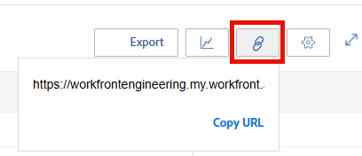

# De gebruikersweergave van de bronnenplanner delen met een koppeling

Adobe Workfront kan een unieke URL genereren voor de gebruikersweergave van de bronnenplanner die u als externe pagina kunt insluiten in een dashboard, of deze afzonderlijk openen in een nieuw browsertabblad. Dit is nuttig wanneer het delen van de informatie van de Planner van het Middel met gebruikers die geen directe toegang tot het gebied van de Middel zouden kunnen hebben.

## Toegangsvereisten

+++ Breid uit om de toegangseisen voor de functionaliteit in dit artikel weer te geven.

U moet de volgende toegang hebben om de stappen in dit artikel uit te voeren:

<table style="table-layout:auto"> 
 <col> 
 <col> 
 <tbody> 
  <tr> 
   <td role="rowheader">Adobe Workfront-plan</td> 
    <td>
Nieuw: alle

       
of

       
Huidig: Pro of hoger
 </td> 
  </tr> 
  <tr> 
   <td role="rowheader">Adobe Workfront-licentie</td> 
   <td>
Nieuw: Standaard

       
of

       
Huidig: Plan
</td> 
  </tr> 
  <tr> 
   <td role="rowheader">Configuraties op toegangsniveau</td> 
   <td> 
De mening of hogere toegang tot het Beheer van het Middel, Projecten, en Gebruikers
 
Toegang tot financiële gegevens bekijken om kosteninformatie weer te geven
</td> 
  </tr> 
  <tr> 
   <td role="rowheader">Objectmachtigingen</td> 
   <td> 
De mening of hogere toestemmingen aan de projecten u in de Planner van het Middel wilt tonen
</td> 
  </tr> 
 </tbody> 
</table>

Voor meer detail over de informatie in deze lijst, zie [ vereisten van de Toegang in de documentatie van Workfront ](/help/quicksilver/administration-and-setup/add-users/access-levels-and-object-permissions/access-level-requirements-in-documentation.md).

+++

Overweeg het volgende wanneer het produceren van unieke URL voor de Mening van de Gebruiker van de Planner van het Middel:

* U kunt alleen een unieke URL ophalen voor de weergave Gebruiker. De optie om URL te produceren bestaat niet in de Mening van het Project of van de Rol.
* U kunt de URL delen met andere gebruikers, waaronder gebruikers met een licentie voor Werk en Revisie.\
  Ze moeten toegang hebben tot andere gebruikers om de informatie in de bronnenplanner te kunnen bekijken via de URL die u met hen deelt.
* De volgende informatie wordt opgeslagen wanneer u de URL deelt met andere gebruikers:

   * Het type tijdsperiodes (week, maand, kwartaal).
   * De filters die u toepast.
   * Het type weergave (uren of FTE).

U kunt als volgt een unieke URL opvragen in de weergave Gebruiker van de functie voor het plaatsen van bronnen en deze delen met andere gebruikers:

{{step1-to-resourcing}}

1. Selecteer **Mening door Gebruiker**.
1. (Optioneel) Selecteer de tijdlijn waarbinnen u de informatie wilt weergeven in de functie Bronnen. Selecteer een van de volgende opties:

   * Week
   * Maand
   * Kwart

1. (Facultatief) selecteer of u de informatie door **FTE** of **Uren** wilt bekijken.\
   

1. (Optioneel) Pas filters toe op de functie Bronnen.\
   Voor informatie over het toepassen van filters, zie [ informatie van de Filter in de Planner van het Middel ](../../resource-mgmt/resource-planning/filter-resource-planner.md).

1. Klik het **hyperlink** pictogram.\
   

1. Klik **Exemplaar URL**.\
   Hiermee wordt de unieke URL van de bronnenplanner in de gebruikersweergave naar het klembord gekopieerd.

1. (Optioneel) Voer een van de volgende handelingen uit:

   * Plak de URL in een andere toepassing om deze naar een andere gebruiker te verzenden.\
     De gebruiker moet aan Workfront worden aangemeld om de Planner van het Middel in de mening van de Gebruiker te bekijken.
   * Open een nieuw browsertabblad of een nieuw browservenster en plak de gekopieerde koppeling en klik vervolgens op Enter op het toetsenbord om de Resource Planner in een nieuw tabblad of venster te openen.
   * Ga als volgt te werk:

     <!--   
     <MadCap:conditionalText data-mc-conditions="QuicksilverOrClassic.Draft mode">   
     (NOTE:&nbsp;turn this into a numbered list)   
     </MadCap:conditionalText>   
     -->

      1. Ga naar **Meldend**> **Dashboards**> **Nieuw Dashboard**> **voeg Externe Pagina toe.**

      1. Plak de verbinding u aan uw klembord op het **&#x200B;**&#x200B;gebied URL kopieerde.
      1. Klik **sparen**, dan **sparen + Sluiten**.\
         Hierdoor wordt de URL ingesloten in het dashboard en wordt de gebruikersweergave van de functie voor het plaatsen van bronnen weergegeven in een afzonderlijk dashboard.

1. (Optioneel) Als u de URL in een dashboard hebt ingesloten, kunt u deze aan een lay-outsjabloon toevoegen of delen met andere gebruikers die mogelijk geen toegang hebben tot het gebied Bronbeheer.\
   Voor informatie over het toevoegen van dashboards aan een lay-outmalplaatje, zie [ lay-outmalplaatjes ](../../administration-and-setup/customize-workfront/use-layout-templates/create-and-manage-layout-templates.md) creëren en beheren.\
   Voor informatie over het delen van dashboards, zie [ een dashboard ](../../reports-and-dashboards/dashboards/creating-and-managing-dashboards/share-dashboard.md) delen.\
   Wanneer het bekijken van gedeelde URL, kunnen de gebruikers de informatie met de montages zien die u oorspronkelijk op de Planner van het Middel toepaste. Ze moeten zijn aangemeld bij Workfront om de gedeelde URL weer te geven.\
   
