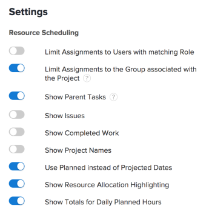

# Instellingen configureren in de planningsgebieden

>[!IMPORTANT]
>  
>De planningsfunctionaliteit die in dit artikel wordt beschreven, is vanaf de release 23.1 in januari 2023 vervangen en uit Adobe Workfront verwijderd.   
>  
>  Dit artikel wordt ook verwijderd kort na de release van 23.1, begin 2023. Op dit moment raden we u aan eventuele bladwijzers dienovereenkomstig bij te werken. 
> 
> U kunt de werklastbalans nu gebruiken om werk voor uw bronnen te plannen. 
>  
> Voor informatie over het plannen van middelen die de Balancer van de Werkbelasting gebruiken, zie de sectie [De werklastbalans](../../resource-mgmt/workload-balancer/workload-balancer.md). 

<!--  

>[!CAUTION] 
> 
> 
> The information in this article refers to the Adobe Workfront's Scheduling tools. The Scheduling areas have been removed from the Preview environment and will be removed from the Production environment in **January 2023**. 
>  Instead, you can schedule resources in the Workload Balancer.  
> 
>*  For information about scheduling resources using the Workload Balancer, see the section [The Workload Balancer](../../resource-mgmt/workload-balancer/workload-balancer.md). 
> 
>*  For more information about the deprecation and removal of the Scheduling tools, see [Deprecation of Resource Scheduling tools in Adobe Workfront](../../resource-mgmt/resource-mgmt-overview/deprecate-resource-scheduling.md). 
-->

U kunt verschillende instellingen configureren om aan te passen hoe en welke informatie wordt weergegeven in de tijdlijn van de planning.

## Toegangsvereisten

U moet de volgende toegang hebben om de stappen in dit artikel uit te voeren:

<table style="table-layout:auto"> 
 <col> 
 <col> 
 <tbody> 
  <tr> 
   <td role="rowheader">Adobe Workfront-abonnement*</td> 
   <td> 
Alle
 </td> 
  </tr> 
  <tr> 
   <td role="rowheader">Adobe Workfront-licentie*</td> 
   <td> 
Werk of hoger
 </td> 
  </tr> 
  <tr> 
   <td role="rowheader">Toegangsniveau*</td> 
   <td> 
De toegang van de mening of hoger tot Projecten, Taken, en Kwesties
 
<b>OPMERKING</b>

Als u nog steeds geen toegang hebt, vraagt u de Workfront-beheerder of deze aanvullende beperkingen op uw toegangsniveau instelt. Voor informatie over hoe een beheerder van Workfront uw toegangsniveau kan veranderen, zie <a href="../../administration-and-setup/add-users/configure-and-grant-access/create-modify-access-levels.md" class="MCXref xref">Aangepaste toegangsniveaus maken of wijzigen</a>.
 </td>
</tr> 
  <tr> 
   <td role="rowheader">Objectmachtigingen</td> 
   <td> 
Contribute-machtigingen of hoger voor projecten, taken en problemen
 
Voor informatie over het aanvragen van aanvullende toegang raadpleegt u <a href="../../workfront-basics/grant-and-request-access-to-objects/request-access.md" class="MCXref xref">Toegang tot objecten aanvragen </a>.
 </td> 
  </tr> 
 </tbody> 
</table>

*Neem contact op met uw Workfront-beheerder om te weten te komen welk abonnement, licentietype of toegang u hebt.

## Problemen configureren die op de tijdlijn van de planning moeten worden weergegeven

<!--

(NOTE: ALL THE SECTIONS BELOW ARE LINKED TO PRODUCT. DO NOT CHANGE TITLES) 

-->

U kunt kwesties vormen die naast taken op de het plannen chronologie moeten worden getoond.\
Wanneer het plannen van middelen in de Plannende sectie voor een team, worden de kwesties getoond door gebrek naast taken. Wanneer het plannen van middelen voor projecten, slechts worden de taken getoond door gebrek.

1. Ga naar de het plannen chronologie voor veelvoudige projecten, voor een individueel project, of voor een team:

   * **Voor meerdere projecten**: Klik op de knop **Hoofdmenu** pictogram  in de rechterbovenhoek van Workfront klikt u op **Bronnen > Werklastverdeling** selecteert u vervolgens **Planning** in het drop-down menu linksboven.
   * **Voor een afzonderlijk project**: Ga naar een project, klik **Werklastverdeling** in het linkerdeelvenster en selecteer vervolgens **Planning** in het keuzemenu linksboven.
   * **Voor een team**: Klik op de knop **Hoofdmenu** pictogram  in de rechterbovenhoek van Workfront klikt u op **Teams**, selecteert u een team en klikt u op **Werklastverdeling** in het linkerdeelvenster selecteert u vervolgens **Planning** in het keuzemenu linksboven.

1. Klik op de knop **Instellingen** op de tijdlijn van de planning.

1. Schakel in het dialoogvenster Resource Scheduling Settings het dialoogvenster **Problemen tonen** optie.\
   

1. Klikken **Terugkeren naar planning**. 

## Voltooid werk configureren om weer te geven op de tijdlijn voor planning

U kunt de geplande tijdlijn configureren om werk weer te geven dat al is gemarkeerd als Voltooid. Standaard wordt voltooide bewerking niet weergegeven op de tijdlijn van de planning. 

1. Ga naar de het plannen chronologie voor veelvoudige projecten, voor een individueel project, of voor een team:

   * **Voor meerdere projecten**: Klik op de knop **Hoofdmenu** pictogram  in de rechterbovenhoek van Workfront klikt u op **Bronnen > Werklastverdeling** selecteert u vervolgens **Planning** in het drop-down menu linksboven.
   * **Voor een afzonderlijk project**: Ga naar een project, klik **Werklastverdeling** in het linkerdeelvenster en selecteer vervolgens **Planning** in het keuzemenu linksboven.
   * **Voor een team**: Klik op de knop **Hoofdmenu** pictogram  in de rechterbovenhoek van Workfront klikt u op **Teams**, selecteert u een team en klikt u op **Werklastverdeling** in het linkerdeelvenster selecteert u vervolgens **Planning** in het keuzemenu linksboven.

1. Klik op de knop **Instellingen** op de tijdlijn van de planning.

1. Schakel in het dialoogvenster Resource Scheduling Settings het dialoogvenster **Voltooid werk tonen** optie.\
   

1. Klikken **Terugkeren naar planning**.\
   Voltooid werk wordt weergegeven met een vinkje in de rechterbovenhoek van het werkitem.

## Projectnamen configureren voor weergave op de geplande tijdlijn 

U kunt de projectnaam vormen om op elke taak en kwestie op de het plannen chronologie te tonen. Dit staat gebruikers toe die de het plannen chronologie bekijken om de naam van het project snel te zien waar de taak of de kwestie verblijft.

Wanneer u projectnamen om toelaat te tonen, verbruikt elke taak en kwestie meer verticale ruimte op de het plannen chronologie, resulterend in minder taken en kwesties die in één enkele mening tonen.

Standaard worden projectnamen niet weergegeven bij taken en problemen in de tijdlijn van de planning.

U kunt als volgt projectnamen weergeven voor taken en problemen in de tijdlijn van de planning:

1. Ga naar de het plannen chronologie voor veelvoudige projecten of voor een team:

   * **Voor meerdere projecten**: Klik op de knop **Hoofdmenu** pictogram  in de rechterbovenhoek van Workfront klikt u op **Bronnen > Werklastverdeling** selecteert u vervolgens **Planning** in het drop-down menu linksboven.
   * **Voor een team**: Klik op de knop **Hoofdmenu** pictogram  in de rechterbovenhoek van Workfront klikt u op **Teams**, selecteert u een team en klikt u op **Werklastverdeling** in het linkerdeelvenster selecteert u vervolgens **Planning** in het keuzemenu linksboven.

1. Klik op de knop **Instellingen** op de tijdlijn van de planning.

1. Schakel de optie in in het dialoogvenster Instellingen voor bronnenplanning. **Projectnamen tonen**.\
   

1. Klikken **Terugkeren naar planning**.\
   Elke taak en kwestie op de het plannen chronologie toont de naam van het project waar de taak of de kwestie verblijft.\
   

## Geprojecteerde datums configureren voor weergave op de tijdlijn van de planning

Standaard worden geplande datums gebruikt op de tijdlijn van de planning. U kunt ook de tijdlijn voor het plannen configureren om Geprojecteerde datums te gebruiken.

Overweeg de volgende informatie over geplande en geprojecteerde datums:

* Geplande datums voor taken kunnen handmatig worden ingesteld, of ze kunnen automatisch worden ingesteld, afhankelijk van het type taakbeperking en duur. Zie de artikelen voor meer informatie [Overzicht van taakbeperking](../../manage-work/tasks/task-constraints/task-constraint-overview.md) en  [Overzicht van het Type van Duur en van de Duur van de Taak](../../manage-work/tasks/taskdurtn/task-duration-and-duration-type.md) .

   Geplande datums voor uitgaven worden handmatig ingesteld bij uitgaven door gebruikers. De systeembeheerder kan gebruikers echter beperken om geplande datums voor problemen aan te passen.

* De geprojecteerde Datums voor zowel taken als kwesties worden automatisch geplaatst. Raadpleeg de artikelen voor meer informatie over de geprojecteerde datums [Overzicht van de geplande afsluitdatum voor projecten, taken en problemen](../../manage-work/projects/planning-a-project/project-projected-completion-date.md).

>[!NOTE]
>
>Wanneer u Geprojecteerde datums gebruikt op de tijdlijn van de planning, kan de informatie over de gebruikerstoewijzing niet worden weergegeven. Raadpleeg het artikel voor meer informatie over gebruikerstoewijzingen [Niet-toegewezen taken en problemen handmatig toewijzen in de planningsgebieden](../../resource-mgmt/resource-scheduling/manually-assign-items-scheduling-areas.md).

Om de het plannen chronologie aan vertoningstaken en kwesties volgens Geprojecteerde Datums te vormen: 

1. Ga naar de het plannen chronologie voor veelvoudige projecten, voor een individueel project, of voor een team:

   * **Voor meerdere projecten**: Klik op de knop **Hoofdmenu** pictogram  in de rechterbovenhoek van Workfront klikt u op **Bronnen > Werklastverdeling** selecteert u vervolgens **Planning** in het drop-down menu linksboven.
   * **Voor een afzonderlijk project**: Ga naar een project, klik **Werklastverdeling** in het linkerdeelvenster en selecteer vervolgens **Planning** in het keuzemenu linksboven.
   * **Voor een team**: Klik op de knop **Hoofdmenu** pictogram  in de rechterbovenhoek van Workfront klikt u op **Teams**, selecteert u een team en klikt u op **Werklastverdeling** in het linkerdeelvenster selecteert u vervolgens **Planning** in het keuzemenu linksboven.

1. Klik op de knop **Instellingen** op de tijdlijn van de planning.

1. Schakel in het dialoogvenster Resource Scheduling Settings het selectievakje **Gepland gebruiken in plaats van geprojecteerde datums** optie.
1. Klikken **Terugkeren naar planning**.

## Configureer hoe gebruikers worden weergegeven op de tijdlijn voor planning

>[!NOTE]
>
>Deze sectie is slechts van toepassing wanneer het plannen van middelen voor teams (van de Plannende sectie voor een team). Wanneer het plannen van middelen voor veelvoudige projecten (van het Plannende lusje) of voor één enkel project (van het het Stafsen lusje), kunnen de gebruikers niet alfabetisch worden getoond; zij worden altijd georganiseerd op rol .

Wanneer het plannen van middelen voor een team, kunt u gebruikers vormen om op de het plannen chronologie of alfabetisch of door rol worden getoond. Standaard worden gebruikers in alfabetische volgorde weergegeven (rollen worden niet weergegeven).

1. Klik op de knop **Hoofdmenu** pictogram  Klik in de rechterbovenhoek van Workfront op Teams. Een team is standaard geselecteerd.

1. Klik op de knop **Instellingen** op de tijdlijn van de planning.

1. Selecteer in het dialoogvenster Instellingen of u het dialoogvenster **Groeperen op rol** optie.\
   Wanneer deze optie is uitgeschakeld, worden gebruikers in alfabetische volgorde weergegeven en worden rollen niet weergegeven op de tijdlijn die u wilt plannen.\
   Wanneer deze optie wordt toegelaten, worden de rollen getoond op de het plannen chronologie, en de gebruikers worden gegroepeerd binnen hun respectieve rol. Als een bepaalde gebruiker veelvoudige rollen heeft die in het systeem worden bepaald, verschijnt die gebruiker veelvoudige tijden op de het plannen chronologie, onder elke aangewezen rol.\
   

1. Klikken **Terugkeren naar planning**.

## Vorm of de oudertaken op de het plannen chronologie worden getoond

<!--

(NOTE: This section is linked to the UI in a tooltip inside the Settings of the scheduler. do not rename/ remove/ edit the tag!! - Resource Scheduling (People> Scheduling>Settings>Show Parent Tasks tooltip)

-->

De weergave Bovenliggende taken is afhankelijk van de tijdlijn die u wilt plannen. 

* [De oudertaken van de vertoning voor veelvoudige projecten](#display-parent-tasks-for-multiple-projects)
* [De oudertaken van de vertoning voor een project of een team](#display-parent-tasks-for-a-project-or-a-team)

### De oudertaken van de vertoning voor veelvoudige projecten {#display-parent-tasks-for-multiple-projects}

Wanneer het plannen van middelen voor veelvoudige projecten in de Plannende sectie, of de vertoning van oudertaken of niet afhangt van de volgende montages:

* De voltooiingsmodus van het project.
* De modus Samenvatting van project.
* De instelling Bovenliggende taken tonen op het tabblad Planning.

De volgende lijst schetst wanneer de oudertaken op het Plannende lusje, en wanneer slechts de subtaken tonen. 

| **Instelling bovenliggende taken tonen** | **Voltooiingsmodus van het project** | **Samenvattingsmodus van het project** | **Type van Taken die op de Plannende Chronologie worden getoond** |
|---|---|---|---|
| Uitgeschakeld | Handmatig | Automatisch | Alleen subtaken |
| Uitgeschakeld | Handmatig | Handmatig | Alleen subtaken |
| Uitgeschakeld | Automatisch | Automatisch | Alleen subtaken |
| Uitgeschakeld | Automatisch | Handmatig | Alleen subtaken |
| Ingeschakeld | Automatisch | Handmatig | Subtaken en bovenliggende taken |
| Ingeschakeld | Automatisch | Automatisch | Alleen subtaken |
| Ingeschakeld | Handmatig | Handmatig | Subtaken en bovenliggende taken |
| Ingeschakeld | Handmatig | Automatisch | Alleen subtaken |

Voor informatie over het configureren van de **Voltooiingsmodus** en de **Samenvattingsmodus** de gebieden voor elk project, zie de sectie &quot;Montages&quot;in het artikel [Projecten bewerken](../../manage-work/projects/manage-projects/edit-projects.md).

U kunt oudertaken manueel vormen die in de Plannende sectie voor veelvoudige projecten plaatsen. 

De instelling Bovenliggende taken weergeven configureren: 

1. Klik op de knop **Hoofdmenu** pictogram  in de rechterbovenhoek van Workfront klikt u op **Bronnen > Werklastverdeling** selecteert u vervolgens **Planning** in het drop-down menu linksboven.
1. Klik op de knop **Instellingen** op de tijdlijn van de planning.

1. Selecteer in het dialoogvenster Instellingen voor bronnenplanning of de optie moet worden ingeschakeld, **Bovenliggende taken tonen.**
Wanneer deze optie wordt toegelaten, worden de oudertaken van alle projecten getoond volgens de Summiere Wijze van de Voltooiing en de montages van de Wijze van de Voltooiing van de projecten, zoals die in de bovengenoemde lijst worden geschetst. Deze optie is standaard ingeschakeld.
\
   

1. Klikken **Terugkeren naar planning** in de linkerbenedenhoek.

### De oudertaken van de vertoning voor een project of een team {#display-parent-tasks-for-a-project-or-a-team}

Wanneer het plannen van middelen in de het Vuren sectie van een project of in de sectie van het Programma, of de vertoning van de Taken van de Ouder of niet van de volgende montages afhangt:

* De voltooiingsmodus van het project.
* De modus Samenvatting van project.

Voor informatie over het configureren van de **Voltooiingsmodus** en de **Samenvattingsmodus** de gebieden voor elk project, zie de sectie &quot;Montages&quot;in het artikel [Projecten bewerken](../../manage-work/projects/manage-projects/edit-projects.md).

De volgende lijst schetst wanneer de de vertoningen van de Taken van de Ouder in de het Personeelssectie van een project of in de sectie van het Programma, en wanneer slechts de subtasks tonen. 

| Voltooiingsmodus van het project | Samenvattingsmodus van het project | Type van taken die in de Plannende sectie worden getoond | Type van taken die in de sectie van de Plannen van Teams worden getoond |
|---|---|---|---|
| Handmatig | Automatisch | Alleen subtaken | Alleen subtaken |
| Handmatig | Handmatig | Subtaken en bovenliggende taken | Alleen subtaken |
| Automatisch | Automatisch | Alleen subtaken | Alleen subtaken |
| Automatisch | Handmatig | Subtaken en bovenliggende taken | Alleen subtaken |
| Automatisch | Handmatig | Subtaken en bovenliggende taken | Alleen subtaken |
| Automatisch | Automatisch | Alleen subtaken | Alleen subtaken |
| Handmatig | Handmatig | Subtaken en bovenliggende taken | Alleen subtaken |
| Handmatig | Automatisch | Alleen subtaken | Alleen subtaken |

## Configureer of de dagelijks geplande uren worden weergegeven op de tijdlijn van de planning

Om de het plannen chronologie te vormen om de dagelijkse totalen voor de Geplande Uren voor elke gebruiker te tonen: 

1. Ga naar de het plannen chronologie voor veelvoudige projecten, voor een individueel project, of voor een team:

   * **Voor meerdere projecten**: Klik op de knop **Hoofdmenu** pictogram  in de rechterbovenhoek van Workfront klikt u op **Bronnen > Werklastverdeling** selecteert u vervolgens **Planning** in het drop-down menu linksboven.
   * **Voor een afzonderlijk project**: Ga naar een project, klik **Werklastverdeling** in het linkerdeelvenster en selecteer vervolgens **Planning** in het keuzemenu linksboven.
   * **Voor een team**: Klik op de knop **Hoofdmenu** pictogram  in de rechterbovenhoek van Workfront klikt u op **Teams**, selecteert u een team en klikt u op **Werklastverdeling** in het linkerdeelvenster selecteert u vervolgens **Planning** in het keuzemenu linksboven.

1. Klik op de knop **Instellingen** op de tijdlijn van de planning.

1. Schakel in het dialoogvenster Instellingen de volgende opties in:

   *  **Totalen tonen voor daggeplante uren**: Hiermee geeft u het totaal weer van de dagelijkse geplande uren voor elke gebruiker.
   * **Markering voor brontoewijzing tonen**: Hiermee wordt de toewijzing van de gebruiker voor taken en problemen gemarkeerd en worden de dagen aangegeven waarop de gebruikers worden overbelast.\
      Deze opties zijn standaard uitgeschakeld.\
      

1. Klikken **Terugkeren naar planning**.\
   Het totaal van de geplande uren die voor elke dag aan de gebruikersvertoning worden toegewezen.\
   De geplande uren voor de dagen dat de gebruiker wordt oververdeeld, worden rood gemarkeerd.\
   Raadpleeg het artikel voor meer informatie over gebruikerstoewijzingen [Niet-toegewezen taken en problemen handmatig toewijzen in de planningsgebieden](../../resource-mgmt/resource-scheduling/manually-assign-items-scheduling-areas.md).

## Configureer of alle gebruikerstaken worden weergegeven op de tijdlijn van de planning

>[!NOTE]
>
>Deze optie is slechts van toepassing wanneer het plannen van middelen voor individuele projecten (van de Plannende sectie van het project). Deze optie is niet beschikbaar wanneer het plannen van middelen voor veelvoudige projecten (van de Plannende sectie) of voor teams (van de Plannende sectie voor een team).

Om te vormen of alle taken die aan elke gebruiker worden toegewezen (niet alleen de taken verbonden aan het project u bekijkt) op de het plannen chronologie worden getoond:

1. Ga naar het project waar u de het plannen chronologie wilt vormen om alle taken te tonen die aan elke gebruiker worden toegewezen.
1. Klik op de knop **Werklastverdeling** in het linkerdeelvenster (het bevindt zich mogelijk onder **Meer weergeven**), selecteert u vervolgens **Planning** in het keuzemenu linksboven.
1. Klik op de knop **Instellingen** op de tijdlijn van de planning.

1. Geef in het gedeelte Instellingen op of u de optie wilt inschakelen. **Alle gebruikerstaken tonen**.\
   Wanneer deze optie wordt toegelaten, worden alle die taken aan elke gebruiker worden toegewezen getoond op de het plannen chronologie, ongeacht het project waar de taken worden gevestigd.\
   Deze optie is standaard uitgeschakeld.\
   

1. Klikken **Terugkeren naar planning**.
