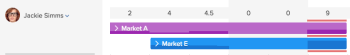

# Gebruikerstoewijzingen beheren in de planningsgebieden

>[!IMPORTANT]
>  
>De planningsfunctionaliteit die in dit artikel wordt beschreven, is vanaf de release 23.1 in januari 2023 vervangen en uit Adobe Workfront verwijderd.   
>  
>  Dit artikel wordt ook verwijderd kort na de release van 23.1, begin 2023. Op dit moment raden we u aan eventuele bladwijzers dienovereenkomstig bij te werken. 
> 
> U kunt de werklastbalans nu gebruiken om werk voor uw bronnen te plannen. 
>  
> Voor informatie over het plannen van middelen die de Balancer van de Werkbelasting gebruiken, zie de sectie [De werklastbalans](../../resource-mgmt/workload-balancer/workload-balancer.md). 

<!--  

>[!CAUTION] 
> 
> 
> The information in this article refers to the Adobe Workfront's Scheduling tools. The Scheduling areas have been removed from the Preview environment and will be removed from the Production environment in **January 2023**.   
>  Instead, you can schedule resources in the Workload Balancer.  
> 
>*  For information about scheduling resources using the Workload Balancer, see the section [The Workload Balancer](../../resource-mgmt/workload-balancer/workload-balancer.md). 
> 
>*  For more information about the deprecation and removal of the Scheduling tools, see [Deprecation of Resource Scheduling tools in Adobe Workfront](../../resource-mgmt/resource-mgmt-overview/deprecate-resource-scheduling.md). 

-->

Gebruikerstoewijzingen zijn hoeveelheden uren die de tijd aangeven die een gebruiker op een bepaalde dag moet doorbrengen om een werkitem te voltooien. Ze worden opgenomen in de geplande uren van het werkitem.

Dit artikel beschrijft hoe te om dagelijkse uurtoewijzingen voor gebruikers bij te werken die aan taken of kwesties worden toegewezen gebruikend het Gebied van de Planning van het Middel. Voor informatie over het beheren van algemene toewijzingen voor gebruikers en baanrollen aan taken, zie [Gebruikers- en roltoewijzingstijden beheren voor taken](../../manage-work/tasks/assign-tasks/manage-allocation-hours-on-tasks.md). U kunt geen algemene toewijzingen voor gebruikers en taakrollen voor problemen bijwerken.

U kunt gebruikerstoewijzingen weergeven in de volgende gebieden van Adobe Workfront:

* Op de Planningssectie van het gebied van de Middelen.
* Voor de Plannende sectie van een project (wanneer het plannen van middelen voor één enkel project).
* Op de sectie van het Programma van een team (wanneer het plannen van middelen voor een team).

## Toegangsvereisten

U moet het volgende hebben:

<table style="table-layout:auto"> 
 <col> 
 <col> 
 <tbody> 
  <tr> 
   <td role="rowheader">Adobe Workfront-abonnement*</td> 
   <td> 
Alle
 </td> 
  </tr> 
  <tr> 
   <td role="rowheader">Adobe Workfront-licentie*</td> 
   <td> 
Werk of hoger
 </td> 
  </tr> 
  <tr> 
   <td role="rowheader">Toegangsniveau*</td> 
   <td> 
De mening of hogere toegang tot Projecten, Taken, en Kwesties
 
<b>OPMERKING</b>

Als u nog steeds geen toegang hebt, vraagt u de Workfront-beheerder of deze aanvullende beperkingen op uw toegangsniveau instelt. Voor informatie over hoe een beheerder van Workfront uw toegangsniveau kan veranderen, zie <a href="../../administration-and-setup/add-users/configure-and-grant-access/create-modify-access-levels.md" class="MCXref xref">Aangepaste toegangsniveaus maken of wijzigen</a>.
 </td>
</tr> 
  <tr> 
   <td role="rowheader">Objectmachtigingen</td> 
   <td> 
Contribute-machtigingen voor projecten, taken en problemen
 
Voor informatie over het aanvragen van aanvullende toegang raadpleegt u <a href="../../workfront-basics/grant-and-request-access-to-objects/request-access.md" class="MCXref xref">Toegang tot objecten aanvragen </a>.
 </td> 
  </tr> 
 </tbody> 
</table>

*Neem contact op met uw Workfront-beheerder om te weten te komen welk abonnement, licentietype of toegang u hebt.

## Toewijzingen van gebruikers in de planningsgebieden

Voordat u begint met het toewijzen van tijd aan gebruikers, zoals in dit artikel wordt beschreven, dient u te weten hoe het plannen van resources in Workfront werkt, zoals in [Aan de slag met Resource Scheduling](../../resource-mgmt/resource-scheduling/get-started-resource-scheduling.md).

U kunt middelen plannen om aan taken en kwesties voor een individueel team te werken u een lid van, voor een individueel project bent waar u een lid van het projectteam bent, of voor veelvoudige projecten waarvoor u de middelmanager bent.

In de volgende secties wordt beschreven hoe u gebruikerstoewijzingen in Workfront kunt inschakelen en beheren:

* [Gebruik de plangebieden om werk toe te wijzen](#use-the-scheduling-areas-to-assign-work)
* [Toewijzingen die zijn ingesteld in de vakken Taak bewerken of Uitgave bewerken in de planningsgebieden](#allocations-set-on-the-edit-task-or-the-edit-issue-boxes-vs-in-the-scheduling-areas)
* [Toewijzingsindicatoren](#allocation-indicators)
* [Standaardtoewijzing voor geplande uren](#default-allocation-for-planned-hours)
* [Wie kan toewijzingen bekijken en wijzigen?](#who-can-view-and-modify-allocations)
* [Tijdzoneoverwegingen in de planningsgebieden](#time-zone-considerations-in-the-scheduling-areas)

### Gebruik de plangebieden om werk toe te wijzen {#use-the-scheduling-areas-to-assign-work}

Wanneer u nieuwe taken toewijst aan gebruikers op de planningtijdlijn, kunt u bepalen hoe de geplande uren voor een taak of uitgave worden toegewezen aan gebruikers.\
Voor meer informatie over Geplande Uren, zie [Overzicht van geplande uren](../../manage-work/tasks/task-information/planned-hours.md).

Geplande uren kunnen als volgt worden verdeeld:

* Onder gebruikers die aan de taak of de kwestie worden toegewezen
* Gedurende de gehele duur van de taak of uitgifte\
   Bijvoorbeeld, zou een op verkoop betrekking hebbende taak meer werk tegen het eind van de taakduur kunnen vereisen. U kunt deze ongelijke verdeling van uren in uw taak plannen.

>[!TIP]
>
>Wanneer het plannen van middelen voor veelvoudige projecten van de Plannende gebieden, niet worden alle gebruikers en het werkpunten getoond op de Plannende chronologie. Voor informatie over welke informatie op de Plannende chronologie wordt getoond, zie [Aan de slag met Resource Scheduling](../../resource-mgmt/resource-scheduling/get-started-resource-scheduling.md).

### Toewijzingen die zijn ingesteld in de vakken Taak bewerken of Uitgave bewerken in de planningsgebieden {#allocations-set-on-the-edit-task-or-the-edit-issue-boxes-vs-in-the-scheduling-areas}

U kunt de gebruikerstoewijzingen voor een taak wijzigen of een uitgave van de volgende plaatsen binnen Workfront uitgeven:

* De tijdlijn voor planning\
   De tijdlijn voor planning bevindt zich in de volgende gebieden:

   * Op de Planningssectie van het gebied van de Middelen.
   * Voor de Plannende sectie van een project (wanneer het plannen van middelen voor één enkel project).
   * Op de sectie van het Programma van een team (wanneer het plannen van middelen voor een team).

   Wanneer u gebruikerstoewijzingen wijzigt vanuit de planningtijdlijn (zoals beschreven in de [Toewijzingen van gebruikers wijzigen](#modify-user-allocations) (in dit artikel) kunt u toewijzingen definiëren voor elke gebruiker op de taak of uitgave, en voor elke dag binnen de taak of de duur van de uitgave.\
   

* Het dialoogvenster Taak bewerken of Uitgave bewerken.\
   Wanneer u gebruikerstoewijzingen wijzigt vanuit een dialoogvenster Taak bewerken of Uitgeven (zoals beschreven in [Het percentage gebruikers- of roltoewijzingen beheren voor taken](../../manage-work/tasks/assign-tasks/manage-allocation-percentage-on-tasks.md)), kunt u toewijzingen voor de taak definiëren of alleen een hele uitgave voor elke gebruiker. Als u deze toewijzingen per dag wilt beheren, moet u de toewijzingen in de planningtijdlijn wijzigen, zoals beschreven in de [Toewijzingen van gebruikers wijzigen](#modify-user-allocations) in dit artikel.

   >[!IMPORTANT]
   >
   >Wanneer het wijzigen van gebruikerstoewijzingen van een Edit Taak of de dialoogdoos van de Uitgave, de toewijzingen u eerder in de Plannende chronologie vormde worden beschreven. Bovendien worden wijzigingen die u aanbrengt in toewijzingen in de planningtijdlijn, niet doorgevoerd in een dialoogvenster Taak bewerken of Uitgave.

We raden u aan om gebruikerstoewijzingen te beheren vanuit de planningtijdlijn in plaats van vanuit de taak of het probleem Bewerken om van de volgende voordelen te profiteren:

* U kunt duidelijk zien wanneer de gebruikers gebruikend toewijzingsindicatoren worden oververdeeld, zoals die in [Toewijzingsindicatoren](#allocation-indicators) sectie.
* U kunt meer tijd toewijzen aan een gebruiker boven een andere gebruiker.\
   Toewijzingsindicatoren geven een visuele weergave van de manier waarop een gebruiker wordt vergeleken met andere gebruikers, zoals beschreven in de [Toewijzingsindicatoren](#allocation-indicators) sectie.

* U kunt meer tijd toewijzen voor werk op de ene dag over een andere dag.\
   Toewijzingsindicatoren geven een visuele weergave van de wijze waarop toegewezen gebruikers zich op een bepaalde dag bevinden, zoals beschreven in [Toewijzingsindicatoren](#allocation-indicators).

* U kunt alle hulpbronnentaken op één plaats uitvoeren, in de planningtijdlijn.

### Toewijzingsindicatoren {#allocation-indicators}

Er zijn verschillende visuele indicatoren beschikbaar om snel informatie te verschaffen over het niveau waaraan een gebruiker is toegewezen om op een bepaalde dag te werken.

Uw systeembeheerder bepaalt hoe Workfront gebruikersbeschikbaarheid op het systeemniveau berekent (rekening houdend met uren evenals beschikbaarheid FTE). Afhankelijk van deze systeembrede instelling wordt de beschikbaarheid van de gebruiker berekend aan de hand van het standaardschema of het schema van de gebruiker. Zie voor meer informatie [Vorm hoe Workfront middeluur en FTE beschikbaarheid voor het Plannende gebied berekent](../../resource-mgmt/resource-scheduling/calculate-hours-fte-scheduling-area.md).

* **Toewijzingsarcering**
Toewijzing wordt visueel weergegeven bij taken die aan gebruikers zijn toegewezen in de vorm van arcering. Een donkerdere schaduw geeft de toegewezen uren aan als een percentage van de FTE (Full Time Equivalent) van de toegewezen gebruikers op een bepaalde dag. (Voor meer informatie over hoe te om FTE in Workfront te vormen, zie [Vorm hoe Workfront middeluur en FTE beschikbaarheid voor het Plannende gebied berekent](../../resource-mgmt/resource-scheduling/calculate-hours-fte-scheduling-area.md).)\
   Eén gebruiker wordt bijvoorbeeld toegewezen aan een taak met een hoeveelheid van 4 geplande uren en een Duur van 1 dag. De FTE voor de gebruiker wordt in het systeem gedefinieerd als 1 (wat betekent dat de gebruiker volgens planning zal werken bij voltijdstatus, of liever 40 uur per week, of 8 uur per dag). De schaduw voor de taak op een bepaalde dag neemt de helft van de verticale ruimte van de taak in, wijst dit erop dat de gebruiker de helft van zijn of haar VTE (4 uren) op die dag wordt toegewezen.\
   \
   De taak of de kwestie toont de cumulatieve toewijzing over alle gebruikers die aan het het werkpunt worden toegewezen. U kunt een het werkpunt uitbreiden om meer details, met inbegrip van te bekijken wie aan het het werkpunt wordt toegewezen en hoeveel uren elke gebruiker wordt toegewezen.\
   Schaduwen wordt niet weergegeven bij taken in het dialoogvenster **Niet toegewezen** op de tijdlijn van de planning.\
   

* **Dagelijkse totalen voor elke dag voor elke gebruiker:** U kunt de totale geplande uren weergeven die aan een bepaalde gebruiker zijn toegewezen op elke dag. Deze informatie wordt boven aan de rij van elke gebruiker in de planningtijdlijn weergegeven. Deze informatie wordt niet standaard weergegeven. U kunt dit inschakelen zoals beschreven in [Toewijzingen van gebruikers inschakelen](#enable-user-allocations). Taken uit projecten met een van de volgende statussen worden meegenomen bij het bepalen van de dagelijkse totalen: Huidige, Planning of Goedgekeurd.\
   

* **Overallocatie-indicatoren**
Wanneer het totale aantal geplande uren dat op een bepaalde dag aan een gebruiker is toegewezen het aantal uren overschrijdt dat de gebruiker in een dag werkt (voor alle taken), wordt die gebruiker beschouwd als oververdeeld op die dag.\
   Wanneer een gebruiker wordt oververdeeld, wordt een rode bar getoond, die elke taak op de dag schetst.\
   De taken van projecten met om het even welke volgende statussen zijn inbegrepen wanneer het bepalen van de overtoewijzing van een gebruiker: Huidige, Planning of Goedgekeurd.\
   Het aantal uren dat een gebruiker op een dag werkt, wordt gedefinieerd via het FTE-veld in het profiel van elke gebruiker, zoals wordt beschreven in [Vorm hoe Workfront middeluur en FTE beschikbaarheid voor het Plannende gebied berekent](../../resource-mgmt/resource-scheduling/calculate-hours-fte-scheduling-area.md).\
   \
   Wanneer u de optie **Totalen tonen voor daggeplante uren** en de **Markering voor brontoewijzing tonen** in uw instellingen wordt het dagelijkse totale aantal geplande uren in het rood weergegeven wanneer de gebruiker wordt oververdeeld. De uren worden getoond aan de dichtstbijzijnde tiende door gebrek (bijvoorbeeld, 1.3).\
   

### Standaardtoewijzing voor geplande uren {#default-allocation-for-planned-hours}

Workfront probeert Geplande uren als volgt te verdelen over de toegewezen gebruikers en dagen:

* Wanneer meerdere gebruikers zijn toegewezen aan een taak of uitgave, worden de uren gelijkmatig over de gebruikers verdeeld.\
   De verspreiding weerspiegelt om het even welke geavanceerde taken die reeds op de taak zijn gedaan.\
   Voor meer informatie over geavanceerde toewijzingen raadpleegt u [Geavanceerde toewijzingen maken](../../manage-work/tasks/assign-tasks/create-advanced-assignments.md).

* Wanneer de Duur van de taak of de kwestie veelvoudige dagen overspant, worden de Geplande Uren gelijkelijk verdeeld over de dagen, en onder alle gebruikers die aan de taak worden toegewezen, op het programma van de gebruiker wordt gebaseerd.
* Wanneer de Geplande Uren van een taak veelvoudige dagen overspannen, zou een gebruiker die de taak van een verschillende tijdzone bekijkt een verschil in de taakduur of de Geplande Datum van het Begin of Geplande Datum van de Voltooiing kunnen zien.

De uren worden getoond aan dichtstbijzijnde honderdste door gebrek (bijvoorbeeld, 1.33). U kunt naar rechts schuiven om meer te zien.\

### Wie kan toewijzingen bekijken en wijzigen? {#who-can-view-and-modify-allocations}

De volgende typen gebruikers kunnen gebruikerstoewijzingen in Workfront weergeven of wijzigen:

* **Bronbeheer:** U kunt gebruikerstoewijzingen voor taken en kwesties op om het even welke projecten bekijken en wijzigen waarvoor u de Manager van het Middel bent. U kunt dit doen of in de Plannende chronologie in het gebied van Mensen, of in het het Personeel lusje van een project.\
   Voor informatie over hoe de Managers van het Middel veranderingen in taken en kwesties over projecten kunnen aanbrengen, zie [Niet-toegewezen taken en problemen handmatig toewijzen in de planningsgebieden](../../resource-mgmt/resource-scheduling/manually-assign-items-scheduling-areas.md).

* **Plan- en werkgebruikers:** U kunt toewijzingen voor om het even welke taken en kwesties bekijken u aan door of de nieuwe Mijn Kalender van het Werk of het Werken aan kalender op een team te gebruiken dat u een lid van bent.\
   Naast het weergeven van toewijzingen kunt u uw toewijzingen wijzigen als u Contribute toegang hebt tot de taken en uitgaven.

   <!--
  <MadCap:conditionalText data-mc-conditions="QuicksilverOrClassic.Draft mode">
  (NOTE: Article is conditioned to classic.)
  </MadCap:conditionalText>
  -->

### Tijdzoneoverwegingen in de planningsgebieden  {#time-zone-considerations-in-the-scheduling-areas}

In zeldzame gevallen kunnen gebruikers die de tijdlijn van de planning bekijken inconsistenties zien waarbij de geplande uren van een taak niet overeenkomen met de totale toegewezen uren van afzonderlijke dagen. Dit kan zich voordoen wanneer de tijdzone-instelling van het besturingssysteem van de ene gebruiker zodanig is dat de geplande begindatum of geplande uitvoeringsdatum verschilt van die van een andere gebruiker.

Als de Geplande Voltooiingsdatum van een taak bijvoorbeeld op 3.18.00 uur op 11.3.18 wordt ingesteld, zou MST, een gebruiker in Australië die de taak bekijkt, de Geplande Voltooiingsdatum zien als 1:00 uur op 4.18 uur, de volgende dag. Als de gebruiker in Australië uren op 11/4/18 toewijst, zijn deze toegewezen uren niet zichtbaar aan de gebruiker op MST. Deze uren worden echter altijd in aanmerking genomen op de geplande uren van het project.

## Toewijzingen van gebruikers inschakelen {#enable-user-allocations}

De functionaliteit voor gebruikerstoewijzing is standaard uitgeschakeld in de planningtijdlijn. Voordat u de in deze sectie beschreven functionaliteit voor gebruikerstoewijzing kunt gebruiken, moet u deze eerst inschakelen.

>[!NOTE]
>
>De toewijzingen van gebruikers kunnen slechts worden toegelaten wanneer de plannende chronologie wordt gevormd om Geplande Datums te gebruiken. Als de planningtijdlijn is geconfigureerd voor het gebruik van Geprojecteerde datums, kunnen gebruikerstoewijzingen niet worden weergegeven. Voor meer informatie over het vormen van de plannende chronologie om Geplande of Geprojecteerde Datums te gebruiken, zie &quot;het Vormen Geprojecteerde Datums aan Vertoning op de Plannende Chronologie&quot;in [Instellingen configureren in de planningsgebieden](../../resource-mgmt/resource-scheduling/configure-settings-scheduling-areas.md).

Om gebruikerstoewijzingen op de planningschronologie toe te laten:

1. Ga naar de het plannen chronologie voor veelvoudige projecten, voor een individueel project, of voor een team:

   * **Voor meerdere projecten**: Klik op de knop **Hoofdmenu** pictogram  in de rechterbovenhoek van Workfront klikt u op **Bronnen > Werklastverdeling** selecteert u vervolgens **Planning** in het drop-down menu linksboven.
   * **Voor een afzonderlijk project**: Ga naar een project, klik **Werklastverdeling** in het linkerdeelvenster en selecteer vervolgens **Planning** in het keuzemenu linksboven.
   * **Voor een team**: Klik op de knop **Hoofdmenu** pictogram  in de rechterbovenhoek van Workfront klikt u op **Teams**, selecteert u een team en klikt u op **Werklastverdeling** in het linkerdeelvenster selecteert u vervolgens **Planning** in het keuzemenu linksboven.

   

1. Klik op de knop **Instellingen** op de tijdlijn van de planning.\
   \
   Het dialoogvenster Instellingen voor bronnenplanning wordt weergegeven.\
   

1. Schakel een of beide van de volgende opties in om gebruikerstoewijzingen op de planningtijdlijn weer te geven:

   <table style="table-layout:auto"> 
    <col> 
    <col> 
    <tbody> 
     <tr> 
      <td role="rowheader">Markering voor brontoewijzing tonen</td> 
      <td> 
Toon de schaduwen van de gebruikerstoewijzing op taken en kwesties op de plannende chronologie. 
 
Deze optie is standaard uitgeschakeld.
 </td> 
     </tr> 
     <tr> 
      <td role="rowheader">Totalen tonen voor daggeplante uren</td> 
      <td>Hiermee geeft u het totale aantal geplande uren weer dat aan elke gebruiker is toegewezen voor elke dag op de tijdlijn van de planning. De geplande uren worden weergegeven op de dichtstbijzijnde tiende (bijvoorbeeld 1.3). Deze optie is standaard uitgeschakeld.</td> 
     </tr> 
    </tbody> 
   </table>

1. (Optioneel) In het dialoogvenster **Inclusief problemen** selecteert u of de problemen in de planningtijdlijn moeten worden weergegeven.\
   Deze optie is standaard uitgeschakeld.

1. Klikken **Terugkeren naar planning**.\
   Toewijzingen van gebruikers worden nu weergegeven in de tijdlijn van de planning.\
   

## Toewijzingen van gebruikers wijzigen {#modify-user-allocations}

U kunt de gebruikerstoewijzingen voor een taak of kwestie van de Plannende chronologie (zoals die in deze sectie wordt beschreven) of van de Edit Taak of de dialoogdoos van de Uitgave wijzigen. Zie voor meer informatie [Toewijzingen die zijn ingesteld in de vakken Taak bewerken of Uitgave bewerken in de planningsgebieden](#allocations-set-on-the-edit-task-or-the-edit-issue-boxes-vs-in-the-scheduling-areas).

Standaard worden gebruikers toegewezen aan een taak of geven ze gelijkmatig uit onder de toegewezen personen en tussen dagen in de duur, zoals beschreven in [Standaardtoewijzing voor geplande uren](#default-allocation-for-planned-hours).

Om gebruikerstoewijzingen voor een taak of kwestie van de Plannende chronologie te wijzigen:

1. Ga naar de het plannen chronologie voor veelvoudige projecten, voor een individueel project, of voor een team:

   * **Voor meerdere projecten**: Klik op de knop **Hoofdmenu** pictogram  in de rechterbovenhoek van Workfront klikt u op **Bronnen > Werklastverdeling** selecteert u vervolgens **Planning** in het drop-down menu linksboven.
   * **Voor een afzonderlijk project**: Ga naar een project, klik **Werklastverdeling** in het linkerdeelvenster en selecteer vervolgens **Planning** in het keuzemenu linksboven.
   * **Voor een team**: Klik op de knop **Hoofdmenu** pictogram  in de rechterbovenhoek van Workfront klikt u op **Teams**, selecteert u een team en klikt u op **Werklastverdeling** in het linkerdeelvenster selecteert u vervolgens **Planning** in het keuzemenu linksboven.

   

1. Zorg ervoor dat gebruikerstoewijzingen zijn ingeschakeld op de planningtijdlijn, zoals wordt beschreven in het dialoogvenster [Toewijzingen van gebruikers inschakelen](#enable-user-allocations) in dit artikel.
1. Vouw de taak uit waarin u gebruikerstoewijzingen wilt beheren.\
   Standaard worden de geplande uren gelijkmatig verdeeld over de toegewezen gebruikers en de dagen van de taakduur. Uren worden niet toegevoegd op weekends (zaterdag en zondag). Zie voor meer informatie de [Standaardtoewijzing voor geplande uren](#default-allocation-for-planned-hours) in dit artikel.

1. Klik op het veld voor de gebruiker wiens uren u op een bepaalde dag wilt aanpassen.

   >[!NOTE]
   >
   >Als u de oorspronkelijke distributie wilt behouden nadat u de uren hebt gewijzigd, klikt u op **Annuleren**.

1. Geef het aangepaste aantal uren op.
1. Klikken **Opslaan**.\
   U kunt uw wijzigingen alleen opslaan wanneer het totale aantal uren voor de taak gelijk is aan het oorspronkelijke aantal geplande uren. Dit nummer wordt weergegeven in het dialoogvenster **Geplande uren** veld op de taak. Het getal wordt in rood weergegeven wanneer het totaal niet gelijk is aan het totale aantal geplande uren.\
   

## Criteria voor het opnieuw instellen van gebruikerstoewijzingen

Workfront herstelt de gebruikerstoewijzingen die u manueel in de Plannende chronologie uitgeeft wanneer een aantal acties op de taken of het project voorkomen. In het algemeen worden gebruikerstoewijzingen opnieuw ingesteld wanneer de tijdlijn van het project opnieuw wordt berekend als het aantal geplande uren voor de taken en problemen in dit proces is gewijzigd.\
Zie voor meer informatie over het opnieuw berekenen van de tijdlijn van projecten [Projecttijdlijnen opnieuw berekenen](../../manage-work/projects/manage-projects/recalculate-project-timeline.md).

Enkele van de meest gangbare criteria voor het opnieuw instellen van gebruikerstoewijzingen in de planningtijdlijn zijn:

* Een taak toevoegen aan een herhaling.\
   Omdat de herhalingen vaste data hebben, worden de data van de taken en de toewijzingen opnieuw berekend.\
   Voor informatie over hoe de Herhalingen takendata kunnen beïnvloeden, zie [Artikelen toevoegen aan een bestaande herhaling](../../agile/use-scrum-in-an-agile-team/iterations/add-stories-to-existing-iteration.md).

* Het veranderen van het Type van Duur van een taak in Gedreven Inspanning.
* Het veranderen van het Type van Duur van een taak in Berekende Taak wanneer meer dan 1 persoon wordt toegewezen.\
   Voor informatie over de Duur van de Taak, zie [Overzicht van het Type van Duur en van de Duur van de Taak](../../manage-work/tasks/taskdurtn/task-duration-and-duration-type.md).

* Het wijzigen van de geplande start- en voltooiingsdatums van het project.\
   Voor informatie over de geplande data van het project, zie [Overzicht van de geplande begindatum van het project](../../manage-work/projects/planning-a-project/project-planned-start-date.md) en [Geplande afsluitdatum van project instellen](../../manage-work/projects/planning-a-project/project-planned-completion-date.md).

   Voor informatie over de taak Geplande Datum van Voltooiing, zie [Overzicht van de geplande voltooiing van de taak](../../manage-work/tasks/task-information/task-planned-completion-date.md).

* Het veranderen van de data van een vroegere taak als de Beperking van de Taak een flexibele beperking is.\
   Zo snel mogelijk of zo laat mogelijk.\
   Voor informatie over de Beperking van de Taak, zie [Overzicht van taakbeperking](../../manage-work/tasks/task-constraints/task-constraint-overview.md).

* Het wijzigen van de hoeveelheid geplande uren taken of uitgaven.

   Voor informatie over geplande uren in Workfront raadpleegt u [Overzicht van geplande uren](../../manage-work/tasks/task-information/planned-hours.md).
