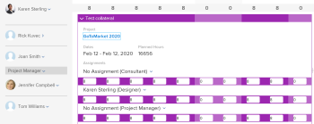

# Niet-toegewezen taken en problemen handmatig toewijzen in de planningsgebieden

>[!IMPORTANT]
>  
>De planningsfunctionaliteit die in dit artikel wordt beschreven, is vanaf de release 23.1 in januari 2023 vervangen en uit Adobe Workfront verwijderd.   
>  
>  Dit artikel wordt ook verwijderd kort na de release van 23.1, begin 2023. Op dit moment raden we u aan eventuele bladwijzers dienovereenkomstig bij te werken. 
> 
> U kunt de werklastbalans nu gebruiken om werk voor uw bronnen te plannen. 
>  
> Voor informatie over het plannen van middelen die de Balancer van de Werkbelasting gebruiken, zie de sectie [De werklastbalans](../../resource-mgmt/workload-balancer/workload-balancer.md). 

<!-- 

>[!CAUTION] 
> 
> 
> The information in this article refers to the Adobe Workfront's Scheduling tools. The Scheduling areas have been removed from the Preview environment and will be removed from the Production environment in **January 2023**.   
>  Instead, you can schedule resources in the Workload Balancer.  
> 
>*  For information about scheduling resources using the Workload Balancer, see the section [The Workload Balancer](../../resource-mgmt/workload-balancer/workload-balancer.md). 
> 
>*  For more information about the deprecation and removal of the Scheduling tools, see [Deprecation of Resource Scheduling tools in Adobe Workfront](../../resource-mgmt/resource-mgmt-overview/deprecate-resource-scheduling.md). 
-->

Met behulp van de plantijdlijn kunt u gebruikerstoewijzingen beheren, naast het opgeven van hoeveel tijd elke gebruiker wordt toegewezen voor een werkitem.

## Toegangsvereisten

U moet het volgende hebben:

<table style="table-layout:auto"> 
 <col> 
 <col> 
 <tbody> 
  <tr> 
   <td role="rowheader">Adobe Workfront-abonnement*</td> 
   <td> 
Alle
 </td> 
  </tr> 
  <tr> 
   <td role="rowheader">Adobe Workfront-licentie*</td> 
   <td> 
Werk of hoger
 </td> 
  </tr> 
  <tr> 
   <td role="rowheader">Toegangsniveau*</td> 
   <td> 
De mening of hogere toegang tot Projecten, Taken, en Kwesties
 
<b>OPMERKING</b>

Als u nog steeds geen toegang hebt, vraagt u de Workfront-beheerder of deze aanvullende beperkingen op uw toegangsniveau instelt. Voor informatie over hoe een beheerder van Workfront uw toegangsniveau kan veranderen, zie <a href="../../administration-and-setup/add-users/configure-and-grant-access/create-modify-access-levels.md" class="MCXref xref">Aangepaste toegangsniveaus maken of wijzigen</a>.
 </td>
</tr> 
  <tr> 
   <td role="rowheader">Objectmachtigingen</td> 
   <td> 
Contribute-machtigingen voor projecten, taken en problemen
 
Voor informatie over het aanvragen van aanvullende toegang raadpleegt u <a href="../../workfront-basics/grant-and-request-access-to-objects/request-access.md" class="MCXref xref">Toegang tot objecten aanvragen </a>.
 </td> 
  </tr> 
 </tbody> 
</table>

*Neem contact op met uw Workfront-beheerder om te weten te komen welk abonnement, licentietype of toegang u hebt.

## Vereisten voordat taken en problemen in de planningtijdlijn worden toegewezen

Voordat u begint met het beheren van gebruikerstoewijzingen zoals in deze sectie wordt beschreven, moet u goed leren hoe het plannen van resources in Workfront werkt, zoals in [Aan de slag met Resource Scheduling](../../resource-mgmt/resource-scheduling/get-started-resource-scheduling.md).

Om gebruikerstaken zoals die in deze sectie worden beschreven met succes te beheren, moet u eerst ervoor zorgen dat u, uw projecten, en uw taken en kwesties aan de eerste vereisten voldoen die in worden beschreven [Vereisten voor het gebruiken van de het plannen hulpmiddelen in Workfront](../../resource-mgmt/resource-scheduling/get-started-resource-scheduling.md#prerequisites) in het artikel [Aan de slag met Resource Scheduling](../../resource-mgmt/resource-scheduling/get-started-resource-scheduling.md).

In de volgende secties wordt beschreven hoe u gebruikerstoewijzingen handmatig, automatisch of door toewijzingen per gebruiker of rol te wisselen.

## Niet-toegewezen taken of problemen handmatig toewijzen aan gebruikers

De tijdlijn voor planning biedt de vereiste zichtbaarheid waarin gebruikers de taak of uitgave kunnen voltooien.\
Zie voor meer informatie over de planningtijdlijn [Aan de slag met Resource Scheduling](../../resource-mgmt/resource-scheduling/get-started-resource-scheduling.md).

U kunt afzonderlijke taken en uitgaven toewijzen aan gebruikers op de tijdlijn van de planning vanuit de volgende Workfront-gebieden:

* De plannende sectie onder Middelen (wanneer het plannen van middelen voor veelvoudige projecten).
* De plannende sectie onder een project (wanneer het plannen van middelen voor één enkel project).
* De sectie van het Programma onder een team (wanneer het plannen van middelen voor een team).

De informatie die in het Unassigned gebied bij de bovenkant van de het plannen chronologie wordt getoond verschilt afhankelijk van het gebied van Workfront waar u middel het plannen (of van de Plannende sectie (wanneer het plannen van middelen voor veelvoudige projecten), de Plannende sectie (wanneer het plannen van middelen voor één enkel project), of de sectie van het Programma (wanneer het plannen van middelen voor een team) gebruikt. Zie de sectie voor meer informatie [Beschikbare functies in het planningsgebied](../../resource-mgmt/resource-scheduling/overview-scheduling-areas.md#functionality-available-in-the-scheduling-area) in het artikel [Overzicht van de planningsgebieden](../../resource-mgmt/resource-scheduling/overview-scheduling-areas.md).

Afhankelijk van het gebied in Workfront waar u de tijdlijn van de planning bekijkt, kunnen alleen bepaalde gebruikers in aanmerking komen voor toegewezen werk. Zie voor meer informatie [Overzicht van de planningsgebieden](../../resource-mgmt/resource-scheduling/overview-scheduling-areas.md).

Niet-toegewezen taken of problemen toewijzen aan gebruikers op de tijdlijn van de planning:

1. Ga naar de het plannen chronologie voor veelvoudige projecten, voor een individueel project, of voor een team:

   * **Voor meerdere projecten**: Klik op de knop **Hoofdmenu** pictogram  in de rechterbovenhoek van Workfront klikt u op **Bronnen > Werklastverdeling** selecteert u vervolgens **Planning** in het drop-down menu linksboven.
   * **Voor een afzonderlijk project**: Ga naar een project, klik **Werklastverdeling** in het linkerdeelvenster en selecteer vervolgens **Planning** in het keuzemenu linksboven.
   * **Voor een team**: Klik op de knop **Hoofdmenu** pictogram  in de rechterbovenhoek van Workfront klikt u op **Teams**, selecteert u een team en klikt u op **Werklastverdeling** in het linkerdeelvenster selecteert u vervolgens **Planning** in het keuzemenu linksboven.

   

1. (Optioneel) Maak een filter om aan te passen welke inhoud op de tijdlijn van de planning wordt weergegeven, zoals wordt beschreven in [Gegevens filteren in het planningsgebied](../../resource-mgmt/resource-scheduling/filter-scheduling-area.md) . [Gegevens filteren in het planningsgebied](../../resource-mgmt/resource-scheduling/filter-scheduling-area.md). Als u bijvoorbeeld problemen wilt weergeven op de tijdlijn van de planning, moet u een filter maken.

1. (Optioneel) Wijzig het datumbereik dat wordt weergegeven op de tijdlijn van de planning, zoals beschreven in [Het datumbereik van de planningsgebieden aanpassen](../../resource-mgmt/resource-scheduling/get-started-resource-scheduling.md#adjusting-the-date-range-for-which-data-is-displayed) in [Aan de slag met Resource Scheduling](../../resource-mgmt/resource-scheduling/get-started-resource-scheduling.md).

1. Ga als volgt te werk om een niet-toegewezen taak of uitgave toe te wijzen:

   * Sleep de taak of kwestie aan de rij van de gebruiker u wilt toewijzen.\
      Een maximum van 10 taken per dag wordt getoond voor een bepaalde gebruiker. U kunt de lijst uitvouwen om alle taken weer te geven die momenteel aan die gebruiker zijn toegewezen. (Na het uitvoeren van taken op de planningstijdlijn, zouden meer dan 10 taken tijdelijk kunnen worden getoond.)\
      Terwijl u een item sleept, wordt de volgende informatie weergegeven voordat u de taak of uitgave loslaat en de toewijzing voltooit:

   * Als gebruikerstoewijzingen zijn ingeschakeld op de tijdlijn van de planning, worden de rode overtoewijzingsindicatoren weergegeven als het voltooien van de toewijzing tot gevolg heeft dat de gebruiker wordt oververdeeld.\
      Zie de sectie voor meer informatie over overtoewijzingsindicatoren [Toewijzingsindicatoren](../../resource-mgmt/resource-scheduling/manage-allocations-scheduling-areas.md#understanding-allocation-indicators) in het artikel [Gebruikerstoewijzingen beheren in de planningsgebieden](../../resource-mgmt/resource-scheduling/manage-allocations-scheduling-areas.md).

      Als de **Toewijzingen beperken tot gebruikers met een overeenkomstige rol** Deze optie is ingeschakeld in het gedeelte Instellingen. Gebruikers die niet in aanmerking komen voor de toewijzing, worden grijs weergegeven. Als deze optie is uitgeschakeld, kunnen alle gebruikers de toewijzing ontvangen. De optie is standaard ingeschakeld.\
      Zie voor meer informatie over deze optie  in [Gebruikerstoewijzingen ongeacht rol en groepslidmaatschap in de planningsgebieden toestaan](../../resource-mgmt/resource-scheduling/assignments-regardless-of-role-or-group-scheduling-areas.md)

      Een neerzetindicator wordt in de rij van de gebruiker weergegeven. Hierdoor kunt u zien waar een item wordt toegewezen voordat u de toewijzing maakt.

      Vouw de taak of uitgave die u wilt toewijzen uit, klik op de vervolgkeuzepijl in het dialoogvenster **Toewijzingen** typt u eerst de naam van de gebruiker die u wilt toewijzen en vervolgens klikt u op de naam van de gebruiker in de vervolgkeuzelijst.\
      

1. (Voorwaardelijk) Na het toewijzen van een niet toegewezen taak of kwestie aan een gebruiker, zou u de bestaande taken voor taken en kwesties onder de gebruikers op de het plannen chronologie kunnen willen aanpassen. Wanneer het plannen van middelen voor projecten (of op het Plannende lusje of het het Personelen lusje), slechts kunnen de gebruikers die de zelfde baanrol hebben de taak ontvangen.\
   Als u een taak of uitgave opnieuw aan een andere gebruiker wilt toewijzen, sleept u de taak van de rij van de ene gebruiker naar de rij van een andere gebruiker.
1. (Optioneel) Configureer het aantal uren dat elke toegewezen gebruiker aan de taak of uitgave is toegewezen, zoals wordt beschreven in [Gebruikerstoewijzingen beheren in de planningsgebieden](../../resource-mgmt/resource-scheduling/manage-allocations-scheduling-areas.md) .
