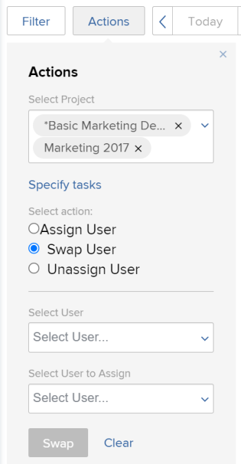

# Meerdere gebruikerstoewijzingen wijzigen voor taken in de planningsgebieden

>[!IMPORTANT]
>  
>De planningsfunctionaliteit die in dit artikel wordt beschreven, is vanaf de release 23.1 in januari 2023 vervangen en uit Adobe Workfront verwijderd.   
>  
>  Dit artikel wordt ook verwijderd kort na de release van 23.1, begin 2023. Op dit moment raden we u aan eventuele bladwijzers dienovereenkomstig bij te werken. 
> 
> U kunt de werklastbalans nu gebruiken om werk voor uw bronnen te plannen. 
>  
> Voor informatie over het plannen van middelen die de Balancer van de Werkbelasting gebruiken, zie de sectie [De werklastbalans](../../resource-mgmt/workload-balancer/workload-balancer.md). 

<!--   

>[!CAUTION] 
> 
> 
> The information in this article refers to the Adobe Workfront's Scheduling tools. The Scheduling areas have been removed from the Preview environment and will be removed from the Production environment in **January 2023**.  
>  Instead, you can schedule resources in the Workload Balancer.  
> 
>*  For information about scheduling resources using the Workload Balancer, see the section [The Workload Balancer](../../resource-mgmt/workload-balancer/workload-balancer.md). 
> 
>*  For more information about the deprecation and removal of the Scheduling tools, see [Deprecation of Resource Scheduling tools in Adobe Workfront](../../resource-mgmt/resource-mgmt-overview/deprecate-resource-scheduling.md). 

This article refers to modifying user assignments for multiple tasks using the Scheduling area of Adobe Workfront. Also see the following articles for modifying assignments on multiple tasks in other areas:

* For information about modifying assignments on multiple tasks in a task list, see [Modify multiple user assignments in a task list](../../manage-work/tasks/assign-tasks/modify-multiple-assignments-in-task-list.md). 
* For information about scheduling resources using the new Workload Balancer, see the section [The Workload Balancer](../../resource-mgmt/workload-balancer/workload-balancer.md).
-->
U kunt gebruikers aan veelvoudige taken tezelfdertijd toewijzen wanneer het gebruiken van de Planner van het Middel.

>[!NOTE]
>
>Dit artikel is slechts van toepassing wanneer het plannen van middelen voor veelvoudige projecten (van de Plannende sectie) of voor één enkel project (van de Plannende sectie); u kunt gebruikerstoewijzingen voor veelvoudige taken niet beheren zoals die in deze sectie wordt beschreven wanneer het plannen van middelen voor een team (van de sectie van het Programma).

## Toegangsvereisten

U moet het volgende hebben:

<table style="table-layout:auto"> 
 <col> 
 <col> 
 <tbody> 
  <tr> 
   <td role="rowheader">Adobe Workfront-abonnement*</td> 
   <td> 
Alle
 </td> 
  </tr> 
  <tr> 
   <td role="rowheader">Overzicht Adobe Workfront-licenties*</td> 
   <td> 
Werk of hoger
 </td> 
  </tr> 
  <tr> 
   <td role="rowheader">Toegangsniveau*</td> 
   <td> 
De mening of hogere toegang tot Projecten, Taken, en Kwesties
 
<b>OPMERKING</b> Als u nog steeds geen toegang hebt, vraagt u de Workfront-beheerder of deze aanvullende beperkingen op uw toegangsniveau instelt. Voor informatie over hoe een beheerder van Workfront uw toegangsniveau kan veranderen, zie <a href="../../administration-and-setup/add-users/configure-and-grant-access/create-modify-access-levels.md" class="MCXref xref">Aangepaste toegangsniveaus maken of wijzigen</a>.
 </td> 
  </tr> 
  <tr> 
   <td role="rowheader">Objectmachtigingen</td> 
   <td> 
Contribute-machtigingen of hoger voor de projecten, taken en uitgaven waarvoor u toewijzingen bijwerkt
 
Voor informatie over het aanvragen van aanvullende toegang raadpleegt u <a href="../../workfront-basics/grant-and-request-access-to-objects/request-access.md" class="MCXref xref">Toegang tot objecten aanvragen </a>.
 </td> 
  </tr> 
 </tbody> 
</table>

*Neem contact op met uw Workfront-beheerder om te weten te komen welk abonnement, licentietype of toegang u hebt.

## Overwegingen bij het uitvoeren van meerdere taken in de planningsgebieden

U kunt gebruikerstoewijzingen voor veelvoudige taken en kwesties over één of meerdere projecten snel beheren (de veranderingen worden dan weerspiegeld op de het plannen chronologie).

U kunt een gebruiker toewijzen aan alle taken die momenteel aan een taakrol zijn toegewezen, gebruikerstoewijzingen tussen gebruikers wisselen of de toewijzing van een gebruiker voor alle taken ongedaan maken.

Bijvoorbeeld:

* Een middelmanager is verantwoordelijk voor het maken van gebruikerstoewijzingen op een nieuw project. Het project werd oorspronkelijk gecreeerd als malplaatje en de baanrollen worden reeds toegewezen aan de diverse taken binnen het project. De middelmanager wil een specifieke gebruiker aan alle taken toewijzen die momenteel aan een baanrol worden toegewezen.
* 45 taken over 3 verschillende projecten worden toegewezen aan Jackie Simms. Jackie verlaat de organisatie, en nu moet de middelmanager haar taken aan een andere gebruiker opnieuw toewijzen.

>[!NOTE]
>
>Houd rekening met de volgende beperkingen wanneer u gebruikerstoewijzingen voor meerdere taken beheert:
>
>* Wanneer het plannen van middelen voor veelvoudige projecten, moeten de projecten u beheert in één van de volgende statussen (of een status zijn die met één van deze statussen evenaart): Planning, Huidige of Goedgekeurd. Voor meer informatie over projectstatussen, zie [Een status maken of bewerken](../../administration-and-setup/customize-workfront/creating-custom-status-and-priority-labels/create-or-edit-a-status.md).
>* Wanneer het plannen van middelen voor één enkel project, beïnvloedt de projectstatus niet de beschikbaarheid van deze functionaliteit.
>* Met de volgende licenties kunt u de resources wijzigen voor gebruikers: Plan, werk en revisie. U kunt geen wijzigingen aanbrengen in de bronnen voor gebruikers met een aanvraaglicentie.
>

## Gebruikerstoewijzingen voor een of meer projecten beheren

1. Ga naar de het plannen chronologie voor veelvoudige projecten of voor een individueel project:

   * **Voor meerdere projecten**: Klik op de knop **Hoofdmenu** pictogram  in de rechterbovenhoek van Workfront klikt u op **Bronnen > Werklastverdeling** selecteert u vervolgens **Planning** in het drop-down menu linksboven.
   * **Voor een afzonderlijk project**: Ga naar een project, klik **Werklastverdeling** in het linkerdeelvenster en selecteer vervolgens **Planning** in het keuzemenu linksboven.

1. Klikken **Handelingen**.\
   

1. In de **Project selecteren** het gebied, afhankelijk van of u de het plannen chronologie voor veelvoudige projecten (van het Plannende lusje) of voor een individueel project (van het het Staven lusje) bekijkt, doe één van beiden van het volgende:

   * **Voor meerdere projecten:** Typ de naam van het project waar u toewijzingswijzigingen wilt aanbrengen en klik vervolgens op de naam wanneer deze wordt weergegeven in de vervolgkeuzelijst. U kunt ook op de vervolgkeuzepijl klikken om een keuze te maken in een lijst met projecten. Herhaal dit proces om toewijzingswijzigingen toe te passen op meerdere projecten.\
      Laat dit veld leeg om toewijzingswijzigingen aan te brengen in alle projecten waarvoor u de bronnenbeheerder bent.

      >[!NOTE]
      >
      >Projecten kunnen alleen worden geselecteerd als:
      >
      >   
      >   
      >   * U wordt aangewezen als middelmanager op het project\
         >     Zie voor meer informatie [Bronbeheerders aanwijzen voor een project of sjabloon](../../manage-work/projects/planning-a-project/designate-resource-managers-for-projects-and-templates.md).
      >   
      >   * Het project heeft een van de volgende statussen (of een status die gelijk is aan een van deze statussen): Planning, Huidige of Goedgekeurd\
         >     Voor meer informatie over projectstatussen, zie [Een status maken of bewerken](../../administration-and-setup/customize-workfront/creating-custom-status-and-priority-labels/create-or-edit-a-status.md).
      >   
      >   * U bent een gebruiker met een licentie voor abonnementen.

   * **Voor een afzonderlijk project:** De **Project selecteren** veld kan niet worden gewijzigd. De **Project selecteren** bevat altijd de naam van het project dat u bekijkt.

1. (Optioneel) Klik op **Taken opgeven** om toewijzingswijzigingen voor afzonderlijke taken te wijzigen. Wanneer u individuele taken specificeert, om het even welke projecten u in selecteerde **Project selecteren** worden genegeerd.\
   In de **Taken selecteren** in het veld typt u de naam van de taak waar u toewijzingswijzigingen wilt aanbrengen. Herhaal deze stap om de toewijzing van extra taken te wijzigen.\
   Als u dit gebied leeg verlaat, worden alle taken binnen de projecten u in Stap 3 selecteerde beïnvloed.\
   Wanneer u toewijzingswijzigingen aanbrengt voor afzonderlijke taken, worden wijzigingen toegepast op alle subtaken voor de taken die u opgeeft. Wijzigingen worden ook toegepast op alle problemen in verband met de taken als problemen zijn geconfigureerd voor weergave op de tijdlijn van de planning, zoals beschreven in [U kunt verschillende instellingen configureren om aan te passen hoe en welke informatie wordt weergegeven in de tijdlijn van de planning.](../../resource-mgmt/resource-scheduling/configure-settings-scheduling-areas.md#configuring-issues-to-display-on-the-scheduling-timeline) in [Instellingen configureren in de planningsgebieden](../../resource-mgmt/resource-scheduling/configure-settings-scheduling-areas.md).

1. Ga door met een van de volgende secties:

   * [Een gebruiker toewijzen](#assign-a-user)
   * [Een gebruiker wisselen](#swap-a-user)
   * [Toewijzing van een gebruiker ongedaan maken](#unassign-a-user)

### Een gebruiker toewijzen {#assign-a-user}

U kunt een gebruiker aan alle taken toewijzen die momenteel aan een specifieke rol binnen de geselecteerde projecten worden toegewezen.

Wanneer u op deze manier een gebruiker toewijst, wordt de gebruiker niet toegewezen aan de volgende typen taken:

* Toewijzingen voor taken die al zijn toegewezen aan een gebruiker
* Taken die zijn voltooid

Om een gebruiker aan taken door de geselecteerde projecten of de taken toe te wijzen:

1. Selecteren **Gebruiker toewijzen** in de **Handeling selecteren** sectie.\
   

1. In de **Rol selecteren** Klik op de vervolgkeuzepijl om een keuze te maken in een lijst met rollen. Alleen rollen die momenteel zijn toegewezen aan taken binnen de opgegeven projecten worden weergegeven.\
   Wanneer u een gebruiker toewijst, vervangt de gebruiker de rollen die u hier selecteert.

1. In de **Gebruiker selecteren om toe te wijzen** Klik op de vervolgkeuzepijl om een keuze te maken in een lijst met gebruikers.\
   Als de **Toewijzingen beperken tot gebruikers met een overeenkomstige rol** is ingeschakeld in het gedeelte Instellingen, kunnen gebruikers alleen selecteren als ze de geselecteerde rol hebben toegewezen in hun gebruikersinstellingen (als primaire rol of als andere rol). Als deze optie is uitgeschakeld, kunt u beginnen met het typen van de naam van een andere gebruiker die u wilt toewijzen, zelfs als voor die gebruiker geen overeenkomende rol is gedefinieerd in het systeem. De optie is standaard ingeschakeld.\
   Zie voor meer informatie over deze optie [Gebruikerstoewijzingen ongeacht rol en groepslidmaatschap in de planningsgebieden toestaan](../../resource-mgmt/resource-scheduling/assignments-regardless-of-role-or-group-scheduling-areas.md). Door gebrek, kunnen de taken slechts aan gebruikers worden gemaakt die een rol hebben die op hun gebruikersprofiel wordt bepaald dat de roltaak van de taak of de kwestie aanpast die aan hen wordt toegewezen.

1. Klikken **Toewijzen**.\
   U kunt maximaal 1000 toewijzingen maken in één actie. Als de selecties die u maakt, meer dan 1000 toewijzingswijzigingen bevatten, moet u de selecties aanpassen en het opnieuw proberen.

### Een gebruiker wisselen {#swap-a-user}

U kunt de taaktaken van een gebruiker met de taaktaken van een andere gebruiker in de geselecteerde projecten of voor de geselecteerde taken ruilen.

Wanneer u de taaktoewijzingen van een gebruiker omwisselt zoals in deze sectie wordt beschreven, worden toewijzingen die al zijn gemarkeerd als Voltooien, niet omgewisseld.

Om de taken van een gebruiker te ruilen met de taaktaken van een andere gebruiker:

1. Selecteren **Gebruiker wisselen** in de **Handeling selecteren** sectie.\
   

1. In de **Gebruiker selecteren** Klik op de vervolgkeuzepijl om een keuze te maken in een lijst met gebruikers (of typ de naam van de gebruiker die u wilt omwisselen en klik vervolgens op de naam wanneer deze wordt weergegeven in de vervolgkeuzelijst).\
   De vertoningen van gebruikers slechts wanneer zij aan één of meerdere onvolledige taken binnen de gespecificeerde projecten worden toegewezen.

1. (Voorwaardelijk) De **Selecteer een rol** wordt alleen weergegeven wanneer de gebruiker die u hebt geselecteerd, aan meerdere taken met verschillende rollen is toegewezen. (Als u de taakrol wilt weergeven die op de taak voor een gebruiker is ingesteld, raadpleegt u de **Rol van de gemachtigde** in het dialoogvenster Geavanceerde toewijzing op de taak, zoals wordt beschreven in [Geavanceerde toewijzingen maken](../../manage-work/tasks/assign-tasks/create-advanced-assignments.md)).\
   In de **Selecteer een rol** selecteert u de rol die u wilt gebruiken om het type taken te bepalen dat u wilt omwisselen. Alleen de taken waarvoor de gebruiker met deze rol is toegewezen, worden toegewezen aan de nieuwe gebruiker.\
   Hanna Marin wordt bijvoorbeeld toegewezen aan vijf taken voor het project. Op twee van de taken wordt haar taakrol gedefinieerd als &quot;Ingenieur.&quot; Op de resterende drie van haar taken is haar functie gedefinieerd als een &quot;Designer&quot;. Als u Designer selecteert in het veld Rol selecteren, betekent dit dat u de toewijzingen wilt wijzigen voor alle drie de taken van Hanna, waarbij haar taakrol wordt gedefinieerd als &quot;Designer&quot;. De twee taken waarvoor haar functie als &quot;Ingenieur&quot; is gedefinieerd, blijven ongewijzigd.\
   

1. In de **Gebruiker selecteren om toe te wijzen** Klik op de vervolgkeuzepijl om een keuze te maken in een lijst met gebruikers. De gebruikers zijn beschikbaar om slechts toe te wijzen als hun rollen (zoals die in hun gebruikersmontages worden bepaald) de rollen van het werk aanpassen dat aan de gebruiker wordt toegewezen u vervangt.\
   Als de **Toewijzingen beperken tot gebruikers met een overeenkomstige rol** optie wordt toegelaten op het gebied van Montages, zijn de gebruikers beschikbaar om slechts toe te wijzen als hun rollen (zoals die in hun gebruikersmontages worden bepaald) de rollen van het werk aanpassen dat aan de gebruiker wordt toegewezen u vervangt. Als deze optie is uitgeschakeld, kunt u beginnen met het typen van de naam van een andere gebruiker die u wilt toewijzen, zelfs als voor die gebruiker geen overeenkomende rol is gedefinieerd in het systeem. De optie is standaard ingeschakeld.\
   Zie voor meer informatie over deze optie [Gebruikerstoewijzingen ongeacht rol en groepslidmaatschap in de planningsgebieden toestaan](../../resource-mgmt/resource-scheduling/assignments-regardless-of-role-or-group-scheduling-areas.md). Door gebrek, kunnen de taken slechts aan gebruikers worden gemaakt die een rol hebben die op hun gebruikersprofiel wordt bepaald dat de roltaak van de taak of de kwestie aanpast die aan hen wordt toegewezen.\
   Als de gebruiker u vervangt in veelvoudige rollen op taken in de geselecteerde projecten wordt toegewezen, en u selecteert meer dan één rol in **Selecteer een rol** in het veld **Gebruiker selecteren om toe te wijzen** in het veld worden alleen gebruikers weergegeven die alle opgegeven rollen hebben.

1. Klikken **Wisselen**.\
   U kunt maximaal 1000 toewijzingen maken in één actie. Als de selecties die u maakt, meer dan 1000 toewijzingswijzigingen bevatten, moet u de selecties aanpassen en het opnieuw proberen.

### Toewijzing van een gebruiker ongedaan maken {#unassign-a-user}

U kunt de toewijzing van een gebruiker ongedaan maken voor alle taken waaraan de gebruiker is toegewezen in de geselecteerde projecten of voor de geselecteerde taken. Wanneer u de toewijzing van een gebruiker ongedaan maakt, worden alle taken die aan die gebruiker zijn toegewezen, teruggezet naar de taakstatus voordat de gebruiker werd toegewezen.

Als een gebruiker een primaire rol heeft die in het systeem wordt bepaald en u unassign de gebruiker, wordt de taak automatisch toegewezen aan de primaire rol van de gebruiker wanneer u unassign de gebruiker. Of het wordt toegewezen aan de rol het aan voorafgaand aan de gebruiker werd toegewezen die.

Als een gebruiker geen primaire rol heeft die in het systeem wordt bepaald en u unassign de gebruiker, gaat de taak in een niet toegewezen staat wanneer u unassign de gebruiker.

Taken die zijn gemarkeerd als Voltooid, kunnen niet opnieuw worden toegewezen.

Om een gebruiker van taken door de geselecteerde projecten of voor de geselecteerde taken ongedaan te maken:

1. Selecteren **Gebruiker vrijgeven** in de **Handeling selecteren** sectie.\
   

1. In de **Gebruiker selecteren** Klik op de vervolgkeuzepijl om een keuze te maken in een lijst met gebruikers (of typ de naam van de gebruiker die u wilt vrijgeven en klik vervolgens op de naam wanneer deze wordt weergegeven in de vervolgkeuzelijst). U kunt de toewijzing van slechts één gebruiker tegelijk ongedaan maken.
1. (Voorwaardelijk) De **Selecteer een rol** wordt alleen weergegeven wanneer de gebruiker die u hebt geselecteerd, aan meerdere taken met verschillende rollen is toegewezen. (Als u wilt zien welke taakrol op de taak voor een gebruiker is ingesteld, raadpleegt u de **Rol van de gemachtigde** in het dialoogvenster Geavanceerde toewijzing op de taak, zoals wordt beschreven in [Geavanceerde toewijzingen maken](../../manage-work/tasks/assign-tasks/create-advanced-assignments.md)).\
   In de **Selecteer een rol** in het veld selecteert u de rol die u wilt bepalen welk type taken u wilt verwijderen. Alleen de taken waarvoor de gebruiker deze rol heeft toegewezen, worden niet toegewezen.\
   Hanna Marin wordt bijvoorbeeld toegewezen aan vijf taken voor een project. Bij twee taken wordt haar functie gedefinieerd als een engineer. Op de resterende drie van haar taken is haar functie gedefinieerd als een Designer. Als u Designer selecteert in het veld Rol selecteren, betekent dit dat u de toewijzing van Hanna voor alle drie de taken ongedaan wilt maken, waarbij haar taakrol als Designer is gedefinieerd. De twee taken waarvoor haar functie als engineer is gedefinieerd, blijven ongewijzigd.\
   

1. Klikken **Toewijzen ongedaan maken**.\
   U kunt maximaal 1000 toewijzingen maken in één actie. Als de selecties die u maakt, meer dan 1000 toewijzingswijzigingen bevatten, moet u de selecties aanpassen en het opnieuw proberen.
