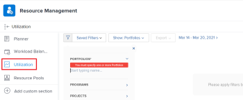
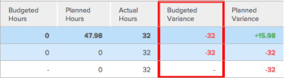

# Informatie over bronnengebruik weergeven

<!-- Audited: 01/2024 -->

<!--

(NOTE:&nbsp;this is linked to the UI from the Utilization report. ALWAYS keep this information. DO NOT DELETE!!)

-->

U kunt het gebruik van uw middelen in het rapport van het Gebruik bekijken.

<!--

(NOTE: Vazgen's response about these hours ie below and he asked us to NOT document them:

It queries Assignments first to get the tasks, issues, projects to display in the view. And then from those gets the hours.

In some cases, like for Planned Hours, it takes them from Assignments

But Budgeted Hours come from projects.

And Actual Hours are their own object - Hour)

-->

<!--

This report displays information about the assignments on work items for projects in your environment, like Planned, Actual, and Budgeted Hours, FTE, or Cost.&nbsp;These are hours,&nbsp;FTE, or costs associated with the assignments and not with the tasks and issues themselves.(PRIVATE NOTE:&nbsp;Vazgen's response about these hours: It queries Assignments first to get the tasks, issues, projects to display in the view. And then from those gets the hours. In some cases, like for Planned Hours, it takes them from Assignments; But Budgeted Hours come from projects. And Actual Hours are their own object - Hour.)

-->

## Toegangsvereisten

+++ Breid uit om de toegangseisen voor de functionaliteit in dit artikel weer te geven.

U moet het volgende hebben om tot het rapport van het Gebruik toegang te hebben:

<table style="table-layout:auto"> 
 <col> 
 <col> 
 <tbody> 
  <tr> 
   <td role="rowheader">Adobe Workfront-plan</td> 
   <td>
Nieuw: alle

       
of

       
Huidig: Pro of hoger
 </td> 
  </tr> 
  <tr> 
   <td role="rowheader">Adobe Workfront-licentie</td> 
   <td>
Nieuw: Standaard

       
of

       
Huidig: Plan
 </td> 
  </tr> 
  <tr> 
   <td role="rowheader">Configuraties op toegangsniveau</td> 
   <td> 
Toegang tot het volgende weergeven of vergroten:
 
    <ul> 
     <li> 
Bronbeheer 
 </li> 
     <li> 
Projecten
 </li> 
     <li> 
Portfolio's
 </li> 
     <li> 
Programma's
 </li> 
     <li> 
Financiële gegevens als u informatie wilt bekijken op kosten
 </li> 
    </ul> </td> 
  </tr> 
  <tr> 
   <td role="rowheader">Objectmachtigingen</td> 
   <td> 
Toegang tot projecten, portfolio's en programma's weergeven voor toegang tot de sectie Gebruik in het gebied Bronnen
 
  
 
Toegang tot een project beheren om toegang te krijgen tot de sectie van het gebruik van het project
 
  </td> 
  </tr> 
 </tbody> 
</table>

Voor meer detail over de informatie in deze lijst, zie [ vereisten van de Toegang in de documentatie van Workfront ](/help/quicksilver/administration-and-setup/add-users/access-levels-and-object-permissions/access-level-requirements-in-documentation.md).

+++

<!--

You must have View access to the projects you want to view utilization information for as described in this section. If you are still unable to access this information, contact your Workfront administrator. (NOTE:&nbsp;replaced with above table)

-->

<!--

<h2>Prerequisites for accessing utilization information</h2>

(NOTE: drafted, replaced with above table)

To access utilization information as described in this section, ensure that the following conditions are met:

<ul>
<li>You have at least&nbsp;View access to the project, program, or portfolio for which you want to view the utilization information.</li>
<li>Your Workfront administrator must grant you at least View access to&nbsp;Financial&nbsp;Data in your Access Level to be able to view cost and revenue information in the Utilization report. The Workfront administrator must enable both View Role Billing & Cost Rates as well as View User Billing &&nbsp;Cost Rates when they grant you the View access to Financial Data. For information about granting access to&nbsp;Financial&nbsp;Data, see <a href="../../administration-and-setup/add-users/configure-and-grant-access/grant-access-financial.md" class="MCXref xref">Grant access to financial data</a>. </li>
<li>

(NOTE:&nbsp;drafted. No longer the case.) 

The Utilization tab is included on any layout template that is assigned to you and that is applied to either the projects you view or to the Reporting area. 

The Utilization section is included on any layout template that is assigned to you and that is applied to either the projects you view or to the Resourcing area. 

</li>
<li>

The Utilization tab is available by default in the Reporting area if the system administrator has not assigned a custom layout template to you. 

The Utilization section is available by default in the Resourcing area if the system administrator has not assigned a custom layout template to you. 

</li>
</ul>

-->

## Overzicht van het gebruiksrapport {#overview-of-the-utilization-report}

Met het gebruiksrapport kunt u de voortgang, kosten of inkomsten van een project, programma of portfolio in één rapport bekijken. U kunt ook inkomsten vergelijken met kosten.

U kunt het rapport van het Gebruik in het gebied van het Middelen bekijken om gebruik over veelvoudige projecten te tonen, of u kunt het op het niveau van één project bekijken, om gebruik voor de individuele middelen (baanrollen en gebruikers) te tonen verbonden aan dat project.

Voor informatie over de toegang tot van en het gebruiken van het rapport van het Gebruik, zie de [ vooruitgang van het Spoor, de kosten, en de opbrengst met het rapport van het Gebruik ](#track-progress-cost-and-revenue-with-the-utilization-report) sectie in dit artikel.

### Trackuren (voortgang) {#track-hours-progress}

U kunt de voortgang volgen door te bekijken hoe de begrote en geplande uren vergeleken worden met de werkelijke uren.

Wanneer u de voortgang van een project, programma of portfolio volgt, wordt de voortgang ten opzichte van zowel taken als problemen opgenomen in het gebruiksrapport.

De volgende informatie is beschikbaar in het rapport Gebruik bij het volgen van Uren:

<table style="table-layout:auto"> 
 <col> 
 <col> 
 <thead> 
  <tr> 
   <th><strong> Titel van de Kolom wanneer het Bekijken van uren </strong> </th> 
   <th><strong> Functie </strong> </th> 
  </tr> 
 </thead> 
 <tbody> 
  <tr> 
   <td scope="col"><strong> Beoogde Uren </strong> </td> 
   <td scope="col"> 
De totale begrote uren voor de opgenomen projecten. U kunt de totale begrote uren voor de totale levensduur van de opgenomen projecten weergeven, of u kunt de totale begrote uren alleen voor het opgegeven datumbereik weergeven (u kunt een afzonderlijke week of maand opgeven). 
 
De begrote Uren zijn bevolkt van informatie beschikbaar in het gebied van de Begroting van het Middel van het BedrijfsGeval of de Planner van het Middel <em>.</em>
 
De begrote Uren verschijnen op het rapport van het Gebruik in om het even welke volgende rijen:
 
    <ul> 
     <li> De begrote uren uren worden samengevat door baanrol en door individuele gebruiker in het rapport van het Gebruik, als volgt: <strong> Individuele Gebruiker:</strong> Begroeide Uren worden samengevat voor elke gebruiker in het gebruiksrapport. Deze begrotingsuren zijn gekoppeld aan de taken en problemen waaraan de gebruiker is toegewezen voor de opgenomen projecten. (U kunt de rij van de overeenkomstige baanrol uitbreiden om een lijst van gebruikers met die baanrol te bekijken.) <strong> de Rol van de Baan:</strong> de Begroeide Uren worden samengevat door baanrol in het gebruiksrapport.  begrotingsuren verschijnen in een bepaalde baanrol als resultaat van om het even welke volgende scenario's:
     <ul>
     <li>De taakrol wordt gedefinieerd als de primaire taakrol van de gebruiker die is toegewezen aan de taak of kwestie waar de begrotingsuren zijn gekoppeld. </li> 
       <li>Wanneer u gebruiksinformatie voor één enkel project bekijkt, wordt de baanrol van de gebruiker toegewezen de uren gebruikt of er geen taak op de taak of de kwestie is, wordt een andere gebruiker toegewezen zonder baanroltaak, een andere gebruiker met een verschillende baanrol wordt toegewezen, of een ander team wordt toegewezen.</li> 
       <li>Wanneer u gebruiksinformatie voor verscheidene projecten, programma's, of portefeuilles bekijkt, wordt de baanrol van de gebruiker toegewezen de uren gebruikt slechts wanneer de rol aan een taak of een kwestie in een project wordt toegewezen. </li> 
       <li>De baanrol wordt toegewezen aan de taak of kwestie die de Gekoppelde Uren verbonden heeft, en de gebruiker die aan de taak of de kwestie wordt toegewezen heeft geen baanrol die in het systeem wordt bepaald.</li> 
      </ul></li> 
    </ul> 
    <ul> 
     <li> 
<strong> Niet toegewezen Uren </strong>: De begrote Uren worden getoond in het gebruiksrapport in de Unassigned sectie van Uren wanneer de Gefilmde Uren met een taak of een kwestie worden geassocieerd en er geen gebruiker of rol aan de taak of de kwestie wordt toegewezen.  deze sectie verschijnt slechts wanneer er uren op het project zijn die deze beschrijving aanpassen en wanneer het bekijken van het rapport van het Gebruik door of van een project. 
 
Deze sectie verschijnt slechts wanneer er uren op het project zijn die deze beschrijving aanpassen en wanneer het bekijken van het rapport van het Gebruik door of van een project. 
 </li> 
    </ul> 
Voor meer informatie over in de begroting opgenomen uren, zie <a href="/help/quicksilver/manage-work/projects/project-finances/budgeted-labor-cost.md#locate-the-budgeted-hours-of-a-project"> van de Begrotende Uren van een project </a> in <a href="/help/quicksilver/manage-work/projects/project-finances/budgeted-labor-cost.md"> Begrijpte Arbeidskosten en Begrotingshours voor projecten </a> begrijpen.
 </td> 
  </tr> 
  <tr> 
   <td scope="col"><strong> Geplande Uren </strong> </td> 
   <td scope="col">

De geplande uren op de inbegrepen projecten die met de taken op elke taak en kwestie worden geassocieerd. U kunt de totale geplande uren van alle taken op het project voor de algemene levensduur van de opgenomen projecten bekijken, of u kunt de totale geplande uren alleen voor het opgegeven datumbereik weergeven (u kunt een afzonderlijke week of maand opgeven).

<strong> TIP </strong>

Er wordt geen rekening gehouden met de geplande uren van items met een duur van 0. 

De geplande uren in het gebruiksrapport houden rekening met of de geplande uren opnieuw zijn toegewezen over de duur van een taak of kwestie. 

Wanneer de dagelijkse toewijzing van de gebruiker voor uren is gewijzigd gebruikend de Balancer van de Werklast, kunnen de gegevens in het rapport van het Gebruik worden beïnvloed als de data die in het rapport van het Gebruik worden geselecteerd slechts een deel van de Duur van een taak of van de kwestie bevatten. 

Voor informatie over het wijzigen van toewijzingen voor gebruikers, zie <a href="../workload-balancer/manage-user-allocations-workload-balancer.md"> gebruikerstoewijzingen in de Balancer van de Werklast beheren </a>.

De geplande uren verschijnen op het rapport van het Gebruik in om het even welke volgende rijen:

<ul>

<li>De geplande uren worden samengevat door baanrol en door individuele gebruiker in het gebruiksrapport, als volgt: 
<ul>

<li><strong> Individuele Gebruiker </strong>: De geplande Uren worden samengevat voor elke gebruiker in het gebruiksrapport. Deze Geplande Uren worden geassocieerd met de taken en de kwesties die de gebruiker aan op de inbegrepen projecten wordt toegewezen. (U kunt de rij van de overeenkomstige baanrol uitbreiden om een lijst van gebruikers met die baanrol te bekijken.)

<li><strong> Rol van de Baan </strong>: De geplande Uren worden samengevat door baanrol in het gebruiksrapport van één enkel project.  Geplande Uren verschijnen in een bepaalde baanrol als resultaat van om het even welke volgende scenario's:  
<ul>

<li>De taakrol wordt gedefinieerd als de primaire taakrol van de gebruiker die is toegewezen aan de taak of uitgave waaraan de geplande uren zijn gekoppeld.

<li>Wanneer u gebruiksinformatie voor één enkel project bekijkt, tonen de uren verbonden aan een baanrol niet voor de baanrol in de volgende scenario's:   
<ul>

<li>Er is geen toewijzing voor de taak of uitgave

<li>Een gebruiker wordt toegewezen zonder taakroltoewijzing

<li>Een gebruiker krijgt een andere taakrol toegewezen

<li>Een team wordt toegewezen aan de taak of de kwestie
</li>   
</ul>

<li>Wanneer u gebruiksinformatie voor verscheidene projecten, programma's, of portefeuilles bekijkt, wordt de baanrol van de gebruiker toegewezen de uren gebruikt slechts wanneer de rol aan een taak of een kwestie in een project wordt toegewezen. De de roluren van de baan tonen niet afzonderlijk wanneer het bekijken van het rapport van het Gebruik voor veelvoudige projecten.

<li>De taakrol wordt toegewezen aan de taak of kwestie die de Geplande Uren verbonden heeft, en de gebruiker die aan de taak of de kwestie wordt toegewezen heeft geen baanrol die in het systeem wordt bepaald.
</li>  
</ul>

<li><strong> Niet toegewezen Uren </strong>: Geplande Uren worden getoond in het gebruiksrapport in de Unassigned sectie van Uren wanneer Geplande Uren met een taak of een kwestie worden geassocieerd en er geen gebruiker of rol die aan de taak of de kwestie wordt toegewezen is. Deze sectie verschijnt slechts wanneer er uren op het project zijn die deze beschrijving aanpassen en wanneer het bekijken van het rapport van het Gebruik voor één enkel project.   voor meer informatie over geplande uren, zie <a href="../../manage-work/tasks/task-information/planned-hours.md"> Gepland overzicht van Uren </a>.
</li> 
</ul>
</li> 
</ul> </td> 
  </tr> 
  <tr> 
   <td><strong> Ware Uren </strong> </td> 
   <td> 
 Het totale aantal uren het programma opende de taken, kwesties,  en op het project  voor de inbegrepen projecten. U kunt de totale werkelijke uren weergeven voor de totale levensduur van de opgenomen projecten of u kunt de totale werkelijke uren alleen weergeven voor het opgegeven datumbereik (u kunt een afzonderlijke week of maand opgeven). 
 
<strong> Waarschuwing:</strong> het gebruiksrapport omvat uren die aan het project, kindtaken, kwesties, en oudertaken worden geregistreerd die minstens één taak hebben. Het omvat geen uren aan oudertaken zonder taken worden geregistreerd die. Wij adviseren dat u oudertaken als het werken taken niet gebruikt en slechts kindtaken aan uw middelen toewijst. 
 
Werkelijke uren worden in een van de volgende rijen in het gebruiksrapport weergegeven:
 
    <ul> 
     <li> De daadwerkelijke Uren worden samengevat door baanrol en door individuele gebruiker in het gebruiksrapport van een project, als volgt: <strong> Individuele Gebruiker:</strong> De Werkelijke Uren worden getoond in het gebruiksrapport in de rij van de gebruiker die de uren opende. (U kunt de rij van de overeenkomstige baanrol uitbreiden om een lijst van gebruikers met die baanrol te bekijken die uren hebben geregistreerd.) <strong> Rol van de Baan:</strong> Werkelijke die uren door gebruikers worden geregistreerd met die rollen worden geassocieerd samengevat in het gebruiksrapport in de rij van de overeenkomstige baanrol.  de Ware Uren verschijnen in een bepaalde baanrol als resultaat van om het even welke volgende scenario's: 
      <ul> 
       <li>De taakrol wordt gedefinieerd als de primaire taakrol van de gebruiker die de uren heeft geregistreerd</li> 
       <li>Er is geen toewijzing voor de taak of uitgave</li> 
       <li>Een andere gebruiker wordt toegewezen zonder taakroltoewijzing</li> 
       <li>Een andere gebruiker krijgt een andere taakrol toegewezen</li> 
       <li> 
Er wordt een team toegewezen
 </li> 
      </ul></li>  
     
Als de gebruiker die de uren registreert geen baanrol verbonden aan hun profiel heeft, is de baanrol die voor het rapport van het Gebruik wordt gebruikt de baanrol die aan de taak of kwestie wordt toegewezen waar de uren of de baanrol verbonden aan de Primaire Eigenaar van de taak of de kwestie worden geregistreerd. 
 
     <li><strong> Andere Uren:</strong> De Werkelijke Uren worden getoond in het gebruiksrapport in de Andere sectie van Uren, in de rij van de gebruiker die de uren het programma opende.  Uren verschijnen in deze sectie wanneer de gebruiker die de uren registreerde geen baanrol heeft die in het systeem wordt bepaald.  deze sectie verschijnt slechts wanneer er uren op het project zijn die deze beschrijving aanpassen. </li> 
    </ul> </td> 
  </tr> 
  <tr> 
   <td><strong> Beoogde Variantie (voor Uren) </strong> </td> 
   <td> 
De totale begrote uren minus de totale werkelijke uren voor de opgenomen projecten. U kunt de totale begrote variantie voor de totale levensduur van de opgenomen projecten bekijken, of u kunt de totale begrote variantie alleen voor het opgegeven datumbereik bekijken (u kunt een afzonderlijke week of maand opgeven). 
 
Als de waarde positief is, wordt deze in groen weergegeven. Dit geeft aan dat de totale begrote uren langer zijn dan de werkelijke uren.
 
Als de waarde negatief is, wordt deze in rood weergegeven. Dit geeft aan dat de totale begrote uren minder zijn dan de werkelijke uren.
 
  
 </td> 
  </tr> 
  <tr> 
   <td><strong> Geplande Variantie (voor Uren) </strong> </td> 
   <td> 
De totale geplande uren minus de totale werkelijke uren voor de opgenomen projecten. U kunt de totale geplande variantie weergeven voor de totale levensduur van de opgenomen projecten of u kunt de totale geplande variantie alleen weergeven voor het opgegeven datumbereik (u kunt een afzonderlijke week of maand opgeven).
 
Als de waarde positief is, wordt deze in groen weergegeven. Dit geeft aan dat de totale geplande uren groter zijn dan de werkelijke uren.
 
Als de waarde negatief is, wordt deze in rood weergegeven. Dit geeft aan dat de totale geplande uren minder zijn dan de werkelijke uren.
 </td> 
  </tr> 
 </tbody> 
</table>

### Trackkosten {#track-cost}

U kunt de kosten bijhouden door te bekijken hoe de begrote kosten en de geplande kosten zich verhouden tot de werkelijke kosten.

Wanneer het volgen van de kosten van een project, een programma, of een portefeuille, komt de informatie in het rapport van het Gebruik uit taken. De informatie van de kosten van taken is altijd beschikbaar op het rapport van het Gebruik. De kosten voor taken worden berekend gebaseerd op het kostentype van de taak. Voor informatie over het kostentype van taken, zie [ hoe Workfront de Types van Kosten voor taken ](/help/quicksilver/manage-work/projects/project-finances/track-costs.md#how-workfront-calculates-cost-types-for-tasks) in [ de kosten van het Spoor ](/help/quicksilver/manage-work/projects/project-finances/track-costs.md) berekent.

U kunt kosteninformatie op het rapport van het Gebruik op de volgende manieren tonen:

* Voor een bepaalde week of maand, of voor het algemene project, het programma of de portefeuille
* Per rol of individu, voor projecten

De valuta in het gebruiksrapport wordt bepaald door de valuta die voor het project is vastgesteld. Voor informatie over hoe te om de munt voor een project aan te passen, zie [ Verandering de projectmunt ](../../manage-work/projects/project-finances/change-project-currency.md).

De volgende informatie is beschikbaar in het gebruiksrapport wanneer het volgen van kosten:

<table style="table-layout:auto"> 
 <col> 
 <col> 
 <thead> 
  <tr> 
   <th><strong> Titel van de Kolom wanneer het Bekijken van Kosten </strong> </th> 
   <th> 
<strong> Functie </strong> 
 </th> 
  </tr> 
 </thead> 
 <tbody> 
  <tr> 
   <td scope="col"><strong> begrote Kosten </strong> </td> 
   <td scope="col"> 
De begrote kosten voor de opgenomen projecten. U kunt de totale begrote Kosten voor de algemene levensduur van de opgenomen projecten bekijken, of u kunt de totale begrote Kosten slechts voor de gespecificeerde datumwaaier bekijken (u kunt een individuele week of een maand specificeren).
 
Omdat de begrote kosten in het gebruiksverslag zijn toegespitst op kosten per rol, is de berekening dezelfde als de begrote arbeidskosten binnen andere gebieden van Workfront. Voor informatie over hoe de Begrotende Kosten van de Arbeid wordt berekend, zie <a href="../../manage-work/projects/project-finances/budgeted-labor-cost.md" class="MCXref xref"> Begrotende Kosten van de Arbeid en Begrotingspunten voor projecten </a> begrijpen.
 </td> 
  </tr> 
  <tr> 
   <td scope="col"><strong> Geplande Kosten </strong> </td> 
   <td scope="col"> 
De totale geplande kosten voor de opgenomen projecten. U kunt de totale geplande kosten voor de totale levensduur van de opgenomen projecten weergeven of u kunt de totale geplande kosten alleen voor het opgegeven datumbereik weergeven (u kunt een afzonderlijke week of maand opgeven).
 
Merk op dat voor de week, de maand, en de driemaandelijkse meningen, de geplande kosten als gemiddelde van de gekozen periode worden berekend wanneer de kostenpercentages voor baanrollen of gebruikers datumeffectief zijn.

Voor informatie over hoe de Geplande Kosten voor het project worden berekend, zie <a href="/help/quicksilver/manage-work/projects/project-finances/track-costs.md#how-workfront-calculates-planned-budgeted-and-actual-costs"> hoe Workfront Gepland, Beoogde, en Ware Kosten </a> in <a href="/help/quicksilver/manage-work/projects/project-finances/track-costs.md"> Kosten van het Spoor </a> berekent.
 </td>
  </tr> 
  <tr> 
   <td scope="col"><strong> Ware Kosten </strong> </td> 
   <td scope="col"> 
De totale werkelijke kosten van de opgenomen projecten. U kunt de totale werkelijke kosten voor de totale levensduur van de opgenomen projecten weergeven of u kunt de totale werkelijke kosten alleen voor het opgegeven datumbereik weergeven (u kunt een afzonderlijke week of maand opgeven).
 
Voor informatie over hoe de Ware Kosten voor het project worden berekend, zie <a href="/help/quicksilver/manage-work/projects/project-finances/track-costs.md#how-workfront-calculates-planned-budgeted-and-actual-costs"> hoe Workfront Geplande, Gefabriceerde, en Ware Kosten </a> in <a href="/help/quicksilver/manage-work/projects/project-finances/track-costs.md"> Kosten van het Spoor </a> berekent.
 </td>
  </tr> 
  <tr> 
   <td><strong> Beoogde Variantie (voor Kosten) </strong> </td> 
   <td scope="col"> 
De totale begrote kosten minus de totale werkelijke kosten voor de opgenomen projecten. U kunt de totale begrote variantie voor de totale levensduur van de opgenomen projecten bekijken, of u kunt de totale begrote variantie alleen voor het opgegeven datumbereik bekijken (u kunt een afzonderlijke week of maand opgeven).
 
Als de waarde positief is, wordt deze in groen weergegeven. Dit geeft aan dat de totale begrote kosten hoger zijn dan de werkelijke kosten.
 
Als de waarde negatief is, wordt deze in rood weergegeven. Dit geeft aan dat de totale begrote kosten lager zijn dan de werkelijke kosten.
 </td>
  </tr> 
  <tr> 
   <td><strong> Geplande Variantie (voor Kosten) </strong> </td> 
   <td> 
De totale geplande kosten minus de totale werkelijke kosten voor de opgenomen projecten. U kunt de totale geplande variantie weergeven voor de totale levensduur van de opgenomen projecten of u kunt de totale geplande variantie alleen weergeven voor het opgegeven datumbereik (u kunt een afzonderlijke week of maand opgeven). 
 
Als de waarde positief is, wordt deze in groen weergegeven. Dit geeft aan dat de totale geplande kosten hoger zijn dan de werkelijke kosten.
 
Als de waarde negatief is, wordt deze in rood weergegeven. Dit geeft aan dat de totale geplande kosten lager zijn dan de werkelijke kosten.
 </td> 
  </tr> 
 </tbody> 
</table>

### Traceerinkomsten {#track-revenue}

U kunt inkomsten bijhouden door te bekijken hoe de begrote en geplande inkomsten zich verhouden tot de werkelijke inkomsten.

Wanneer het volgen van de opbrengst van een project, een programma, of een portefeuille, is de opbrengst slechts van taken inbegrepen in het rapport van het Gebruik.

De informatie in de volgende lijst is beschikbaar in het rapport van het Gebruik wanneer het volgen van Ontvangsten.

Voor informatie over de specifieke gebieden en hoe Workfront hen berekent, zie ook [ Kosten van het Spoor ](../../manage-work/projects/project-finances/track-costs.md) en [ Overzicht van Facturering en Ontvangsten ](../../manage-work/projects/project-finances/billing-and-revenue-overview.md).

<table style="table-layout:auto"> 
 <col> 
 <col> 
 <thead> 
  <tr> 
   <th><strong> Titel van de kolom wanneer het bekijken van Inkomsten </strong> </th> 
   <th> <strong> Functie </strong></th> 
  </tr> 
 </thead> 
 <tbody> 
  <tr> 
   <td scope="col"><strong> begrote Inkomsten </strong> </td> 
   <td scope="col"> 
De totale begrote uren, vermenigvuldigd met de rolfactureringsgraad voor de opgenomen projecten. U kunt de totale begrote inkomsten voor de totale duur van de opgenomen projecten bekijken, of u kunt de totale begrote inkomsten alleen voor de opgegeven datumwaaier bekijken (u kunt een individuele week of maand specificeren).
 </td> 
  </tr> 
  <tr> 
   <td scope="col"><strong> Geplande Inkomsten </strong> </td> 
   <td scope="col"> 
De in het verslag over de exploitatie geplande ontvangsten zijn de inkomsten die voortvloeien uit de geplande uren die zijn toegewezen aan de middelen die zijn toegewezen aan de taken van het project.
 
Workfront berekent de geplande ontvangsten voor het project voor het gebruiksrapport aan de hand van de volgende formule:
 
<code>Project Planned Revenue = SUM (All Tasks Planned Revenue)</code> 
 
   
<b> NOTA </b>
   
De geplande ontvangsten van het project die in het gebruiksrapport worden weergegeven, verschillen van de geplande opbrengsten die in het gebied Projectdetails en projectrapporten worden weergegeven. 
 
De geplande ontvangsten in het gebied Projectdetails weerspiegelen de taakontvangsten evenals de Vaste opbrengsten van het project. De geplande inkomsten in het gebruiksverslag geven de geplande inkomsten weer die alleen verband houden met de taken in het project. 
 
     
Example: </b>">  
      
Als het project 1 taak met 10 uren heeft, die aan een Consultant met $20 uurtarief wordt toegewezen, en het project heeft $100 Vaste Inkomsten, toont het rapport van het Gebruik $200 voor Geplande Inkomsten (de Geplande Inkomsten verbonden aan de uren op de taak). In de sectie Projectdetails wordt $300 weergegeven (de geplande inkomsten uit de taak en de vaste inkomsten voor het project.) 
 
     
 
Voor meer informatie over de taak en het project Geplande Ontvangsten buiten het rapport van het Gebruik, zie <a href="../../manage-work/projects/project-finances/billing-and-revenue-overview.md" class="MCXref xref"> Overzicht van Facturering en Ontvangsten </a>.
 
 
De manier waarop het gebruiksrapport de geplande inkomsten voor de opgenomen projecten berekent en weergeeft, houdt rekening met het type inkomsten dat op de taak is ingesteld. 
 
Afhankelijk van het inkomstentype van elke taak in het project, bestaan de volgende scenario's: 
 
<strong> Vaste Ontvangsten:</strong> Ongeacht de taaktaken, wordt de opbrengst op de taak altijd berekend gebruikend het Vaste die Bedrag op de taak wordt gespecificeerd.
 
<b>BELANGRIJK</b>

In tegenstelling tot andere gebieden van Workfront worden in het gebruiksrapport de geplande inkomsten voor taken met vaste inkomsten berekend door de vaste inkomsten gelijkmatig te delen door het aantal geplande uren op de taak. 
 
Een taak heeft bijvoorbeeld een opbrengst van $200. Als er 4 Geplande Uren op de taak zijn, zou elk uur $50 zijn. Dit wordt verdeeld op een gebruiker en rolniveau. Deze verdeling is uniek aan het rapport van het Gebruik.
 
<b> NOTA </b>

Als u een Vaste taak van de Inkomsten hebt en er geen Geplande Uren voor de taak zijn, toont de Inkomsten niet in het Rapport van het Gebruik omdat er geen manier is om het aan de uren te verdelen. Als u Uren voor taken met Vaste Ontvangsten en geen taken plant, toont de Ontvangsten als Niet toegewezen Ontvangsten. 
 
<strong> Rol Urly:</strong> de opbrengst op de taak wordt berekend gebruikend het het factureringspercentage dat voor een specifieke rol wordt geplaatst, vermenigvuldigd met het aantal Geplande Uren verbonden aan die rol. Workfront gebruikt de volgende formule:
 
<code> Rol de Uur Geplande Inkomsten = SUM (Geplande Uren van rol op alle taken) * Het Tarief van de Facturering van de Rol</code>

<b> NOTA:</b> het factureren uurtarief in de formule overweegt om het even welke datum daadwerkelijke veranderingen van het tarief.
   
<strong> Uur van de Gebruiker:</strong> De opbrengst op de taak wordt berekend gebruikend het factureringspercentage dat voor een specifieke gebruiker wordt geplaatst, vermenigvuldigd met het aantal Geplande Uren verbonden aan die gebruiker. Workfront gebruikt de volgende formule:
 
<code> Gebruiker de Uur Geplande Inkomsten = SUM (Geplande Uren van gebruikers op alle taken) * het Factureringstarief van de Gebruiker</code> 
 
<b> NOTA:</b> het factureren uurtarief in de formule overweegt om het even welke datum daadwerkelijke veranderingen van het tarief.
 
<b> Vaste Rol Uur of Gebruiker Uur plus </b> 
 
<b> BELANGRIJK </b>

In tegenstelling tot andere gebieden van Workfront worden in het gebruiksrapport de geplande inkomsten berekend door de vaste inkomsten gelijkmatig te delen door het aantal geplande uren op de taak. 
 
De volgende gevallen bestaan: 

<ul>
<li> 
<strong> Vaste Rol Uur plus:</strong> de opbrengst op de taak wordt berekend gebruikend het factureringspercentage dat voor een specifieke rol wordt geplaatst, vermenigvuldigd met het aantal Geplande Uren verbonden aan de rol. Bovendien wordt een vast bedrag dat op de taak wordt gespecificeerd toegevoegd aan het roltarief. Workfront gebruikt de volgende formule:
 
<code> Rol de Uur plus Vaste Geplande Inkomsten = [ SUM (Geplande Uren van rol op alle taken) * Het Facturerings Tarief van de Rol ] + SUM (Gepland of Vast Bedrag van de taak / Geplande Uren van de taak)</code> 
 </li>
<li> 
<strong> Vaste Gebruiker van Uur plus:</strong> het factureringstarief dat voor een specifieke gebruiker wordt geplaatst, vermenigvuldigd met het aantal Geplande Uren op de taak van die gebruiker. Bovendien wordt een vast bedrag dat op de taak wordt gespecificeerd toegevoegd aan het gebruikerstarief. Workfront gebruikt de volgende formule:
 
<code> Gebruiker - de Uur plus Vaste Geplande Inkomsten = [ SUM (Geplande Uren van gebruiker op alle taken) * het Facturerings Tarief van de Gebruiker ] + SUM (Gedekte of Vaste Hoeveelheid van de taak / Geplande Uren van de taak)</code> 
 </li>
</ul> 
<b> Rol of de Uur van de Gebruiker met Kop </b> 
 
<b> BELANGRIJK </b>

In tegenstelling tot andere gebieden van Workfront wordt, wanneer de geplande ontvangsten het plafond overschrijden, het bedrag boven het maximumbedrag als vaste inkomsten beschouwd. De geplande inkomsten worden berekend door de vaste inkomsten gelijkmatig te delen door het aantal geplande uren op de taak, en vervolgens bij het maximumbedrag en de rol of de omzet per uur op te tellen.  
 
De volgende gevallen bestaan: 

<ul>
<li> 
<strong> Rol Uur met Kapitaal:</strong> de Taken worden in rekening gebracht elk uur zoals in de Huur van de Rol, maar zij hebben een maximumBedrag van het Uiteinde dat u kunt specificeren. Workfront gebruikt de volgende formule:
 
<code> Rol Uur met Geplande Inkomsten van het Gepland Gepland Gepland Toezicht van de Weg = [ SUM (Geplande Uren van rol op alle taken en kwesties) * Het Facturerings Tarief van de Rol ] + Bedrag van het Gedekte van de taak + SUM (Bedrag over het Bedrag van het Gepland / Geplande Uren van de taak)</code> 
 </li>
<li> 
<strong> Uur van de Gebruiker met/Kop:</strong> de Taken worden per uur zoals in Uur van de Gebruiker in rekening gebracht, maar zij hebben een maximumBedrag van het Uiteinde dat u kunt specificeren. Workfront gebruikt de volgende formule: 
 
<code> Uur van de Gebruiker met Geplande Inkomsten = [ SUM (Geplande Uren van gebruiker op alle taken) * het Facturerings Tarief van de Gebruiker ] + Bedrag van het Geheime voorwendsel van de taak + SUM (Bedrag over het Bedrag van het Uiteinde / Geplande Uren van de taak)</code> 
 </li>
</ul> 
Voor meer informatie over welke rol of gebruiker in aanmerking wordt genomen wanneer het berekenen van Geplande Inkomsten, zie <a href="../../manage-work/projects/project-finances/billing-and-revenue-overview.md" class="MCXref xref"> Overzicht van Facturering en Inkomsten </a>.
 </td>
</tr> 
  <tr> 
   <td><strong> Ware Inkomsten </strong> </td>
   <td> 
De werkelijke inkomsten zijn de inkomsten die voortvloeien uit de werkelijke uren van de taken en van het project. Voor meer informatie over Ware Inkomsten, zie {de bedragen van de Inkomsten van het 0} Spoor </a> in <a href="/help/quicksilver/manage-work/projects/project-finances/billing-and-revenue-overview.md"> Overzicht van Facturering en Inkomsten </a>.<a href="/help/quicksilver/manage-work/projects/project-finances/billing-and-revenue-overview.md#track-revenue-amounts">

De wijze waarop de werkelijke inkomsten voor de opgenomen projecten in het gebruiksverslag worden berekend, is afhankelijk van het type inkomsten dat voor de taak is ingesteld, als volgt:
 
<strong> Vaste Ontvangsten:</strong> Ongeacht de taaktaken, wordt de opbrengst op de taak altijd berekend gebruikend het Vaste die Bedrag op de taak wordt gespecificeerd.
 
<b>BELANGRIJK</b>

In tegenstelling tot andere gebieden van Workfront worden in het gebruiksrapport de werkelijke inkomsten berekend door Vaste inkomsten gelijkmatig te delen door het aantal uren dat op de taak is aangemeld. 
 
 
 
Een taak heeft bijvoorbeeld een werkelijke opbrengst van $200. Als er 4 Werkelijke uren aan de taak zijn, zou elk uur $50 zijn. Dit wordt verdeeld op een gebruiker en rolniveau. Deze verdeling is uniek aan het rapport van het Gebruik.
 
<b> NOTA </b>

Als u een Vaste taak van de Ontvangsten hebt en er geen Werkelijke Uren op de taak zijn, toont de Ware Ontvangsten niet in het Rapport van het Gebruik omdat er geen manier is om uren te verdelen. 
 
<strong> Rol Urly:</strong> de opbrengst op de taak wordt berekend gebruikend het het facturerings tarief dat voor een specifieke rol wordt geplaatst, vermenigvuldigd met het aantal Werkelijke Uren.
 
Workfront gebruikt de volgende formule:
 
<code> Rol de Uur Ware Ware Inkomsten = SUM (Ware Uren van rol op alle taken) * Het Factureringstarief van de Rol</code> 
 
<b> NOTA:</b> het factureren uurtarief in de formule overweegt om het even welke datum daadwerkelijke veranderingen van het tarief.
 
<strong> Gebruiker Urly:</strong> De opbrengst op de taak wordt berekend gebruikend het factureringspercentage dat voor een specifieke gebruiker wordt geplaatst, vermenigvuldigd met het aantal uren die tegen de taak van die gebruiker worden geregistreerd. Workfront gebruikt de volgende formule:
 
<code> Gebruiker de Uur Ware Ware Winst = SUM (Ware Uren van gebruiker op alle taken) * het Factureringstarief van de Gebruiker</code>
 
<b> NOTA:</b> het factureren uurtarief in de formule overweegt om het even welke datum daadwerkelijke veranderingen van het tarief.
 
<b> Vaste Rol of Gebruiker Uur plus </b> 
 
<b> BELANGRIJK </b>

In tegenstelling tot andere gebieden van Workfront worden in het gebruiksrapport de werkelijke inkomsten berekend door Vaste inkomsten gelijkmatig te delen door het aantal uren dat op de taak is aangemeld. 
 
De volgende gevallen bestaan: 

<ul>
<li> 
<strong> Rol Hourly plus Vaste Vaste:</strong> het factureringspercentage dat voor een specifieke rol wordt geplaatst, vermenigvuldigd met het aantal uren die tegen de taak van een gebruiker met die rol worden geregistreerd. Bovendien wordt een vast bedrag dat op de taak wordt gespecificeerd toegevoegd aan het roltarief. 
 
Workfront gebruikt de volgende formule:
 
<code> Rol de Uur plus Vaste Ware Ware Inkomsten = [ SUM (Ware Uren van rol op alle taken) * Het Facturerings Tarief van de Rol ] + SUM (Hoofd of Vaste Hoeveelheid van de taak/Werkelijke Uren van de taak)</code> 
 </li>
<li> 
<strong> Gebruiker hourly plus Vaste Vaste:</strong> het factureringspercentage dat voor een specifieke gebruiker wordt geplaatst, vermenigvuldigd met het aantal uren die tegen de taak van die gebruiker wordt geregistreerd. Bovendien wordt een vast bedrag dat op de taak wordt gespecificeerd toegevoegd aan het gebruikerstarief. 
 
Workfront gebruikt de volgende formule:
 
<code> Gebruiker de Uur plus Vaste Ware Ware Inkomsten = [ SUM (Ware Uren van rol op alle taken) * het Facturerings Tarief van de Gebruiker ] + SUM (Hoofd of Vaste Hoeveelheid van de taak/de Uren van de Gebruiker van de taak)</code> 
 </li>
</ul> 
<b> Rol of de Uur van de Gebruiker met Kop </b> 
 
<b> BELANGRIJK </b>

In tegenstelling tot andere gebieden van Workfront wordt, wanneer de geplande ontvangsten het plafond overschrijden, het bedrag boven het maximumbedrag als vaste inkomsten beschouwd. De geplande inkomsten worden berekend door de vaste inkomsten gelijkmatig te delen door het aantal geplande uren op de taak, en vervolgens bij het maximumbedrag en de rol of de omzet per uur op te tellen.  
 
De volgende gevallen bestaan:

<ul>
<li> 
<strong> Rol Uur met Kapitaal:</strong> de Taken worden in rekening gebracht elk uur zoals in de Huur van de Rol, maar zij hebben een maximumBedrag van het Uiteinde dat u kunt specificeren. Workfront gebruikt de volgende formule:
 
<code> Rol Huur met de Ware Inkomsten van het Kaap = [ SUM (Ware Uren van rol op alle taken en kwesties) * Het Facturerings Tarief van de Rol ] + Bedrag van het Kort + SUM (Bedrag over het Bedrag van het Kort/Ware Uren van de taak)</code>
 </li>
<li> 
<strong> Uur van de Gebruiker met/Kop:</strong> de Taken worden per uur zoals in Uur van de Gebruiker in rekening gebracht, maar zij hebben een maximumBedrag van het Uiteinde dat u kunt specificeren.
 
 Workfront gebruikt de volgende formule:
 
<code> Uur van de Gebruiker met de Ware Inkomsten van het Lampje = [ SUM (Ware Uren van rol op alle taken en kwesties) * het Facturerings Tarief van de Gebruiker ] + Bedrag van het Geheime woord van de taak + SUM (Bedrag over het Bedrag van het Uiteinde / Ware Uren van de taak)</code> 
 </li>
</ul>

<strong> de Ontvangsten van het Project </strong>: De opbrengst verbonden aan de uren het programma worden geopend op het project wordt berekend rekening houdend met het Factureren per bedrag van het Uur van de primaire baanrol van de gebruiker die de tijd registreert. Wij adviseren registrerentijd op het project niet. 

<b> NOTA </b>

Als de gebruiker niet aan een baanrol wordt geassocieerd of als het Factureren per Uur van de Primaire Rol nul is, berekent Workfront Ware Inkomsten gebruikend het Factureren per Uur bedrag voor de gebruiker. Als de gebruiker geen Facturering per bedrag van Uur in hun profiel heeft, is de Ware Opbrengst nul. 

</td> 
  </tr> 
  <tr> 
   <td><strong> Beoogde Variantie (voor Inkomsten) </strong> </td> 
   <td> 
Het totaal van de werkelijke inkomsten minus de begrote inkomsten voor de opgenomen projecten.  u kunt de totale begrote variantie voor de algemene levensduur van de inbegrepen projecten bekijken, of u kunt de totale begrote variantie slechts voor de gespecificeerde datumwaaier bekijken (u kunt een individuele week of een maand specificeren).
 
Als de waarde positief is, wordt deze in groen weergegeven. Dit geeft aan dat de totale begrote inkomsten groter zijn dan de werkelijke inkomsten.
 
Als de waarde negatief is, wordt deze in rood weergegeven. Dit geeft aan dat de totale begrote inkomsten lager zijn dan de werkelijke inkomsten.
 </td>
  </tr> 
  <tr> 
   <td><strong> Geplande Variantie (voor Inkomsten) </strong> </td> 
   <td> 
De totale werkelijke inkomsten minus de totale geplande ontvangsten voor de opgenomen projecten.  u kunt de totale geplande variantie voor het algemene leven van de inbegrepen projecten bekijken, of u kunt de totale geplande variantie slechts voor de gespecificeerde datumwaaier bekijken (u kunt een individuele week of een maand specificeren). 
 
Als de waarde positief is, wordt deze in groen weergegeven. Dit geeft aan dat de totale geplande inkomsten groter zijn dan de werkelijke inkomsten.
 
Als de waarde negatief is, wordt deze in rood weergegeven. Dit geeft aan dat de totale geplande inkomsten lager zijn dan de werkelijke inkomsten.
 </td>
  </tr> 
 </tbody> 
</table>

<!--Note from the table about Actual revenue: 
     
Actual Revenue is displayed in the Utilization report only after the task is marked as Complete or Done (or a status that equates with Complete).

    -->

<!--More notes from the table: 
     
(NOTE:&nbsp;the note below is duplicated in this article: /Content/Manage work/Projects/Project Finances/billing-and-revenue-overview.html and in the glossary)

   -->

### Vergelijk de ontvangsten met de geplande en de werkelijke kosten {#compare-revenue-against-planned-and-actual-costs}

U kunt de Geplande of Werkelijke Kosten naast de Geplande Inkomsten bekijken. De marge (%) wordt ook weergegeven (de marge wordt berekend als inkomsten - kosten / inkomsten).

De volgende informatie is beschikbaar in het gebruiksverslag wanneer de ontvangsten worden vergeleken met de geplande en de werkelijke kosten:

<table style="table-layout:auto"> 
 <col> 
 <col> 
 <thead> 
  <tr> 
   <th><strong> Titel van de Kolom toen het Bekijken van Inkomsten versus (Geplande) Kosten </strong> </th> 
   <th> <strong> Functie </strong></th> 
  </tr> 
 </thead> 
 <tbody> 
  <tr> 
   <td scope="col"><strong> Geplande Kosten </strong> </td> 
   <td scope="col"> De totale geplande kosten voor de opgenomen projecten. U kunt de totale geplande kosten voor de totale levensduur van de opgenomen projecten weergeven of u kunt de totale geplande kosten alleen voor het opgegeven datumbereik weergeven (u kunt een afzonderlijke week of maand opgeven). </td> 
  </tr> 
  <tr> 
   <td scope="col"><strong> Geplande Inkomsten </strong> </td> 
   <td scope="col"> 
De geplande ontvangsten zijn de ontvangsten die verband houden met de geplande uren van de taken. 
 
De manier het rapport van het Gebruik berekent en toont Geplande Ontvangsten voor de inbegrepen projecten verschilt afhankelijk van het Type van Ontvangsten dat op de taak wordt geplaatst, zoals die in de </a> sectie van de opbrengst van het 0} Spoor {in dit artikel wordt beschreven.<a href="#track-revenue" class="MCXref xref">
 </td> 
  </tr> 
  <tr> 
   <td scope="col"><strong> Marge </strong> </td> 
   <td scope="col"> 
Het percentage van de marge wordt als volgt berekend:
 
<code>Planned Revenue - Planned Cost / Planned Revenue * 100. </code>
 
<b>OPMERKING</b>

Als Geplande Opbrengst 0 evenaart, wordt de Marge getoond als 0. 
 </td>
</tr> 
  <tr> 
   <td scope="col"> 
<strong> Titel van de Kolom toen het Bekijken van Inkomsten versus (Ware) Kosten </strong> 
  </td> 
   <td scope="col">
<strong>Functie</strong>
</td> 
  </tr> 
  <tr> 
   <td scope="col"><strong> Ware Kosten </strong> </td> 
   <td scope="col"> 
De totale werkelijke kosten van de opgenomen projecten. U kunt de totale werkelijke kosten voor de totale levensduur van de opgenomen projecten weergeven of u kunt de totale werkelijke kosten alleen voor het opgegeven datumbereik weergeven (u kunt een afzonderlijke week of maand opgeven).
 </td> 
  </tr> 
  <tr> 
   <td scope="col"><strong> Ware Inkomsten </strong> </td> 
   <td> 
De werkelijke inkomsten zijn de inkomsten die voortvloeien uit de werkelijke uren van de taken.
 
De daadwerkelijke Ontvangsten worden getoond in het rapport van het Gebruik slechts nadat de taak als Voltooid of Gereed (of een status wordt gemerkt die met Voltooid) vergelijkt.
 
De manier dat het rapport van het Gebruik de Ware Inkomsten voor de inbegrepen projecten berekent verschilt afhankelijk van het Type van Inkomsten dat op de taak wordt geplaatst, zoals die in de </a> sectie van de Inkomsten van het 0} Spoor {in dit artikel wordt beschreven.<a href="#track-revenue" class="MCXref xref"> 
 </td> 
  </tr> 
  <tr> 
   <td scope="col"><strong> Marge </strong> </td> 
   <td> 
Het percentage van de marge wordt als volgt berekend:
 
Werkelijke ontvangsten - Werkelijke kosten / Werkelijke ontvangsten * 100. 
 
<b>OPMERKING</b>

Als de werkelijke opbrengst gelijk is aan 0, wordt de marge weergegeven als 0. 
 </td>
</tr> 
 </tbody> 
</table>

<!--Note from the table from above "Function" header in the middle of the table; right after the "Planned Revenue"/"Margin" definition: 
     
(NOTE: This needs to be either split in two tables of formatted differently)

    -->

## De vooruitgang, de kosten, en de opbrengst van het spoor met het rapport van het Gebruik {#track-progress-cost-and-revenue-with-the-utilization-report}

U kunt de voortgang of kosten van een project, programma of portfolio bijhouden.

U kunt informatie over het gebruiksrapport weergeven voor een bepaalde week of maand, of voor de algemene levensduur van de projecten.

De voortgang of kosten van een of meer projecten volgen met behulp van een gebruiksrapport:

1. Voer een van de volgende handelingen uit, afhankelijk van het feit of u gebruiksgegevens voor een afzonderlijk project, meerdere projecten, een programma of een portfolio bekijkt:

   * Om gebruiksinformatie voor één enkel project te bekijken:

      1. Ga naar een project waarvoor u gebruiksinformatie wilt bekijken, dan **tonen Meer> Gebruik**.
      1. De informatie van het gebruik wordt automatisch getoond wanneer het bekijken van een individueel project, en het toepassen van een filter wordt niet vereist.\
         Als u het rapport van het Gebruik wilt filtreren, kunt u een filter toepassen, dan **Looppas** klikken.\
         Voor informatie over hoe te om het rapport van het Gebruik te filtreren, zie [ het gebruiksinformatie van de Filter ](#filter-utilization-information) in dit artikel.\
         Gebruiksinformatie wordt weergegeven voor individuele gebruikers en rollen (gebruikers worden gegroepeerd binnen hun bijbehorende rol).

   * Om gebruiksinformatie voor veelvoudige projecten te bekijken:

     {{step1-to-utilization-report}}

      1. Pas een filter op het rapport van het Gebruik toe, dan klik **Looppas**.
U moet één of meerdere projecten in de filter specificeren alvorens het rapport van het Gebruik in werking te stellen. Voor informatie over hoe te om het rapport van het Gebruik te filtreren, zie [ het gebruiksinformatie van de Filter ](#filter-utilization-information) in dit artikel.\
         De informatie van het gebruik wordt getoond voor individuele rollen en projecten (de rollen worden gegroepeerd binnen hun bijbehorende project).

   * Gebruiksgegevens voor een programma weergeven:

     {{step1-to-utilization-report}}

      1. Klik **tonen**> **Programma&#39;s**.
      1. Pas een filter op het rapport van het Gebruik toe, dan klik **Looppas**.\
         U moet één of meerdere programma&#39;s in de filter specificeren alvorens het rapport van het Gebruik in werking te stellen. Voor informatie over hoe te om het rapport van het Gebruik te filtreren, zie [ het gebruiksinformatie van de Filter ](#filter-utilization-information) in dit artikel.\
         Gebruiksinformatie wordt weergegeven voor afzonderlijke projecten en programma&#39;s (projecten worden gegroepeerd in het bijbehorende programma).

   * Gebruiksgegevens voor een portfolio weergeven:

     {{step1-to-utilization-report}}

      1. Klik **tonen**> **Portfolio&#39;s**.
      1. Pas een filter op het rapport van het Gebruik toe, dan klik **Looppas**.\
         U moet een of meer portfolio&#39;s in het filter opgeven voordat u het gebruiksrapport uitvoert. Voor informatie over hoe te om het rapport van het Gebruik te filtreren, zie [ het gebruiksinformatie van de Filter ](#filter-utilization-information) in dit artikel.\
         Gebruiksinformatie wordt weergegeven voor afzonderlijke projecten, programma&#39;s en portfolio&#39;s (projecten worden gegroepeerd in het bijbehorende programma en programma&#39;s worden gegroepeerd in het bijbehorende portfolio).

1. In de hoger-juiste hoek van het rapport van het Gebruik, klik **Mening**, dan selecteer van het volgende in het menu:

   * **Kosten**
   * **Uren**
   * **Ontvangsten**
   * **Inkomsten tegenover (Geplande) Kosten**
   * **Winst vs Kosten (Ware)**

   De optie die u selecteert, bepaalt welke kolommen en informatie beschikbaar zijn in het rapport.
   

1. (Optioneel) Selecteer het datumbereik waarvoor gebruiksgegevens worden weergegeven. U kunt informatie voor een bepaalde week of maand aan de linkerzijde van de **Algemene** kolom tonen. De informatie voor het algemene project, het programma, of de portefeuille wordt altijd getoond in de **Algemene** kolom.\
   Voor meer informatie, zie [ de datumwaaier aanpassen waarvoor de informatie ](#adjust-the-date-range-for-which-information-is-displayed) in dit artikel wordt getoond.

1. (Optioneel) Klik op een kolomtitel om het gebruiksrapport te sorteren op de informatie in die kolom. Sorteren werkt alleen wanneer u meerdere items in uw rapport opneemt. Bijvoorbeeld, kunt u de resultaten van uw rapport sorteren wanneer u meer dan één project (of portefeuille of programma) bekijkt. U kunt de resultaten niet sorteren wanneer u slechts één project (of één portefeuille of één programma) tegelijk bekijkt.
1. Gebruik de informatie in het sectie [ Overzicht van het rapport van het Gebruik ](#overview-of-the-utilization-report) in dit artikel om over elke kolom in het rapport van het Gebruik te leren.

## Informatie over filtergebruik {#filter-utilization-information}

U kunt de inhoud filtreren die in een rapport van het Gebruik over een project wordt getoond. U kunt filteren op taken, kwesties, rollen, en douanegegevens. Wanneer u een filter toepast, bevat het gebruiksrapport informatie op basis van de criteria die u selecteert.

U kunt een nieuw filter maken of een filter toepassen dat u eerder hebt gemaakt.

### Een filter maken of wijzigen {#create-or-modify-a-filter}

Wanneer u een filter maakt, hebben alle Workfront-gebruikers die toegang hebben tot het gebruiksrapport ook toegang tot het filter dat u maakt. Op dezelfde manier wanneer u een bestaand filter wijzigt, wordt de filter gewijzigd voor alle gebruikers die toegang tot het rapport van het Gebruik hebben.

Een filter maken of wijzigen:

1. Open het gebruiksrapport.
Zie [ vooruitgang, kosten, en opbrengst van het Spoor met het rapport van het Gebruik ](#track-progress-cost-and-revenue-with-the-utilization-report) om dit te doen.

1. Klik het **pictogram van de Filter** om de filteropties te tonen.
1. (Voorwaardelijk) om een bestaand filter te wijzigen, klik het **drop-down menu van de Filter**, dan selecteer de filter u wilt wijzigen.
1. Geef de volgende informatie op om het filter te maken of te wijzigen:

   * **Portfolio&#39;s:** beginnen de naam van de portefeuille te typen die de informatie bevat u in het rapport van het Gebruik wilt omvatten, dan klik de naam wanneer het in de drop-down lijst verschijnt\
     Herhaal dit proces om informatie van veelvoudige portefeuilles in het rapport van het Gebruik te omvatten.\
     Om alle portefeuilles van uw systeem in uw filter te omvatten, klik **voegt alles** toe. (Deze optie is alleen beschikbaar als uw systeem minder dan tien portfolio&#39;s bevat.)

   * **Programma&#39;s:** beginnen de naam van het programma te typen dat de informatie bevat u in het rapport van het Gebruik wilt omvatten, dan klik de naam wanneer het in de drop-down lijst verschijnt.\
     Herhaal dit proces om informatie van veelvoudige taken in het rapport van het Gebruik te omvatten.\
     Als u al portfolio&#39;s in het filter hebt toegewezen, moet het programma dat u opgeeft, afkomstig zijn uit de portfolio&#39;s die al in het filter zijn opgenomen. Als dat niet het geval is, worden de gegevens van het programma niet in het gebruiksrapport opgenomen.\
     Om alle programma&#39;s van uw systeem in uw filter te omvatten, klik **voegt alles** toe. (Deze optie is alleen beschikbaar als uw systeem minder dan 20 programma&#39;s bevat.)

   * **Projecten:** beginnen de naam van het project te typen dat de informatie bevat u in het rapport van het Gebruik wilt omvatten, dan klik de naam wanneer het in de drop-down lijst verschijnt.\
     Herhaal dit proces om informatie van veelvoudige projecten in het rapport van het Gebruik te omvatten.\
     Als u al portfolio&#39;s of programma&#39;s hebt toegewezen in het filter, moet het project dat u opgeeft, afkomstig zijn uit een van de portfolio&#39;s of programma&#39;s die al in het filter zijn opgenomen. Als dat niet het geval is, worden de gegevens van het project niet opgenomen in het gebruiksrapport.\
     Om alle projecten van uw systeem in uw filter te omvatten, voegt de klik **allen** toe. (Deze optie is alleen beschikbaar als uw systeem minder dan 250 projecten bevat.)

   * **Taken:** begint met het typen van de naam van de taak die de informatie bevat u in het rapport van het Gebruik wilt omvatten, dan klik de naam wanneer het in de drop-down lijst verschijnt.\
     Herhaal dit proces om informatie van veelvoudige taken in het rapport van het Gebruik te omvatten.\
     Als u al portfolio&#39;s, programma&#39;s of projecten hebt toegewezen in het filter, moet de opgegeven taak afkomstig zijn uit een van de portfolio&#39;s, programma&#39;s of projecten die al in het filter zijn opgenomen. Als dat niet het geval is, worden de gegevens van de taak niet opgenomen in het gebruiksrapport.

   * **Kwesties:** beginnen de naam van de kwestie te typen die de informatie bevat u in het rapport van het Gebruik wilt omvatten, dan klik de naam wanneer het in de drop-down lijst verschijnt.\
     Herhaal dit proces om informatie van veelvoudige kwesties in het rapport van het Gebruik op te nemen.\
     Als u al portfolio&#39;s, programma&#39;s of projecten in het filter hebt opgegeven, moet de uitgave die u opgeeft, afkomstig zijn uit een van de portfolio&#39;s, programma&#39;s of projecten die al in het filter zijn opgenomen. Als dat niet het geval is, worden de gegevens van de kwestie niet in het gebruiksrapport opgenomen.\
     Kosteninformatie voor kwesties wordt niet altijd in het gebruiksrapport opgenomen. Voor meer informatie over wanneer de kosteninformatie voor kwesties in het rapport van het Gebruik inbegrepen is, zie [ de vooruitgang van het Spoor, kosten, en opbrengst met het rapport van het Gebruik ](#track-progress-cost-and-revenue-with-the-utilization-report) in dit artikel.

   * **Rollen:** beginnen de naam van de rol te typen u in het Rapport van het Gebruik wilt worden vertegenwoordigd, dan klik de naam wanneer het in de drop-down lijst verschijnt. Herhaal dit proces om extra rollen op te nemen.
Het gebruiksrapport bevat alleen informatie voor de rollen die u opgeeft. Een taak bevat bijvoorbeeld 10 Werkelijke uren. Zes van die uren komen uit een Designer-rol en vier uit een Developer-rol. Als u het gebruiksrapport filtert op rol voor Designer, worden de vier uren die uit de rol van de Ontwikkelaar komen uitgesloten van het rapport.

   * **voegt de Regel van de Filter toe:** klik **voegt de Regel van de Filter** toe, klikt op het tekstgebied, en begint typend de gebiedsnaam die u wilt filtreren. Als het veld beschikbaar is, wordt het gevuld voor elk object waaraan het kan worden gekoppeld. Klik op de naam van het veld om het aan het filter toe te voegen.

     >[!IMPORTANT]
     >
     >Typ de veldnaam en niet het veldlabel. Het veldlabel wordt weergegeven op een aangepast formulier dat is gekoppeld aan een object. Voor informatie over het verschil tussen het etiket en de naam van een douanegebied, zie [ Ontwerp een vorm met de vormontwerper ](/help/quicksilver/administration-and-setup/customize-workfront/create-manage-custom-forms/form-designer/design-a-form/design-a-form.md).

     Voor meer informatie over de gebieden u in de kolommen ziet, zie [ Verklarende woordenlijst van de terminologie van Adobe Workfront ](../../workfront-basics/navigate-workfront/workfront-navigation/workfront-terminology-glossary.md).\
     Kies het filter en de voorwaardomstandigheden voor het filter. De beschikbare bepalingen worden beschreven in [ Filter en voorwaardenbepalingen ](../../reports-and-dashboards/reports/reporting-elements/filter-condition-modifiers.md).

1. Om een nieuw filter tot stand te brengen, klik **sparen Filter**.\
   of\
   Om een bestaand filter te wijzigen, klik de pijl naast **sparen de knoop van de Filter**, dan klik **sparen Nieuwe Filter**.
Op het **gebied van de Naam van de Filter**, typ een naam voor de filter en klik **sparen**.
Het gebied van het Gebruik wordt gefiltreerd met de informatie u in de filter omvatte.

### Een opgeslagen filter toepassen {#apply-a-saved-filter}

1. Open het gebruiksrapport.
Zie [ vooruitgang, kosten, en opbrengst van het Spoor met het rapport van het Gebruik ](#track-progress-cost-and-revenue-with-the-utilization-report) om dit te doen.

1. Klik **Bewaarde Filters**, dan selecteer de filter u van de drop-down lijst wilt toepassen.

### Een filter dupliceren {#duplicate-a-filter}

1. Open het gebruiksrapport.
Zie [ vooruitgang, kosten, en opbrengst van het Spoor met het rapport van het Gebruik ](#track-progress-cost-and-revenue-with-the-utilization-report) om dit te doen.

1. Klik **Bewaarde Filters**, beweegt over de filter u, **wilt dupliceren** pictogram dupliceren en klikken.

   

   Het dialoogvenster Filter dupliceren wordt weergegeven.

1. Op het **gebied van de Naam van de Filter**, typ een naam voor de nieuwe filter en klik **sparen**.

### De naam van een filter wijzigen {#rename-a-filter}

Wanneer u een filter anders noemt, zien alle gebruikers van Workfront die toegang tot het rapport van het Gebruik hebben de nieuwe naam die u inging.

Een filter hernoemen:

1. Open het gebruiksrapport.
Zie [ vooruitgang, kosten, en opbrengst van het Spoor met het rapport van het Gebruik ](#track-progress-cost-and-revenue-with-the-utilization-report) om dit te doen.

1. Klik **Bewaarde Filters**, beweeg over de filter u wilt anders noemen, en **klikken anders noemen** pictogram.

   

   Het dialoogvenster Naam filter wijzigen wordt weergegeven.

1. Op het **gebied van de Naam van de Filter**, typ een naam voor de nieuwe filter en klik **sparen**.

### Een filter verwijderen {#delete-a-filter}

Wanneer u een filter verwijdert, wordt het filter verwijderd voor alle Workfront-gebruikers die toegang hebben tot het gebruiksrapport.

Een filter verwijderen:

1. Open het gebruiksrapport.
Zie [ vooruitgang, kosten, en opbrengst van het Spoor met het rapport van het Gebruik ](#track-progress-cost-and-revenue-with-the-utilization-report) om dit te doen.

1. Klik **Bewaarde Filters**, houd over het filter u wilt schrappen, en klik het **Schrapping** pictogram.

   

1. Klik **Schrapping** wanneer ertoe aangezet of u de filter wilt schrappen.

## Het datumbereik aanpassen waarvoor informatie wordt weergegeven {#adjust-the-date-range-for-which-information-is-displayed}

U kunt de datumwaaier aanpassen waarvoor de gebruiksinformatie wordt getoond. U kunt een datum uit het verleden of de toekomst selecteren. Wijzigingen die u aanbrengt, zijn alleen voor u zichtbaar.

1. Open het gebruiksrapport.
Zie [ vooruitgang, kosten, en opbrengst van het Spoor met het rapport van het Gebruik ](#track-progress-cost-and-revenue-with-the-utilization-report) om dit te doen.

1. Klik de datumwaaier naast de **Uitvoer** knoop.

   De huidige week is standaard geselecteerd.

1. Kies een van de volgende opties:

   * **Week:** selecteer deze optie om een bepaalde week (van Zondag door Zaterdag) te selecteren.
   * **Maand:** selecteer deze optie om een bepaalde maand te selecteren.

   De datumwaaier u selecteert wordt getoond in het rapport van het Gebruik, links van de **Algemene** kolom.\
   Workfront onthoudt of je een week- of maandweergave wilt bekijken. De volgende keer dat u het gebruiksrapport opent, wordt de huidige week of maand weergegeven, afhankelijk van de optie die u selecteert.

## Gebruiksinformatie exporteren

U kunt gebruiksgegevens voor een project, programma of portfolio exporteren vanuit Workfront. De informatie kan slechts in formaten worden uitgevoerd XLSX, TSV, en PDF.

Bij weergave in Microsoft Excel worden negatieve getallen tussen haakjes weergegeven.

Gebruiksgegevens exporteren:

1. Open het gebruiksrapport.
Zie [ vooruitgang, kosten, en opbrengst van het Spoor met het rapport van het Gebruik ](#track-progress-cost-and-revenue-with-the-utilization-report) om dit te doen.

1. Klik **Uitvoer** op de hogere linkerzijde van het rapport.

1. Selecteer een van de volgende opties:

   * **PDF:** voert het rapport in formaat van PDF uit. Dit is de aanbevolen indeling als u het rapport wilt afdrukken.\
     Selecteer of **Brief - Portret**, **Brief - Liggend**, of **Andere Grootte** (verstrekt opties om in Juridisch (8.5 &quot;x 14&quot;), Ledger (11 &quot;x 17&quot;), en A4) uit te voeren.
Afhankelijk van het besturingssysteem dat u gebruikt, kunt u het bestand openen of opslaan. Open het bestand met de bijbehorende toepassing of sla het op de computer op.

   * **Excel:** voert het rapport in formaat XLSX uit. Dit is het geadviseerde formaat als u van plan bent om de gegevens in Excel verder te analyseren.
Afhankelijk van het besturingssysteem dat u gebruikt, kunt u het bestand openen of opslaan. Open het bestand met de bijbehorende toepassing of sla het op de computer op.

   * **Gescheiden Lusje:** voert het rapport in formaat TSV uit. Dit is de aanbevolen indeling als u de gegevens wilt importeren in software van derden voor verdere analyse.
Afhankelijk van het besturingssysteem dat u gebruikt, kunt u het bestand openen of opslaan. Open het bestand met de bijbehorende toepassing of sla het op de computer op.

1. Lees de informatie in het artikel [ gegevens van de Uitvoer ](../../reports-and-dashboards/reports/creating-and-managing-reports/export-data.md) om te begrijpen hoe te om het uitgevoerde dossier te gebruiken.

## Gebruiksgegevens weergeven in een grafiek

U kunt de gegevens van het rapport van het Gebruik in een grafiekmening visualiseren.

1. Open het gebruiksrapport.
Zie [ vooruitgang, kosten, en opbrengst van het Spoor met het rapport van het Gebruik ](#track-progress-cost-and-revenue-with-the-utilization-report) om dit te doen.

1. In de hoger-juiste hoek van het rapport van het Gebruik, klik het **pictogram van de Grafiek**.

   

   Het gebruiksrapport wordt weergegeven in een grafiekweergave.

1. (Facultatief) vorm de grafiek om Projecten, Programma&#39;s, of Portfolio&#39;s te tonen door de aangewezen optie van **te selecteren toon** drop-down menu.
1. (Optioneel) Houd de muis boven een specifiek tijdstip in het rapport om de gegevens voor dat tijdstip weer te geven.

   

1. (Optioneel) Pas de filters aan om te wijzigen welke informatie in het diagram wordt weergegeven. Voor informatie over het aanpassen van de filters, zie [ het gebruiksinformatie van de Filter ](#filter-utilization-information) in dit artikel.
1. (Facultatief) vorm het tijdkader van het grafiekrapport, zoals die in [ wordt beschreven Pas de datumwaaier aan waarvoor de informatie ](#adjust-the-date-range-for-which-information-is-displayed) in dit artikel wordt getoond.
