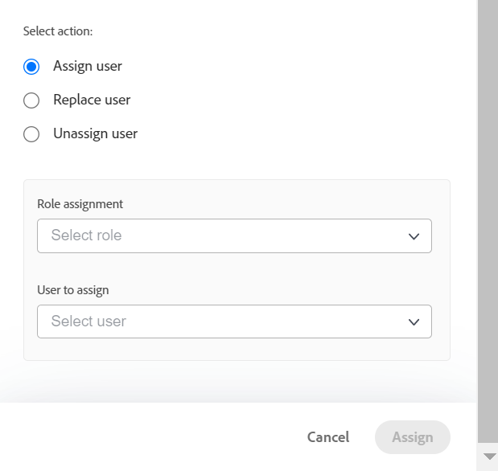
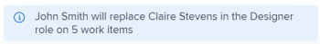

# Werk in bulk toewijzen met Werklastverdeling

<!--Audited: 07/2024-->

Met de Adobe Workfront Workload Balancer kunt u resources toewijzen aan meerdere taken en problemen in bulk.

Voor algemene informatie over het toewijzen van het werk aan gebruikers die de Balancer van de Werklast gebruiken, zie [&#x200B; Overzicht van het toewijzen van het werk in de Balancer van de Werklast &#x200B;](../../resource-mgmt/workload-balancer/assign-work-in-workload-balancer.md).

## Toegangsvereisten

+++ Breid uit om de toegangseisen voor de functionaliteit in dit artikel weer te geven.

<table style="table-layout:auto"> 
 <col> 
 <col> 
 <tbody> 
  <tr> 
   <td>Adobe Workfront-pakket</td> 
   <td>
Alle
</td>
  </tr>
  <tr> 
   <td>Adobe Workfront-licentie</td> 
   <td>
Standard

       
Plan, wanneer het gebruiken van de Balancer van de Werkbelasting in het gebied van Middelen; het werk, wanneer het gebruiken van de Balancer van de Werkbelasting van een team of een project
</td>
  </tr>
  <tr> 
   <td>Configuraties op toegangsniveau</td> 
   <td> 
Toegang tot het volgende bewerken:
 
    <ul> 
     <li>Bronbeheer</li> 
     <li>Projecten</li> 
     <li>Taken</li> 
     <li>Problemen</li> 
    </ul>
   </td> 
  </tr> 
  <tr> 
   <td>Objectmachtigingen</td> 
   <td>Contribute-machtigingen of hoger voor projecten, taken en problemen die Toewijzingen maken bevatten</td> 
  </tr> 
 </tbody> 
</table>

Voor informatie, zie [&#x200B; vereisten van de Toegang in de documentatie van Workfront &#x200B;](/help/quicksilver/administration-and-setup/add-users/access-levels-and-object-permissions/access-level-requirements-in-documentation.md).

+++

## Overwegingen bij het uitvoeren van bulktoewijzingen in Workload Balancer

* U kunt gebruikerstoewijzingen voor veelvoudige taken en kwesties over één of meerdere projecten snel beheren. Wijzigingen in toewijzingen zijn direct zichtbaar in Workload Balancer.
* U kunt geen middelen aan het werkpunten toewijzen die, of aan punten worden voltooid die op een voltooid project zijn.
* U kunt het volgende doen wanneer het toewijzen van gebruikers in bulk:

   * Wijs een gebruiker aan alle werkpunten toe die momenteel aan een baanrol worden toegewezen.
   * Gebruikerstoewijzingen vervangen tussen gebruikers.
   * Wijs een gebruiker van al zijn het werkpunten weg.

**VOORBEELDEN**

* U bent verantwoordelijk voor het toewijzen van gebruikerstaken aan verschillende nieuwe projecten. De projecten werden oorspronkelijk gecreeerd van malplaatjes en de baanrollen worden reeds toegewezen aan de diverse taken binnen de projecten. U wilt een specifieke gebruiker, Jackie Simms, aan alle taken toewijzen die momenteel aan een baanrol worden toegewezen. U kunt de Assign functie gebruiken om deze taken aan Jackie Simms toe te wijzen.
* 45 taken over 3 verschillende projecten worden toegewezen aan Jackie Simms. Jackie verlaat de organisatie en nu moet je haar taken opnieuw toewijzen aan een andere gebruiker. U kunt de functie Vervangen gebruiken om deze taken aan de nieuwe persoon toe te wijzen.
* 10 taken over 2 verschillende projecten worden toegewezen aan een andere gebruiker, Rick Kuvec. U realiseert zich dat Rick aan deze taken in fout werd toegewezen, maar u bent niet zeker wie zij aan op dit ogenblik moeten worden toegewezen. U moet de toewijzing van Rick aan alle taken tezelfdertijd ongedaan maken. U kunt de functie Unassign gebruiken om Rick uit deze taken te verwijderen.

## Werk in bulk toewijzen in de werklastbalans

1. Ga naar Werklastverdeling waar u werk wilt toewijzen.

   U kunt werk aan gebruikers toewijzen gebruikend de Balancer van de Werkbelasting in het gebied van het Middelen, op het project, of op het teamniveau. Voor meer informatie over waar de Balancer van de Werkbelasting in Workfront wordt gevestigd, zie [&#x200B; plaats van de Balancer van de Werkbelasting &#x200B;](../../resource-mgmt/workload-balancer/locate-workload-balancer.md).

1. Klik **&#x200B;**&#x200B;Bulktoewijzingen 

   Het deelvenster Bulktoewijzingen wordt rechts van Workload Balancer geopend.

1. (Voorwaardelijk) als u tot de Balancer van de Werkbelasting van het Bronsgebied of voor een team toegang hebt, breid het **Project uit: Naam** drop-down menu en gebruik de filterbepalingen om het project of de projecten te selecteren waarvoor u taken wilt maken. U kunt projecten op Naam (dit is de standaardoptie) of door Status selecteren.

   Voor informatie over de filterbepalingen van Workfront, zie [&#x200B; Filters en voorwaardenbepalingen &#x200B;](../../reports-and-dashboards/reports/reporting-elements/filter-condition-modifiers.md).

   >[!NOTE]
   >
   >De naam van het Project wordt geselecteerd door gebrek wanneer u tot de Balancer van de Werkbelasting voor een project toegang hebt.

   

1. (Facultatief) klik **Uitgezochte projecttaken** om de taak of de taken te selecteren die u taken voor, dan in de **Taak wilt maken: Naam** drop-down menu, uitgezochte taken door Naam (dit is de standaardoptie) of Status en de filterbepalingen gebruiken om naar specifieke taken te zoeken.

   Voor informatie over de filterbepalingen van Workfront, zie [&#x200B; Filters en voorwaardenbepalingen &#x200B;](../../reports-and-dashboards/reports/reporting-elements/filter-condition-modifiers.md).

   >[!NOTE]
   >
   >U kunt geen taken in de status Voltooid selecteren.

   

   >[!TIP]
   >
   >Laat deze selectie leeg als u niet alleen taken maar ook taken in grote hoeveelheden wilt toewijzen.

1. (Facultatief) klik het **pictogram van de Schrapping**  naast één van de geselecteerde criteria

   of

   Klik **ontruimen allen** in de hoger-juiste hoek van het paneel van de Toewijzingen van het Bulk om alle selecties te verwijderen.

1. Selecteer een van de volgende opties en ga verder met de hieronder beschreven stappen:

   * [&#x200B; wijs gebruiker &#x200B;](#assign-user) toe
   * [&#x200B; vervang gebruiker &#x200B;](#replace-user)
   * [Gebruiker vrijgeven](#unassign-user)

   >[!TIP]
   >
   >Als er geen items overeenkomen met de geselecteerde filters, worden deze opties grijs weergegeven.

### Gebruiker toewijzen {#assign-user}

Wanneer u een gebruiker met de opdracht Bulktoewijzingen in Workload Balancer toewijst, gebeurt het volgende:

* Een gebruiker wordt toegewezen aan alle werkpunten momenteel die aan een gespecificeerde rol binnen de geselecteerde projecten worden toegewezen.
* De gebruiker wordt niet toegewezen aan de volgende typen werkitems:

   * Items die al aan een gebruiker zijn toegewezen.
   * Voltooide objecten.

* Als de gebruiker u selecteerde niet met de gespecificeerde rol wordt geassocieerd, wordt de rol vervangen door de gebruiker in de Primaire Rol van de gebruiker.

Om een gebruiker aan werkpunten toe te wijzen die eerder aan baanrollen worden toegewezen:

1. Begin het toewijzen van het werkpunten gebruikend BulkToewijzingen in de Balancer van de Werkbelasting zoals hierboven beschreven en selecteer **toewijzen**.

1. Op het **gebied van de Rol 0&rbrace; &lbrace;, klik de drop-down pijl om van een lijst van rollen te kiezen.** Slechts worden de rollen momenteel toegewezen binnen de gespecificeerde projecten getoond. Dit is een verplicht veld.

   

1. In de **Gebruiker om** gebied toe te wijzen, klik de drop-down pijl om van een lijst van gesuggereerde gebruikers te kiezen of een naam van een andere gebruiker te typen.

   Selecteer gebruikers in de volgende gebieden:

   * **voorgestelde Toewijzingen**: Gebruikers die de geselecteerde rol kunnen vervullen en die de criteria voor Slimme Toewijzingen aanpassen. Voor meer informatie, zie [&#x200B; Slim toewijzingsoverzicht &#x200B;](../../manage-work/tasks/assign-tasks/smart-assignments.md).
   * **Andere Toewijzingen**: Alle gebruikers in het systeem die de geselecteerde rol kunnen vervullen.

     >[!TIP]
     >
     >Alleen de eerste 50 gebruikers worden vermeld in het gebied Overige toewijzingen.

   Na het selecteren van een gebruiker, toont Workfront een nota over het aantal punten waar de gebruiker u specificeerde zal worden toegewezen en welke baanrol zij zullen vervangen.

   >[!TIP]
   >
   >Alle rollen van de gebruiker worden weergegeven in de lijst, onder de naam van de gebruiker.

1. Klik **toewijzen**.

   De opgegeven rollen worden vervangen door de gebruikers die u hebt geselecteerd.

   Je ontvangt een bevestiging over hoeveel tijdelijke objecten de geselecteerde rol hebben vervangen door de geselecteerde gebruiker.

   

### Gebruiker vervangen {#replace-user}

U kunt een gebruiker vervangen die reeds aan het werkpunten met een andere gebruiker in de geselecteerde projecten wordt toegewezen.

Wanneer u een gebruiker vervangt door een andere gebruiker die gebruikmaakt van Bulk-toewijzingen in Workload Balancer, gebeurt het volgende:

* De vervangingsgebruiker wordt toegewezen aan alle het werkpunten die momenteel aan een originele gebruiker binnen de geselecteerde projecten worden toegewezen.

* De nieuwe gebruiker wordt niet toegewezen aan werkitems die al zijn gemarkeerd als Voltooid.
* Als de rol verbonden aan de eerste gebruiker geen van de rollen van de tweede gebruiker aanpast, wordt de tweede gebruiker toegewezen in hun Primaire Rol.

Een gebruiker vervangen door een andere gebruiker:

1. Begin het toewijzen van het werkpunten in de Balancer van de Werkbelasting zoals hierboven beschreven en selecteer **Vervangen**.
1. Op het **momenteel toegewezen gebruiker** gebied, klik de drop-down pijl om van een lijst van gebruikers te kiezen. Slechts worden de gebruikers momenteel toegewezen aan onvolledige het werkpunten binnen de gespecificeerde projecten getoond. Dit is een verplicht veld.

   

1. In de **Gebruiker om** gebied toe te wijzen, klik de drop-down pijl om van een lijst van gesuggereerde gebruikers te kiezen of een andere gebruikersnaam te typen. Gebruikers die standaard in de lijst worden vermeld, komen overeen met de criteria voor slimme toewijzingen. Voor meer informatie, zie [&#x200B; Slim toewijzingsoverzicht &#x200B;](../../manage-work/tasks/assign-tasks/smart-assignments.md).

   Workfront geeft een notitie weer over het aantal items waar de momenteel toegewezen gebruiker de tweede gebruiker vervangt en welke rollen deze zal vervangen.

   

1. Klik **vervangen**.

   De eerste geselecteerde gebruiker wordt vervangen door de tweede gebruiker in alle het werkpunten van het geselecteerde project.

   Je ontvangt een bevestiging over hoeveel tijdelijke objecten de oorspronkelijke gebruikerstoewijzing hebben vervangen door de geselecteerde tweede gebruiker.

### Gebruiker vrijgeven {#unassign-user}

U kunt een gebruiker van alle het werkpunten ongedaan maken die de gebruiker aan in de geselecteerde projecten wordt toegewezen.

Wanneer u de toewijzing van een gebruiker uit al hun toewijzingen ongedaan maakt met gebruik van Bulk-toewijzingen in Workload Balancer, gebeurt het volgende:

* De opgegeven gebruiker wordt verwijderd uit alle werkitems waaraan deze is toegewezen.
* Als de niet toegewezen gebruiker met baanrollen wordt geassocieerd, blijven de baanrollen toegewezen aan de het werkpunten wanneer de gebruiker wordt verwijderd.

* Als de gespecificeerde gebruiker aan het werkpunten wordt toegewezen die worden voltooid, blijft de gebruiker toegewezen aan die het werkpunten.

Voor meer informatie over gebruiker en baanroltaken, zie [&#x200B; Overzicht van het toewijzen van het werk in de Balancer van de Werkbelasting &#x200B;](../../resource-mgmt/workload-balancer/assign-work-in-workload-balancer.md).

Om een gebruiker van het werkpunten in de geselecteerde projecten of voor de geselecteerde taken of kwesties ongedaan te maken waar zij worden toegewezen:

1. Begin het toewijzen van het werkpunten in de Balancer van de Werkbelasting zoals hierboven beschreven en selecteer **toewijzen** ongedaan.

1. In de **Gebruiker om** gebied ongedaan te maken, klik de drop-down pijl om van een lijst van gebruikers te kiezen. Alleen gebruikers die momenteel zijn toegewezen aan onvolledige werkitems binnen de opgegeven projectweergave. Dit is een verplicht veld.

    ongedaan

   Workfront geeft een notitie weer over het aantal items waarvoor de momenteel toegewezen gebruiker niet is toegewezen.

   

1. Klik **unassign**.\
   U ontvangt een bevestiging over het aantal werkitems waarop de opgegeven gebruiker is verwijderd.

