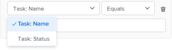

# Werk in bulk toewijzen met Werklastverdeling

<!--drafted
The highlighted information on this page refers to functionality not yet generally available. It is available only in the Preview environment. 
-->

Met de Adobe Workfront Workload Balancer kunt u handmatig werkitems toewijzen aan gebruikers.

Zie voor algemene informatie over het toewijzen van werk aan gebruikers met behulp van Workload Balancer [Overzicht van het toewijzen van werk in de werklastverdeler](../../resource-mgmt/workload-balancer/assign-work-in-workload-balancer.md).

## Toegangsvereisten

U moet de volgende toegang hebben om de stappen in dit artikel uit te voeren:

<table style="table-layout:auto"> 
 <col> 
 <col> 
 <tbody> 
  <tr> 
   <td role="rowheader">Adobe Workfront-abonnement*</td> 
   <td> 
Alle 
 </td> 
  </tr> 
  <tr> 
   <td role="rowheader">Adobe Workfront-licentie*</td> 
   <td> 
Plan, wanneer het gebruiken van de Balancer van de Werkbelasting in het gebied van de Middelen

   
Het werk, wanneer het gebruiken van de Balancer van de Werkbelasting van een team of een project

</td> 
  </tr> 
  <tr> 
   <td role="rowheader">Toegangsniveau*</td> 
   <td> 
Toegang tot het volgende bewerken:
 
    <ul> 
     <li> 
Bronbeheer
 </li> 
     <li> 
Projecten
 </li> 
     <li> 
Taken
 </li> 
     <li> 
Problemen
 </li> 
    </ul> 
<b>OPMERKING</b>

Als u nog steeds geen toegang hebt, vraagt u de Workfront-beheerder of deze aanvullende beperkingen op uw toegangsniveau instelt. Voor informatie over hoe een beheerder van Workfront uw toegangsniveau kan veranderen, zie <a href="../../administration-and-setup/add-users/configure-and-grant-access/create-modify-access-levels.md" class="MCXref xref">Aangepaste toegangsniveaus maken of wijzigen</a>.
 </td>
</tr> 
  <tr> 
   <td role="rowheader">Objectmachtigingen</td> 
   <td> 
Contribute-machtigingen of hoger voor projecten, taken en problemen die Toewijzingen maken bevatten
 
Voor informatie over het aanvragen van aanvullende toegang raadpleegt u <a href="../../workfront-basics/grant-and-request-access-to-objects/request-access.md" class="MCXref xref">Toegang tot objecten aanvragen </a>.
 </td> 
  </tr> 
 </tbody> 
</table>

&#42;Neem contact op met uw Workfront-beheerder om te weten te komen welk plan, licentietype of toegang u hebt.

## Overwegingen bij het uitvoeren van bulktoewijzingen in Workload Balancer

* U kunt gebruikerstoewijzingen voor veelvoudige taken en kwesties over één of meerdere projecten snel beheren. Wijzigingen in toewijzingen zijn direct zichtbaar in Workload Balancer.
* U kunt geen middelen aan het werkpunten toewijzen die, of aan punten worden voltooid die op een voltooid project zijn.
* U kunt het volgende doen wanneer het toewijzen van gebruikers in bulk:

   * Wijs een gebruiker aan alle werkpunten toe die momenteel aan een baanrol worden toegewezen.
   * Gebruikerstoewijzingen vervangen tussen gebruikers.
   * Wijs een gebruiker van al zijn het werkpunten weg.

**VOORBEELDEN**

* U bent verantwoordelijk voor het toewijzen van gebruikerstaken aan verschillende nieuwe projecten. De projecten werden oorspronkelijk gecreeerd van malplaatjes en de baanrollen worden reeds toegewezen aan de diverse taken binnen de projecten. U wilt een specifieke gebruiker, Jackie Simms, aan alle taken toewijzen die momenteel aan een baanrol worden toegewezen. U kunt de Assign functie gebruiken om deze taken aan Jackie Simms toe te wijzen.
* 45 taken over 3 verschillende projecten worden toegewezen aan Jackie Simms. Jackie verlaat de organisatie en nu moet je haar taken opnieuw toewijzen aan een andere gebruiker. U kunt de functie Vervangen gebruiken om deze taken aan de nieuwe persoon toe te wijzen.
* 10 taken over 2 verschillende projecten worden toegewezen aan een andere gebruiker, Rick Kuvec. U realiseert zich dat Rick aan deze taken in fout werd toegewezen, maar u bent niet zeker wie zij aan op dit ogenblik moeten worden toegewezen. U moet de toewijzing van Rick aan alle taken tezelfdertijd ongedaan maken. U kunt de functie Unassign gebruiken om Rick uit deze taken te verwijderen.

## Werk in bulk toewijzen in de werklastbalans

1. Ga naar Werklastverdeling waar u werk wilt toewijzen.

   U kunt werk aan gebruikers toewijzen gebruikend de Balancer van de Werkbelasting in het gebied van het Middelen, op het project, of op het teamniveau. Ga voor meer informatie over waar de werklastbalans zich in Workfront bevindt naar [De werklastbalans zoeken](../../resource-mgmt/workload-balancer/locate-workload-balancer.md).

1. Klikken **Bulktoewijzingen**  boven aan werklastbalans.

   Het deelvenster Bulktoewijzingen wordt rechts van Workload Balancer geopend.

1. (Voorwaardelijk) Als u de werklastbalans opent vanuit het brongebied of voor een team, vouwt u de **Project: Naam** vervolgkeuzemenu en gebruik de filteropties om het project of de projecten te selecteren waarvoor u toewijzingen wilt maken. U kunt projecten op Naam (dit is de standaardoptie) of door Status selecteren.

Zie voor informatie over Workfront-filtermodifiers [Filters en voorwaardelijke modifiers](../../reports-and-dashboards/reports/reporting-elements/filter-condition-modifiers.md).

>[!NOTE]
>
>De naam van het Project wordt geselecteerd door gebrek wanneer u tot de Balancer van de Werkbelasting voor een project toegang hebt.

1. (Optioneel) Klik op **Projecttaken selecteren** om de taak of taken te selecteren waarvoor u toewijzingen wilt maken, en vervolgens in het dialoogvenster **Taak: Naam** vervolgkeuzemenu, selecteert taken op Naam (dit is de standaardoptie) of Status en gebruikt de filteropties om naar specifieke taken te zoeken.

Zie voor informatie over Workfront-filtermodifiers [Filters en voorwaardelijke modifiers](../../reports-and-dashboards/reports/reporting-elements/filter-condition-modifiers.md).

>[!NOTE]
>
>U kunt geen taken in de status Voltooid selecteren.

>[!TIP]
>
>Laat deze selectie leeg als u niet alleen taken maar ook taken in grote hoeveelheden wilt toewijzen.

1. (Optioneel) Klik op de knop **Verwijderen** pictogram  naast een van de geselecteerde criteria

   of

   Klikken **Alles wissen** in de rechterbovenhoek van het deelvenster Bulktoewijzingen om alle selecties te verwijderen.

1. Selecteer een van de volgende opties en ga verder met de hieronder beschreven stappen:

   * [Gebruiker toewijzen](#assign-user)
   * [Gebruiker vervangen](#replace-user)
   * [Gebruiker vrijgeven](#unassign-user)

   >[!TIP]
   >
   >Als er geen items overeenkomen met de geselecteerde filters, worden deze opties grijs weergegeven.

### Gebruiker toewijzen {#assign-user}

Wanneer u een gebruiker met de opdracht Bulktoewijzingen in Workload Balancer toewijst, gebeurt het volgende:

* Een gebruiker wordt toegewezen aan alle werkpunten momenteel die aan een gespecificeerde rol binnen de geselecteerde projecten worden toegewezen.
* De gebruiker wordt niet toegewezen aan de volgende typen werkitems:

   * Items die al aan een gebruiker zijn toegewezen.
   * Voltooide objecten.

* Als de gebruiker u selecteerde niet met de gespecificeerde rol wordt geassocieerd, wordt de rol vervangen door de gebruiker in de Primaire Rol van de gebruiker.

Om een gebruiker aan werkpunten toe te wijzen die eerder aan baanrollen worden toegewezen:

1. Begin met het toewijzen van werkitems met gebruik van Bulktoewijzingen in Workload Balancer, zoals hierboven beschreven, en selecteer **Toewijzen**.

1. In de **Rollen toewijzen** Klik op de vervolgkeuzepijl om een keuze te maken in een lijst met rollen. Slechts worden de rollen momenteel toegewezen binnen de gespecificeerde projecten getoond. Dit is een verplicht veld.

   

1. In de **Gebruiker die moet toewijzen** Klik op de vervolgkeuzepijl om een keuze te maken in een lijst met voorgestelde gebruikers of om de naam van een andere gebruiker te typen.

   Selecteer gebruikers in de volgende gebieden:

   * **Voorgestelde toewijzingen**: Gebruikers die de geselecteerde rol kunnen vervullen en die voldoen aan de criteria voor slimme toewijzingen. Zie voor meer informatie [Overzicht van slimme toewijzingen](../../manage-work/tasks/assign-tasks/smart-assignments.md).
   * **Overige toewijzingen**: Alle gebruikers in het systeem die de geselecteerde rol kunnen vervullen.

     >[!TIP]
     >
     >Alleen de eerste 50 gebruikers worden vermeld in het gebied Overige toewijzingen.

   Na het selecteren van een gebruiker, toont Workfront een nota over het aantal punten waar de gebruiker u specificeerde zal worden toegewezen en welke baanrol zij zullen vervangen.

   >[!TIP]
   >
   >Alle rollen van de gebruiker worden weergegeven in de lijst, onder de naam van de gebruiker.

1. Klikken **Toewijzen**.

   De opgegeven rollen worden vervangen door de gebruikers die u hebt geselecteerd.

   Je ontvangt een bevestiging over hoeveel tijdelijke objecten de geselecteerde rol hebben vervangen door de geselecteerde gebruiker.

   

### Gebruiker vervangen {#replace-user}

U kunt een gebruiker vervangen die reeds aan het werkpunten met een andere gebruiker in de geselecteerde projecten wordt toegewezen.

Wanneer u een gebruiker vervangt door een andere gebruiker die gebruikmaakt van Bulk-toewijzingen in Workload Balancer, gebeurt het volgende:

* De vervangingsgebruiker wordt toegewezen aan alle het werkpunten die momenteel aan een originele gebruiker binnen de geselecteerde projecten worden toegewezen.

* De nieuwe gebruiker wordt niet toegewezen aan werkitems die al zijn gemarkeerd als Voltooid.
* Als de rol verbonden aan de eerste gebruiker geen van de rollen van de tweede gebruiker aanpast, wordt de tweede gebruiker toegewezen in hun Primaire Rol.

Een gebruiker vervangen door een andere gebruiker:

1. Begin met het toewijzen van werkitems in de werklastbalans zoals hierboven beschreven en selecteer **Vervangen**.
1. In de **Momenteel toegewezen gebruiker** Klik op de vervolgkeuzepijl om een keuze te maken in een lijst met gebruikers. Slechts worden de gebruikers momenteel toegewezen aan onvolledige het werkpunten binnen de gespecificeerde projecten getoond. Dit is een verplicht veld.

   

1. In de **Gebruiker die moet toewijzen** Klik op de vervolgkeuzepijl om een keuze te maken in een lijst met voorgestelde gebruikers of om een andere gebruikersnaam te typen. Gebruikers die standaard in de lijst worden vermeld, komen overeen met de criteria voor slimme toewijzingen. Zie voor meer informatie [Overzicht van slimme toewijzingen](../../manage-work/tasks/assign-tasks/smart-assignments.md).

   Workfront geeft een notitie weer over het aantal items waar de momenteel toegewezen gebruiker de tweede gebruiker vervangt en welke rollen deze zal vervangen.

   

1. Klikken **Vervangen**.

   De eerste geselecteerde gebruiker wordt vervangen door de tweede gebruiker in alle het werkpunten van het geselecteerde project.

   Je ontvangt een bevestiging over hoeveel tijdelijke objecten de oorspronkelijke gebruikerstoewijzing hebben vervangen door de geselecteerde tweede gebruiker.

### Gebruiker vrijgeven {#unassign-user}

U kunt een gebruiker van alle het werkpunten ongedaan maken die de gebruiker aan in de geselecteerde projecten wordt toegewezen.

Wanneer u de toewijzing van een gebruiker uit al hun toewijzingen ongedaan maakt met gebruik van Bulk-toewijzingen in Workload Balancer, gebeurt het volgende:

* De opgegeven gebruiker wordt verwijderd uit alle werkitems waaraan deze is toegewezen.
* Als de niet toegewezen gebruiker met baanrollen wordt geassocieerd, blijven de baanrollen toegewezen aan de het werkpunten wanneer de gebruiker wordt verwijderd.

* Als de gespecificeerde gebruiker aan het werkpunten wordt toegewezen die worden voltooid, blijft de gebruiker toegewezen aan die het werkpunten.

Zie voor meer informatie over gebruikers- en taakroltoewijzingen [Overzicht van het toewijzen van werk in de werklastverdeler](../../resource-mgmt/workload-balancer/assign-work-in-workload-balancer.md).

Om een gebruiker van het werkpunten in de geselecteerde projecten of voor de geselecteerde taken of kwesties ongedaan te maken waar zij worden toegewezen:

1. Begin met het toewijzen van werkitems in de werklastbalans zoals hierboven beschreven en selecteer **Toewijzen ongedaan maken**.

1. In de **Gebruiker kan toewijzen ongedaan maken** Klik op de vervolgkeuzepijl om een keuze te maken in een lijst met gebruikers. Alleen gebruikers die momenteel zijn toegewezen aan onvolledige werkitems binnen de opgegeven projectweergave. Dit is een verplicht veld.

   

   Workfront geeft een notitie weer over het aantal items waarvoor de momenteel toegewezen gebruiker niet is toegewezen.

   

1. Klikken **Toewijzen ongedaan maken**.\
   U ontvangt een bevestiging over het aantal werkitems waarop de opgegeven gebruiker is verwijderd.

 
