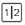

# Handmatig werk toewijzen met Workload Balancer

Met de Adobe Workfront Workload Balancer kunt u handmatig werkitems toewijzen aan gebruikers.

Voor algemene informatie over het toewijzen van het werk aan gebruikers die de Balancer van de Werklast gebruiken, zie [&#x200B; Overzicht van het toewijzen van het werk in de Balancer van de Werklast &#x200B;](../../resource-mgmt/workload-balancer/assign-work-in-workload-balancer.md).

## Toegangsvereisten

+++ Breid uit om de toegangseisen voor de functionaliteit in dit artikel weer te geven.

<table style="table-layout:auto"> 
 <col> 
 <col> 
 <tbody> 
  <tr> 
   <td>Adobe Workfront-pakket</td> 
   <td>
Alle
</td>
  </tr>
  <tr> 
   <td>Adobe Workfront-licentie</td> 
   <td>
Standard

       
Plan, wanneer het gebruiken van de Balancer van de Werkbelasting in het gebied van Middelen; het werk, wanneer het gebruiken van de Balancer van de Werkbelasting van een team of een project
</td>
  </tr>
  <tr> 
   <td>Configuraties op toegangsniveau</td> 
   <td> 
Toegang tot het volgende bewerken:
 
    <ul> 
     <li>Bronbeheer</li> 
     <li>Projecten</li> 
     <li>Taken</li> 
     <li>Problemen</li> 
    </ul>
   </td> 
  </tr> 
  <tr> 
   <td>Objectmachtigingen</td> 
   <td>Contribute-machtigingen of hoger voor projecten, taken en problemen die Toewijzingen maken bevatten</td> 
  </tr> 
 </tbody> 
</table>

Voor informatie, zie [&#x200B; vereisten van de Toegang in de documentatie van Workfront &#x200B;](/help/quicksilver/administration-and-setup/add-users/access-levels-and-object-permissions/access-level-requirements-in-documentation.md).

+++

## Handmatig werk toewijzen in Workload Balancer

U kunt werkitems toewijzen die nog niet aan een gebruiker zijn toegewezen of items die aan gebruikers in de werklastbalans zijn toegewezen, opnieuw toewijzen.

1. Ga naar Werklastverdeling waar u werk wilt toewijzen.

   U kunt werk aan gebruikers toewijzen gebruikend de Balancer van de Werkbelasting in het gebied van het Middelen, op het project, of op het teamniveau. Voor meer informatie over waar de Balancer van de Werkbelasting in Workfront wordt gevestigd, zie [&#x200B; plaats van de Balancer van de Werkbelasting &#x200B;](../../resource-mgmt/workload-balancer/locate-workload-balancer.md).

1. (Facultatief) ga naar het **Niet toegewezen gebied van het Werk** en pas een filter op meningstaken, kwesties, of roltaken toe.

   of

   Ga naar het **Toegewezen gebied van het Werk** en breid de naam van een gebruiker uit om de het werkpunten te bekijken die aan hen worden toegewezen, als u hun punten opnieuw wilt toewijzen.

   >[!NOTE]
   >
   >Roltoewijzingen worden weergegeven onder werkitems in het gebied Niet toegewezen werk wanneer de instelling Roltoewijzingen weergeven is ingeschakeld. Voor meer informatie, zie [&#x200B; de mening &#x200B;](/help/quicksilver/resource-mgmt/workload-balancer/navigate-the-workload-balancer.md#customize-the-view) in [&#x200B; aanpassen de Balancer van de Werkbelasting &#x200B;](/help/quicksilver/resource-mgmt/workload-balancer/navigate-the-workload-balancer.md).

1. Klik het **Meer menu**  aan de linkerzijde van een de naam of roltaak van het het werkpunt, dan klik **toewijzen dit aan**.

    toe

   >[!TIP]
   >
   >U kunt ook de volgende sneltoetsen gebruiken om taken of problemen toe te wijzen:
   >
   >* In Windows: CTRL + klik de taak of de uitgiftebar.
   >* In Mac: CMD + klik op de taak of de uitgiftebalk.

1. Voer een van de volgende handelingen uit:

   * Begin het typen van de naam van een gebruiker, baanrol, of team dat u aan het punt in het **gebied van het Onderzoek wilt toewijzen mensen, rol of teams**, het selecteren wanneer het in de lijst toont, dan **sparen** klikken.

   >[!TIP]
   >
   >Wanneer u een gebruiker toevoegt, ziet u de avatar, de primaire rol van de gebruiker en hun e-mailadres om onderscheid te maken tussen gebruikers met identieke namen.
   >
   >Gebruikers moeten aan ten minste één taakrol zijn gekoppeld om deze te kunnen bekijken terwijl u ze toevoegt.
   >
   > De instelling Contactinfo weergeven moet zijn ingeschakeld op uw toegangsniveau zodat gebruikers de e-mails van gebruikers kunnen bekijken. Voor informatie, zie [&#x200B; toegang van de Verlening tot gebruikers &#x200B;](../../administration-and-setup/add-users/configure-and-grant-access/grant-access-other-users.md).

   

   >[!TIP]
   >
   > Als uw Workfront- of groepsbeheerder delegaties in uw omgeving heeft ingeschakeld, gebruikt u het tabblad Toewijzingen om gebruikers toe te wijzen aan de taak of uitgave. Gebruik het tabblad Delegaties om gebruikers weer te geven die zijn gedelegeerd aan het werkitem. Voor informatie over het delegeren van het werk, zie [&#x200B; de taken en kwesties van de Afgevaardigde &#x200B;](../../manage-work/delegate-work/how-to-delegate-work.md).

   Hiermee wijst u het werkitem toe aan of wijst u het toe aan de opgegeven toewijzingen.

   Als u een punt aan enkel een team of een baanrol toewijst, toont het punt slechts in het Niet toegewezen gebied van het Werk. U moet werkitems toewijzen aan gebruikers om deze weer te geven in het gedeelte Toegewezen werk van Workload Balancer.

   >[!TIP]
   >
   >U kunt meerdere gebruikers, taakrollen of teams toewijzen. U kunt alleen actieve gebruikers, taakrollen en teams toewijzen.
   >
   >
   >Als een gebruiker, een baanrol, of een team werd toegewezen alvorens zij werden gedeactiveerd, blijven zij toegewezen aan het het werkpunt. In dit geval raden we het volgende aan:
   >
   >   
   >   
   >   * Wijs het werkitem opnieuw toe aan actieve bronnen.
   >   * Koppel de gebruikers in een gedeactiveerd team aan een actief team en wijs het het werkpunt aan het actieve team opnieuw toe.
   >   
   >

   * Klik **Geavanceerd** om tot Geavanceerde Toewijzingen toegang te hebben.

     Voor meer informatie over het maken van Geavanceerde Taken, zie [&#x200B; Geavanceerde taken &#x200B;](../../manage-work/tasks/assign-tasks/create-advanced-assignments.md) creëren.

1. (Facultatief) klik het **pictogram van de Toon toewijzingen**  tonen, dan klik het **Meer menu**  > **geeft toewijzingen** uit.

   of

   Dubbelklik op een dagelijkse of wekelijkse toewijzing om de hoeveelheid tijd aan te passen die de gebruiker aan het werkitem heeft toegewezen.

   Voor informatie over het wijzigen van gebruikerstoewijzingen in de Balancer van de Werkbelasting, zie de &quot;wijzig gebruikerstoewijzingen&quot;sectie in artikel [&#x200B; gebruikerstoewijzingen in de Balancer van de Werkbelasting &#x200B;](../../resource-mgmt/workload-balancer/manage-user-allocations-workload-balancer.md) beheren.

   Voor informatie over het verwijderen van taken uit een het werkpunt gebruikend de Balancer van de Werklast, zie [&#x200B; werk in de Balancer van de Werkbelasting &#x200B;](../../resource-mgmt/workload-balancer/unassign-work-in-workload-balancer.md) unassign.

    
