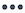

# Gegevens in de werklastbalans filteren

<!-- Audited: 6/2025 -->

<!--
(when they add custom fields to fitlering, add the caveat you added for the Resource Planner : only field NAMES and not LABELS are to be found in the drop-down >> ADD THIS IN THE STEP BELOW WHEN ADDING A FILTER)
-->

Als middelmanager, kunt u de Balancer van de Werkbelasting gebruiken om de werkbelasting van uw gebruikers te bekijken en te beheren. Zie de volgende artikelen voor meer algemene informatie over de werklastbalans:

* [&#x200B; Overzicht van de Balancer van de Werkbelasting &#x200B;](../../resource-mgmt/workload-balancer/overview-workload-balancer.md)
* [Navigeren door werklastbalans](../../resource-mgmt/workload-balancer/navigate-the-workload-balancer.md)

>[!IMPORTANT]
>
>We raden u ten zeerste aan filters te gebruiken in Workload Balancer om werkitems efficiënt te zoeken en u te concentreren op de gebruikers of items die u beheert. Hierdoor kunt u de juiste gegevens weergeven voordat u de toewijzingen van uw bronnen gaat beheren.
>
>Wanneer u na het opslaan en toepassen van een nieuw filter weg navigeert van Workload Balancer, wordt het filter nog steeds toegepast, zelfs nadat u zich hebt afgemeld en weer hebt aangemeld.

Dit artikel bevat informatie over filters in Workload Balancer. Voor informatie over filters in Workfront, zie [&#x200B; Overzicht van Filters &#x200B;](../../reports-and-dashboards/reports/reporting-elements/filters-overview.md).

## Toegangsvereisten

<table style="table-layout:auto"> 
 <col> 
 <col>
 <tbody> 
  <tr> 
   <td>Adobe Workfront-pakket</td> 
   <td>
Alle
</td>
  </tr>
  <tr> 
   <td>Adobe Workfront-licentie</td> 
   <td>
Standard

       
Plan, wanneer het gebruiken van de Balancer van de Werkbelasting in het gebied van Middelen; het werk, wanneer het gebruiken van de Balancer van de Werkbelasting van een team of een project
</td>
  </tr>
  <tr> 
   <td>Configuraties op toegangsniveau</td> 
   <td> 
Toegang tot het volgende weergeven of vergroten:
 
    <ul> 
     <li>Bronbeheer</li> 
     <li>Projecten</li> 
     <li>Taken</li> 
     <li>Problemen</li>
     <li>Filters, Weergaven en Groepen</li>
    </ul>
    
Toegang tot filters, weergaven en groepen bewerken tijdens het maken of bewerken van filters 
 </td>
  </tr> 
  <tr> 
   <td>Objectmachtigingen</td> 
   <td> 
De toestemmingen van de mening of hoger aan de projecten, taken, kwesties

   
Rechten beheren voor de filters die u wilt bewerken of verwijderen

   </td> 
  </tr> 
 </tbody> 
</table>

Voor informatie, zie [&#x200B; vereisten van de Toegang in de documentatie van Workfront &#x200B;](/help/quicksilver/administration-and-setup/add-users/access-levels-and-object-permissions/access-level-requirements-in-documentation.md).

## Overzicht van filters in de werklastverdeler

Houd rekening met het volgende wanneer u werkt met filters in Workload Balancer:

* Afhankelijk van waar u tot de Balancer van de Werkbelasting van toegang hebt, zou Workfront de informatie voor u reeds kunnen filtreren. Voor meer informatie, zie de volgende sectie in dit artikel: [&#x200B; vooraf toegepaste filters in de Balancer van de Werkbelasting &#x200B;](#pre-applied-filters-in-the-workload-balancer).
* U kunt een filter maken en toepassen zonder het op te slaan, of u kunt een filter opslaan om later opnieuw te gebruiken.
* Wanneer u een filter toepast zonder het op te slaan, kunt u terugkeren naar de originele lijsten door de pagina te vernieuwen.
* U kunt filters bekijken die u hebt gemaakt of filters die andere gebruikers hebben gemaakt en met u hebben gedeeld.
* Wanneer u een gedeeld filter verwijdert of bewerkt, wordt het filter ook verwijderd of bewerkt voor iedereen met wie u het hebt gedeeld.
* Wanneer u filters in het werklastevenwicht in één gebied maakt, zijn deze niet beschikbaar in andere gebieden.

  Bijvoorbeeld, zijn de filters die in het gebied van de Middelen worden gecreeerd niet beschikbaar in een project of de Balancer van de Werkbelasting van het team.

  Voor informatie over waar te om van de Balancer van de Werklast de plaats te bepalen, zie [&#x200B; plaats van de Balancer van de Werkbelasting &#x200B;](../../resource-mgmt/workload-balancer/locate-workload-balancer.md).

* U kunt alleen items weergeven die overeenkomen met de geselecteerde filters als deze overeenkomen met de datums in de tijdlijn die wordt weergegeven op het scherm Werklastbalans.

## Vooraf toegepaste filters in de werklastverdeler {#pre-applied-filters-in-the-workload-balancer}

De werklastbalans geeft informatie in twee afzonderlijke gebieden weer:

* **het Niet toegewezen gebied van het Werk**: De punten van het werk die nog niet aan gebruikers worden toegewezen.
* **het Toegewezen gebied van het Werk**: De punten van het werk die aan gebruikers worden toegewezen.

  Voor informatie over wat vertoningen in elk van de gebieden, zie [&#x200B; de Balancer van de Werkbelasting &#x200B;](../../resource-mgmt/workload-balancer/navigate-the-workload-balancer.md) navigeren.

>[!IMPORTANT]
>
>Elk gebied van de werklastbalans heeft een eigen set filters die onafhankelijk van elkaar werken. U moet beide filters configureren om aan te geven welke informatie u in elk gebied wilt zien.

Met Werklastbalans worden gebruikers en hun werkitems weergegeven.
De aan de gebruikers toegewezen werkitems worden alleen weergegeven wanneer de datums van de items overeenkomen met het tijdframe dat op het scherm wordt weergegeven.

Afhankelijk van waar u tot de Balancer van de Werkbelasting toegang hebt, worden de Niet toegewezen en Toegewezen gebieden reeds gefiltreerd door bepaalde criteria, zoals die in de volgende lijst worden beschreven:

<table style="table-layout:auto"> 
 <col> 
 <col> 
 <col> 
 <tbody> 
  <tr> 
   <td role="rowheader"><strong>Workfront-gebied waar u de werklastbalans kunt openen</strong></td> 
   <td><b> Punten die in het Niet toegewezen gebied van het Werk door gebrek </b> tonen </td> 
   <td><b> Punten die op het Toegewezen gebied van het Werk door gebrek </b> tonen </td> 
  </tr> 
  <tr> 
   <td role="rowheader">Het gebied met hulpbronnen</td> 
   <td>Er worden hier standaard geen items weergegeven. U moet filters aanpassen om werkitems in dit gebied weer te geven.</td> 
   <td>Gebruikers die lid zijn van een van uw teams en hun werkitems. </td> 
  </tr> 
  <tr> 
   <td role="rowheader">Een team</td> 
   <td>De punten van het werk die aan het team of het team en een baanrol worden toegewezen. </td> 
   <td> 
Gebruikers die lid zijn van het geselecteerde team en hun werkitems.
 </td> 
  </tr> 
  <tr> 
   <td role="rowheader">Een project</td> 
   <td> 
Niet toegewezen het werkpunten of punten die aan teams of baanrollen in de geselecteerde projectvertoning in dit gebied worden toegewezen.
 </td> 
   <td> 
De gebruikers die aan minstens één het werkpunt op het geselecteerde project en hun het werkpunten op het project worden toegewezen wanneer de <b> het werkpunten van dit project </b> systeemstandaardfilter wordt geselecteerd. 

Wanneer de <b> het werkpunten van dit project </b> systeemstandaardfilter wordt geschrapt, toont het Toegewezen gebied van het Werk van een project alle het werkpunten van de gebruikers die aan minstens één punt op het geselecteerde project worden toegewezen.     Dit filter wordt geschrapt door gebrek.

 <b> Nota </b>: U kunt <b> toelaten tonen alle gebruikers </b> optie in de Balans van de Werkbelasting van het project om alle gebruikers in het systeem te tonen. Voor meer informatie, zie <a href="../workload-balancer/navigate-the-workload-balancer.md" class="MCXref xref"> de Balancer van de Werkbelasting </a> navigeren

</td> 
  </tr> 
 </tbody> 
</table>

## Werklastverdelingsfilters maken

Het proces voor het maken van filters voor de niet-toegewezen werkgebieden en toegewezen werkgebieden in Workload Balancer is identiek, ongeacht waar u de Workload Balancer opent. Voor informatie over het lokaliseren van de Balancer van de Werkbelasting, zie [&#x200B; plaats de Balancer van de Werkbelasting &#x200B;](../../resource-mgmt/workload-balancer/locate-workload-balancer.md).

U kunt een geheel nieuw filter maken of een van de vooraf gedefinieerde filters bewerken. Voor informatie over bestaande filters die u kunt uitgeven, zie [&#x200B; een bestaand filter in de 1&rbrace; sectie van de Balancer van de Werkbelasting &lbrace;in dit artikel uitgeven.](#edit-an-existing-filter-in-the-workload-balancer)

1. Ga naar Werklastverdeling.

   Voor informatie over de toegang tot van de Balancer van de Werkbelasting, zie [&#x200B; de Balancer van de Werkbelasting &#x200B;](../../resource-mgmt/workload-balancer/navigate-the-workload-balancer.md) navigeren.

1. In de hoger-juiste hoek van of het **Niet toegewezen Werk** of de **Toegewezen Gebieden van het Werk**, klik het **pictogram van de Filter** . De **vertoningen van de Filters** doos op het recht, en de naam van het gebied u de filter voor vertoningen in de kopbal creeert.

   

1. (Facultatief en voorwaardelijk) als u tot de Balancer van de Werkbelasting in het **Voorkomende 1&rbrace; gebied toegang hebt, zou de vooraf bepaalde Standaardfilter reeds op het** Toegewezen gebied van het Werk **kunnen worden toegepast.** U kunt een kopie van het filter Standaard bewerken en opslaan.

   >[!TIP]
   >
   >Met het filter Standaard worden gebruikers weergegeven die tot een van uw teams behoren en hun werkitems. U kunt een kopie van dit filter bewerken.

   Als u tot [!UICONTROL Workload Balancer] van een project toegang hebt, zou de **het werkpunten van dit project** filter reeds kunnen worden toegepast. Dit toont slechts het werkpunten die aan gebruikers in dit project worden toegewezen. U kunt een kopie van dit filter dupliceren en opslaan.

   Door gebrek, toont het project [!UICONTROL Workload Balancer] alle het werkpunten die aan alle gebruikers op het project worden toegewezen.

1. Klik **Nieuwe filter**.

1. Ga als volgt te werk om een filter te maken:

   1. Selecteer een gebiedsnaam in het eerste drop-down menu of klik **doorbladert gebieden** bij de bodem van drop-down om de naam van een gebied te typen dat niet door gebrek toont.

      >[!IMPORTANT]
      >
      >Wanneer u naar aangepaste velden verwijst, moet u de veldnaam en niet het veldlabel typen. Het veldlabel wordt weergegeven op een aangepast formulier dat is gekoppeld aan een object. Voor informatie over het verschil tussen het etiket en de naam van een douanegebied, zie [&#x200B; een douaneformulier &#x200B;](/help/quicksilver/administration-and-setup/customize-workfront/create-manage-custom-forms/form-designer/design-a-form/design-a-form.md) creëren.

   1. (Voorwaardelijk) als u **klikte doorbladert gebieden**, typ de naam van een gebied op het **3&rbrace; gebied van het Onderzoek &lbrace;en selecteer het wanneer het in de lijst toont.**

      

      >[!TIP]
      >
      >U kunt een veld selecteren uit de volgende secties:
      >
      >* **Recente selecties**: de gebieden u onlangs voor hebt gefilterd.
      >* **stelde** voor: de gebieden het meest meestal gebruikt.

   1. Selecteer een bepaling van het tweede drop-down menu. Voor informatie over de filterbepalingen van Workfront, zie [&#x200B; Filters en voorwaardenbepalingen &#x200B;](../../reports-and-dashboards/reports/reporting-elements/filter-condition-modifiers.md).
   1. Selecteer of typ een waarde voor het veld waarvoor u filtert.

      >[!NOTE]
      >
      > Wanneer u werkobjecten uit een bepaald portfolio wilt weergeven, kunt u het volgende filter toepassen: Portfolio-id is gelijk aan &lt; PORTFOLIO-NAAM >.
      >
      >
      >
      >Om projecten in een status van Op Greep uit te sluiten, moet u het volgende filter toepassen: Project: De status is niet gelijk aan Op Greep. Dit verhindert het werkpunten in de projecten van de Greep in de Balancer van de Werklast te tonen.
      >
      >

   1. (Facultatief) klik het **pictogram van de Schrapping** pictogram  om een filtercriteria te verwijderen.

1. (Facultatief) klik **filter** toevoegen om een andere filtercriteria toe te voegen, dan de acties van stap 4 herhalen.

   <!--(NOTE: ensure this stays correct)-->

1. Klik **toepassen** om de resultaten van de filter op het geselecteerde gebied van de Balancer van de Werkbelasting toe te passen zonder het te bewaren. De lijst met werkitems wordt links bijgewerkt.

   >[!IMPORTANT]
   >
   >De resultaten worden weergegeven in Workload Balancer wanneer alle filterinstructies die u hebt toegevoegd, tegelijkertijd true zijn.

   Het filter wordt bewaard tot u de pagina verfrist, en **&#x200B;**&#x200B;knoop is vervangen met a **sparen als nieuwe** knoop.

1. Klik **sparen als nieuw** om de filter voor toekomstig gebruik te bewaren.

   >[!TIP]
   >
   >Het klikken **annuleert** op elk ogenblik neemt u terug naar het gebied van de filterbouw.

1. Op het **Naamloze gebied van de Filter**, ga de nieuwe filternaam in.
1. (Optioneel) Selecteer een pictogram voor het nieuwe filter in het vervolgkeuzemenu **Pictogram** .

   

1. (Facultatief) voeg een filter **Beschrijving** toe. De beschrijving wordt onder de filternaam in de filterlijst weergegeven.
1. Klik **sparen**. De bewaarde filtervertoningen in **Mijn filters** gebied van de filterdoos.

   Voor informatie over het toepassen van bewaarde filters, zie de sectie [&#x200B; een bewaarde filter in de Balancer van de Werkbelasting &#x200B;](#delete-a-saved-filter-in-the-workload-balancer) in dit artikel schrappen.

1. (Voorwaardelijk) Muis over het **pictogram van de Filter**  Niet toegewezen Werk **of de** Toegewezen gebieden van het Werk **om tooltip met de naam of het aantal filters te tonen die momenteel worden toegepast.**

   

## Een filter dupliceren

U kunt een filter dupliceren en bewerken om een nieuw filter te maken.

1. Ga naar Werklastverdeling.

   Voor informatie over de toegang tot van de Balancer van de Werkbelasting, zie [&#x200B; de Balancer van de Werkbelasting &#x200B;](../../resource-mgmt/workload-balancer/navigate-the-workload-balancer.md) navigeren.

1. In de hoger-juiste hoek van of het **Niet toegewezen Werk** of de **Toegewezen Gebieden van het Werk**, klik het **pictogram van de Filter** .  De **vertoningen van de Filters** doos op het recht, en de naam van het gebied u de filter voor vertoningen in de kopbal dupliceert.

1. Beweeg over een bestaand filter, dan klik **Meer** menu .
1. Klik **Dupliceren**.

   >[!TIP]
   >
   > Terwijl het uitgeven van een filter, kunt u **Meer** menu  in de laag-linkerhoek van **uitgeeft de doos van de Filter**, dan **Dupliceert**.

1. Bewerk de volgende informatie voor het gedupliceerde filter:

   * Naam
   * Pictogram
   * Beschrijving
   * Een van de velden, modifiers of waarden.

1. (Facultatief) klik **filter** toevoegen om meer verklaringen aan de gedupliceerde filter toe te voegen.
1. Klik **sparen** om de gedupliceerde filter in het **Mijn filters** gebied te bewaren. Het oorspronkelijke filter blijft ongewijzigd en het gedupliceerde filter wordt opgeslagen als een nieuw filter.

## Een bestaand filter bewerken in het deelvenster Werklastbalans {#edit-an-existing-filter-in-the-workload-balancer}

U kunt een opgeslagen filter bewerken in Workload Balancer.

>[!TIP]
>
>Wanneer u een filter bewerkt dat met anderen wordt gedeeld, worden ook de wijzigingen weergegeven die u aanbrengt.

1. Ga naar Werklastverdeling.

   Voor informatie over de toegang tot van de Balancer van de Werkbelasting, zie [&#x200B; de Balancer van de Werkbelasting &#x200B;](../../resource-mgmt/workload-balancer/navigate-the-workload-balancer.md) navigeren.

1. In de hoger-juiste hoek van of **Niet toegewezen** of **Toegewezen Gebieden van het Werk**, klik het **pictogram van de Filter** . Aan de rechterkant wordt de filterbuilder weergegeven.

1. De muis over de filter u wilt uitgeven, dan klikken geeft **&#x200B;**&#x200B;pictogram  uit.

1. Voer een van de volgende handelingen uit:

   * Wijzig de filterinstructies.
   * Klik **filter** toevoegen om nieuwe filterverklaringen toe te voegen.
   * Klik het **pictogram van de Schrapping** pictogram  om bestaande filterverklaringen te verwijderen.

1. (Optioneel) Klik op **Toepassen** . De resultaten worden bijgewerkt in Workload Balancer aan de linkerkant om de wijzigingen aan te tonen die u in het filter hebt aangebracht.

1. Klik **sparen**. De resultaten worden bijgewerkt in Workload Balancer aan de linkerkant en het filter wordt bijgewerkt met de nieuwe informatie die u hebt geselecteerd.

## Een opgeslagen filter verwijderen in Workload Balancer {#delete-a-saved-filter-in-the-workload-balancer}

Overweeg het volgende voordat u een filter verwijdert:

* U kunt verwijderde filters niet herstellen.
* U kunt vooraf gedefinieerde filters niet verwijderen.
* U kunt een niet-opgeslagen filter niet verwijderen. Ze worden automatisch verwijderd nadat ze zijn afgemeld en opnieuw zijn aangemeld bij Workfront.
* Wanneer u een gedeeld filter schrapt, wordt het ook geschrapt voor alle gebruikers die het met wordt gedeeld.
* Nadat u alle opgeslagen filters hebt verwijderd, wordt de werklastbalans weergegeven volgens de oorspronkelijke standaardwaarden.

>[!NOTE]
>
>Wanneer u een filter verwijdert dat met anderen wordt gedeeld, wordt het filter ook voor hen verwijderd.

1. Ga naar Werklastverdeling.

   Voor informatie over de toegang tot van de Balancer van de Werkbelasting, zie [&#x200B; de Balancer van de Werkbelasting &#x200B;](../../resource-mgmt/workload-balancer/navigate-the-workload-balancer.md) navigeren.

1. In de hoger-juiste hoek van of het **Niet toegewezen Werk** of **Toegewezen Gebieden van het Werk**, klik het **pictogram van de Filter** . De **vertoningen van de Filters** doos op het recht.

1. De muis over een filter, klikt **Meer** menu , dan klik **Schrapping**.

   >[!TIP]
   >
   >Terwijl het uitgeven van een filter, kunt u **Meer** menu  in de laag-linkerhoek van **klikken uitgeeft de doos van de Filter**, dan klik **Schrapping**.

1. (Optioneel) Klik op **Annuleren** om de verwijdering te annuleren en terug te keren naar de lijst met filters.
1. Klik **Schrapping** om de schrapping te bevestigen. Het filter wordt verwijderd voor u en alle gebruikers die hiervoor machtigingen hebben.

## Een filter delen in Workload Balancer

U kunt een filter delen dat u hebt gemaakt of dat met u is gedeeld door andere gebruikers.

Houd rekening met het volgende wanneer u filters deelt in Workload Balancer:

* U kunt filters delen met actieve gebruikers, teams, rollen en bedrijven of u kunt ze zichtbaar maken voor iedereen in uw Workfront-instantie.
* Filters die u deelt in het gebied Bronnen zijn niet zichtbaar in de taakverdeler van een project of een team.
* Werklastverdelingsfilters die u met anderen deelt, zijn niet zichtbaar in andere gebieden van Workfront.

Een filter delen:

1. Ga naar Werklastverdeling.

   Voor informatie over de toegang tot van de Balancer van de Werkbelasting, zie [&#x200B; de Balancer van de Werkbelasting &#x200B;](../../resource-mgmt/workload-balancer/navigate-the-workload-balancer.md) navigeren.

1. In de hoger-juiste hoek van of het **Niet toegewezen Werk** of **Toegewezen Gebieden van het Werk**, klik het **pictogram van de Filter** . De **vertoningen van de Filters** doos op het recht.

1. Beweeg over een filter, dan klik **Meer** menu .

1. Klik **Aandeel**. De **filter delend** vakvertoningen.

   >[!TIP]
   >
   > Terwijl het uitgeven van een filter, kunt u **Meer** menu  in de laag-linkerhoek van **klikken uitgeven de doos van de Filter**, dan klik **Aandeel**.

1. Op **geef toegang tot** gebied, typ de namen van gebruikers, teams, rollen, groepen, of bedrijven die u de filter met wilt delen, en selecteer dan hen wanneer zij verschijnen.

1. (Facultatief) om de filtertoestemmingen voor een entiteit uit te geven, klik de juist-richten pijl naast hun naam, dan selecteren of **Mening** of **leiden**.

   

1. (Optioneel) Schakel de aanvullende machtigingen voor een entiteit in of uit door een van de volgende handelingen uit te voeren:

   1. Klik **Mening** en maak de **optie van het Aandeel** onbruikbaar. Dit is standaard ingeschakeld.

   1. Klik **leiden** en laat of het **Aandeel** of **toe schrapt** optie.

   >[!TIP]
   >
   >De gebruikers kunnen geen hogere toestemming dan hun toegangsniveau ontvangen. Als zij geen toegang tot Edit filters in hun toegangsniveau hebben, kunnen zij geen toestemmingen ontvangen om een filter te beheren. Workfront schakelt de optie Beheren voor deze gebruikers uit.

1. Klik **Aandeel**. Het filter wordt gedeeld met de entiteiten u specificeerde, en de gedeelde filtervertoningen in **Gedeeld met me** gebied van de **Filters** doos.

   

<!--   

## Add a filter to your favorites list

You can mark a filter as a favorite for quicker access to it. 

The filters that you mark as a favorite do not count towards your system Favorites list. There is no limit for how many filters you can favorite. 

1. Go to the Workload Balancer
1. Click the **Filter** icon  in the upper-right corner of the **Unassigned Work** or **Assigned Work** areas. The filter builder box displays on the right. 
1. Mouse over a filter, then click the **Favorite** . 
(NOTE: insert screen shot here with Favorite as part of this menu - same as above ones but with Favorite)
1. The filter is listed in the **Favorited** section inside the filter panel. 
1. (Optional) Click the **Favorite** icon again to remove the filter from the list of favorite filters
(I logged bugs for "Favorited" and "Unfavorite" wordings - make sure these have not updated)
-->
