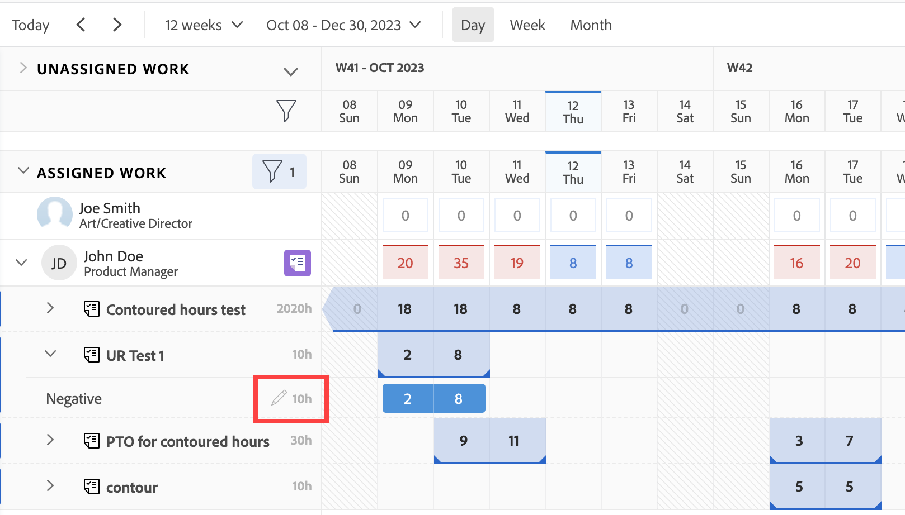

# Toewijzingen van gebruikers beheren in Workload Balancer

<!-- Audited: 01/2024 -->

De gemarkeerde informatie op deze pagina verwijst naar functionaliteit die nog niet algemeen beschikbaar is. Deze functie is alleen beschikbaar in de voorvertoningsomgeving voor alle klanten of in de productieomgeving voor klanten die snelle releases hebben ingeschakeld.

Voor informatie over snelle versies raadpleegt u [Snelle releases voor uw organisatie in- of uitschakelen](/help/quicksilver/administration-and-setup/set-up-workfront/configure-system-defaults/enable-fast-release-process.md).

Voor informatie over de huidige versie raadpleegt u [Overzicht tweede release 2024, tweede kwartaal](/help/quicksilver/product-announcements/product-releases/24-q2-release-activity/24-q2-release-overview.md).

Als Manager van het Middel, kunt u werk aan gebruikers toewijzen en hun dagelijkse, wekelijkse, of maandelijkse toewijzingen van de Balancer van de Werklast beheren om ervoor te zorgen zij een hoeveelheid uren worden toegewezen die in hun beschikbare programma&#39;s past.

## Toegangsvereisten {#access-requirements}

U moet het volgende hebben:

<table style="table-layout:auto"> 
 <col> 
 <col> 
 <tbody> 
  <tr> 
   <td role="rowheader">Adobe Workfront-plan</td> 
   <td> 
Alle 
 </td> 
  </tr> 
  <tr> 
   <td role="rowheader">Adobe Workfront-licentie</td> 
   <td>
   
Als u de werklastbalans gebruikt in het gebied Bronnen, hebt u het volgende nodig:

   
Nieuw: Standaard

   
of

   
Huidig: Plan

   
Wanneer het gebruiken van de Balancer van de Werkbelasting van een team of een project, hebt u nodig:

   
Nieuw: Standaard

   
of

   
Huidig: Werk

 </td> 
  </tr> 
  <tr> 
   <td role="rowheader">Configuratie op toegangsniveau</td> 
   <td> 
Toegang tot het volgende bewerken:
 
    <ul> 
     <li> 
Bronbeheer
 </li> 
     <li> 
Projecten
 </li> 
     <li> 
Taken
 </li> 
     <li> 
Problemen
 </li> 
    </ul> </td> 
  </tr> 
  <tr> 
   <td role="rowheader">Objectmachtigingen</td> 
   <td> 
Contribute-machtigingen of hoger die Toewijzingen maken aan de taken en problemen bevatten waarvoor u toewijzingen wilt beheren. 
 
of 
 
U kunt machtigingen beheren voor de taken waarvoor u de geplande uren wilt bijwerken, en voor het bijwerken van toewijzingen. Voor informatie over het bijwerken van Geplande Uren in de Balancer van de Werkbelasting, zie <a href="#update-task-planned-hours-when-managing-user-allocations">Taak geplande uren bijwerken bij het beheren van gebruikerstoewijzingen</a> in dit artikel.
 </td> 
  </tr> 
 </tbody> 
</table>

Zie voor meer informatie over de informatie in deze tabel [Toegangsvereisten in Workfront-documentatie](/help/quicksilver/administration-and-setup/add-users/access-levels-and-object-permissions/access-level-requirements-in-documentation.md).

## Gebruikerstoewijzingen begrijpen

Gebruikerstoewijzingen zijn hoeveelheden uren die de tijd aangeven die een gebruiker op een bepaalde dag of weekdag, week of maand moet doorbrengen om het werkitem te voltooien. Ze worden opgenomen in de geplande uren van het werkitem.

In dit artikel wordt beschreven hoe u dagelijkse, wekelijkse of maandelijkse toewijzingen per uur kunt bijwerken voor gebruikers die zijn toegewezen aan taken of uitgaven. Voor informatie over het beheren van algemene toewijzingen voor gebruikers en baanrollen aan taken, zie [Gebruikers- en roltoewijzingstijden beheren voor taken](../../manage-work/tasks/assign-tasks/manage-allocation-hours-on-tasks.md).

### Overzicht van gebruikerstoewijzing {#user-allocation-overview}

U kunt gebruikerstoewijzing weergeven als uren of als een percentagewaarde in Workload Balancer. U kunt uren of percentages aanpassen.

Gebruikerstoewijzingen worden opgenomen in het aantal geplande uren van een tijdelijk onderdeel. Voor informatie over geplande uren raadpleegt u [Overzicht van geplande uren](../../manage-work/tasks/task-information/planned-hours.md).

De taak Geplande Uren wordt gelijkelijk verdeeld tussen alle dagen binnen de Duur van de taak voor de gebruiker die aan de taak wordt toegewezen. Als een taak bijvoorbeeld een duur van 5 dagen en een totaal van 10 geplande uren heeft, is het aantal dagelijkse toewijzingen voor de taak 2 uur. De wekelijkse toewijzing is 10 uur. Dit betekent dat een gebruiker elke dag twee uur aan de taak moet werken. U kunt de dagelijkse toewijzing voor de gebruiker echter handmatig wijzigen met Workload Balancer.

>[!CAUTION]
>
>De werklastbalans geeft slechts 1000 geplande uren per werkitem per gebruiker weer, en maximaal 1000 dagen van de duur van een onderdeel. De toewijzingen in de weergave Werklastbalans zijn nul nadat de limiet van 1000 uur of 1000 dagen is bereikt. Wij adviseren het verdelen van taken in kleinere subtaken om een groter aantal Geplande Uren of voor Duur van meer dan 1000 dagen aan te passen.

Houd rekening met het volgende wanneer u dagelijkse, wekelijkse of maandelijkse toewijzingen opzoekt voor taken of problemen in de werklastbalans:

* U kunt dagelijkse, wekelijkse en maandelijkse toewijzingen van de gebruikers aan hun werkitems weergeven. Schakel de weergave Week of Maand in om wekelijkse of maandelijkse toewijzingen weer te geven.
* U kunt de werklastbalans gebruiken om de dagelijkse, wekelijkse of maandelijkse toewijzing van de gebruikers aan de taken of uitgaven aan te passen. Voor informatie over het aanpassen van de weergave van Werklastbalans raadpleegt u [Navigeren door werklastbalans](../../resource-mgmt/workload-balancer/navigate-the-workload-balancer.md).

  >[!NOTE]
  >
  >Wij adviseren dat u een besluit neemt welk tijdkader (dagelijks, wekelijks, of maandelijks) u altijd wilt gebruiken wanneer het beheren van gebruikerstoewijzingen en niet tussen hen voor de zelfde het werkpunten wilt schakelen. Wanneer u wekelijkse toewijzingen bijwerkt voor dezelfde gebruiker waarvoor u eerder dagelijkse toewijzingen hebt bijgewerkt, wordt de dagelijkse toewijzing voor de gebruiker gewijzigd.

* U kunt toewijzingen bijwerken voor zowel werkdagen als niet-werkdagen.
* De tijdstempels voor de Geplande Datum van Begin en Geplande Voltooiing van de het werkpunten evenals het programma van het project zijn belangrijk wanneer Workfront automatisch de dagelijkse toewijzing voor de taak berekent.

  >[!INFO]
  >
  > Bijvoorbeeld, zou een taak een Duur van 2 dagen en 2 Geplande Uren kunnen hebben en het heeft een Geplande tijd van het Begin van 12:00 PM op de eerste dag van de duur met een gebruiker en een Plan van het Project dat bij 5 PM beëindigt. De capaciteit van de gebruiker voor de eerste dag is 5 uur. De capaciteit van de gebruiker voor de tweede dag is 8 uur (als het programma om 9.00 uur start).
  >
  >Workfront berekent de toerekening van de twee uur over de twee dagen van de duur met behulp van de volgende formule:
  >
  >`Daily allocation hours = (Total Planned Hours / Total of available hours) * Daily available hours`
  >
  >Voor ons voorbeeld zijn de dagelijkse toewijzingstijden voor elke dag:
  >   
  >(2 / 13) * 5 = 0,77 toewijzingstijden voor de eerste dag
  >
  >(2 / 13) * 8 = 1,23 toewijzingstijden voor de tweede dag
  >
  >In de bovenstaande berekeningen is 13 de totale beschikbare uren voor de taak: 5 + 8 = 13

* Twee gebruikers in verschillende tijdzones of programma&#39;s in verschillende tijdzones dan die van de toegewezen gebruikers kunnen ertoe leiden dat de toewijzingsbedragen anders worden weergegeven voor twee gebruikers die dezelfde werkitems bekijken.

* Wanneer een gebruiker tijd uit heeft gepland, de dag of het gedeelte van de dag in een grijze achtergrond toont. Als de Workfront-beheerder de instelling Gebruikerstijd uit in het gedeelte Setup heeft ingeschakeld om rekening te houden met de tijd van de gebruiker uitgeschakeld, gaan de toegewezen uren naar de volgende beschikbare dag in de tijdlijn. Als de instelling is uitgeschakeld, blijven de toegewezen uren op de dag staan die voor vrije tijd is gemarkeerd en wordt de gebruiker weergegeven als oververdeeld. Zie voor meer informatie [Projectvoorkeuren voor het hele systeem configureren](../../administration-and-setup/set-up-workfront/configure-system-defaults/set-project-preferences.md).

  >[!TIP]
  >
  >Als de tijd weg duidelijk was nadat de gebruiker aan een het werkpunt werd toegewezen, moet u de chronologie van het project opnieuw berekenen om de bewogen toewijzing te tonen. Zie voor meer informatie [Projecttijdlijnen opnieuw berekenen](../../manage-work/projects/manage-projects/recalculate-project-timeline.md).

* Als er veelvoudige gebruikers aan de taak worden toegewezen, wordt de hoeveelheid Geplande Uren gelijkmatig verdeeld aan elke gebruiker eerst, dan gelijkmatig aan elke dag binnen de Duur van de taak. Deze distributie wordt de toewijzing van elke gebruiker aan de taak.

  De volgende scenario&#39;s kunnen bijvoorbeeld bestaan:

   * Voor een taak met een Duur van 2 Dagen en met 10 Geplande Uren die aan één gebruiker wordt toegewezen, is de dagelijkse toewijzing voor de gebruiker 5 uren voor elke dag door gebrek.
   * Voor een taak met een Duur van 2 dagen en met 10 Geplande Uren die aan twee gebruikers worden toegewezen, is de dagelijkse toewijzing voor elke gebruiker 2.5 uren voor elke dag door gebrek.

* Als een taak of afgifte vóór de geplande voltooiingsdatum is voltooid, wordt het aantal toegewezen uren voor de resterende dagen doorgehaald en wordt niet meegerekend in de totale toewijzing van de gebruiker. Dit wordt alleen weergegeven wanneer zowel het pictogram Toewijzingen weergeven als de instelling Geprojecteerde datums weergeven zijn ingeschakeld. Ga voor meer informatie over het inschakelen van instellingen in Workload Balancer naar [Navigeren door werklastbalans](../../resource-mgmt/workload-balancer/navigate-the-workload-balancer.md).

  

* Wanneer een gebruiker wordt oververdeeld, worden de toegewezen uren weergegeven met een rode achtergrond in het gebruikersveld.
* Wanneer de gebruiker onderverdeeld is of een gelijke hoeveelheid uren aan hun geplande beschikbare tijd toewijst, tonen de uren met een blauwe achtergrond.
* U kunt de toewijzing van gebruikers weergeven in een grafiekweergave in de gebruikersregel. Voor informatie over het toelaten van de grafiekmening voor gebruikerstoewijzingen, zie de &quot;sectie van de Balancer van de Werkbelasting&quot;in het artikel [Navigeren door werklastbalans](../../resource-mgmt/workload-balancer/navigate-the-workload-balancer.md).

  

### Criteria voor het opnieuw instellen van gebruikerstoewijzingen {#criteria-that-reset-user-allocations}

Niet alle taakveranderingen brengen de gewijzigde toewijzingen aan herverdeling teweeg. Er zijn echter bepaalde acties die de reeds aangepaste toewijzingen op uw middelen opnieuw kunnen instellen en deze gelijkmatig kunnen verdelen over alle dagen tijdens de duur van het werkitem voor elk van de toewijzingen.

>[!NOTE]
>
>Als u de automatische verdeling van de toewijzingen voor werkitems niet hebt gewijzigd, worden de uren gelijkmatig verdeeld over alle toewijsingen wanneer het aantal toewijzingen, de duur van een taak of de hoeveelheid geplande uren voor het werkitem wordt gewijzigd.

#### Handelingen die aangepaste toewijzingen opnieuw instellen {#actions-that-reset-adjusted-allocations}

De volgende acties herstellen of wijzigen de dagelijkse, wekelijkse of maandelijkse toewijzingen voor gebruikers nadat u ze handmatig hebt aangepast zoals beschreven in het dialoogvenster [Toewijzingen van gebruikers wijzigen](#modify-user-allocations) in dit artikel:

* Wanneer u de lengte van een het werkpunt verkort dat de hoeveelheid dagen in zijn Duur verkort, worden de aangepaste toegewezen uren van de verloren dagen toegevoegd aan het toewijzingsbedrag van de laatste dag van het het werkpunt.
* Wanneer u de hoeveelheid Geplande Uren op een taak of op het het werkpunt verandert, verdeelt het nieuwe aantal Geplande Uren zich uniform voor de volledige Duur van het het werkpunt.
* Wanneer u een toegewezen werkitem toevoegt of verwijdert en dit ertoe leidt dat de geplande uren van de taak veranderen, worden de aangepaste waarden op dezelfde manier opnieuw verdeeld.

#### Handelingen waarbij de aangepaste toewijzingen niet opnieuw worden ingesteld {#actions-that-do-not-reset-adjusted-allocations}

De volgende wijzigingen in een werkitem activeren de aangepaste toewijzingen niet om opnieuw in te stellen of te wijzigen:

* Wanneer u de dagen van een werkitem verplaatst, maar de hoeveelheid dagen in de Duur niet verandert, blijven de aangepaste toegewezen waarden ongewijzigd en gaan deze naar de nieuwe datums.
* Wanneer u de Duur van een het werkpunt verhoogt dat het aantal dagen in zijn Duur verhoogt, blijven de aangepaste toegewezen uren het zelfde voor de aangepaste dagen. Er worden extra dagen toegevoegd aan het werkitem met 0 toegewezen uren.
* Wanneer u een toegewezen werkitem toevoegt of verwijdert en dit niet tot gevolg heeft dat de geplande uren van het item veranderen, blijven de aangepaste waarden ongewijzigd.

## Geplande uren zoeken in werklastbalans

U kunt gebruikerstoewijzingen aan taken of kwesties wijzigen gebruikend de Balancer van de Werkbelasting door de Geplande Uren van de taken of de kwesties te vinden die aan gebruikers worden toegewezen.

Houd rekening met het volgende wanneer u de geplande uren in het werklastevenwicht weergeeft:

* De totale geplande uren voor een taak of een uitgiftenvertoning naast de Taak of Naam van Uitgave op de linkerzijde van de Balancer van de Werkbelasting.

* De totale Geplande Uren voor een project toont naast de Naam van het Project op de linkerzijde van de Balancer van de Werkbelasting. Dit vertegenwoordigt het totaal van Geplande Uren voor alle taken en kwesties die onder het project in de Balancer van de Werkbelasting en niet alle Geplande Uren van het project worden vermeld.
* De hoeveelheid tijd die dagelijks of wekelijks voor alle taak en voor alle projecten wordt toegewezen toont slechts wanneer u manueel het plaatsen van de Toewijzingen van de Show toelaat. Ga voor informatie over het inschakelen van instellingen in Workload Balancer naar [Navigeren door werklastbalans](../../resource-mgmt/workload-balancer/navigate-the-workload-balancer.md).

## Toewijzingen van gebruikers wijzigen {#modify-user-allocations}

Als onderdeel van het toewijzen van werk aan gebruikers, kunt u gebruikerstoewijzingen in de Balancer van de Werklast wijzigen om ervoor te zorgen dat zij nooit worden overgeslagen, of om een nauwkeurige balans van uren tussen uw middelen te verzekeren. Zie de sectie voor informatie over het identificeren of een gebruiker oververdeeld is [Overzicht van gebruikerstoewijzing](#user-allocation-overview) in dit artikel.

1. Zorg ervoor dat u taken en problemen hebt toegewezen aan gebruikers. Zie voor meer informatie over het toewijzen van werk aan gebruikers in Workload Balancer [Overzicht van het toewijzen van werk in de werklastverdeler](../../resource-mgmt/workload-balancer/assign-work-in-workload-balancer.md).
1. Ga naar Werklastverdeling.
1. (Optioneel) Klik op **Week** of **Maand** wekelijkse of maandelijkse toewijzingen voor gebruikers beheren.

   

1. In de **Toegewezen werk** te zoeken naar de gebruiker waarvoor u de toewijzing handmatig wilt wijzigen en op de pijl naar rechts links van de gebruikersnaam te klikken om de gebruiker uit te vouwen.

   

1. Klik op de pijl naar rechts links van de projectnaam om het project uit te breiden en de werkitems weer te geven waaraan de gebruiker is toegewezen.

   >[!TIP]
   >
   >U kunt gebruikerstoewijzingen alleen wijzigen voor taken en problemen. U kunt gebruikerstoewijzingen voor projecten niet wijzigen.

1. (Optioneel) Klik op de knop **Toewijzingen weergeven** pictogram  om toewijzingen voor alle werkitems weer te geven.

   De naam van de taken en van de projecten wordt vervangen door de toewijzing van de gebruiker voor de taak of het project.

1. (Optioneel) Klik op de knop **Instellingen** pictogram  en selecteer een van de volgende opties:

   1. **Uren opnemen uit uitgaven**. Hierdoor kunt u niet alleen taaktoewijzingen maar ook toewijzingen van uitgaven beheren.
   1. **Voltooid werk tonen**. Op deze manier worden items weergegeven die zijn voltooid en gepland tijdens de tijdlijn waarvoor u toewijzingen beheert.
   1. **Resterende tijd tonen**. Het totale aantal uren voor elke gebruiker (in de gebruikerslijn) verandert. Als deze instelling is ingeschakeld, wordt in Workload Balancer het aantal uren weergegeven dat elke gebruiker beschikbaar heeft voor het werk in plaats van het aantal uren waarvoor hij of zij is toegewezen.

      >[!TIP]
      >
      >Als u toewijzingen wijzigt terwijl deze instelling is ingeschakeld, wordt het totale aantal in de gebruikersregel verlaagd.

   1. **Project** in de **Kleurthema selecteren** sectie. Dit toont elk project en zijn respectieve het werkpunten in unieke kleuren en maakt het gemakkelijker om te begrijpen welke punten tot welk project behoren.
   1. **Percentage** in de **Gebruikerstoewijzing weergeven in** sectie. Hiermee worden toewijzingen weergegeven als een percentagewaarde. De capaciteit van de gebruiker volgens het tijdschema wordt geacht 100% te bedragen. Als een gebruiker bijvoorbeeld is gekoppeld aan een planning van 8 uur per dag, is 8 uur gelijk aan 100% capaciteit. Als u de gebruiker wilt toewijzen om 4 uur per dag te werken, werkt u de toewijzing bij tot 50%.

      >[!NOTE]
      >
      >De beheerder van Workfront beslist welk programma over uw systeem voor het berekenen van de capaciteit van de gebruiker op het gebied van het Beheer van het Middel van Opstelling te gebruiken. Zie voor meer informatie [Voorkeuren voor beheer van bronnen configureren](../../administration-and-setup/set-up-workfront/configure-system-defaults/configure-resource-mgmt-preferences.md).

1. Klik op de knop **Meer** menu  voor een tijdelijk onderdeel klikt u op **Toewijzingen bewerken**.

   

   of

   Dubbelklik op de dag, week of maand in de balk van een taak of uitgave.

   De toewijzingsvakken kunnen worden bewerkt.

1. Klik in het vak van elke dagelijkse, wekelijkse of maandelijkse toewijzing om de hoeveelheid uren of de percentagewaarde waarvoor u de gebruiker elke dag, week of maand wilt toewijzen handmatig bij te werken en klik vervolgens op de knop **Opslaan** pictogram .

   >[!TIP]
   >
   >Klik op de knop **Annuleren** pictogram  om de toewijzingen te verwijderen die u hebt aangepast.

   

   De toewijzingen voor de gebruikersupdate.

   >[!TIP]
   >
   >Als een taak of afgifte vóór de geplande voltooiingsdatum is voltooid, wordt het aantal toegewezen uren voor de resterende dagen doorgehaald en wordt niet meegerekend in de totale toewijzing van de gebruiker. Dit wordt alleen weergegeven als beide **Toewijzingen weergeven** en de **Geprojecteerde datums tonen** instellen is ingeschakeld.

   De volgende scenario&#39;s bestaan:

   * Voor taken met de Types van Duur die niet Eenvoudig of voor kwesties zijn, moet het totaal van de toewijzingen de taak Gepland Uren aanpassen alvorens u het vinkje pictogram kunt klikken.
   * Voor taken met een Eenvoudig Duur Type, kan het totaal van de toewijzingen hoger of lager zijn dan de Geplande Uren en u kunt het pictogram van het vinkje klikken zelfs als zij niet aanpassen. Hierdoor wordt ook het aantal geplande uren voor de taak bijgewerkt. U moet over de juiste machtigingen en toegang beschikken om geplande uren bij te werken voor taken vanuit Workload Balancer.

     >[!TIP]
     >
     >Een slotpictogram toont rechts van de taaknaam aangezien u begint uw toewijzingen aan te passen om erop te wijzen dat de taak een Eenvoudig Type van Duur heeft.

     

   Voor meer informatie over de voorwaarden waaraan moet worden voldaan om Geplande Uren in de Balancer van de Werkbelasting bij te werken, zie [Taak geplande uren bijwerken bij het beheren van gebruikerstoewijzingen](#update-task-planned-hours-when-managing-user-allocations) in dit artikel. Voor informatie over de Types van Duur van de taak, zie [Overzicht van het Type van Duur en van de Duur van de Taak](../../manage-work/tasks/taskdurtn/task-duration-and-duration-type.md).

1. (Voorwaardelijk) als de taak aan meer dan één gebruiker wordt toegewezen, herhaal deze stappen voor elke gebruiker die aan de taak wordt toegewezen om de toewijzingen voor elke gebruiker bij te werken.

   Iedereen die toegang heeft om de Balancer van de Werklast te bekijken en de zelfde gebruikers en de zelfde projecten te bekijken u nu de bijgewerkte toewijzing voor de gebruikers beheerde.

>[!TIP]
>
>Een potloodpictogram wordt rechts van de naam van het werkitem weergegeven om aan te geven dat dit handmatig is aangepast.

## Taak geplande uren bijwerken bij het beheren van gebruikerstoewijzingen {#update-task-planned-hours-when-managing-user-allocations}

U kunt de geplande uren van een taak bijwerken wanneer u gebruikerstoewijzingen in de werklastbalans voor de taak beheert. Dit gebeurt wanneer het totaal van de bijgewerkte toegewezen uren niet het originele totaal van de Geplande Uren voor een taak aanpast.

>[!IMPORTANT]
>
>* Het bijwerken van geplande uren voor taken kan de voortgang van uw project beïnvloeden.
>* Het handmatig bijwerken van geplande uren door het wijzigen van de dagelijkse toewijzingen kan invloed hebben op de geplande uren wanneer taken in de toekomst worden verwijderd. Zie voor meer informatie [Overzicht van geplande uren](../../manage-work/tasks/task-information/planned-hours.md).
>
>* Het is niet mogelijk geplande uren voor problemen bij te werken door toewijzingen in de werklastbalans bij te werken.

Dit is mogelijk wanneer aan de volgende voorwaarden wordt voldaan:

* U hebt de juiste machtigingen en toegang om geplande uren te beheren vanuit de werklastverdeler. Dit zijn onder andere:

   * Rechten voor de taken beheren.
   * Werk Geplande uren in de toegang van de Balancer van de Werkbelasting op het gebied van het Beheer van het Middel van uw Niveau van de Toegang bij.

  Voor meer informatie over de toegang nodig om de Balancer van de Werkbelasting te gebruiken, zie [Toegangsvereisten](#access-requirements) in dit artikel.

* De taak heeft een Type van Duur van Eenvoudig.

