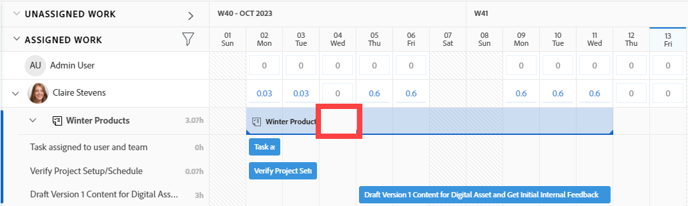
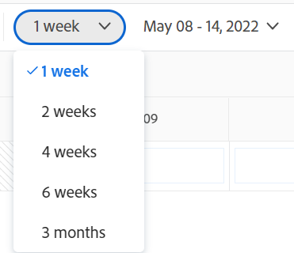

# Navigeren door werklastbalans

{{preview-fast-release-general}}

<!--Audited: 12/2024-->

Gebruik de werklastbalans in Adobe Workfront om werk toe te wijzen aan gebruikers op basis van hun beschikbaarheid. In dit artikel wordt beschreven hoe u instellingen en opties kunt gebruiken om door Workload Balancer te navigeren en de informatie weer te geven die voor u van belang is. In de aanvullende artikelen die hier worden vermeld, wordt beschreven hoe u de werklastbalans kunt gebruiken om uw bronnen en hun toewijzing aan het werk te beheren.

De werklastbalans is beschikbaar in meerdere gebieden van Adobe Workfront. Navigeren is vergelijkbaar in alle gebieden.

Voor meer informatie over waar de Balancer van de Werklast wordt gevestigd, zie [&#x200B; plaats van de Balancer van de Werkbelasting &#x200B;](https://experienceleague.adobe.com/nl/docs/workfront/using/manage-resources/the-workload-balancer/locate-workload-balancer).

## Toegangsvereisten

+++ Breid uit om de toegangseisen voor de functionaliteit in dit artikel weer te geven.

<table style="table-layout:auto"> 
 <col> 
 <col> 
 <tbody> 
  <tr> 
   <td>Adobe Workfront-pakket</td> 
   <td>
Alle
</td>
  </tr>
  <tr> 
   <td>Adobe Workfront-licentie</td> 
   <td>
Standard

       
Plan, wanneer het gebruiken van de Balancer van de Werkbelasting in het gebied van Middelen; het werk, wanneer het gebruiken van de Balancer van de Werkbelasting van een team of een project
</td>
  </tr>
  <tr> 
   <td>Configuraties op toegangsniveau</td> 
   <td> 
Toegang tot het volgende weergeven of vergroten:
 
    <ul> 
     <li>Bronbeheer</li> 
     <li>Projecten</li> 
     <li>Taken</li> 
     <li>Problemen</li> 
    </ul>
   </td> 
  </tr> 
  <tr> 
   <td>Objectmachtigingen</td> 
   <td>Bekijk of hoger toestemmingen aan de projecten, de taken, en de kwesties</td> 
  </tr> 
 </tbody> 
</table>

Voor informatie, zie [&#x200B; vereisten van de Toegang in de documentatie van Workfront &#x200B;](/help/quicksilver/administration-and-setup/add-users/access-levels-and-object-permissions/access-level-requirements-in-documentation.md).

+++

## Overwegingen bij het weergeven van items in de werklastbalans

Houd rekening met het volgende wanneer u de werklastbalans weergeeft:

* In Workload Balancer worden de werkitems in twee afzonderlijke gebieden weergegeven, afhankelijk van hun toewijzingen. Werkitems en gebruikers worden in de volgende gebieden weergegeven:

   * **Niet toegewezen Werk**: Punten die geen taken hebben of slechts aan baanrollen of teams toegewezen zijn.
   * **Toegewezen Werk**: Punten die aan minstens één gebruiker worden toegewezen. De toegewezen items worden onder de naam van de toegewezen gebruiker weergegeven.

  >[!NOTE]
  >
  >* De punten van het werk die aan een baanrol of een team worden toegewezen, en ook aan een gebruiker worden toegewezen, tonen in zowel het Niet toegewezen gebied van het Werk als onder de toegewezen naam van de gebruiker in het Toegewezen gebied van het Werk.
  >* De punten van het werk die aan een gebruiker en een baanrol worden toegewezen, waar de baanrol als primaire ontvanger van het punt wordt geselecteerd, tonen in het Niet toegewezen gebied van het Werk.
  >* De punten van het werk die aan meer dan één gebruikersvertoning onder alle toegewezen gebruikersnamen in het Toegewezen gebied van het Werk worden toegewezen.
  >*  de taken van de Rol worden getoond onder het werkpunten in het Niet toegewezen gebied van het Werk wanneer het plaatsen van de Taken van de Rol van de Show wordt toegelaten. Voor informatie, zie de sectie [&#x200B; de mening &#x200B;](#customize-the-view) in dit artikel aanpassen.

  Voor meer informatie, zie [&#x200B; gebieden van de Toewijzing in de Balancer van de Werkbelasting &#x200B;](/help/quicksilver/resource-mgmt/workload-balancer/assign-work-in-workload-balancer.md#assignment-areas-in-the-workload-balancer) in [&#x200B; Overzicht van het toewijzen van het werk in de Balancer van de Werklast &#x200B;](/help/quicksilver/resource-mgmt/workload-balancer/assign-work-in-workload-balancer.md).

* Wanneer een project geen taken tijdens een periode heeft, is de bar op het projectniveau leeg voor die tijd.

  

* Wanneer u geen toestemmingen hebt om bepaalde punten te zien, tonen zij als **Niet toegankelijke het werkpunten** of **Ontoegankelijke projecten**.

  

* De namen van de werkitems worden links weergegeven en de tijdlijn wordt rechts weergegeven.
* Het totaal van Geplande Uren voor elk het werkpunt toont rechts van de naam van het het werkpunt en links van de bar die de chronologie van het het werkpunt vertegenwoordigt.
* Het totaal van de Geplande Uren voor elk project toont rechts van de naam van het project en links van de bar die de chronologie van het project vertegenwoordigt.

  De geplande informatie van uren voor het project is een totaal van Geplande Uren van alle punten die in de Balancer van de Werkbelasting worden vermeld, en niet een totaal van Geplande Uren op het project.

Zie ook de volgende artikelen voor meer informatie over het weergeven van informatie in Workload Balancer:

* [De werklastbalans zoeken](../workload-balancer/locate-workload-balancer.md)
* [Gegevens in de werklastbalans filteren](../workload-balancer/filter-information-workload-balancer.md)
* [De werklastbalans delen met een koppeling](../workload-balancer/share-link-for-workload-balancer.md)
* [&#x200B; het werkpunten van de Update in de Balancer van de Werkbelasting gebruikend de Samenvatting &#x200B;](../workload-balancer/update-items-in-summary-panel-in-workload-balancer.md)

Zie ook de volgende artikelen voor informatie over het beheer van bronnen met behulp van Workload Balancer:

* [&#x200B; Overzicht van het toewijzen van het werk in de Balancer van de Werkbelasting &#x200B;](https://experienceleague.adobe.com/nl/docs/workfront/using/manage-resources/the-workload-balancer/assign-work-in-workload-balancer)
* [&#x200B; beheer gebruikerstoewijzingen in de Balancer van de Werklast &#x200B;](https://experienceleague.adobe.com/nl/docs/workfront/using/manage-resources/the-workload-balancer/manage-user-allocations-workload-balancer)

## Navigeer de Balancer van de Werkbelasting voor veelvoudige projecten in het gebied van de Middelen

Het navigeren van de Balancer van de Werkbelasting is gelijkaardig in alle gebieden waar u het van toegang hebt.

De volgende subsecties beschrijven hoe te om de informatie in de Balancer van de Werkbelasting voor veelvoudige projecten te bekijken.

U kunt een aantal instellingen en opties aanpassen in Workload Balancer om de informatie te tonen u zich op in het tijdkader moet concentreren dat voor u het meest steek houdt.

Nadat u de instellingen hebt geselecteerd die u op de weergave wilt toepassen, onthoudt Workload Balancer deze instellingen telkens wanneer u deze instellingen opent vanuit een browser of apparaat.

### Heb toegang tot de Balancer van de Werkbelasting voor veelvoudige projecten in het gebied van de Middelen

Om de Balancer van de Werkbelasting voor veelvoudige projecten te navigeren:

{{step1-to-resourcing}}

1. Klik **de Balancer van de Werkbelasting** in het linkerpaneel.

   

   De werklastbalans geeft werktoewijzingsinformatie weer die begint met de huidige week op de volgende twee gebieden:

   * Het **Niet toegewezen gebied van het Werk** toont de volgende het werkpunten:

      * De punten van het werk (taken en kwesties) die aan rollen, teams worden toegewezen, of die unassigned vertoning zijn nadat u filters toepast.
In het gedeelte Niet toegewezen werk worden standaard geen werkitems weergegeven. We raden u aan filters te gebruiken om relevante informatie voor u in dit gebied weer te geven.

        Voor informatie over het gebruiken van filters, zie [&#x200B; informatie van de Filter in de Balancer van de Werklast &#x200B;](../workload-balancer/filter-information-workload-balancer.md).

      *  de taken van de Rol onder de vertoning van de het werkpunten slechts wanneer u het plaatsen van de Taken van de Rol van de Show toelaat. Voor informatie, zie de sectie [&#x200B; de mening &#x200B;](#customize-the-view) in dit artikel aanpassen.

      * De vertoning van projecten slechts wanneer u de Groep door het plaatsen van het Project toelaat. Voor informatie, zie de sectie [&#x200B; de mening &#x200B;](#customize-the-view) in dit artikel aanpassen.

   * Het **Toegewezen gebied van het Werk** toont de volgende het werkpunten:

      * Alle actieve gebruikers in het systeem worden standaard in dit gebied weergegeven. We raden u aan filters te gebruiken om de hoeveelheid informatie op dit gebied te beperken. Als gebruikers aan punten worden toegewezen, tonen de het werkpunten ook onder hun naam.

      * Taken en uitgaven die aan minstens één gebruikersvertoning onder de naam van de gebruiker worden toegewezen.

        De het werkpunten onder de namen van gebruikers in het Toegewezen gebied van het Werk worden gesorteerd door de volgende criteria, in deze orde:

         1. Geplande begindatum (oudste eerst)
         1. Geplande afsluitdatum (oudste eerst)
         1. Alfabetisch per project (alleen wanneer de eerste twee criteria identiek zijn voor meerdere werkitems)

            >[!TIP]
            >
            >* U kunt de projectsortering aanpassen door een optie te selecteren bij de instelling &quot;Projecten sorteren op&quot;.
            >
            >* Projecten worden alleen weergegeven wanneer u de instelling &quot;Groeperen op project&quot; inschakelt.
            > 
            >Voor informatie over het aanpassen van montages, zie de sectie [&#x200B; de mening &#x200B;](#customize-the-view) in dit artikel aanpassen.

1. (Facultatief) klik het **pictogram van de Filter** filter  Toegewezen gebied van het Werk **, dan selecteren de** Standaard filter **in het** Voorgestelde **gebied van de filterdoos.**

   Wanneer het toepassen van het Standaardfilter, tonen de gebruikers die tot om het even welk van uw teams en hun het werkpunten behoren. U kunt een kopie van dit filter bewerken.

   >[!TIP]
   >
   >Het filter Standaard is alleen beschikbaar in Workload Balancer in het gebied Bronnen.

1. Ga door met de volgende stappen om door Workload Balancer te navigeren:

   * [Een tijdframe selecteren in het deelvenster Werklastbalans](#select-a-time-frame-in-the-workload-balancer)
   * [&#x200B; pas de mening &#x200B;](#customize-the-view) aan
   * [Werkitems toewijzen en gebruikerstoewijzingen aanpassen](#assign-work-items-and-adjust-user-allocations)
   * [Toewijzingen weergeven in een grafiek](#view-allocations-in-a-chart)

### Een tijdframe selecteren in het deelvenster Werklastbalans

1. Heb toegang tot de Balancer van de Werkbelasting op het **Bronende** gebied, zoals die in de sectie [&#x200B; wordt beschreven toegang tot de Balancer van de Werkbelasting voor veelvoudige projecten in het gebied van de Middelen &#x200B;](#access-the-workload-balancer-for-multiple-projects-in-the-resourcing-area) in dit artikel.

   De werklastbalans geeft informatie over werktoewijzing weer, te beginnen met de huidige week.

1. Gebruik de horizontale schuifbalk om de tijdlijn weer te geven van de werkitems die buiten de grenzen van het scherm vallen.
1. Klik de **rug of door:sturen** pictogrammen  in de upper-left hoek om de chronologie te navigeren, dan klik **vandaag** om aan de huidige week terug te keren.
1. Klik het **drop-down menu van het tijdkader** op de toolbar, dan klik de begindatum van de periode u wilt tonen. Standaard is de eerste week die u in de kalender hebt geselecteerd, de week waarnaar u hebt genavigeerd.

   

1. Selecteer uit de volgende opties het aantal weken dat u in één keer wilt weergeven in Workload Balancer:
   * 1 week
   * 2 weken
   * 4 weken. Dit is de standaardinstelling.
   * 6 weken
   * 3 maanden

   

1. Klik op een van de volgende opties op de werkbalk om de informatie in verschillende tijdframes weer te geven:
   * **Dag**: De informatie van vertoningen door dag voor vier weken die met de datum van vandaag beginnen, door gebrek.
   * **Week**: De informatie van vertoningen door week voor vier weken.
   * **Maand**: De informatie van vertoningen door maand voor drie maanden.

1. Ga verder met het navigeren door de werklastbalans, zoals beschreven in de volgende secties.

### De weergave aanpassen

1. Heb toegang tot de Balancer van de Werkbelasting op het **Bronende** gebied, zoals die in de sectie [&#x200B; wordt beschreven toegang tot de Balancer van de Werkbelasting voor veelvoudige projecten in het gebied van de Middelen &#x200B;](#access-the-workload-balancer-for-multiple-projects-in-the-resourcing-area) in dit artikel.

   De namen van werkitems worden links weergegeven en worden rechts in Workload Balancer weergegeven door balken. De lengte van de balk staat voor de tijdlijn van een tijdelijk item.

1. (Optioneel en aanbevolen) Gebruik filters in de werkgebieden Niet toegewezen en Toegewezen om alleen werkitems of gebruikers weer te geven die voor u van belang zijn.

   Voor meer informatie, zie [&#x200B; informatie van de Filter in de Balancer van de Werklast &#x200B;](../workload-balancer/filter-information-workload-balancer.md).

   Standaard staan blauwe balken voor de tijdlijnen van projecten en taken en maroon-balken voor problemen.

   U kunt de kleur van de bars voor projecten en taken veranderen wanneer u uw kleurenthema selecteert om het project aan te passen. Lees deze procedure verder voor meer informatie.

   De punten van het werk in het Toegewezen gebied van het Werk worden gesorteerd door projecten door de volgende criteria, in deze orde:
   1. Geplande begindatum (oudste eerst)
   1. Geplande afsluitdatum (oudste eerst)
   1. Alfabetisch per project (alleen wanneer de eerste twee criteria identiek zijn voor meerdere werkitems)

1. Klik de **juist-richt pijl** links van Niet toegewezen of Toegewezen gebieden om alle punten onder de projectnamen (in het Niet toegewezen gebied) en onder de gebruikersnamen (in het Toegewezen gebied) uit te breiden.

   >[!TIP]
   >
   >De punten van het werk zijn vermeld onder projectnamen in Unassigned gebied slechts wanneer u &quot;Groep door Project&quot;het plaatsen toelaat.

1. Klik op de **pijl-omlaag** links van de gebieden Niet toegewezen of Toegewezen om alle items onder de projectnamen (in het gebied Niet toegewezen) en onder de gebruikersnamen (in het gebied Toegewezen) samen te vouwen.

1. Beweeg over, dan belemmering en laat vallen de **scheidingslijn** tussen het linkerpaneel en het chronologiegebied om de grootte van het linkerpaneel aan te passen.

   

1. Klik het **pictogram van Montages** pictogram van Montages .

   Het deelvenster Instellingen wordt aan de rechterkant weergegeven.

    beeld van de Steekproef in het milieu van de Voorproef:
   

   Voorbeeldafbeelding in de productieomgeving:
   

   Selecteer van de hieronder vermelde opties om de informatie bij te werken u in de Balancer van de Werklast bekijkt, dan klik het **X pictogram** in het hoger-recht van de doos van Montages om het te sluiten.

   * **Groep door Project**: Wanneer dit wordt geselecteerd, worden de punten in de Niet toegewezen en Toegewezen gebieden van het Werk gegroepeerd door project. Dit is standaard geselecteerd.

   * **omvat uren van kwesties**: Wanneer dit wordt geselecteerd, kwesties die aan gebruikers worden toegewezen tonen onder de naam van de gebruiker in het Toegewezen gebied van het Werk en kwesties die niet aan gebruikers worden toegewezen tonen in het Niet toegewezen gebied van het Werk. De geplande uren van de uitgaven tellen naar de Geplande Uren voor het project en voor de gebruiker in het Toegewezen Gewerkte gebied van het Werk.
   * **toon Geprojecteerde Datums**: Wanneer dit wordt geselecteerd, toont de geprojecteerde chronologie van het werkpunten naast de geplande chronologie. Let op het volgende:
      * De geprojecteerde chronologie van project, taken, en kwesties toont als donkerblauwe lijn boven de taak, de kwestie, en de projectbars.
      * De geprojecteerde tijdlijn die buiten de geplande tijdlijn valt, wordt in lichtblauw weergegeven, zelfs wanneer u het kleurthema bijwerkt, zoals hieronder beschreven.
      * De geprojecteerde tijdlijn voor de items die u niet kunt weergeven, wordt lichtgrijs weergegeven met een onderliggende lijn.
      * Wanneer een taak of uitgifte vóór de geplande Voltooiingsdatum voltooid is, worden de toewijzingsnummers voor de resterende dagen doorgehaald en niet meegenomen in de toewijzing van de gebruiker. Dit wordt alleen weergegeven wanneer zowel de instelling Geprojecteerde datums weergeven als het pictogram Toewijzing weergeven is ingeschakeld.

     >[!TIP]
     >
     >U ziet dat de werkitems in de werklastbalans worden weergegeven wanneer de geplande of geprojecteerde tijdlijnen (niet noodzakelijkerwijs beide tegelijk) plaatsvinden tijdens het geselecteerde tijdkader.

   * **toon voltooid werk**: Wanneer dit wordt toegelaten, voltooide taken en kwesties tonen in het Toegewezen gebied van het Werk. Dit is standaard ingeschakeld.

     Een groen vinkje wordt in de rechterbovenhoek van een taak of uitgiftebalk weergegeven wanneer deze klaar zijn. Het zelfde pictogram toont voor een project wanneer de taken of de kwesties voor het geselecteerde tijdkader van het project worden voltooid.
   * **toon resterende tijd**: Wanneer dit wordt toegelaten, toont Workfront het verschil tussen de dagelijkse tijd waarvoor de gebruiker beschikbaar is om op hun programma&#39;s en de uren te werken waarvoor zij in het Toegewezen gebied van het Werk voor de gebruikers worden toegewezen. Dit is standaard uitgeschakeld en er wordt standaard toegewezen tijd weergegeven.
   * **toon de Taken van de Rol**: Wanneer dit wordt toegelaten, tonen de taken van de rol in het Niet toegewezen gebied van het Werk onder hun toegewezen het werkpunten. Dit wordt toegelaten door gebrek.

   * In de **Uitgezochte sectie van het kleurenthema**, selecteer de kleur die u voor het project en de taakbars wilt.

     >[!TIP]
     >
     >De instelling voor het selecteren van het kleurenthema heeft geen invloed op de kleur van de uitgavedubalken. Problemen worden altijd weergegeven in een kleurenbalk.

     Selecteer een van de volgende opties:
      * **Gebrek**: De bars voor alle projecten en hun het werkpunten tonen in blauw.
      * **Project**: De bars verbonden aan elk project en zijn taken veranderen volgens de naam van het project. Alle taken die tot de projectvertoning in bars behoren die de kleur van het project aanpassen. De projecubalken worden lichter weergegeven om ze te onderscheiden van de taken. De projectbars omvatten ook een projectpictogram wanneer het kiezen om geen toewijzingen te tonen.
      * **Status van het Project**: De bars verbonden aan elk project en zijn het werkpunten veranderen in de kleur van het statuut van het project.

        De projectstatus is die verbonden aan de Groep van het project. Als de Groep geen groep-specifieke statussen heeft, is de kleur van de bars van het het werkpunt die van de systeem-vlakke projectstatus. Zowel het systeem als de aangepaste status worden weergegeven. Voor informatie over groepsstatussen, zie [&#x200B; tot stand brengen of een groepsstatus &#x200B;](../../administration-and-setup/manage-groups/manage-group-statuses/create-or-edit-a-group-status.md) uitgeven.

   * In de **de gebruikerstoewijzing van de Vertoning in** sectie, selecteer van het volgende:
      * **Uren**: Vertoningen toegewezen tijd als uren. Dit is de standaardinstelling.
      * **Percentage**: Vertoningen toegewezen tijd als percentage van de totale beschikbare tijd
   * In de **Sorterende voorkeur** sectie, selecteer hoe u de punten in de Balancer van de Werkbelasting wilt worden gesorteerd. Selecteer een van de volgende opties:
      * **de gebruikers van de Soort door Primaire Rol**: De gebruikers tonen in de alfabetische orde van hun Primaire Rollen in het Toegewezen gebied van het Werk.
      * **de gebruikers van de Soort alfabetisch**: De vertoningen van gebruikers in de alfabetische orde van hun eerste namen in het Toegewezen gebied van het Werk.
      * **de projecten van de Soort door**: Selecteer een projectgebied van het drop-down menu om projecten alfabetisch door dat gebied in de Niet toegewezen of Toegewezen gebieden van het Werk te sorteren.

   >[!TIP]
   >
   >U kunt op projecten sorteren slechts wanneer de Groep door het Plaatsen van het Project wordt toegelaten. Anders wordt deze instelling grijs weergegeven.

1. (Optioneel en voorwaardelijk) Wanneer u het kleurthema wijzigt in Projectstatus, houdt u de muisaanwijzer boven de naam van een project aan de linkerkant om de status van het project weer te geven.

   

### Werkitems toewijzen en gebruikerstoewijzingen aanpassen

1. Heb toegang tot de Balancer van de Werkbelasting op het gebied van het Middelen, zoals die in de sectie [&#x200B; wordt beschreven toegang tot de Balancer van de Werkbelasting voor veelvoudige projecten in het gebied van de Middelen &#x200B;](#access-the-workload-balancer-for-multiple-projects-in-the-resourcing-area) in dit artikel.
1. Klik het **pictogram van de Toon toewijzingen**  om de dagelijkse of wekelijkse Gepland Uren voor het werkpunten te bekijken.

   Dit vervangt de naam in de bars van de het werkpunten met de hoeveelheid dagelijkse of wekelijkse Geplande Uren in de Niet toegewezen en Toegewezen Gewerkte gebieden van het Werk. Deze instelling is standaard uitgeschakeld.

   Dagen met overtoewijzingen worden rood weergegeven.

   >[!TIP]
   >
   >* De optie Toewijzingen weergeven heeft alleen invloed op wat wordt weergegeven voor projecten, taken, problemen en ontoegankelijke items. Dagelijkse geplande uren voor gebruikers worden standaard weergegeven en kunnen niet worden verborgen.
   >* U moet de Groep door het plaatsen van het Project toelaten om dagelijks Geplande Uren voor projecten te tonen.
   >* Als u de werklastverdeling per week weergeeft, worden de wekelijkse geplande uren weergegeven.

1. (Optioneel) Houd de toegewezen tijd in de gebruikerslijn over om inzicht te krijgen in de capaciteit en de toewijzing van de gebruiker. De capaciteit is de beschikbaarheid van de gebruiker volgens hun planning.

   

1. (Facultatief) klik het **pictogram van de Toewijzingen van de Verbergen**  om de naam van de taken en kwesties in de bars van de het werkpunten te tonen.
1. Klik het **Meer menu** pictogram  rechts van een taak, kwestie,  of rol  naam, dan klik één van de opties hieronder.

   

   * **wijs dit aan** toe, dan begin de naam van een gebruiker, een rol, of een team te typen u het het werkpunt aan in het **de mensen van het Onderzoek, de rol, of het 3&rbrace; gebied van teams wilt toewijzen.**

     Klik **Geavanceerd** om tot het Geavanceerde scherm van Toewijzingen voor het het werkpunt toegang te hebben. Voor meer informatie, zie [&#x200B; Geavanceerde taken &#x200B;](/help/quicksilver/manage-work/tasks/assign-tasks/create-advanced-assignments.md) creëren.

     U kunt ook de volgende sneltoetsen gebruiken om taken of problemen toe te wijzen:

      * In Windows: CTRL + klik de taak of de uitgiftebar.
      * In Mac: CMD + klik op de taak of de uitgiftebalk.

     Voor meer informatie over het toewijzen van het werkpunten aan gebruikers in de Balancer van de Werkbelasting, zie [&#x200B; Overzicht van het toewijzen van het werk in de Balancer van de Werkbelasting &#x200B;](../workload-balancer/assign-work-in-workload-balancer.md).

     >[!NOTE]
     >
     > de taken van de Rol worden slechts getoond onder het werkpunten in het Niet toegewezen gebied van het Werk wanneer het plaatsen van de Taken van de Rol van de Show wordt toegelaten. Voor informatie, zie de sectie [&#x200B; de mening &#x200B;](#customize-the-view) in dit artikel aanpassen. De taken van de rol hebben slechts **dit aan** optie in het **Meer menu** toewijzen.

     >[!TIP]
     >
     >Als uw Workfront- of groepsbeheerder delegaties in uw omgeving heeft ingeschakeld, gebruikt u het tabblad Toewijzingen om gebruikers toe te wijzen aan de taak of uitgave. Voor informatie over het delegeren van het werk, zie [&#x200B; de taken en kwesties van de Afgevaardigde &#x200B;](../../manage-work/delegate-work/how-to-delegate-work.md).

   * **geeft toewijzingen** uit, dan geef de dagelijkse of wekelijkse toewijzingen voor de gebruiker uit. Voor informatie over het beheren van gebruikerstoewijzingen, zie [&#x200B; gebruikerstoewijzingen in de Balancer van de Werklast beheren &#x200B;](../workload-balancer/manage-user-allocations-workload-balancer.md).

   * **Open Samenvatting**. Het Summiere paneel opent op het recht, dan klik het gebied van Toewijzingen en begin de naam van een gebruiker, een rol, of een team in het **gebied van het Onderzoek de mensen, de rol, of teams** te typen om het punt toe te wijzen. Voor meer informatie, zie de sectie [&#x200B; meer informatie over taken en kwesties &#x200B;](#display-more-information-about-tasks-and-issues) in dit artikel.

1. (Optioneel) Dubbelklik op een dagelijkse of wekelijkse toewijzing voor een gebruiker binnen de bar van een het werkpunt om het aantal toegewezen uren uit te geven, dan klik **sparen** pictogram  om de toewijzingen te bewaren of **annuleer** pictogram  om de toewijzingen te verwijderen u aanpast.

   >[!TIP]
   >
   >De pictogrammen Opslaan en Annuleren worden weergegeven aan het einde van een taak of de tijdlijnbalk van een uitgave.
   >
   >

   Voor informatie over het beheren van gebruikerstoewijzingen, zie [&#x200B; gebruikerstoewijzingen in de Balancer van de Werklast beheren &#x200B;](../workload-balancer/manage-user-allocations-workload-balancer.md).

1. Klik **BulkTaken** om het werkpunten in bulk toe te wijzen.

   Voor meer informatie, zie [&#x200B; werk in bulk toewijzen gebruikend de Balancer van de Werkbelasting &#x200B;](../workload-balancer/assign-work-in-workload-balancer-in-bulk.md).
1. De punten van de belemmering van het **Niet toegewezen Werk** gebied of van een gebruiker en laat vallen hen op een andere gebruiker om hen toe te wijzen.

   Voor meer informatie, zie [&#x200B; werk in de Balancer van de Werklast toewijzen door te slepen en te laten vallen &#x200B;](../workload-balancer/assign-work-in-workload-balancer-by-drag-and-drop.md).

### Toewijzingen weergeven in een grafiek

In plaats van toewijzingen per dag of per week weer te geven, kunt u ze in een grafiek bekijken.

1. Heb toegang tot de Balancer van de Werkbelasting op het gebied van het Middelen, zoals die in de sectie [&#x200B; wordt beschreven toegang tot de Balancer van de Werkbelasting voor veelvoudige projecten in het gebied van de Middelen &#x200B;](#access-the-workload-balancer-for-multiple-projects-in-the-resourcing-area) in dit artikel.
1. Klik het **pictogram van de Grafiek**  om de gebruikerstoewijzing in een grafiekformaat te tonen.

   Dagen waarop de gebruiker te veel toegewezen krijgt, worden weergegeven als rode blokken, en dagen waarop de gebruiker te weinig toegewezen is of dat de gebruiker op capaciteit wordt weergegeven als blauwe blokken.

   De grootte van de blokken geeft de hoeveelheid toewijzing aan: hoe groter de doos, des te meer tijd de gebruiker wordt toegewezen aan werkitems voor die dag of week.

   

### Meer informatie over taken en problemen weergeven

U kunt meer informatie bekijken over de taken en de problemen in Workload Balancer.

1. Heb toegang tot de Balancer van de Werkbelasting op het gebied van het Middelen, zoals die in de sectie [&#x200B; wordt beschreven toegang tot de Balancer van de Werkbelasting voor veelvoudige projecten in het gebied van de Middelen &#x200B;](#access-the-workload-balancer-for-multiple-projects-in-the-resourcing-area) in dit artikel.
1. Voer een van de volgende handelingen uit om meer informatie weer te geven in het deelvenster Samenvatting:

   * Klik op de balk van een taak of uitgave om het deelvenster Samenvatting aan de rechterkant te openen.
   * Klik het **Open Summiere** pictogram , dan klik de bar van een taak of kwestie om het Summiere paneel te openen.
   * Klik het **Meer** menu rechts van een taak of een kwestie, dan klik **Open Samenvatting**.

   Voor informatie over het bijwerken van taakinformatie in de Samenvatting in de Balancer van de Werkbelasting, zie [&#x200B; de het werkpunten van de Update in de Balancer van de Werkbelasting gebruikend de Samenvatting &#x200B;](../workload-balancer/update-items-in-summary-panel-in-workload-balancer.md).

1. Houd de muis boven de naam van een taak of uitgave om meer informatie over de taak of uitgave weer te geven. Boven de taak of de uitgave wordt een vak weergegeven met de volgende informatie:

   * De naam van de taak of uitgave.
   * De naam van het project.
   * De geplande begin- en einddatum.
   * Het aantal geplande uren.
   * Voor taken geeft u het vorige nummer op.
   * Voor taken geeft een indicator in de bovenhoek van het vak aan of de taak al dan niet kan worden uitgevoerd.

   

1. Klik op de naam van een tijdelijk item aan de linkerkant om het te openen. Het het werkpunt opent in een nieuw browser tabel.

### De werklastbalans op volledig scherm weergeven

1. Heb toegang tot de Balancer van de Werkbelasting op het gebied van het Middelen, zoals die in de sectie [&#x200B; wordt beschreven toegang tot de Balancer van de Werkbelasting voor veelvoudige projecten in het gebied van de Middelen &#x200B;](#access-the-workload-balancer-for-multiple-projects-in-the-resourcing-area) in dit artikel.

1. Klik het **pictogram van het 1&rbrace; Volledige scherm** Volledige het schermpictogram 

   De werklastbalans neemt het volledige scherm in beslag. Browservensters en tabbladen worden niet weergegeven.

1. Klik het **pictogram** van de Uitgang het volledige het schermpictogram 

## Navigeren door de taakverdeler van een team

Het navigeren van de Balancer van de Werkbelasting van een team is gelijkaardig aan hoe u de Balancer van de Werkbelasting voor veelvoudige projecten navigeert. Voor informatie, zie de sectie [&#x200B; de Balancer van de Werklast voor veelvoudige projecten &#x200B;](#navigate-the-workload-balancer-for-multiple-projects-in-the-resourcing-area) in dit artikel navigeren.

{{step1-to-team}}

De pagina van uw Team van het Huis toont door gebrek.

1. Klik **de Balancer van de Werkbelasting** in het linkerpaneel.

   

   De werklastbalans van een team geeft standaard de volgende informatie weer:

   * In het **Niet toegewezen gebied van het Werk**: De punten van het werk die aan het team of aan het team en baanrollen worden toegewezen en die niet aan gebruikers worden toegewezen.  de taken van de Rol worden getoond onder het werkpunten in het Niet toegewezen gebied van het Werk wanneer het plaatsen van de Taken van de Rol van de Show wordt toegelaten.
   * In het **Toegewezen gebied van het Werk**: De punten van het werk die aan gebruikers worden toegewezen tonen onder de namen van gebruikers.

1. Ga door het navigeren van de Balancer van de Werkbelasting van een team zoals die in [&#x200B; wordt beschreven de Balancer van de Werkbelasting voor veelvoudige projecten in het gebied van de Hulpbron &#x200B;](#navigate-the-workload-balancer-for-multiple-projects-in-the-resourcing-area) sectie van dit artikel.

## Navigeer de Balancer van de Werkbelasting van één enkel project

{{step1-to-projects}}

1. Klik op de naam van een project om de projectpagina te openen.
1. Klik **de Balancer van de Werkbelasting** in het linkerpaneel.

   

   In Workload Balancer voor het project wordt standaard de volgende informatie weergegeven:

   * In het **Niet toegewezen gebied van het Werk**: De punten van het werk op het project die aan rollen of teams worden toegewezen en niet aan gebruikers worden toegewezen.  de taken van de Rol worden getoond onder het werkpunten in het Niet toegewezen gebied van het Werk wanneer het plaatsen van de Taken van de Rol van de Show wordt toegelaten.
   * In het **Toegewezen gebied van het Werk**: De punten van het werk op het project die aan minstens één gebruiker worden toegewezen.

   We raden u aan filters te gebruiken om alleen gebruikers weer te geven die voor u van belang zijn.

   U kunt bijvoorbeeld overwegen alleen gebruikers weer te geven die tot uw teams of groepen behoren. Voor meer informatie, zie [&#x200B; informatie van de Filter in de Balancer van de Werklast &#x200B;](../workload-balancer/filter-information-workload-balancer.md).

1. (Facultatief) klik het **pictogram van de Filter** filter  het werkpunten van dit project **optie van het** Voorgestelde **gebied van het filterpaneel.** Dit filter is standaard uitgeschakeld.

   Wanneer deze optie wordt geselecteerd, slechts de punten die aan gebruikers op de geselecteerde projectvertoning worden toegewezen.

   Wanneer de optie niet wordt geselecteerd, alle punten die aan de gebruikers op de projectvertoning worden toegewezen, ongeacht tot welke projecten de punten behoren.

1. (Facultatief en geadviseerd) pas een filter op het Toegewezen gebied van het Werk toe om gebruikers te tonen die voor u belangrijk zijn maar niet aan punten op het project zouden kunnen worden toegewezen, dan klik **tonen alle gebruikers** pictogram .

   Door alle gebruikers te tonen, kunt u alle gebruikers in Workfront tonen die nog niet aan het werk of andere rollen op het project worden toegewezen.

   U kunt eerst een filter toepassen om het aantal gebruikers dat u weergeeft te verminderen.

   Bijvoorbeeld, zou u eerst voor gebruikers kunnen willen filtreren die tot uw teams of groepen behoren, en dan al die gebruikers tonen.

   Voor informatie over hoe te om een filter te bouwen, zie [&#x200B; informatie van de Filter in de Balancer van de Werklast &#x200B;](../workload-balancer/filter-information-workload-balancer.md).

   >[!NOTE]
   >
   > De optie Alle gebruikers weergeven is alleen beschikbaar voor de werklastverdeling van een project.

1. (Facultatief) klik **de roltoewijzingen van de Show** pictogram .

   Het deelvenster Roltoewijzing wordt weergegeven.

   U kunt informatie bekijken over Geplande Uren verbonden aan de baanrollen op het project en die baanrollen verbonden aan initiatieven met betrekking tot de projecten van de Planner van het Scenario.

   Voor meer informatie, zie [&#x200B; Overzicht van het verzoenen van middeltoewijzingen tussen projecten en initiatieven &#x200B;](../../scenario-planner/overview-reconcile-allocations-between-projects-initiatives.md).

   >[!NOTE]
   >
   >U kunt informatie over de rol van initiatieftaken niet weergeven als uw organisatie geen licentie voor de Workfront Scenario Planner heeft aangeschaft. In dit geval, kunt u de geplande uren slechts bekijken verbonden aan baanrollen op het project. Voor meer informatie, zie [&#x200B; Toegang nodig om de Planner van het Scenario te gebruiken &#x200B;](../../scenario-planner/access-needed-to-use-sp.md).

1. Ga door het navigeren van de Balancer van de Werkbelasting van een project zoals die in [&#x200B; wordt beschreven de Balancer van de Werkbelasting voor veelvoudige projecten &#x200B;](#navigate-the-workload-balancer-for-multiple-projects-in-the-resourcing-area) sectie van dit artikel.

### Navigeren door de taakverdelingsfunctie van een gebruiker

U kunt de werklastbalans openen via uw eigen gebruikersprofiel.

{{step1-click-profile-pic}}

1. Klik **de Balancer van de Werkbelasting** in het linkerpaneel.

   De werklastbalans voor de gebruiker wordt weergegeven.

   

   De werklastbalans van een gebruiker geeft standaard het volgende weer op basis van informatie:

   * **Toegewezen Werk**: De taken en de kwesties die aan de specifieke gebruiker worden toegewezen.

   >[!NOTE]
   >
   >De werklastbalans van een gebruikersprofiel is alleen-lezen en toewijzingen en toewijzingen kunnen niet worden gewijzigd.

1. Ga door het navigeren van de Balancer van de Werkbelasting van een gebruiker zoals die in [&#x200B; wordt beschreven de Balancer van de Werkbelasting voor veelvoudige projecten &#x200B;](#navigate-the-workload-balancer-for-multiple-projects-in-the-resourcing-area) sectie van dit artikel.

<!--old content below - this used to be a one-large-procedure article - outdated, and rewrote it above with several smaller procedures: 

# Navigate the Workload Balancer

<!-drafted note for 22.4 release: remove all production/ preview references at Prod release>

The highlighted information on this page refers to functionality not yet generally available. It is available only in the Preview environment. 

Use the Workload Balancer to understand the availability of your resources as well as to assign work to your users. This article walks you through using the icons and settings available to update the view for and navigate the Workload Balancer.

>[!NOTE]
>
>The Workload Balancer is a resource scheduling tool that will eventually replace the current resource scheduling tools which are currently deprecated. 
>
>For more information about removing the resource scheduling tools and replacing them with the Workload Balancer, see [Deprecation of Resource Scheduling tools in Adobe Workfront](../../resource-mgmt/resource-mgmt-overview/deprecate-resource-scheduling.md).
>
>We recommend that you use the Workload Balancer for scheduling your resources.

The Workload Balancer is available in multiple areas of Adobe Workfront. Navigating it is similar in all areas. This article describes how to navigate the Workload Balancer for multiple projects in the Resourcing area. For more information about where the Workload Balancer is located, see [Locate the Workload Balancer](../../resource-mgmt/workload-balancer/locate-workload-balancer.md).

For information about managing resources using the Workload Balancer, also consider reading the following articles:

* [Overview of assigning work in the Workload Balancer](../../resource-mgmt/workload-balancer/assign-work-in-workload-balancer.md)
* [Manage user allocations in the Workload Balancer](../../resource-mgmt/workload-balancer/manage-user-allocations-workload-balancer.md)

## Access requirements

You must have the following access to perform the steps in this article:

<table style="table-layout:auto"> 
 <col> 
 <col> 
 <tbody> 
  <tr> 
   <td role="rowheader">Adobe Workfront plan*</td> 
   <td> 
Any 
 </td> 
  </tr> 
  <tr> 
   <td role="rowheader">Adobe Workfront license*</td> 
   <td> 
Plan, when using the Workload Balancer in all areas in the Production environment

   
Work, when using the Workload Balancer of a project, in the Preview environment 
 </td> 
  </tr> 
  <tr> 
   <td role="rowheader">Access level configurations*</td> 
   <td> 
View or higher access to the following:
 
    <ul> 
     <li> 
Resource Management
 </li> 
     <li> 
Projects
 </li> 
     <li> 
Tasks
 </li> 
     <li> 
Issues
 </li> 
    </ul> 
If you still don't have access, ask your Workfront administrator if they set additional restrictions in your access level. For information on how a Workfront administrator can change your access level, see <a href="../../administration-and-setup/add-users/configure-and-grant-access/create-modify-access-levels.md" class="MCXref xref">Create or modify custom access levels</a>.
 </td> 
  </tr> 
  <tr> 
   <td role="rowheader">Object permissions</td> 
   <td> 
View or higher permissions to the projects, tasks, and issues 
 
For information on requesting additional access, see <a href="../../workfront-basics/grant-and-request-access-to-objects/request-access.md" class="MCXref xref">Request access to objects </a>.
 </td> 
  </tr> 
 </tbody> 
</table>

*To find out what plan, license type, or access you have, contact your Workfront administrator.

## Considerations for viewing items in the Workload Balancer

Consider the following when viewing the Workload Balancer:

* Projects display in the Workload Balancer only when the Group by Project setting is enabled. This setting is enabled by default.
* Mousing over a task or an issue displays the following additional information about the task or issue:

  * Project name

  * Task or issue name

  * Parent task

  * Planned Start and Completion Dates

  * Number of Planned Hours

  * Ready to start or Not ready status

  

* When a project has no tasks during a period of time, the bar at the project level becomes a dimmed color.

  

* When you don't have permissions to see certain items, they display as **Inaccessible work items** or **Inaccessible projects**.

  

* The names of the work items display on the left and within the timeline selected on the right. 
* The total of Planned Hours for each work item displays to the right of the name of the work items on the left. 
* The total of the Planned Hours for each project displays to the right of the name of the project on the left.

  The Planned Hours information for the project is a total of Planned Hours from all items listed in the Workload Balancer, and not a total of Planned Hours on the project.

## Overview of the Unassigned Work and Assigned Work areas

The Workload Balancer displays work items in two separate areas, depending on their assignments.

The two areas of the Workload Balancer display the following information:

<table style="table-layout:auto"> 
 <col> 
 <col> 
 <tbody> 
  <tr> 
   <td role="rowheader">Unassigned Work</td> 
   <td> 
This area displays tasks and issues unassigned to users. 
 
Projects display when the Group by Project setting is enabled.
 
This area does not display any work items by default. We recommend using filters to display relevant information for you in this area.
 
After you apply a filter, this area displays the following work items:
 
    <ul> 
     <li>unassigned</li> 
     <li>assigned to a team </li> 
     <li>assigned to a job role</li> 
     <li> 
assigned to a team and a role at the same time
 </li> 
    </ul> 
Tip: Items assigned to a user as the primary assignee do not display in the Unassigned Work area. 
 </td> 
  </tr> 
  <tr> 
   <td role="rowheader">Assigned Work</td> 
   <td> 
 All active users in the system display in this area by default. We recommend using filters to limit the amount of information in this area.  
 
Both tasks and issues display in the Assigned Work area. 
 
Projects display when the Group by Project setting is enabled.
 
The work items that the users are assigned to display under their names. 
 
If a work item is assigned to multiple users, the item displays under each assigned user. 
 </td> 
  </tr> 
 </tbody> 
</table>

For information about applying a filter in the Workload Balancer, see [Filter information in the Workload Balancer](../../resource-mgmt/workload-balancer/filter-information-workload-balancer.md).

## Navigate the Workload Balancer

You can update the view in the Workload Balancer to display exactly the information you need to focus on in the time frame that makes the most sense to you.

After selecting the settings you want to apply to your view, the Workload Balancer remembers these settings every time you access it from any browser or device.

1. Click the **Main Menu** icon  in the upper-right corner of Workfront, then click **Resourcing**.
1. Click **Workload Balancer** in the left panel.

   The Workload Balancer displays work assignment information starting with the current week. The names of work items are listed on the left side as well as represented by bars on the right side of the of the Workload Balancer within their respective timelines. By default, blue bars represent the timelines of projects and tasks and maroon bars represent issues.

   >[!TIP]
   >
   >You can change the color of the bars for projects and tasks when you select your color scheme to match the project. For more information, continue reading this procedure.

   The work items that display under the name of users in the Workload Balancer are sorted by the following criteria, in this order:

   1. Planned Start Date (oldest first)
   1. Planned Completion Date (oldest first)
   1. Alphabetical by project (only when the first two criteria are identical for multiple work items)

1. Click the right-pointing arrow to the left of the Unassigned or Assigned areas to expand all items under the project names (in the Unassigned area) and under the user names (in the Assigned area).
1. Click the down-pointing arrow to the left of the Unassigned or Assigned areas to collapse all items under the project names (in the Unassigned area) and under the user names (in the Assigned area).
1. Use the horizontal scroll to navigate the timelines of work items that extends beyond the limits of the screen. 
1. Use the vertical scroll to display additional users and work items. 
1. Drag and drop the separation line between the left panel and the timeline areas to adjust the size of the left panel.

   

1. Click the **Filter icon**  in the upper-right corner of the **Unassigned Work** or the **Assigned Work** areas to select the type of information to display in the Workload Balancer.

   For information about filtering information in the Workload Balancer, see [Manage filters in the Workload Balancer](../../resource-mgmt/workload-balancer/filter-information-workload-balancer.md). 

1. Click the right-pointing arrow next to **Unassigned Work** to expand this area or the down-pointing arrow to collapse it.

   >[!TIP]
   >
   >No items display in this area by default. You must apply a filter to view unassigned work items.

1. Drag and drop the separation line between the **Unassigned Work** and **Assigned Work** areas to adjust their size.

   

1. Click the back or forward icons  to navigate the timeline, then click **Today** to return to the current week. 

1. Click the **time frame drop-down menu** on the toolbar, then click the beginning date of the period you want to display. By default, the first week selected on the calendar is the week you navigated to.

   

1. Click one of the following options in the toolbar to display information by different time frames:

   <table style="table-layout:auto"> 
    <col> 
    <col> 
    <tbody> 
     <tr> 
      <td role="rowheader">Day</td> 
      <td>Displays information by day for four weeks starting with today's date, by default. </td> 
     </tr> 
     <tr> 
      <td role="rowheader">Week</td> 
      <td>Displays information by week for four weeks. </td> 
     </tr> 
     <tr data-mc-conditions=""> 
      <td role="rowheader">Month</td> 
      <td> 
Displays information by month for three months. 
 </td> 
     </tr> 
    </tbody> 
   </table>

1. Select the number of weeks you want to display at one time in the Workload Balancer from the following options:

   * 1 week
   * 2 weeks
   * 4 weeks. This is the default setting.
   * 6 weeks
   * 3 months
        

1. Click the **Settings** icon .

   The Settings panel displays.

   

   Select from the options listed below to update the information you view in the Workload Balancer, then click the **X icon** in the upper-right of the Settings box to close it.

   * **Group by Project**: When this is selected, the items in the Unassigned and Assigned Work areas are grouped by project. This is selected by default.

     

   * **Include hours from issues**: When this is selected, issues assigned to users display under the user's name in the Assigned Work area and issues that are not assigned to users display in the Unassigned Work area. The Planned Hours from the issues count towards the Planned Hours for the project and for the user in the Assigned Work area. 

        

   
      * **Show Projected Dates**: When this is selected, the projected timeline of work items displays in addition to the planned timeline. Notice the following:

         * The projected timeline of project, tasks, and issues displays as a dark blue line above the task, issue, and project bars.
         * The projected timeline that is outside of the planned timeline displays in light blue, even when you update the color theme, as described below.
         * The projected timeline for the items that you have no access to view displays in light gray with a line underneath.
         * When a task or issue completes before the due Planned Completion Date the allocation numbers for the remaining days are struck through and do not count towards the user's allocation. This displays only when both the Show Projected Dates setting and the Show allocation icon are enabled.

         

         >[!TIP]
         >
         >Notice that work items display in the Workload Balancer when either their planned or the projected timelines (not necessarily both at the same time) occur during the timeframe selected.

   * **Show completed work**: When this is enabled, tasks and issues that are completed display in the Assigned Work area. This is enabled by default.

     A green checkmark icon  displays to the upper-right corner of a task or issue bar when they are completed. The same icon displays for a project when the tasks or issues for the selected time frame of the project are completed. 
   
   * **Show remaining time**: When this is enabled, Workfront displays the difference between the daily time for which the user is available to work based on their schedules and the hours for which they are allocated in the Assigned Work area for the users. This is disabled by default and allocated time displays by default.

   * In the **Select color theme** section, select the color that you want for the project and task bars.  

      >[!NOTE]
      >
      >The setting for selecting the color theme  does not affect the color of the issue bars. Issues always display in a maroon-color bar. 

      Select from the following:

      * **Default**: The bars for all projects and their work items display in blue.  
      * **Project**: The bars associated with each project and its tasks change according to the name of the project. All tasks that belong to the project display in bars that match the color of the project. The project bars display in a lighter shade to distinguish them from the tasks. The project bars also include a project icon when choosing not to display allocations.
      * **Project Status**: The bars associated with each project and its work items change to the color of the status of the project.

        >[!TIP]
        >
        >* The project status is that associated with the Group of the project. If the Group does not have group-specific statuses, the color of the work item bars is that of the system-level project status. Both system as well as custom statuses display. For information about group statuses, see [Create or edit a group status](../../administration-and-setup/manage-groups/manage-group-statuses/create-or-edit-a-group-status.md).
        
   * In the **Display user allocation in** section, select from the following:

      * **Hours**: Displays allocated time as hours. This is the default. 
      * **Percentage**: Displays allocated time as a percentage of the total available time

   * In the **Sorting preferences** section, select how you want the items to be sorted in the Workload Balancer. Select from the following options: 

      * **Sort users by Primary Role**: Users display in the alphabetical order of their Primary Roles in the Assigned Work area.

      * **Sort users alphabetically**: Users display in the alphabetical order of their first names in the Assigned Work area.

      * **Sort projects by**: Select a project field from the drop-down menu to sort projects alphabetically by that field in the Unassigned or Assigned Work areas. 

      >[!TIP]
      >
      >You can sort by projects only when the Group by Project setting is enabled. Otherwise, this setting is dimmed.

1. (Optional and conditional) If you changed the color theme to Project Status, hover over the name of a project on the left to view the status of the project.

   

1. (Conditional and recommended) In the Workload Balancer of a project, apply a filter in the Assigned Work area to display users that are important to you but might not be assigned to items on the project, then click the **Show all users** icon . This displays other users in the system that are not yet assigned on the project. For information about how to build a filter, see [Manage filters in the Workload Balancer](../workload-balancer/filter-information-workload-balancer.md).

 
   >[!TIP]
   >
   >The Show all users icon is available only for the Workload Balancer of a project. 

1. Click the **Chart icon**  to display the user allocation in a chart format. Days where the user is overallocated display as red blocks, and days where the user is underallocated or at capacity display as blue blocks. The size of the blocks indicates the amount of the allocation: the larger the box, the more time the user is allocated to work items for that day or week.

   

1. Click the **Show allocations icon**  to view the daily or weekly Planned Hours for work items.

   This replaces the name in the bars of the work items with the amount of daily or weekly Planned Hours in the Unassigned and Assigned Work areas. This setting is disabled by default.

   >[!TIP]
   >
   >* The Show allocations setting only affects what displays for projects, tasks, issues and inaccessible items. Daily Planned Hours for users display by default and cannot be hidden.
   >* You must enable the Group by Project setting to display daily Planned Hours for projects. 
   >* When you view the Workload Balancer by week, the hours displayed are the weekly Planned Hours. 

   Days that show overallocations display in red. 

1. (Optional) Hover over the allocated time in the user line to understand what the capacity and allocation of the user. The capacity is the availability of the user according to their schedule.

   

1. (Optional) Click the **Hide allocations icon**  to display the name of the tasks in the bars of the work items. 
1. Click the **More menu** icon  to the right of a task or issue name, then click one of options below. 

   

      * **Assign this to**, then start typing the name of a user, role, or team you want to assign the work item to in the **Search people, role, or teams** field.
    
      >[!TIP]
      >
      >You can also use the following shortcuts to assign tasks or issues:
      >
      >* In Windows: CTRL+click the task or issue bar.
      >* In Mac: CMD+click the task or issue bar.

      For more information about assigning work items to users in the Workload Balancer, see [Overview of assigning work in the Workload Balancer](../../resource-mgmt/workload-balancer/assign-work-in-workload-balancer.md). 

      >[!TIP]
      >
      >If your Workfront or group administrator enabled delegations in your environment, use the Assignments tab to assign users to the task or issue. For information about delegating work, see [Manage task and issue delegation](../../manage-work/delegate-work/how-to-delegate-work.md).

   * **Edit allocations**, then edit the daily or weekly allocations for the user. For information about managing user allocations, see [Manage user allocations in the Workload Balancer](../../resource-mgmt/workload-balancer/manage-user-allocations-workload-balancer.md).

1. Click the bar of a task or issue to open the Summary panel on the right

   Or

   Click **Open Summary** icon , then click the bar of a task or issue to open the Summary panel

   Or

   Click the **More** menu  to the right of a task or issue, then click **Open Summary**.

   For information about updating task information in the Summary in the Workload Balancer, see [Update work items in the Workload Balancer using the Summary](../../resource-mgmt/workload-balancer/update-items-in-summary-panel-in-workload-balancer.md).

    The Summary panel opens on the right. 

1. Click **Bulk Assignments** to assign work items in bulk.

   For more information, see [Assign work in bulk using the Workload Balancer](../../resource-mgmt/workload-balancer/assign-work-in-workload-balancer-in-bulk.md). 

1. Click the **Full screen** icon  to display the Workload Balancer in full screen, then click the **Exit full screen** icon  to return to the default screen. 
1. (Optional) Double-click a daily or weekly allocation for a user inside the bar of a work item to edit the number of allocated hours, then click the **Save** icon  to save the allocations or the **Cancel** icon  to remove the allocations you adjusted.

   >[!TIP]
   >
   >The Save and Cancel icons display towards the end of a task or an issue's timeline bar.

   For information about managing user allocations, see [Manage user allocations in the Workload Balancer](../../resource-mgmt/workload-balancer/manage-user-allocations-workload-balancer.md). 

1. Click the name of a work item on the left to access it. 
1. Click the **Shareable link icon**  to copy the direct URL for the Workload Balancer to your clipboard. 
1. (Optional) Share the link with any user who does not have direct access to the Workload Balancer.

   For information about sharing the Workload Balancer with a link, see [Share the Workload Balancer with a link](../../resource-mgmt/workload-balancer/share-link-for-workload-balancer.md). 

1. (Conditional) From the Workload Balancer of a project, click the **Show role allocations** icon .

   The Role Allocation panel displays. You can view information about Planned Hours associated with job roles on the project and job roles associated with initiatives from the Scenario Planner. For more information, see [Overview of reconciling resource allocations between projects and initiatives](../../scenario-planner/overview-reconcile-allocations-between-projects-initiatives.md).

   >[!TIP]
   >
   >You cannot view initiative job role information if your organization has not purchased a license for the Workfront Scenario Planner. In this case, you can only view the planned hours associated with job roles on the project. For more information, see [Access needed to use the Scenario Planner](../../scenario-planner/access-needed-to-use-sp.md).

-->
