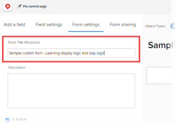
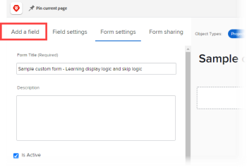

# Weergavelogica toevoegen en logica overslaan naar een aangepast formulier

Met slimme regels kunt u een aangepast formulier dynamisch en relevanter maken voor de gebruikers die het invullen. Wanneer een gebruiker op een bepaalde manier reageert op een meerkeuzeveld op een formulier, wordt met een slimme regel aangegeven wat de gebruiker als volgende moet zien, op basis van dat antwoord.

De meerkeuzevelden zijn vervolgkeuzelijsten, selectievakjes en keuzerondjes.

* **logica van de Vertoning**: U vormt een regel van de vertoningslogica op het gebied, widget, of de sectie die u de gebruiker wilt zien slechts nadat zij een specifieke keus in een voorafgaand meerkeuzeveld selecteren.

  **Voorbeeld:** u creeert een vorm van het Verzoek van de Inhoud van de Marketing waar de mensen in uw organisatie om een nieuw embleem, websiteupdate, brochure, of andere soorten marketing inhoud kunnen verzoeken. Gebaseerd op type van inhoud die de gebruiker wil, moet u hen voor verschillende soorten details, zoals kleuren en ontwerpideeën vragen als zij een embleem, of een lijst van producteigenschappen nodig hebben als zij een brochure nodig hebben.

  In het veld waarin wordt gevraagd naar kleuren en details voor een nieuw logo, kunt u een regel voor weergavelogica toevoegen waarmee dat veld alleen wordt weergegeven nadat de gebruiker het keuzerondje Logo in het eerste veld heeft geselecteerd.

  Op dezelfde manier kunt u in het veld waarin u wordt gevraagd naar productfuncties, een regel voor weergavelogica toevoegen waarmee dat veld alleen wordt weergegeven nadat een gebruiker het keuzerondje Brochure in het eerste veld heeft geselecteerd.

  

  U kunt de regels van de vertoningslogica op om het even welk douanegebied, widget, of sectieonderbreking vormen die een meerkeuzeveld volgen.

* **Skip logicaregel**: U vormt deze regel om delen van een vorm te verbergen die de gebruiker niet nodig heeft. Wanneer de gebruiker een specifiek item in een voorafgaand meerkeuzeveld selecteert, slaat de logicaregel voor overslaan deze over naar het einde van het formulier of naar een aangepast veld, een widget of een sectie die u wilt zien.

  **Voorbeeld:** Iemand gebruikt de vorm van het Verzoek van de Inhoud van de Marketing hierboven om een Witboek te vragen, dat door Verkoop, niet Marketing wordt verstrekt. Voor deze gebruiker, kan een overslaan logische regel de vraag verbergen die voor details ertoe aanzet en aan een lijn van tekst overslaan die hen verwijst naar de afdeling zij nodig hebben.

  

  In dit geval kunt u een beschrijvend tekstveld toevoegen waarin de gebruiker naar de afdeling Verkoop verwijst. In het eerste aangepaste veld waarin wordt gevraagd welk type marketinginhoud de gebruiker nodig heeft, kunt u een logicaregel voor overslaan toevoegen die alleen de tekstregel weergeeft wanneer een gebruiker in het eerste veld het keuzerondje Witboek selecteert.

  Dit is vooral handig als u veel andere velden met logo&#39;s, updates van websites en brochures toevoegt die deze gebruiker niet hoeft te zien.
U kunt een logicaregel voor overslaan alleen toepassen op een aangepast veld, niet op een widget of sectie.

## Toegangsvereisten

U moet het volgende hebben om de stappen in dit artikel uit te voeren:

<table style="table-layout:auto"> 
 <col> 
 <col> 
 <tbody> 
  <tr data-mc-conditions=""> 
   <td role="rowheader"> 
Adobe Workfront-abonnement*
 </td> 
   <td>Alle</td> 
  </tr> 
  <tr> 
   <td role="rowheader">Adobe Workfront-licentie*</td> 
   <td> 
Plan 
 </td> 
  </tr> 
  <tr data-mc-conditions=""> 
   <td role="rowheader">Configuraties op toegangsniveau*</td> 
   <td> 
Administratieve toegang tot aangepaste formulieren
 
Voor informatie over hoe de beheerders van Workfront deze toegang verlenen, zie <a href="../../administration-and-setup/add-users/configure-and-grant-access/grant-users-admin-access-certain-areas.md" class="MCXref xref"> gebruikers administratieve toegang verlenen tot bepaalde gebieden </a>.
 </td> 
  </tr>  
 </tbody> 
</table>

&#42; om te weten te komen welk plan, vergunningstype, of configuraties van het toegangsniveau u hebt, contacteer uw beheerder van Workfront.

## Een voorbeeld van een aangepast formulier maken met weergave en logica overslaan

De beste manier om te leren hoe te om vertoning toe te voegen en logica aan een douaneformulier over te slaan is door het praktische voorbeeld dat in de twee volgende secties wordt verklaard:

* [&#x200B; logica van de Vertoning - praktisch voorbeeld &#x200B;](#display-logic-practical-example)
* [Logica overslaan - praktisch voorbeeld](#skip-logic-practical-example)

### Logica weergeven - praktisch voorbeeld {#display-logic-practical-example}

In dit voorbeeld maakt u een aangepast formulier met een meerkeuzerondje-veld. Vervolgens voegt u weergavelogica toe die dit veld verbindt met een tweede veld.

1. Klik het **Belangrijkste pictogram van het Menu**  in de hoger-juiste hoek van Adobe Workfront, dan klik **Opstelling** .

1. In het linkerpaneel, uitgezochte **Aangepaste Forms** .

1. Klik **Nieuwe Vorm van de Douane**, uitgezochte **Project** in de doos die toont, dan uitgezocht **gaat** verder.

1. In het **tekstvakje van de Titel van de Vorm 0&rbrace;, type** de douanevorm van de Steekproef - het leren vertoningslogica en overslaat logica **om de vorm te noemen.**

   

1. Het eerste veld toevoegen aan het formulier:

   1. Open **voeg een Gebied** tabel toe.

      

   1. Selecteer het **Keuzerondjes** gebiedstype, toen type *Welk type van marketing inhoud hebt u nodig?* als **Etiket** voor het gebied.

   1. Onder **Keuzen**, vervang **Keuze 1** en **Keuze 2** met de volgende tekst om twee optiesgebruikers tot stand te brengen kunnen op het gebied kiezen:

      *de update van de Website*

      *het ontwerp van het Logo*

1. U voegt als volgt het volgende aangepaste veld toe en voegt er een regel met een weergaveregel aan toe:

   1. Open **voeg opnieuw een gebied** tabel toe en voeg een nieuw **RadioKnopen** gebied toe geroepen *Welk type van websiteupdate u nodig hebt?*

      De opties voor dit veld worden later toegevoegd.

   1. In de **Extra montages** sectie, uitgezochte **voegt Logica** toe.

      

1. In de doos die verschijnt, met het **open lusje van de Logica van de Vertoning**, vorm het tweede gebied zodat het slechts voor gebruikers verschijnt die *het ontwerp van de Website* op het eerste gebied selecteerden:

   1. In eerste dropdown, selecteer **Welk type van marketing inhoud hebt u nodig?**
   1. In tweede dropdown, uitgezochte **ontwerp van de Website**.
   1. Verlaat derde dropdown die aan **wordt geplaatst Geselecteerde**, uitgezocht **sparen**.

   Let op de kleine gekleurde vierkantjes met een D, waarmee wordt aangegeven dat het tweede veld is verbonden met weergavelogica aan de selectie van de gebruiker in het eerste veld:

   

1. Selecteer **Voorproef** om ervoor te zorgen de logica de manier werkt u het aan op de vorm wilt, dan selecteren **Voorproef van het Eind**.

1. Klik **sparen + Sluiten** sparen de vorm, dan verdergaat op [&#x200B; logica Overslaan - praktisch voorbeeld &#x200B;](#skip-logic-practical-example) hieronder.

### Logica overslaan - praktisch voorbeeld {#skip-logic-practical-example}

Logische functies voor overslaan werken ongeveer op dezelfde manier als voor de weergave van logica, maar fungeren als het omgekeerde: in plaats van specifieke aangepaste multikeuze-velden weer te geven op basis van eerdere gebruikersselecties, bepaalt u welke velden moeten worden verborgen (overgeslagen) omdat ze niet relevant zijn voor de gebruiker.

Om over dit te leren, blijf werkend aan de vorm van de steekproefdouane u in de sectie [&#x200B; logica van de Vertoning - praktisch voorbeeld &#x200B;](#display-logic-practical-example) in dit artikel creeerde.

1. Klik het **Belangrijkste pictogram van het Menu**  in de hoger-juiste hoek van Adobe Workfront, dan klik **Opstelling** .

1. Klik **Aangepaste Forms**.
1. Klik de naam van de vorm **aangepaste vorm van de Steekproef - het leren vertoningslogica en overslaan logica** die u in de stappen hierboven creeerde, om het voor het uitgeven te openen.
1. Selecteer het drop-down gebied u genoemde *noemde  Welk type van website hebt u nodig?*, voeg de volgende keuzen voor het gebied toe, dan klik **&#x200B;**&#x200B;van toepassing zijn:

   *e-commerce*

   *Brochure*

   *Lidmaatschap*

1. Open **voeg een gebied** tabel toe, creeer een **Tekstgebied met het Formatteren &#x200B;** gebied geroepen *wat het doel voor de website is?*, dan klik **toepassen**.

   In deze organisatie, wordt een de documentatieplaats van de Hulp gecreeerd door het Technisch schrijvende team, niet de afdeling van de Marketing. Er is dus geen verdere informatie nodig van een gebruiker die Help-documentatie selecteert in het tweede veld. Er wordt een tekstregel gemaakt (een beschrijvend tekstveld) waarmee ze het team voor technisch schrijven kunnen bekijken. En wij zullen een overslaan logische regel gebruiken die die gebruiker aan die lijn van tekst overslaat.

1. De tekstregel maken:

   1. Open **voeg een gebied** tabel toe en creeer het gebied van de Tekst van a **Beschrijvende**.

   1. Voor het **Etiket**, type *zie Technisch schrijvend team*.

   1. Voor de **Beschrijvende Tekst**, type *gelieve te zien het Technische Schrijvende team over het creëren van online hulpdocumentatie*.

   1. Selecteer **toepassen**.

1. U kunt als volgt de logicaregel overslaan maken:

   1. Selecteer het tweede drop-down gebied, *Welk type van website hebt u nodig?*
   1. In de **Extra plaatsende** sectie, uitgezocht **geeft Logica** uit.
   1. In de doos die toont, open **Skip Logische** tabel.
   1. Plaats eerste drop-down aan **documentatie van de Hulp**, verlaat de tweede drop-down reeks aan **Geselecteerd**, en plaats derde drop-down aan **zie het Technische schrijvende team**.
   1. Selecteer **sparen**.

   Let op de kleine overslaan logische vierkantjes met een S die aangeven dat de gebruiker iets overslaat nadat een bepaalde keuze in het tweede veld is geselecteerd.

   

1. Klik **Voorproef**  om ervoor te zorgen dat de logica op de gewenste manier wordt toegepast.
1. Klik **sparen + Sluiten**.

Wanneer u een formulier als dit maakt, kunt u meer tekstvelden toevoegen om gebruikers te vragen informatie te vragen die in het tweede veld E-commerce of Brochure selecteren. Deze gebieden zouden kunnen vragen wie het doelpubliek voor de website is, wat het doel is om het te creëren, wat het budget is, enzovoort.

Met logische regels kunt u vertakkende vraagpaden maken.

Voor gebruikers die e-commerce selecteren, kunt u bijvoorbeeld velden maken met vragen over productfoto&#39;s, beschrijvingen, prijzen en betalingsopties. Voor gebruikers die Brochure selecteren, kunt u gebieden tot stand brengen vragend over inhoud.

Een gebruiker die Help-documentatie heeft geselecteerd, ziet geen van deze extra velden die voor hem of haar irrelevant zijn.

>[!TIP]
>
>U kunt zowel weergavelogica als logica overslaan aan een aangepast veld toevoegen als het volgende geldt voor het veld:
>
>* Het is een meerkeuzeveld (keuzerondjes, vervolgkeuzelijst of selectievakjes)
>* Voorafgegaan door een veld met meerdere keuzen
>* Het wordt gevolgd door een ander aangepast veld
>

<!--
<h2 data-mc-conditions="QuicksilverOrClassic.Draft mode">Multi-field display logic statements</h2>
-->

