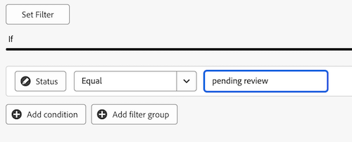
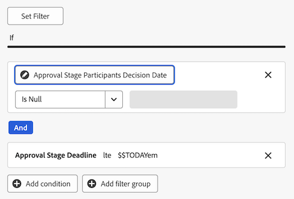

# Een rapportdashboard maken voor revisie en goedkeuring

U kunt een rapportdashboard in het gebied van de Dashboards van het Canvas tot stand brengen om zowel hoog als gedetailleerde informatie over overzichten en goedkeuringen met de nieuwe functionaliteit van documentgoedkeuringen te tonen.

>[!IMPORTANT]
>
>Deze functionaliteit is alleen beschikbaar voor klanten die de service voor nieuwe documentgoedkeuringen gebruiken en zijn ingeschreven in de bètaversie van Canvasdashboards.

## Een dashboard maken

{{step1-to-dashboards}}

1. In het linkerpaneel, klik **de Dashboards van het Canvas**.
1. Klik **Nieuw Dashboard**.
1. Geef het dashboard een naam.
1. (Optioneel) Voeg een beschrijving toe.
1. Klik **creëren**.
    toe

Nadat u een dashboard hebt gemaakt, kunt u beginnen met het toevoegen van KPI&#39;s, grafieken en tabellen. Zie de volgende secties voor meer informatie:

* [Voeg overzichts- en goedkeuringsinformatie op hoog niveau toe met KPI&#39;s en grafieken](#add-high-level-review-and-approval-information-with-kpis-and-charts)
* [Gedetailleerde revisie- en goedkeuringsinformatie toevoegen met tabellen](#add-detailed-review-and-approval-information-with-tables)

## Voeg overzichts- en goedkeuringsinformatie op hoog niveau toe met KPI&#39;s en grafieken

U kunt informatie op hoog niveau over documentgoedkeuringen met KPIs en grafieken bekijken. De bètaversie bevat momenteel geen informatie over de uitboeking.

### KPI&#39;s

<!--
>>[!IMPORTANT]
>
>New document approvals data currently refreshes during the evenings in the US Mountain timezone. Real-time updates are planned and coming soon.-->

#### Goedkeuringen in behandeling

1. [ creeer een dashboard ](#create-a-dashboard) zoals die in de sectie hierboven wordt beschreven.
1. In **KPI** kaart, klik **toevoegen**.
1. Het type _in afwachting van_ in **KPI Titel** textbox.
1. Het type _wacht goedkeuringen_ in **KPI** textbox van de Titel. Deze tekst beschrijft wat KPI toont.
1. Bij de bovenkant van de pagina, klik **Uitgezochte het Gebied van KPI**.
1. De rol neer en vindt de **omslag van de Goedkeuring van het Document**.
1. Kies **Status**, dan uitgezochte **Telling** van het drop-down menu.
1. Klik **uitgeven Filter** > **toevoegt voorwaarde**.
   1. Klik in de lege voorwaardenfilter, klik **Kiep een Gebied**, dan kies **Status**.
   1. Verlaat de exploitant als **Gelijk**, en type _in afwachting van overzicht_ in textbox.
      
1. Klik **Gedaan** in de hoger-juiste hoek van het scherm.

#### Achterstallige betalingen

1. [ creeer een dashboard ](#create-a-dashboard) zoals die in de sectie hierboven wordt beschreven.
1. In **KPI** kaart, klik **toevoegen**.
1. Het type _achterstallig_ in **KPI Titel** textbox.
1. De Deadline van het Stadium van de Goedkeuring van het type _in het verleden_ in **KPI Bijschrift** textbox. Deze tekst beschrijft wat KPI toont.
1. Bij de bovenkant van de pagina, klik **Uitgezochte het Gebied van KPI**.
1. De rol neer en vindt de **omslag van de Goedkeuring van het Document**.
1. Kies **Status**, dan uitgezochte **Telling** van het drop-down menu.
1. Klik **uitgeven Filter** > **toevoegt voorwaarde**:
   1. Klik in de lege voorwaardenfilter, klik **Kiep een Gebied**, dan kies **Deadline**.
   1. Verander de exploitant in **minder dan**, en knevel Relatieve datum aan, dan type _$$TODAY_ in textbox.
      
1. Klik **toevoegen voorwaarde**:
   1. Klik in de lege voorwaardenfilter, klik **Kiep een Gebied**, dan kies **Status**.
   1. Verander de exploitant in **niet bevat**, dan type _goedgekeurd_ in textbox.
      
1. Klik **Gedaan** in de hoger-juiste hoek van het scherm.

#### Voltooide goedkeuringen

1. [ creeer een dashboard ](#create-a-dashboard) zoals die in de sectie hierboven wordt beschreven.
1. In **KPI** kaart, klik **toevoegen**.
1. Het type _voltooide_ in **KPI Titel** textbox.
1. De Telling van de Status van de Goedkeuring van het type __ in **KPI** textbox van de Titel. Deze tekst beschrijft wat KPI toont.
1. Bij de bovenkant van de pagina, klik **Uitgezochte het Gebied van KPI**.
1. De rol neer en vindt de **omslag van de Goedkeuring van het Document**.
1. Kies **Status**, dan uitgezochte **Telling** van het drop-down menu.
1. Klik **uitgeven Filter** > **toevoegt voorwaarde**:
   1. Klik in de lege voorwaardenfilter, klik **Kiep een Gebied**, dan kies **Status**.
   1. Verander de exploitant in **bevat**, en type _goedgekeurd_ in textbox.
      
1. Klik **toevoegen voorwaarde**:
   1. Klik **en** om het in **of** te veranderen.
   1. Klik in de lege voorwaardenfilter, klik **Kiep een Gebied**, dan kies **Status**.
   1. Verander de exploitant in **evenaart**, dan type _herzien_ in textbox.
      
1. Klik **Gedaan** in de hoger-juiste hoek van het scherm.

#### Verlaten goedkeuringen

1. [ creeer een dashboard ](#create-a-dashboard) zoals die in de sectie hierboven wordt beschreven.
1. In **KPI** kaart, klik **toevoegen**.
1. Het type _verliet_ in **KPI Titel** textbox.
1. De deadline van de Goedkeuring van het type _over 2 weken voorbij_ in **KPI de 3} textbox van de Titel van de Titel {.** Deze tekst beschrijft wat KPI toont.
1. Bij de bovenkant van de pagina, klik **Uitgezochte het Gebied van KPI**.
1. De rol neer en vindt de **omslag van het Stadium van de Goedkeuring van het Document**.
1. Kies **Deadline**, dan uitgezochte **Telling** van het drop-down menu.
1. Klik **uitgeven Filter** > **toevoegt voorwaarde**:
   1. Klik in de lege voorwaardenfilter, klik **Kiep een Gebied**, dan kies **Status**.
   1. Verander de exploitant in **niet bevat**, en type _goedgekeurd_ in textbox.
      
1. Klik **toevoegen voorwaarde**:
   1. Klik in de lege voorwaardenfilter, klik **Kiep een Gebied**, dan kies **Deadline**.
   1. Verander de exploitant in **minder dan**, dan knevel Relatieve datum op, dan type _$$TODAY-2w_ in textbox.
      
1. Klik **Gedaan** in de hoger-juiste hoek van het scherm.

### Grafieken

#### Goedkeuringen op basis van het diagram van de beslissingsbalk

1. [ creeer een dashboard ](#create-a-dashboard) zoals die in de sectie hierboven wordt beschreven.
1. In de **kaart van de Grafiek**, klik **toevoegen**.
1. Het type _keurt door besluit_ in **goed** textbox van de Naam.
1. (Facultatief) Type een beschrijving in **Beschrijving** textbox. Deze tekst wordt als knopinfo naast de naam van het diagram weergegeven.
1. Klik **Open grafiekdetails**.
1. In het **type van Grafiek** drop-down menu, verlaat **Geselecteerde de Grafiek van de Bar**.
1. In het **type van Bar** drop-down menu, verlaat **Eenvoudig** geselecteerd.
1. Klik **gebied van de Update** voor de **Onderste (X) as**, en kies de eerste **omslag van de Goedkeuring van het Document** toen **Status**.
1. Plaats het type van Samenvoeging aan **Telling**.
1. Klik **gebied van de Update** voor de **Linkeras (Y)**, en kies de eerste **optie van de Goedkeuring van het Document** toen **Status**.
1. Klik op het lusje van de Filter .
1. Klik **uitgeven Filter** > **toevoegt voorwaarde**:
   1. Klik in de lege voorwaardenfilter, klik **Kiep een Gebied**, dan kies **Versie van het Document**.
   1. Verander de exploitant in **is niet Null**.
      
1. Klik **Gedaan** in de hoger-juiste hoek van het scherm.

#### Revisitiebalkdiagram

1. [ creeer een dashboard ](#create-a-dashboard) zoals die in de sectie hierboven wordt beschreven.
1. In de **kaart van de Grafiek**, klik **toevoegen**.
1. Het type _Herzieningen_ in **Naam** textbox.
1. Type _Aantal revisies voor documenten met onvolledige besluiten die vóór het eind van deze maand_ in **worden gepland Beschrijving** textbox. Deze tekst wordt als knopinfo naast de naam van het diagram weergegeven.
1. Klik **Open grafiekdetails**.
1. In het **type van Grafiek** drop-down menu, verlaat **Geselecteerde de Grafiek van de Bar**.
1. In het **type van Bar** drop-down menu, verlaat **Eenvoudig** geselecteerd.
1. Klik het gebied van de Update **voor de** Onderste (X) as **, en kies de eerste** omslag van de Goedkeuring van het Document **toen** Versie van het Document **>** Versie **.**
1. Plaats het type van Samenvoeging aan **Telling**.
1. Klik {het gebied van de Update 1} voor de **Linker (Y) as**, en kies de eerste **optie van de Goedkeuring van het Document** toen **Versie van het Document** > **Document** > **Naam**.****
1. Klik het lusje van de Filter .
1. Klik **uitgeven Filter** > **toevoegt voorwaarde**:
   1. Klik in de lege voorwaardenfilter, klik **Kiep een Gebied**, dan kies **de Datum van het Besluit van de Deelnemers van het Stadium van de Goedkeuring**.
   1. Verander de exploitant in **is Null**.
      
1. Klik **uitgeven Filter** > **toevoegt voorwaarde**:
   1. Klik in de lege voorwaardenfilter, klik **Kiep een Gebied**, dan kies **de deadline van het Stadium van de Goedkeuring**.
   1. Verander de exploitant in **minder dan of Gelijk**, dan knevel Vastgestelde relatieve datum op en type _$$TODAYem_ in textbox.
      
1. Klik **Gedaan** in de hoger-juiste hoek van het scherm.

## Gedetailleerde revisie- en goedkeuringsinformatie toevoegen met tabellen

### Goedkeuringslijst in behandeling

1. [ creeer een dashboard ](#create-a-dashboard) zoals die in de sectie hierboven wordt beschreven.
1. In de **kaart van de Lijst**, klik **toevoegen**.
1. Het type _in afwachting van Goedkeuringen_ in **Naam** textbox.
1. (Facultatief) Type een beschrijving in **Beschrijving** textbox. Deze tekst wordt als knopinfo naast de naam van het diagram weergegeven.
1. Klik **Open kolommontages**.
1. Klik **toevoegen kolom**, scrol neer en klik de eerste **omslag van de Goedkeuringen van het Document**, dan kiezen **Status**.
1. Voeg de volgende kolommen toe:

   <table>
    <tr>
    <td><strong>Projectnaam</strong></td>
    <td>Documentversie &gt; Document &gt; Project &gt; Naam</td>
    </tr>
    <tr>
    <td><strong>Documentnaam</strong></td>
    <td>Document Version &gt; Document &gt; type _Name_ in the search box.</td>
    </tr>
    <tr>
    <td><strong>Documentversie</strong></td>
    <td>Documentversie &gt; Document &gt; Versie</td>
    </tr>
    <tr>
    <td><strong>Deadline</strong></td>
    <td>Document &gt; Approval Stage &gt; Deadline</td>
    </tr>
    <tr>
    <td><strong>Gevraagd door</strong></td>
    <td>Document &gt; Approval Stage &gt; Approval Stage Participants* &gt; Requester &gt; type _Name_ in the search box.</td>
    </tr>
     <tr>
    <td><strong>Aangevraagde datum</strong></td>
    <td>Document &gt; Approval Stage &gt; Approval Stage Participants* &gt; Created at</td>
    </tr>
     <tr>
    <td><strong>Fiatteur</strong></td>
    <td>Document &gt; Approval Stage &gt; Approval Stage Participants* &gt; Participant User &gt; type _Name_ in the search box.</td>
    </tr>
    <table>

   *Deelnemers aan het goedkeuringswerkgebied worden afgekapt naar goedkeuringswerkgebied Pa.

1. Ga aan [ verder toevoegen voeg hieronder de vereiste filter ](#add-the-required-filter) toe.

#### Voeg het vereiste goedkeuringsfilter toe in afwachting van goedkeuring

1. Klik het lusje van de Filter .
1. Klik **uitgeven Filter** > **toevoegt voorwaarde**:
   1. Klik in de lege voorwaardenfilter, klik **Kiep een Gebied**, dan kies **Status**.
   1. Verander de exploitant in **Gelijk**, dan type _in afwachting van goedkeuring_.
      
1. Voeg facultatieve filters toe zoals hieronder beschreven, of klik **Gedaan** in de hoger-juiste hoek van het scherm.

**Facultatieve filters**

Als u meer specifieke informatie wilt weergeven, afhankelijk van het gebruik, kunt u extra filtervoorwaarden toevoegen. U kunt de tabel opnieuw maken en nieuwe filtervoorwaarden per gebruik toevoegen.

+++ Uitbreiden om extra filteropties weer te geven

**Mijn Projecten**

1. Klik **uitgeven Filter** > **toevoegt voorwaarde**:
   1. Klik in de lege voorwaardenfilter, klik **Kiep een Gebied**, dan kies **versie van het Document** > **Document** > **Project** > **Eigenaar** > type _Naam_ in de onderzoeksdoos.
   1. Verander de exploitant in **Gelijk**, dan kies **me (die in Gebruiker wordt geregistreerd)** aan vertoningsprojecten in Workfront waarin u als projecteigenaar duidelijk bent.
      
1. Klik **Gedaan** in de hoger-juiste hoek van het scherm.

**Goedkeuringen ik heb voorgelegd**

1. Klik **uitgeven Filter** > **toevoegt voorwaarde**:
   1. Klik in de lege voorwaardenfilter, klik **Kiep een Gebied**, dan kies **het Stadium van de Goedkeuring** > **de Deelnemers van het Stadium van de Goedkeuring** > **Vraag** > type _Naam_ in het onderzoeksvakje.
   1. Verander de exploitant in **Gelijk**, dan kies **me (die in Gebruiker wordt geregistreerd)** aan vertoningsprojecten in Workfront waarin u als projecteigenaar duidelijk bent.
      
1. Klik **Gedaan** in de hoger-juiste hoek van het scherm.

+++

### Achterstallige goedkeuringenlijst

1. [ creeer een dashboard ](#create-a-dashboard) zoals die in de sectie hierboven wordt beschreven.
1. In de kaart van de Lijst, voegt de klik **** toe.
1. Het type _Achterstallige goedkeurt_ in **Naam** textbox.
1. (Facultatief) Type een beschrijving in **Beschrijving** textbox. Deze tekst wordt als knopinfo naast de naam van het diagram weergegeven.
1. Klik **Open kolommontages**.
1. Klik **toevoegen kolom**, scrol neer en klik de eerste **omslag van de Goedkeuringen van het Document**, dan kiezen **Status**.
1. Voeg de volgende kolommen toe:

   <table>
    <tr>
    <td><strong>Projectnaam</strong></td>
    <td>Documentversie &gt; Document &gt; Project &gt; Naam</td>
    </tr>
    <tr>
    <td><strong>Documentnaam</strong></td>
    <td>Document Version &gt; Document &gt; type _Name_ in the search box.</td>
    </tr>
    <tr>
    <td><strong>Documentversie</strong></td>
    <td>Documentversie &gt; Document &gt; Versie</td>
    </tr>
    <tr>
    <td><strong>Deadline</strong></td>
    <td>Document &gt; Approval Stage &gt; Deadline</td>
    </tr>
    <tr>
    <td><strong>Gevraagd door</strong></td>
    <td>Document &gt; Approval Stage &gt; Approval Stage Participants* &gt; Requester &gt; type _Name_ in the search box.</td>
    </tr>
     <tr>
    <td><strong>Aangevraagde datum</strong></td>
    <td>Document &gt; Approval Stage &gt; Approval Stage Participants* &gt; Created at</td>
    </tr>
     <tr>
    <td><strong>Fiatteur</strong></td>
    <td>Document &gt; Approval Stage &gt; Approval Stage Participants* &gt; Participant User &gt; type _Name_ in the search box.</td>
    </tr>
    <table>

   *Deelnemers aan het goedkeuringswerkgebied worden afgekapt naar goedkeuringswerkgebied Pa.

1. Ga aan [ verder toevoegen voeg hieronder de vereiste filter ](#add-the-required-filter-1) toe.

#### Het filter Vereiste te late goedkeuringen toevoegen

1. Klik het lusje van de Filter .
1. Klik **uitgeven Filter** > **toevoegt voorwaarde**:
   1. Klik in de lege voorwaardenfilter, klik **Kiep een Gebied**, dan kies **het Stadium van de Goedkeuring** > **Deadline**.
   1. Verander de exploitant in **minder dan**, knevel **plaats relatieve datum**, dan type _$$TODAY_.
      
1. Voeg facultatieve filters toe zoals hieronder beschreven, of klik **Gedaan** in de hoger-juiste hoek van het scherm.

**Facultatieve filters**

Als u meer specifieke informatie wilt weergeven, afhankelijk van het gebruik, kunt u extra filtervoorwaarden toevoegen. U kunt de tabel opnieuw maken en nieuwe, optionele filtervoorwaarden per geval toevoegen.

+++ Uitbreiden om extra filteropties weer te geven

**Mijn Projecten**

1. Klik **uitgeven Filter** > **toevoegt voorwaarde**:
   1. Klik in de lege voorwaardenfilter, klik **Kiep een Gebied**, dan kies **versie van het Document** > **Document** > **Project** > **Eigenaar** > type _Naam_ in de onderzoeksdoos.
   1. Verander de exploitant in **Gelijk**, dan kies **me (die in Gebruiker wordt geregistreerd)** aan vertoningsprojecten in Workfront waarin u als projecteigenaar duidelijk bent.
      
1. Klik **Gedaan** in de hoger-juiste hoek van het scherm.

**Goedkeuringen ik heb voorgelegd**

1. Klik **uitgeven Filter** > **toevoegt voorwaarde**:
   1. Klik in de lege voorwaardenfilter, klik **Kiep een Gebied**, dan kies **het Stadium van de Goedkeuring** > **de Deelnemers van het Stadium van de Goedkeuring** > **Vraag** > type _Naam_ in het onderzoeksvakje.
   1. Verander de exploitant in **Gelijk**, dan kies **me (die in Gebruiker wordt geregistreerd)** aan vertoningsprojecten in Workfront waarin u als projecteigenaar duidelijk bent.
      
1. Klik **Gedaan** in de hoger-juiste hoek van het scherm.

**Mijn team**

1. Klik **uitgeven Filter** > **toevoegt voorwaarde**:
   1. Klik in de lege voorwaardenfilter, klik **Kiep een Gebied**, dan kies **het Stadium van de Goedkeuring** > **de Deelnemers van het Stadium van de Goedkeuring** > **Team van de Deelnemer** > de Naam van het type __ in het onderzoeksvakje.
   1. Verander de exploitant aan **Gelijk**, dan kies **Mijn standaardteams (die in Gebruiker)** of **Mijn andere teams (die in Gebruiker) worden geregistreerd** aan vertoningsprojecten die aan of uw standaardteam of andere teams worden toegewezen u bent.
      
1. Klik **Gedaan** in de hoger-juiste hoek van het scherm.
+++
