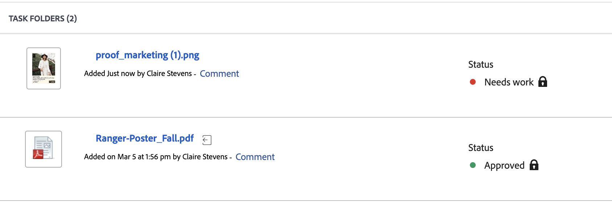

# Overzicht van de beslissingsstatus van het document

U kunt de status van het document rechtstreeks in de documentlijst weergeven:

De volgende statussen zijn beschikbaar:

<table>
            <col style="width: 50%;" />
            <col style="width: 50%;" />
            <tbody>
                 <tr>
                    <td>
                        Revisie in behandeling

                    </td>
                    <td>
                        <ul>
                            <li>
                                Revisoren en fiatteurs zijn op de hoogte gesteld, maar hebben het middel nog niet geopend.
                            </li>
                        </ul>
                    </td>
                </tr>
                 <tr>
                    <td>
                        Bij herziening

                    </td>
                    <td>
                        <ul>
                            <li>
                                
Ten minste één controleur heeft het element weergegeven

                            </li>
                            <li>
                                
Ten minste één revisor heeft zijn revisie niet voltooid

                            </li>
                            <li>
                                
Er zijn geen fiatteurs toegewezen aan dit element

                            </li>
                        </ul>
                    </td>
                </tr>
                 <tr>
                    <td>
                        Bekeken

                    </td>
                    <td>
                        <ul>
                            <li>
                                
Alle revisoren hebben hun revisie voltooid

                            </li>
                            <li>
                                
Er zijn geen fiatteurs toegewezen aan dit element

                            </li>
                        </ul>
                    </td>
                </tr>
                 <tr>
                    <td>Werking vereist

                    </td>
                    <td>
                        <ul>
                            <li>
                                
Alle goedkeuringen en beoordelingen zijn voltooid

                            </li>
                            <li>
                                
Ten minste één fiatteur heeft een beslissing genomen over "werk nodig"

                                
Andere fiatteurs kunnen besluiten van "Goedgekeurd met wijzigingen" of "Goedgekeurd"
                            </li>
                        </ul>
                    </td>
                </tr>
                  <tr>
                    <td>Goedgekeurd met wijzigingen

                    </td>
                    <td>
                        <ul>
                            <li>
                                
Alle goedkeuringen en beoordelingen zijn voltooid

                            </li>
                            <li>
                                
Ten minste één fiatteur heeft een beslissing genomen van "Goedgekeurd met wijzigingen"

                                
Andere fiatteurs kunnen besluiten van "Goedgekeurd"
                            </li>
                            
Opmerking: deze optie is niet beschikbaar als u de integratie Frame.io gebruikt voor revisie en goedkeuring.

                        </ul>
                    </td>
                </tr>
                 <tr>
                    <td>Goedgekeurd

                    </td>
                    <td>
                        <ul>
                           <!--<li>
                                
All approvals and reviews are complete

                            </li>-->
                            <li>
                                
Alle fiatteurs kunnen besluiten dat "goedgekeurd"
                            </li>
                        </ul>
                    </td>
                </tr>
           </tbody>
        </table>

<!--

<table>
            <col style="width: 50%;" />
            <col style="width: 50%;" />
            <tbody>
                 <tr>
                    <td>
                        Pending review

                    </td>
                    <td>
                        <ul>
                            <li>
                                Reviewers and approvers have been notified, but have not yet opened the asset.
                            </li>
                        </ul>
                    </td>
                </tr>
                 <tr>
                    <td>
                        In review

                    </td>
                    <td>
                        <ul>
                            <li>
                                
At least one reviewer or approver has viewed the asset

                            </li>
                            <li>
                                
At least one reviewer has not completed their review

Or

                                
At least one approver has not made an approval decision

                            </li>
                        </ul>
                    </td>
                </tr>
                 <tr>
                    <td>
                        Reviewed

                    </td>
                    <td>
                        <ul>
                            <li>
                                All reviews are complete
                            </li>
                            <li>
                                There are no approvers
                            </li>
                        </ul>
                    </td>
                </tr>
                 <tr>
                    <td>Needs work

                    </td>
                    <td>
                        <ul>
                            <li>
                                
All approvals and reviews are complete

                            </li>
                            <li>
                                
At least one approver has made a decision of "Needs work"

                                
Other approvers may have given decisions of "Approved with changes" or "Approved"
                            </li>
                        </ul>
                    </td>
                </tr>
                  <tr>
                    <td>Approved with changes

                    </td>
                    <td>
                        <ul>
                            <li>
                                
All approvals and reviews are complete

                            </li>
                            <li>
                                
At least one approver has made a decision of "Approved with changes"

                                
Other approvers may have given decisions of "Approved"
                            </li>
                        </ul>
                    </td>
                </tr>
                 <tr>
                    <td>Approved

                    </td>
                    <td>
                        <ul>
                            <li>
                                
All approvals and reviews are complete

                            </li>
                            <li>
                                
All approvers may have given decisions of "Approved"
                            </li>
                        </ul>
                    </td>
                </tr>
           </tbody>
        </table>

-->
