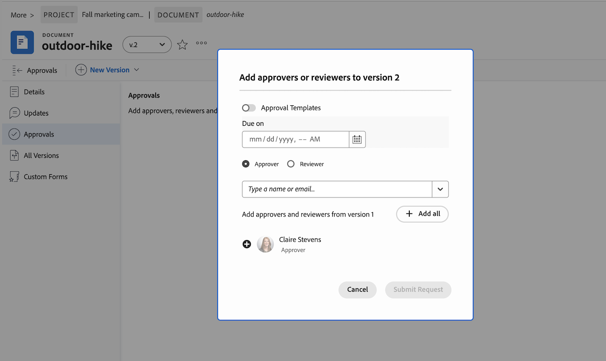

# Een nieuwe documentversie uploaden en goedkeuring aanvragen

 de benadrukte informatie op deze pagina verwijst naar functionaliteit nog niet algemeen beschikbaar. Het is beschikbaar slechts in het milieu van de Sandbox van de Voorproef.

Als een document in een vorige revisie is gemarkeerd als &quot;Werk nodig&quot;, kunt u een nieuwe versie uploaden naar het oorspronkelijke document en een andere goedkeuringsronde starten. Nadat u een nieuwe versie van het document hebt geüpload, zijn de vorige versies vergrendeld.

Als de bestandsnaam van de nieuwe versie afwijkt van de bestandsnaam van de vorige versie, geeft Workfront het document weer met de nieuwere bestandsnaam.

Wanneer een nieuwe versie wordt toegevoegd aan een document met opmerkelijke goedkeuringen, wordt de goedkeuring in de vorige versie weergegeven als &quot;Ingetrokken&quot;. Het voorgaande goedkeuringsproces wordt afgesloten, ook al hebben sommige deelnemers nog geen besluit genomen.

Als de nieuwste documentversie wordt verwijderd, blijven de vorige versies vergrendeld. Als u een vorige versie moet bewerken, moet u deze handmatig ontgrendelen.

## Toegangsvereisten

+++ Breid uit om de toegangseisen voor de functionaliteit in dit artikel weer te geven.

<table style="table-layout:auto"> 
 <col> 
 </col> 
 <col> 
 </col> 
 <tbody> 
  <tr> 
   <td role="rowheader">Adobe Workfront-pakket</td> 
   <td> 
Alle
 </td> 
  </tr> 
  <tr> 
   <td role="rowheader">Adobe Workfront-licenties</td> 
   <td> 
Aanvraag of hoger

   
Medewerker of hoger

   
Als u de integratie Frame.io gebruikt, moet u een Standaard vergunning hebben om goedkeuringswerkschema's tot stand te brengen.

    </td> 
  </tr> 
  <tr data-mc-conditions=""> 
   <td role="rowheader">Configuraties op toegangsniveau</td> 
   <td> 
Toegang tot documenten bewerken
 </td> 
  </tr> 
  <tr data-mc-conditions=""> 
   <td role="rowheader">Objectmachtigingen</td> 
   <td> 
Toegang tot het aan het document gekoppelde object bewerken
 </td> 
  </tr> 
 </tbody> 
</table>

Voor informatie, zie [&#x200B; vereisten van de Toegang in de documentatie van Workfront &#x200B;](/help/quicksilver/administration-and-setup/add-users/access-levels-and-object-permissions/access-level-requirements-in-documentation.md).

+++

## Gebruik slepen en neerzetten om een nieuwe versie toe te voegen aan uw productieomgeving

>[!NOTE]
>
>Slepen en neerzetten werkt niet met Internet Explorer.

Als u nog een revisie- en goedkeuringsronde voor een document nodig hebt, kunt u een nieuwe documentversie maken in Workfront.

U kunt de vorige deelnemers, nieuwe deelnemers of een combinatie van beide toevoegen. U kunt informatie over eerdere versies en deelnemers weergeven op de pagina Documentdetails.

Een nieuwe versie toevoegen:

1. Navigeer naar het document in Workfront.
1. Sleep het nieuwe bestand naar het vorige document. Hiermee wordt automatisch een nieuwe versie gemaakt.

1. Zodra het document eindigt uploadend, selecteer het document, dan klik **Details van het Document**.
   

1. In het linkerpaneel, klik **goedkeurt**, dan klik **toevoegen**.

1. Om alle vorige deelnemers toe te voegen, klik **alles** toevoegen. Desgewenst kunt u ook nieuwe deelnemers toevoegen of vorige deelnemers verwijderen.

1. Als u een bestaande goedkeuringssjabloon wilt toevoegen, klikt u op de knop Sjabloon en typt u een sjabloonnaam.

   >[!TIP]
   >
   >   Gebruikers met een standaardlicentie kunnen herbruikbare goedkeuringssjablonen maken in het gedeelte Setup. Voor meer informatie, zie [&#x200B; een malplaatje van het goedkeuringswerkschema voor documenten &#x200B;](/help/quicksilver/review-and-approve-work/document-reviews-and-approvals/manage-document-approvals/create-approval-template.md) creëren.

1. (Optioneel) Stel een deadline in voor de goedkeuring. Gebruikers en teams worden 72 uur per e-mail op de hoogte gesteld en 24 uur vóór de opgegeven deadline.

1. Zodra u alle recensenten en fiatteurs hebt toegevoegd, klik **voorleggen Verzoek**. Deelnemers worden via e-mail op de hoogte gesteld.

   

## Gebruik slepen en neerzetten om een nieuwe versie toe te voegen in de voorvertoningsomgeving in het gebied voor oudere documenten

Als uw organisatie in Workfront is opgeslagen, wordt het gedeelte met verouderde documenten weergegeven wanneer u documenten in Workfront opent. Voor meer informatie over de opslag van Workfront, zie [&#x200B; Opslag van Workfront vs. de ondernemingsopslag van Adobe &#x200B;](/help/quicksilver/review-and-approve-work/esm-overview.md#workfront-storage-vs-adobe-enterprise-storage).

>[!NOTE]
>
>Slepen en neerzetten werkt niet met Internet Explorer.

Als u nog een revisie- en goedkeuringsronde voor een document nodig hebt, kunt u een nieuwe documentversie maken in Workfront.

U kunt de vorige deelnemers, nieuwe deelnemers of een combinatie van beide toevoegen. U kunt informatie over eerdere versies en deelnemers weergeven op de pagina Documentdetails.

Een nieuwe versie toevoegen:

1. Navigeer naar het document in Workfront.
1. Sleep het nieuwe bestand naar het vorige document. Hiermee wordt automatisch een nieuwe versie gemaakt.

1. Nadat het document is geüpload, selecteert u het document dat u wilt openen in het deelvenster Documentoverzicht. Hier ziet u het versienummer boven in het deelvenster.
   

1. De rol neer aan de **goedkeurt** sectie.

1. Klik **creeer werkschema**, dan vul de volgende details in:

   <table>
   <tr>
   <td><strong>Werkgebiednaam</strong></td>
   <td>Voeg een werkgebiednaam toe. U kunt de naam in iets beschrijvender veranderen, zoals <em> Eerste Overzicht </em> of <em> Definitieve Goedkeuring </em>.</td>
   </tr>
   <tr>
   <td><strong>Namen of e-mails toevoegen</strong></td>
   <td>Typ een gebruiker- of teamnaam die u als fiatteur of revisor wilt toevoegen. Als u alleen revisoren hebt, worden deze op de hoogte gesteld en hebben ze de mogelijkheid de revisie te voltooien, maar er wordt geen beslissing vereist of genomen.</td>
   </tr>
   <tr>
   <td><strong>Eén beslissing vereist (facultatief)</strong></td>
   <td>De eerste persoon die een besluit neemt, voltooit het stadium.</td>
   </tr>
   <tr>
   <td><strong>Vervaldatum (optioneel)</strong></td>
   <td>Stel een vervaldatum in voor de goedkeuring. Gebruikers en teams worden 72 uur per e-mail op de hoogte gesteld en 24 uur vóór de opgegeven vervaldatum.</td>
   </tr>
   </table>

1. (Optioneel) Herhaal de vorige stap om zo nodig extra stappen toe te voegen.

   >[!NOTE]
   >
   >Als u meerdere fasen toevoegt, gaat de goedkeuringswerkstroom verder in de volgorde waarin de fasen worden weergegeven. Wanneer alle vereiste beslissingen worden genomen, begint de volgende fase en wordt de vorige fase vergrendeld.

1. (Optioneel) Als u een bestaande goedkeuringssjabloon wilt toevoegen, selecteert u een sjabloon aan de linkerkant van het dialoogvenster.

   >[!TIP]
   >
   >   Gebruikers met een standaardlicentie kunnen herbruikbare goedkeuringssjablonen maken in het gedeelte Setup. Voor meer informatie, zie [&#x200B; een malplaatje van het goedkeuringswerkschema voor documenten &#x200B;](/help/quicksilver/review-and-approve-work/document-reviews-and-approvals/manage-document-approvals/create-approval-template.md) creëren.

1. Zodra u alle stadia en deelnemers hebt toegevoegd u nodig hebt, klik **Goedkeuring van het Verzoek**.

   De goedkeuringswerkstroom wordt gestart en de fiatteurs ontvangen een melding dat hun goedkeuring voor de nieuwe documentversie is vereist. De vorige documentversie is vergrendeld en eventuele onopgeloste goedkeuringen van de vorige versie worden ingetrokken.

   
   <!--1. To add all previous participants, click **Add all**. You can also add new participants or remove previous participants as needed.-->

