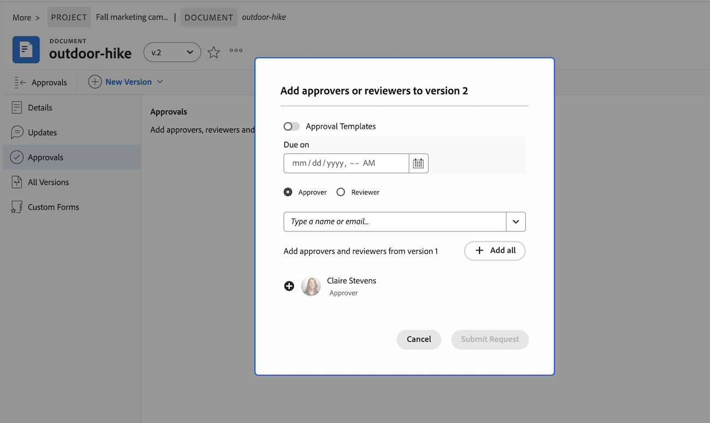

# Een nieuwe documentversie uploaden en goedkeuring aanvragen

Als een document is gemarkeerd en u wilt werken in een vorige revisie, kunt u een nieuwe versie uploaden naar het oorspronkelijke document en een volgende goedkeuringsronde starten. Nadat u een nieuwe versie van het document hebt geüpload, zijn de vorige versies vergrendeld.

Als de bestandsnaam van de nieuwe versie afwijkt van de bestandsnaam van de vorige versie, geeft Workfront het document weer met de nieuwere bestandsnaam.

Wanneer een nieuwe versie wordt toegevoegd aan een document met openstaande goedkeuringen, wordt de goedkeuring van de vorige versie weergegeven als Ingetrokken. Het voorgaande goedkeuringsproces wordt afgesloten, ook al hebben sommige deelnemers nog geen besluit genomen.

Als de nieuwste documentversie wordt verwijderd, blijven de vorige versies vergrendeld. Als u een vorige versie moet bewerken, moet u deze handmatig ontgrendelen.

## Toegangsvereisten

+++ Breid uit om de toegangseisen voor de functionaliteit in dit artikel weer te geven.

<table style="table-layout:auto"> 
 <col> 
 </col> 
 <col> 
 </col> 
 <tbody> 
  <tr> 
   <td role="rowheader">Adobe Workfront-pakket</td> 
   <td> 
 Alle
 </td> 
  </tr> 
  <tr> 
   <td role="rowheader">Adobe Workfront-licenties*</td> 
   <td> 
Aanvraag of hoger

   
Medewerker of hoger
 </td> 
  </tr> 
  <tr data-mc-conditions=""> 
   <td role="rowheader">Configuraties op toegangsniveau</td> 
   <td> 
Toegang tot documenten bewerken
 
Opmerking: als u nog steeds geen toegang hebt, vraag dan aan de Workfront-beheerder of deze aanvullende beperkingen op uw toegangsniveau heeft ingesteld. Voor informatie over hoe een beheerder van Workfront uw toegangsniveau kan wijzigen, zie <a href="/help/quicksilver/administration-and-setup/add-users/configure-and-grant-access/create-modify-access-levels.md" class="MCXref xref"> tot douanetoegangsniveaus </a> leiden of wijzigen.
 </td> 
  </tr> 
  <tr data-mc-conditions=""> 
   <td role="rowheader">Objectmachtigingen</td> 
   <td> 
Toegang tot het aan het document gekoppelde object bewerken
 
Voor informatie bij het vragen van om extra toegang, zie <a href="/help/quicksilver/workfront-basics/grant-and-request-access-to-objects/grant-and-request-access-to-objects.md" class="MCXref xref"> de toegang van het Verzoek tot voorwerpen </a>.
 </td> 
  </tr> 
 </tbody> 
</table>

Voor informatie, zie [ vereisten van de Toegang in de documentatie van Workfront ](/help/quicksilver/administration-and-setup/add-users/access-levels-and-object-permissions/access-level-requirements-in-documentation.md).

+++

## Slepen en neerzetten gebruiken om een nieuwe versie toe te voegen

>[!NOTE]
>
>Slepen en neerzetten werkt niet met Internet Explorer.

Als u nog een revisie- en goedkeuringsronde voor een document nodig hebt, kunt u een nieuwe documentversie maken in Workfront.

U kunt de vorige deelnemers, nieuwe deelnemers of een combinatie van beide toevoegen. U kunt informatie over eerdere versies en deelnemers weergeven op de pagina Documentdetails.

Een nieuwe versie toevoegen:

1. Navigeer naar het document in Workfront.
1. Sleep het nieuwe bestand naar het vorige document. Hiermee wordt automatisch een nieuwe versie gemaakt.

1. Zodra het document eindigt uploadend, selecteer het document, dan klik **Details van het Document**.
   

1. In het linkerpaneel, klik **goedkeurt**, dan klik **toevoegen**.

1. Om alle vorige deelnemers toe te voegen, klik **alles** toevoegen. Desgewenst kunt u ook nieuwe deelnemers toevoegen of vorige deelnemers verwijderen.

1. Als u een bestaande goedkeuringssjabloon wilt toevoegen, klikt u op de knop Sjabloon en typt u een sjabloonnaam.

   >[!TIP]
   >
   >   Gebruikers met een standaardlicentie kunnen acceptatiesjablonen maken die u kunt gebruiken vanuit het gedeelte Instellen. Voor meer informatie, zie [ een Malplaatje van de Goedkeuring voor activa en documenten ](/help/quicksilver/review-and-approve-work/document-reviews-and-approvals/manage-document-approvals/create-approval-template.md) creëren.

1. (Optioneel) Stel een deadline in voor de goedkeuring. Gebruikers en teams worden 72 uur per e-mail op de hoogte gesteld en 24 uur vóór de opgegeven deadline.

1. Zodra u alle recensenten en fiatteurs hebt toegevoegd, klik **voorleggen Verzoek**. Deelnemers worden via e-mail op de hoogte gesteld.

   

