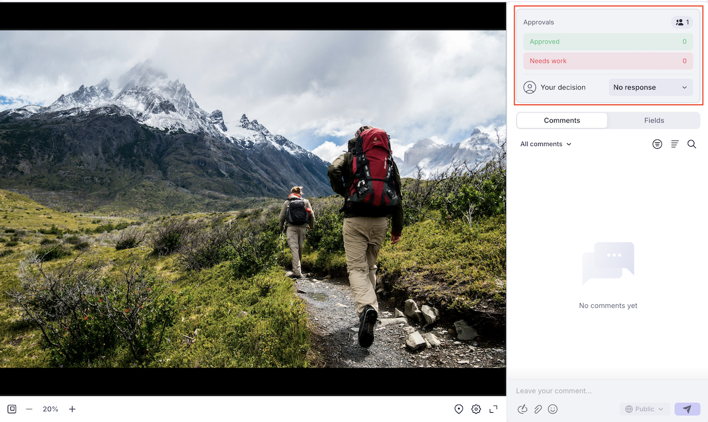

# Reviseren en goedkeuren met de viewer Frame.io

U kunt documenten in Workfront reviseren en goedkeuren met de viewer Frame.io.

Door Workfront-documenten te reviseren met de Frame.io-viewer kunt u opmerkingen achterlaten of specifieke gedeelten van een document, afbeelding of video markeren om efficiënt met uw team samen te werken en ervoor te zorgen dat feedback duidelijk en handelbaar is.

Voor meer informatie over de integratie Frame.io met Workfront, zie [&#x200B; Frame.io integratieoverzicht &#x200B;](/help/quicksilver/review-and-approve-work/native-integrations/frame-io/frame-int-overview.md).

<!--## Access requirements

+++ Expand to view access requirements for the functionality in this article.

<table style="table-layout:auto"> 
 <col> 
 </col> 
 <col> 
 </col> 
 <tbody> 
  <tr> 
   <td role="rowheader">Adobe Workfront package</td> 
   <td> 
 Any
 </td> 
  </tr> 
  <tr> 
   <td role="rowheader">Adobe Workfront license</td> 
   <td> 
Request or higher

   
Contributor or higher
 </td> 
  </tr> 
  <tr data-mc-conditions=""> 
   <td role="rowheader">Access level configurations</td> 
   <td> 
Edit access to Documents
  </td> 
  </tr> 
  <tr data-mc-conditions=""> 
   <td role="rowheader">Object permissions</td> 
   <td> 
Edit access to the object associated with the document
  </td> 
  </tr> 
 </tbody> 
</table>

For information, see [Access requirements in Workfront documentation](/help/quicksilver/administration-and-setup/add-users/access-levels-and-object-permissions/access-level-requirements-in-documentation.md).

+++ -->

## Een document reviseren

Als controleur kunt u opmerkingen toevoegen aan en elementen markeren. Als je klaar bent, kun je de revisie markeren als voltooid in Workfront. Het is niet nodig de revisie als voltooid te markeren om het actief in het goedkeuringsproces verder te laten gaan.

1. Ga naar uw overzicht e-mailbericht, en klik **gaan aan overzicht**.
of
Ga de homepage van Workfront, vind Mijn widget Goedkeuringen, dan klik **Open overzicht**.

   >[!NOTE]
   > 
   >Mogelijk moet u de widget Mijn goedkeuringen toevoegen aan uw startpagina. Voor meer informatie, zie [&#x200B; toevoegen, geef, of verwijder widgets in Huis &#x200B;](/help/quicksilver/workfront-basics/using-home/using-the-home-area/add-edit-remove-widgets-in-new-home.md) uit.

1. Gebruik in Frame.io de gereedschappen voor opmerkingen om feedback te geven of vragen te stellen.
Opmerkingen en elementmarkeringen zijn alleen zichtbaar in de viewer Frame.io. Opmerkingen worden niet weergegeven in Workfront. Voor meer informatie bij het gebruiken van de kijker Frame.io, zie [&#x200B; Commentaar op uw media &#x200B;](https://help.frame.io/en/articles/9105251-commenting-on-your-media).
1. Als u tevreden bent met het document, navigeert u terug naar de pagina Documentdetails in Workfront en markeert u de revisie als voltooid.

   

## Een document goedkeuren

Als fiatteur kunt u opmerkingen toevoegen en maximaal elementen markeren. U moet een besluit nemen om het goedkeuringsproces vooruit te bewegen.

Het document wordt pas naar een goedgekeurde status verplaatst als alle toegewezen fiatteurs &quot;Goedgekeurd&quot; hebben gekozen.

Beslissen over een document:

1. Ga naar uw overzicht e-mailbericht, en klik **gaan aan overzicht**.
of
Ga de homepage van Workfront, vind Mijn widget Goedkeuringen, dan klik **Open overzicht**.

   >[!NOTE]
   > 
   >Mogelijk moet u de widget Mijn goedkeuringen toevoegen aan uw startpagina. Voor meer informatie, zie [&#x200B; toevoegen, geef, of verwijder widgets in Huis &#x200B;](/help/quicksilver/workfront-basics/using-home/using-the-home-area/add-edit-remove-widgets-in-new-home.md) uit.

1. Gebruik in Frame.io de gereedschappen voor opmerkingen om feedback te geven of vragen te stellen. Opmerkingen en elementmarkeringen zijn alleen zichtbaar in de viewer Frame.io. Voor meer informatie bij het gebruiken van de kijker Frame.io, zie [&#x200B; Commentaar op uw media &#x200B;](https://help.frame.io/en/articles/9105251-commenting-on-your-media).
1. Als u tevreden bent met het document, kunt u een van de volgende beslissingen kiezen in de viewer Frame.io:

   * **keur** goed: De activa hebben geen veranderingen nodig en is klaar voor gebruik.
   * **het werk van behoeften**: De activa vereist veranderingen en is niet klaar voor gebruik. Nadat de opgegeven wijzigingen zijn aangebracht, moet het element worden geüpload als een nieuwe versie en moet een nieuwe goedkeuringsronde worden doorlopen. Voor meer informatie, zie [&#x200B; een nieuwe documentversie uploaden en om goedkeuring &#x200B;](/help/quicksilver/review-and-approve-work/document-reviews-and-approvals/manage-document-approvals/upload-new-doc-version.md) verzoeken. <!--do they need to tell someone it was uploaded via comment tagging?-->

   Nadat u een beslissing hebt genomen, wordt de eigenaar van het document via e-mail op de hoogte gesteld.

   Voor meer informatie over besluiten in Workfront, zie [&#x200B; overzicht van de beslissingsstatus van het Document &#x200B;](/help/quicksilver/review-and-approve-work/document-reviews-and-approvals/manage-document-approvals/document-approval-status.md).

   

<!--is document owner the correct term?-->
