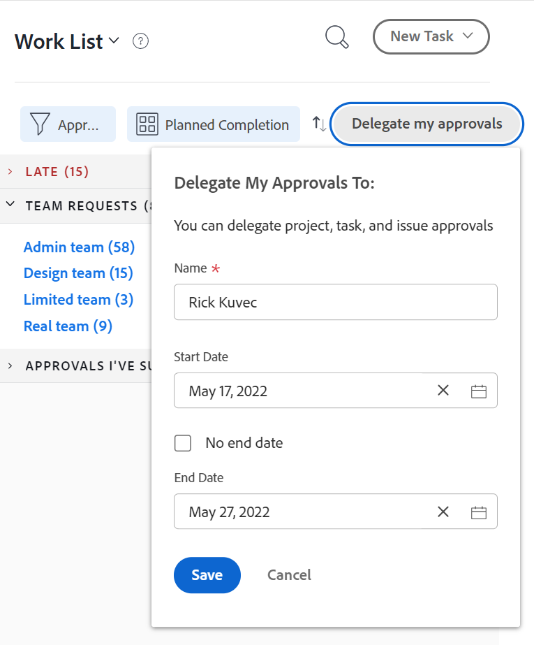

# Goedkeuringsaanvraag delegeren

U kunt het werk tijdelijk delegeren u aan wordt toegewezen terwijl u uit het bureau bent. U kunt taken delegeren en taken uitgeven of u kunt goedkeuringsverzoeken delegeren. Dit artikel beschrijft hoe te om goedkeuringsverzoeken te delegeren. Voor informatie over het delegeren van taak en uitgiftetaken, zie [ de taken en kwesties van de Afgevaardigde ](../../manage-work/delegate-work/how-to-delegate-work.md).

U kunt de volgende typen goedkeuringen delegeren, ongeacht hoe de goedkeuring aan u is toegewezen (of deze rechtstreeks aan u zijn toegewezen, aan een team u lid van, of aan uw baanrol):

* Projectgoedkeuringen
* Taken goedkeuren
* Goedkeuring afgeven

U kunt geen timesheet-, document- of proefdrukgoedkeuringen delegeren.

>[!NOTE]
>
>Om ervoor te zorgen dat geen inconsistenties met de data voorkomen die u voor uw goedkeuringen plant om worden afgevaardigd, adviseren wij dat de tijdzone van uw gebruikersprofiel dat van uw programma aanpast. Raadpleeg de volgende artikelen voor meer informatie:
>
>* [ creeer een programma ](../../administration-and-setup/set-up-workfront/configure-timesheets-schedules/create-schedules.md)
>* [ geef het profiel van een gebruiker ](../../administration-and-setup/add-users/create-and-manage-users/edit-a-users-profile.md) uit
>

## Toegangsvereisten

+++ Breid uit om de toegangseisen voor de functionaliteit in dit artikel weer te geven.

U moet de volgende toegang hebben om de stappen in dit artikel uit te voeren:

<table style="table-layout:auto"> 
 <col> 
 </col> 
 <col> 
 </col> 
 <tbody> 
  <tr> 
   <td role="rowheader">
Adobe Workfront-abonnement*
</td> 
   <td> 
Alle
 </td> 
  </tr> 
  <tr> 
   <td role="rowheader">
Adobe Workfront-licentie*
</td> 
   <td> 
Controleren of hoger
 </td> 
  </tr> 
 </tbody> 
</table>

Neem contact op met uw Workfront-beheerder om te weten te komen welk abonnement- of licentietype u hebt.

+++

## Gebruikerstoegang voor gedelegeerde goedkeuringen begrijpen

Tijdens de aangewezen goedkeuringsperiode, heeft de gebruiker aan wie u een goedkeuringsverzoek delegeert de volgende capaciteiten:

* Bestaande goedkeuringsaanvragen goedkeuren of afwijzen als er geen besluit is genomen
* Kan nieuwe goedkeuringsaanvragen goedkeuren en afwijzen die gedurende een bepaalde periode zijn ontvangen
* Hiermee krijgt u toegang tot objecten die nog moeten worden goedgekeurd

  >[!NOTE]
  >
  > De Adobe Workfront-beheerder kan gebruikers toegang tot bepaalde objecttypen ontzeggen. Wanneer een gebruiker geen toegang tot een objecttype heeft en een goedkeuring van dat type aan de gebruiker wordt gedelegeerd, heeft de gebruiker geen toegang tot het object weergeven. Nochtans, kan de gebruiker nog goedkeuren of goedkeuringsverzoeken van de **1} pagina van het Huis {verwerpen, zoals die in [ wordt beschreven het werk ](../../review-and-approve-work/manage-approvals/approving-work.md) goedkeurt.**\
  >Bijvoorbeeld, behoort de Gebruiker A tot Groep A. De Workfront-beheerder heeft de toegangsrechten van groep A beperkt, zodat gebruikers in deze groep geen taken in Workfront kunnen weergeven. Als een verzoek van de taakgoedkeuring aan Gebruiker A wordt gedelegeerd, kan Gebruiker A niet de taak bekijken die de goedkeuring met wordt geassocieerd. Nochtans, kan Gebruiker A het goedkeuringsverzoek van de Homepage goedkeuren of verwerpen.

  Voor informatie over hoe de beheerder van Workfront toegang tot objecten types binnen Opstelling kan beperken, zie  [ creeer of wijzig douanetoegangsniveaus ](../../administration-and-setup/add-users/configure-and-grant-access/create-modify-access-levels.md). 

Nadat de delegatie van de goedkeuring is gestopt of geannuleerd, heeft de gebruiker die als fiatteur is aangewezen:

* U hebt geen toegang meer tot het goedkeuren van uw werk voor items die goedkeuring vereisen
* Blijft toegang tot het werk van de Mening tot\
  Gebruikers aan wie via een goedkeuringsdelegatie toegang tot objecten is verleend, behouden die toegang zelfs nadat de goedkeuringsdelegatie is gestopt of teruggeroepen. Als u toegang tot Weergave wilt verwijderen tot alle objecten waartoe de gebruiker toegang had tijdens de periode dat goedkeuringen werden gedelegeerd, moet u naar het object gaan en de toegangsrechten rechtstreeks uit het object verwijderen.

## Goedkeuringsaanvragen delegeren in het thuisgebied

U kunt goedkeuringsverzoeken van het gebied van het Huis delegeren.

### Uw goedkeuringen delegeren aan een andere gebruiker {#delegate-your-approvals-to-another-user}

U kunt de volgende typen goedkeuringen delegeren, ongeacht hoe de goedkeuring aan u is toegewezen (of deze rechtstreeks aan u zijn toegewezen, aan een team u lid van, of aan uw baanrol):

* Projectgoedkeuringen
* Taken goedkeuren
* Goedkeuring afgeven

U kunt geen timesheet-, document- of proefdrukgoedkeuringen delegeren.

Overweeg het volgende wanneer het delegeren van goedkeuringen:

* Wanneer u goedkeuringen delegeert, worden al uw goedkeuringen gedelegeerd. U kunt individuele goedkeuringsverzoeken niet delegeren.
* U kunt goedkeuringen aan slechts één gebruiker delegeren; u kunt geen goedkeuringen aan veelvoudige gebruikers tezelfdertijd delegeren.\
  Alle goedkeuringen voor alle projecten, taken, en kwesties worden gedelegeerd aan de gebruiker die u aanwijst.
* Een maximum van 5 gebruikers kan goedkeuringen aan de zelfde gebruiker tezelfdertijd delegeren. Met andere woorden, één gebruiker kan niet tegelijkertijd worden aangewezen als tijdelijke fiatteur voor meer dan vijf gebruikers.
* De activiteit betreffende goedkeuringen toont op de Updates tabel. Systeemupdates tonen moet zijn ingeschakeld. Zowel de gebruiker die de goedkeuring delegeert als de gebruiker aan wie goedkeuringen worden gedelegeerd, ontvangt een e-mailbericht over goedkeuringsactiviteiten.

Goedkeuringen delegeren aan een andere gebruiker:

1. Klik het **pictogram van het Huis**  in de upper-left hoek van Adobe Workfront.

   >[!NOTE]
   >
   >Uw Workfront-beheerder kan de volgende wijzigingen aanbrengen in het pictogram Home in uw omgeving:
   >
   >* Vervang deze door een afbeelding die is aangepast om uw organisatie te illustreren. In dit geval ziet het pictogram er anders uit dan in dit artikel.
   >* De gekoppelde pagina vervangen door een andere pagina. In dit geval, klik het **Belangrijkste Menu**  in de hoger-juiste hoek van de pagina, dan klik **Huis**.

   of

   Klik het **Belangrijkste pictogram van het Menu** > **uw naam** > **Tijd van** in het linkerpaneel.

1. (Facultatief en voorwaardelijk) op het gebied van het Huis, klik het **drop-down menu van de Filter**, dan klik **goedkeurt**.

1. (Voorwaardelijk) klik **Afgevaardigde Mijn Goedkeuringen**

   of

   Als uw systeem of groepsbeheerder de taak en de uitgiftedelegatie toeliet, klik **Afgevaardigde**, dan klik **goedkeuringen van de Afgevaardigde**.

   

1. Geef de volgende informatie op in de sectie Mijn goedkeuringen delegeren:

   * **Naam**: Begin typend de naam van de gebruiker die u goedkeuringen aan wilt afvaardigen, dan klik de naam wanneer het in het drop-down menu verschijnt.
   * **datum van het Begin**: Selecteer de datum voor goedkeuringen beginnen door:sturen. Het door:sturen begint om 12:00 a.m. op de datum die u selecteert.\
     De begindatum moet de huidige of toekomstige datum zijn.
   * **einddatum**:Doe één van het volgende:

      * Selecteer de datum waarop goedkeuring niet meer moet worden doorgestuurd. Het door:sturen beëindigt om 11:59 op de datum die u selecteert.
      * Selecteer **Geen einddatum** om Workfront te vormen om goedkeuringen voor onbepaalde tijd te delegeren.

1. Klik **sparen**.

### Een goedkeuringsdelegatie bijwerken of stoppen {#update-or-stop-an-approval-delegation}

1. Klik het **pictogram van het Huis**  in de upper-left hoek van Adobe Workfront.

   >[!NOTE]
   >
   >Uw Workfront-beheerder kan de volgende wijzigingen aanbrengen in het pictogram Home in uw omgeving:
   >
   >* Vervang deze door een afbeelding die is aangepast om uw organisatie te illustreren. In dit geval ziet het pictogram er anders uit dan in dit artikel.
   >* De gekoppelde pagina vervangen door een andere pagina. In dit geval, klik het **Belangrijkste Menu**  in de hoger-juiste hoek van de pagina, dan klik **Huis**.

1. Klik het **drop-down menu van de Filter**, dan klik **goedkeurt**.

1. (Voorwaardelijk) klik **delegatie** uitgeven

   of

   Als uw systeem of groepsbeheerder taak en uitgiftedelegatie toeliet, klik **delegatie** uitgeven, dan klik **goedkeuringen van de Afgevaardigde**.

1. (Voorwaardelijk) doe één van beiden van het volgende:

   * Om de bestaande goedkeuringsdelegatie bij te werken: Verandering de getoonde informatie, dan klik **sparen**.

   * Om de bestaande delegatie tegen te houden: Klik **delegatie van het Einde**, dan klik **delegatie van het Einde** om te bevestigen.

     

### Gedelegeerde goedkeuringen weergeven {#view-delegated-approvals}

In de werklijst kunt u alleen de volgende typen goedkeuringsdelegaties weergeven:

* Projectgoedkeuringen
* Taken goedkeuren
* Goedkeuring afgeven

Gedelegeerde goedkeuringen weergeven:

1. Klik het **pictogram van het Huis**  in de upper-left hoek van Adobe Workfront.

   >[!NOTE]
   >
   >Uw Workfront-beheerder kan de volgende wijzigingen aanbrengen in het pictogram Home in uw omgeving:
   >
   >* Vervang deze door een afbeelding die is aangepast om uw organisatie te illustreren. In dit geval ziet het pictogram er anders uit dan in dit artikel.
   >* De gekoppelde pagina vervangen door een andere pagina. In dit geval, klik het **Belangrijkste Menu**  in de hoger-juiste hoek van de pagina, dan klik **Huis**.

1. Klik het **drop-down menu van de Filter**, dan klik **goedkeurt**.\
   Alle goedkeuringen worden standaard in de lijst weergegeven, inclusief goedkeuringen die aan u zijn toegewezen en goedkeuringen die aan u zijn gedelegeerd.

   
