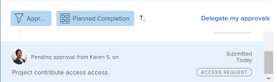

# Aanvaarders herinneren aan ingediende goedkeuringen

U kunt fiatteurs herinneren aan goedkeuringen die in behandeling zijn voor de volgende objecten: 

* Toegangsverzoeken
* Documenten

## Toegangsvereisten

U moet de volgende toegang hebben om de stappen in dit artikel uit te voeren:

<table style="table-layout:auto"> 
 <col> 
 <col> 
 <tbody> 
  <tr> 
   <td role="rowheader">Adobe Workfront-abonnement*</td> 
   <td> 
Alle
 </td> 
  </tr> 
  <tr> 
   <td role="rowheader">Adobe Workfront-licentie*</td> 
   <td> 
Aanvraag of hoger
 </td> 
  </tr> 
  <tr> 
   <td role="rowheader">Configuraties op toegangsniveau*</td> 
   <td> 
De mening of hogere toegang tot Projecten, Taken, Kwesties, Malplaatjes, Portfolio's, Programma's, Rapporten, Dashboards, en Kalenders, Documenten
 
Opmerking: als u nog steeds geen toegang hebt, vraag dan aan de Workfront-beheerder of deze aanvullende beperkingen op uw toegangsniveau heeft ingesteld. Voor informatie over hoe een beheerder van Workfront uw toegangsniveau kan wijzigen, zie <a href="../../administration-and-setup/add-users/configure-and-grant-access/create-modify-access-levels.md" class="MCXref xref">Aangepaste toegangsniveaus maken of wijzigen</a>.
 </td> 
  </tr> 
  <tr> 
   <td role="rowheader">Objectmachtigingen</td> 
   <td> 
Toegang tot of toegang tot het object dat is gekoppeld aan de toegang tot of goedkeuring van de aanvraag 
 
Voor informatie over het aanvragen van aanvullende toegang raadpleegt u <a href="../../workfront-basics/grant-and-request-access-to-objects/request-access.md" class="MCXref xref">Toegang tot objecten aanvragen </a>.
 </td> 
  </tr> 
 </tbody> 
</table>

&#42;Neem contact op met uw Workfront-beheerder om te weten te komen welk plan, licentietype of toegang u hebt.

## Toegangsverzoeken

U kunt aanvullende toegang aanvragen voor de volgende objecten:

* Projecten
* Taken
* Problemen
* Portfolio&#39;s
* Programma&#39;s
* Sjablonen
* Rapporten
* Dashboards
* Kalenders
* Documenten

Een andere gebruiker eraan herinneren uw toegangsverzoek voor een object goed te keuren:

1. Klik op de knop **Home** pictogram  linksboven in Adobe Workfront.

   >[!NOTE]
   >
   >Uw Workfront-beheerder kan de volgende wijzigingen aanbrengen in het pictogram Home in uw omgeving:
   >
   >* Vervang deze door een afbeelding die is aangepast om uw organisatie te illustreren. In dit geval ziet het pictogram er anders uit dan in dit artikel.
   >* De gekoppelde pagina vervangen door een andere pagina. Klik in dit geval op de knop **Hoofdmenu**  in de rechterbovenhoek van de pagina klikt u op **Home**.

1. In de **Werklijst** gebied, Ga naar de **Goedkeuringen die ik heb ingediend** groeperen.

1. Selecteer een **Verzoek om toegang** goedkeuring in de werklijst.

   Dit opent het Verzoek van de Toegang tot het recht van de Lijst van het Werk.

   

1. Klikken **Herinneren** in de rechterbovenhoek van het rechterdeelvenster om een melding naar de fiatteur te verzenden.

## Documenten

1. Klik op de knop **Home** pictogram  linksboven in Adobe Workfront.

   >[!NOTE]
   >
   >Uw Workfront-beheerder kan de volgende wijzigingen aanbrengen in het pictogram Home in uw omgeving:
   >
   >* Vervang deze door een afbeelding die is aangepast om uw organisatie te illustreren. In dit geval ziet het pictogram er anders uit dan in dit artikel.
   >* De gekoppelde pagina vervangen door een andere pagina. Klik in dit geval op de knop **Hoofdmenu**  in de rechterbovenhoek van de pagina klikt u op **Home**.

1. In de **Werklijst** gebied, Ga naar de **Goedkeuringen die ik heb ingediend** groeperen.

1. Klik op een **Document** goedkeuring in de werklijst.

   Hiermee wordt de documentgoedkeuring rechts van de werklijst geopend.\
   

1. Klikken **Goedkeuringen beheren** in de rechterbovenhoek van het deelvenster rechts.
1. Klik op de knop **Herinneren** pictogram om een bericht naar de fiatteur te verzenden.\
   
