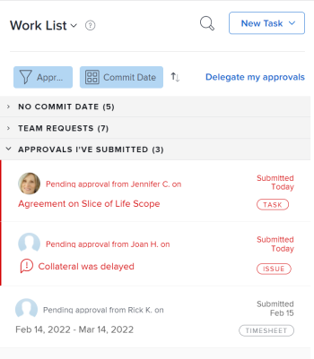

# Goedkeuringen weergeven

De processen van de goedkeuring verstrekken de flexibiliteit om multistep goedkeuringen voor projecten, taken, en kwesties tot stand te brengen. Adobe Workfront-beheerders definiëren goedkeuringsprocessen voor consistentie in het hele systeem.

Voor informatie over het maken van goedkeuringsprocessen raadpleegt u [Een goedkeuringsproces voor werkitems maken](../../administration-and-setup/customize-workfront/configure-approval-milestone-processes/create-approval-processes.md).

Voor informatie over het koppelen van goedkeuringen aan het werk in Workfront raadpleegt u [Een nieuw of bestaand goedkeuringsproces koppelen aan werk](../../review-and-approve-work/manage-approvals/associate-approval-with-work.md).

## Toegangsvereisten

U moet de volgende toegang hebben om de stappen in dit artikel uit te voeren:

<table style="table-layout:auto"> 
 <col> 
 <col> 
 <tbody> 
  <tr> 
   <td role="rowheader">Adobe Workfront-abonnement*</td> 
   <td> 
Alle
 </td> 
  </tr> 
  <tr> 
   <td role="rowheader">Adobe Workfront-licentie*</td> 
   <td> 
Controleren of hoger
 </td> 
  </tr> 
  <tr> 
   <td role="rowheader">Configuraties op toegangsniveau*</td> 
   <td> 
Toegang tot de objecten die aan goedkeuringen zijn gekoppeld weergeven of vergroten
 
Opmerking: als u nog steeds geen toegang hebt, vraag dan aan de Workfront-beheerder of deze aanvullende beperkingen op uw toegangsniveau heeft ingesteld. Voor informatie over hoe een beheerder van Workfront uw toegangsniveau kan wijzigen, zie <a href="../../administration-and-setup/add-users/configure-and-grant-access/create-modify-access-levels.md" class="MCXref xref">Aangepaste toegangsniveaus maken of wijzigen</a>.
 </td> 
  </tr> 
  <tr> 
   <td role="rowheader">Objectmachtigingen</td> 
   <td> 
Machtigingen weergeven of hoger voor objecten die zijn gekoppeld aan goedkeuringen
 
Voor informatie over het aanvragen van aanvullende toegang raadpleegt u <a href="../../workfront-basics/grant-and-request-access-to-objects/request-access.md" class="MCXref xref">Toegang tot objecten aanvragen </a>.
 </td> 
  </tr> 
 </tbody> 
</table>

&#42;Neem contact op met uw Workfront-beheerder om te weten te komen welk plan, licentietype of toegang u hebt.

## Goedkeuringen zoeken in Adobe Workfront

U kunt goedkeuringen vanuit verschillende delen van Workfront weergeven of beheren. Voor informatie over hoe te om goedkeuringen op diverse gebieden te beheren, zie [Goedkeuring van de werkzaamheden](../../review-and-approve-work/manage-approvals/approving-work.md).

U kunt goedkeuringen van de volgende gebieden bekijken of beheren:

* In het thuisgebied

   * Alle projecten, taken, kwesties, timesheets, documenten, en toegang die op uw goedkeuring wachten worden getoond in het gebied van het Huis wanneer u selecteert om allen of Goedkeuringen te bekijken.
   * Goedkeuringen die u ook hebt voorgelegd tonen in het gebied van het Huis, in de Goedkeuringen I sectie van de Lijst van het Werk heb voorgelegd. Zie de klasse [Uw werk voor goedkeuring in het gebied Home controleren](#review-work-you-submit-for-approval-in-the-home-area) in dit artikel.
   * De goedkeuringen worden verwijderd uit het gebied van het Huis wanneer het bijbehorende project, de taak, of de kwestie wordt duidelijk Afgelost, op Greep, Gesloten, of Geannuleerd.

  Voor informatie over het gebruik van Home raadpleegt u [Aan de slag met Home](../../workfront-basics/using-home/using-the-home-area/get-started-with-home.md).

* In de koptekst van een project, taak, uitgave, document of proef
* In de sectie van Goedkeuringen van een project, taak, of kwestie
* In een rapport

  >[!NOTE]
  >
  >U kunt geen besluit nemen over een goedkeuring uit een rapport.

  U kunt een project, een taak, een kwestie, of een rapport van de documentgoedkeuring tot stand brengen dat goedkeuringsinformatie bevat.

  Voor informatie over het maken van rapporten raadpleegt u [Een aangepast rapport maken](../../reports-and-dashboards/reports/creating-and-managing-reports/create-custom-report.md).

## Uw werk voor goedkeuring in het gebied Home controleren {#review-work-you-submit-for-approval-in-the-home-area}

1. Klik op de knop **Home** pictogram  linksboven in Adobe Workfront.

   >[!NOTE]
   >
   >Uw Workfront-beheerder kan de volgende wijzigingen aanbrengen in het pictogram Home in uw omgeving:
   >
   >* Vervang deze door een afbeelding die is aangepast om uw organisatie te illustreren. In dit geval ziet het pictogram er anders uit dan in dit artikel.
   >* De gekoppelde pagina vervangen door een andere pagina. Klik in dit geval op de knop **Hoofdmenu**  in de rechterbovenhoek van de pagina klikt u op **Home**.

1. Selecteren **Werklijst** en klik vervolgens op de knop **Filter** vervolgkeuzelijst en selecteert u **Goedkeuringen**.
1. Breid uit **Goedkeuringen die ik heb ingediend** en zoek naar de goedkeuringen die u hebt verzonden.

   

## De goedkeuringsstatus van een object weergeven

U kunt de goedkeuringsstatus van een object weergeven in de volgende secties van het object:

<table style="table-layout:auto"> 
 <col> 
 <col> 
 <tbody> 
  <tr> 
   <td role="rowheader">Updates </td> 
   <td> 
Hiermee geeft u alle goedkeuringsstatussen weer wanneer deze zich voordoen. De status van goedkeuring wordt weergegeven in overeenstemming met andere statussen die worden weergegeven op het tabblad <strong>Updates</strong> sectie.
 </td> 
  </tr> 
  <tr> 
   <td role="rowheader">Goedkeuringen</td> 
   <td> 
Geeft meer gedetailleerde informatie weer over het goedkeuringsproces, zoals elke fase van het goedkeuringsproces en of fiatteurs de goedkeuring hebben verleend.
 </td> 
  </tr> 
 </tbody> 
</table>

* [In het gedeelte Updates kunt u de goedkeuringsstatus weergeven](#use-the-updates-area-to-view-an-approval-status)
* [Geef een goedkeuringsstatus weer in het gebied Goedkeuringen](#use-the-approvals-area-to-view-an-approval-status)

### In het gedeelte Updates kunt u de goedkeuringsstatus weergeven {#use-the-updates-area-to-view-an-approval-status}

Wanneer een goedkeuring voor een project, een taak, of een kwestie in werking wordt gesteld, toont een status in **Updates** tabblad van het object, dat de goedkeuringsstatus aangeeft. Een nieuwe status wordt altijd weergegeven wanneer het object het goedkeuringsproces doorloopt. Dit zijn onder andere de volgende gebeurtenissen:

* Voor een object wordt een goedkeuringsproces gestart. Het goedkeuringsproces wordt in gang gezet wanneer de status wordt veranderd.
* Het object wordt geweigerd
* Het object is goedgekeurd 

>[!TIP]
>
>Als een goedkeuring op een taak wordt toegepast, worden de goedkeuringsupdates getoond op het lusje van Updates van de taak, niet op het lusje van Updates van het project waar de taak verblijft.

### Geef een goedkeuringsstatus weer in het gebied Goedkeuringen {#use-the-approvals-area-to-view-an-approval-status}

U kunt zien waar een taak of kwestie waaraan u momenteel werkt in het goedkeuringsproces is. U kunt de volgende informatie zien:

* De fase van het goedkeuringsproces
* Welke fiatteurs hebben het reeds goedgekeurd
* Welke fiatteurs hebben het nog niet goedgekeurd

U kunt als volgt de huidige status bekijken van de plaats waar een taak of kwestie zich in het goedkeuringsproces bevindt:

1. Ga naar het project, de taak, of de kwestie waaraan de goedkeuring wordt geassocieerd.
1. Klik in het linkerdeelvenster op **Goedkeuringen**. Mogelijk moet u eerst op **Meer weergeven**.

   Op het tabblad Goedkeuringen wordt de volledige informatie over alle eerdere goedkeuringspaden en -fasen weergegeven. U kunt precies zien wie een besluit over de goedkeuring heeft genomen of of de goedkeuring voor een team, baanrol, of gebruiker wordt geplaatst.

   

   Voor informatie over het maken van een goedkeuringsproces raadpleegt u [Een goedkeuringsproces voor werkitems maken](../../administration-and-setup/customize-workfront/configure-approval-milestone-processes/create-approval-processes.md).
