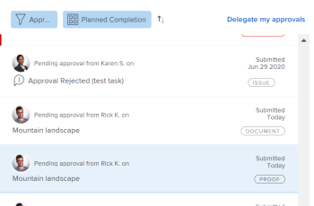

# Verstuurde proefdrukgoedkeuringen bekijken

Goedkeuringen voor proefdrukken worden alleen weergegeven in het gebied Home als uw Adobe Workfront-omgeving is geïntegreerd met een Workfront Proof Premium-account. Neem contact op met de Workfront-beheerder als u geen gebruik kunt maken van de hier beschreven proefdrukken.

## Toegangsvereisten

U moet de volgende toegang hebben om de stappen in dit artikel uit te voeren:

<table style="table-layout:auto"> 
 <col> 
 <col> 
 <tbody> 
  <tr> 
   <td role="rowheader">Adobe Workfront-abonnement*</td> 
   <td> 
Alle
 </td> 
  </tr> 
  <tr> 
   <td role="rowheader">Adobe Workfront-licentie*</td> 
   <td> 
Controleren of hoger
 </td> 
  </tr> 
  <tr> 
   <td role="rowheader">Configuraties op toegangsniveau*</td> 
   <td> 
De mening of hogere toegang tot Projecten, Taken, Kwesties, Malplaatjes, Portfolio, Programma's, Rapporten, Dashboards, en Kalenders, Documenten
 
Opmerking: Als u nog steeds geen toegang hebt, vraagt u de Workfront-beheerder of deze aanvullende beperkingen op uw toegangsniveau instelt. Voor informatie over hoe een beheerder van Workfront uw toegangsniveau kan wijzigen, zie <a href="../../administration-and-setup/add-users/configure-and-grant-access/create-modify-access-levels.md" class="MCXref xref">Aangepaste toegangsniveaus maken of wijzigen</a>.
 </td> 
  </tr> 
  <tr> 
   <td role="rowheader">Objectmachtigingen</td> 
   <td> 
Toegang tot of toegang tot het object dat is gekoppeld aan de toegang tot of goedkeuring van de aanvraag 
 
Voor informatie over het aanvragen van aanvullende toegang raadpleegt u <a href="../../workfront-basics/grant-and-request-access-to-objects/request-access.md" class="MCXref xref">Toegang tot objecten aanvragen </a>.
 </td> 
  </tr> 
 </tbody> 
</table>

&#42;Neem contact op met uw Workfront-beheerder om te weten te komen welk plan, licentietype of toegang u hebt.

## Verstuurde proefdrukgoedkeuringen bekijken

1. Klik op de knop **Home** pictogram  in de linkerbovenhoek van Adobe Workfront.

   >[!NOTE]
   >
   >Uw Workfront-beheerder kan de volgende wijzigingen aanbrengen in het pictogram Home in uw omgeving:
   >
   >* Vervang deze door een afbeelding die is aangepast om uw organisatie te illustreren. In dit geval ziet het pictogram er anders uit dan in dit artikel.
   >* De gekoppelde pagina vervangen door een andere pagina. Klik in dit geval op de knop **Hoofdmenu**  in de rechterbovenhoek van de pagina klikt u op **Home**.

1. In de **Werklijst** gebied, Ga naar de **Goedkeuringen die ik heb ingediend** groeperen.

1. Klik op een **Proef** goedkeuring in de werklijst.

   Hiermee wordt de proefdrukgoedkeuring rechts van de lijst Werkwijzen geopend.

   >[!NOTE]
   >
   > Als u een goedkeuring aan een gast het proef gebruiker voorlegt, verschijnt de goedkeuring niet in Huis.

   

1. (Optioneel) Klik op **Ga naar proefafdruk** in de rechterbovenhoek van het rechterdeelvenster om de proefdrukviewer te starten.

   <!--
   <note type="note">
   You must have View or Edit access to Documents in your Access Level to launch the proofing viewer.
   </note>
   -->
