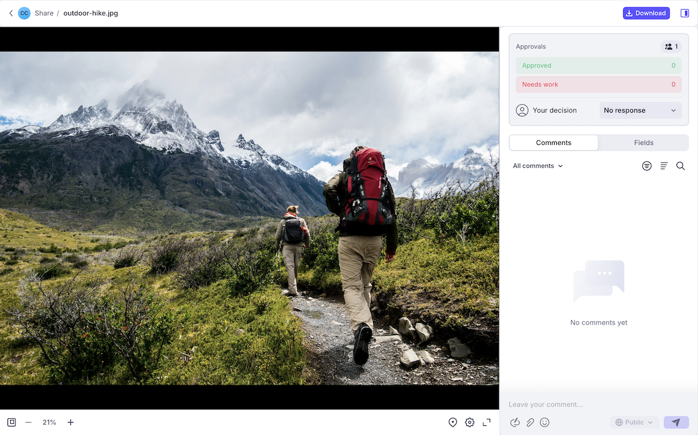

# Begin met de integratie Frame.io

Dankzij de integratie met Workfront en Frame.io blijven creatieve personen, marketers en belanghebbenden op één lijn met een naadloze workflow. Toegang tot realtime updates, vermijd dubbel werk en zorg ervoor dat middelen worden goedgekeurd voordat u de toepassing start.

Voor meer informatie over Frame.io, zie [&#x200B; Begonnen het Worden met Frame.io &#x200B;](https://support.frame.io/en/collections/49298-getting-started).

De integratie van Workfront en Frame.io moet zijn ingesteld in uw Workfront-instantie. Voor meer informatie, zie [&#x200B; Frame.io integratieoverzicht &#x200B;](/help/quicksilver/review-and-approve-work/native-integrations/frame-io/frame-int-overview.md#integration-requirements).

## Integratievereisten

* Workfront en Frame.io moeten worden geïmplementeerd in dezelfde Identity Management System (IMS)-organisatie.

* Gebruikers kunnen binnen de IMS-organisatie slechts tot één Workfront-instantie behoren.

* De Workfront-instantie moet zijn ingeschakeld op de Adobe Unified Experience en Adobe Enterprise storage.

* De integratie moet door Adobe Professional Services worden gevormd.

## Starten en plannen van werkzaamheden in Workfront

Projectcoördinatoren kunnen projecten maken en werken plannen in Workfront. Projecten die zijn gemaakt in een instantie waarvoor de integratie Frame.io is ingeschakeld, maken gebruik van Adobe Enterprise Storage, waardoor assets kunnen worden opgeslagen en beheerd binnen het Adobe-ecosysteem.

Als uw organisatie een vergunning van de Onderneming Frame.io heeft, zijn de projecten die in Workfront worden gecreeerd ook zichtbaar in Frame.io, toestaand gebruikers om activa in één van beide product in wisselwerking te staan en te uploaden.

Voor informatie over Adobe Enterprise Storage of -projecten in Frame.io raadpleegt u

* [&#x200B; Workspace Overzicht: Projecten &#x200B;](https://help.frame.io/en/articles/9101001-workspace-overview#h_d9f8654895)
* [Overzicht van Adobe Enterprise Storage](/help/quicksilver/review-and-approve-work/esm-overview.md)

## Elementen controleren en goedkeuren

Zodra een activa wordt gebeëindigd, kan de projectcoördinator het formele evaluatie- en goedkeuringsproces in Workfront in gang zetten.

Nadat de goedkeuringswerkstroom is gemaakt, kunnen revisoren en fiatteurs de viewer Frame.io gebruiken om opmerkingen toe te voegen en het element te markeren. Zij kunnen de goedkeuringsbeslissing in de kijker Frame.io ook nemen.

Voor meer informatie over vestiging projecten, zie

* [Een project maken](/help/quicksilver/manage-work/projects/create-projects/create-project.md)
* [Overzicht van de integratie van Frame.io](/help/quicksilver/review-and-approve-work/native-integrations/frame-io/frame-int-overview.md)

### In Workfront formele beoordelingen en goedkeuringen starten

Projectcoördinatoren kunnen eenmalige beoordelingen en goedkeuringen of herbruikbare goedkeuringssjablonen maken. Ze kunnen revisoren, fiatteurs of een combinatie van beide toewijzen:

* **de Controleurs** kunnen commentaren toevoegen en activa opsommen. Als ze klaar zijn, kunnen ze de revisie als voltooid markeren. Het is niet nodig de revisie als voltooid te markeren om het actief in het goedkeuringsproces verder te laten gaan.
* **Approvers** kunnen commentaren toevoegen en activa opsommen. Zij moeten een besluit nemen om het goedkeuringsproces vooruit te helpen.

#### Een revisie- en goedkeuringswerkstroom maken

Revisoren en fiatteurs kunnen worden toegevoegd aan een goedkeuringswerkstroom voor eenmalig gebruik of aan een herbruikbare goedkeuringssjabloon:

* **goedkeuringen voor eenmalig gebruik**: In het project of de taak waar het middel verblijft, kan de projectcoördinator revisoren en fiatteurs toewijzen en een voltooiingsdeadline plaatsen. Revisoren en fiatteurs worden 72 uur voor de deadline, 24 uur voor de deadline en vervolgens op de deadline zelf per e-mail herinnerd.

  Voor meer informatie, zie [&#x200B; een documentoverzicht of goedkeuringsverzoek &#x200B;](/help/quicksilver/review-and-approve-work/document-reviews-and-approvals/manage-document-approvals/create-a-document-approval.md) creëren.

* **malplaatjes van de Goedkeuring**: In het gebied van de Opstelling van Workfront, kunnen de projectcoördinatoren tot duurzame Malplaatjes van de Goedkeuring leiden. In een sjabloon kunnen gebruikers revisoren en fiatteurs toevoegen en een voltooiingstijd opgeven. Wanneer de goedkeuringssjabloon op een actief wordt toegepast, wordt de deadline berekend vanaf het opgegeven tijdkader.

  Nadat een sjabloon is gemaakt, kan deze worden toegepast op een middel om het formele beoordelings- en goedkeuringsproces in Workfront te starten.

  Voor meer informatie, zie [&#x200B; een Malplaatje van de Goedkeuring &#x200B;](/help/quicksilver/review-and-approve-work/document-reviews-and-approvals/manage-document-approvals/create-approval-template.md) creëren.

   toe

### Middelen in de viewer Frame.io controleren en goedkeuren

Nadat de revisie- en goedkeuringsworkflow in Workfront is gestart, hebben revisoren en fiatteurs toegang tot de viewer Frame.io om opmerkingen toe te voegen, het element te markeren en een beslissing te nemen.

Voor meer informatie, zie [&#x200B; Overzicht en keur met de kijker Frame.io &#x200B;](/help/quicksilver/review-and-approve-work/document-reviews-and-approvals/review-with-frame.md) goed.

#### De viewer Frame.io openen

Gebruikers kunnen op de volgende manieren toegang krijgen tot de viewer Frame.io:

* Workfront-e-mailberichten
* De widget Mijn goedkeuring in het gebied Workfront Home

>[!NOTE]
>
>Externe Workfront-gebruikers worden via e-mail op de hoogte gesteld en worden gevraagd om een Frame.io-aanmelding te maken voor het controleren en goedkeuren van middelen.

#### Opmerkingen toevoegen en elementen markeren

Opmerkingen en elementmarkeringen zijn zichtbaar in de viewer Frame.io. Voor meer informatie bij het gebruiken van de kijker Frame.io, zie [&#x200B; Commentaar op uw media &#x200B;](https://help.frame.io/en/articles/9105251-commenting-on-your-media).

#### Beslissingen nemen

Wanneer alle toetsingsactiviteiten zijn voltooid, moeten fiatteurs een van de volgende beslissingen nemen:

* **keur** goed: De activa hebben geen veranderingen nodig en is klaar voor gebruik.
* **het werk van behoeften**: De activa vereist veranderingen en is niet klaar voor gebruik. Nadat de opgegeven wijzigingen zijn aangebracht, moet het element worden geüpload als een nieuwe versie en moet een nieuwe goedkeuringsronde worden doorlopen. <!--is the same approval workflow automatically applied? Does the coordinator have to do anything to get the approval going? -->

Revisoren kunnen hun volledige revisie markeren in Workfront, maar dit is niet vereist om het middel verder te laten gaan in het goedkeuringsproces.

Voor meer informatie over besluiten in Workfront, zie [&#x200B; overzicht van de beslissingsstatus van het Document &#x200B;](/help/quicksilver/review-and-approve-work/document-reviews-and-approvals/manage-document-approvals/document-approval-status.md).

### Metrische gegevens voor beoordeling en goedkeuring bijhouden

Projectcoördinatoren kunnen toezicht houden op de voortgang van alle goedkeuringen tijdens de vlucht in het Workfront Home-gebied of met aangepaste rapporten in Canvas Dashboards:

* **Eigen dashboard van de Douane**: Creeer een rapportdashboard in het gebied van de Dashboards van het Canvas om zowel hoog-vlakke als gedetailleerde informatie over overzichten en goedkeuringen met Verenigde functionaliteit van Goedkeuringen te tonen. Voor informatie over hoe te begonnen worden, zie [&#x200B; een rapportdashboard voor overzicht en goedkeuringen &#x200B;](/help/quicksilver/review-and-approve-work/document-reviews-and-approvals/create-review-and-approval-dashboard.md) creëren.
* **Van de goedkeuringsmetriek van het Document widget van het Huis**: Toont 2 grafieken met informatie over gemiddelde goedkeuringstijd en besluiten evenals lijstmeningen van hangende en achterstallige goedkeuringen.
  