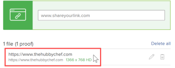

# Een interactieve proefdruk maken voor een website of andere webinhoud

U kunt een nieuwe interactieve proefdruk of een nieuwe versie van een bestaande interactieve proefdruk voor webinhoud produceren. Dit kan een website of andere soorten interactieve inhoud zijn, zoals advertenties met streaming video of audio, HTML-animaties en interactieve banners.

In een interactieve proefdruk kunnen revisoren navigeren en communiceren zoals ze gewoonlijk doen met de website of andere webinhoud.

>[!IMPORTANT]
>
>Zorg ervoor dat de website of de interactieve inhoud toegankelijk is voor de personen die de website of inhoud gaan beoordelen. Ze kunnen het alleen in het proefdrukproces gebruiken als ze het ook via internet kunnen bekijken.

## Toegangsvereisten

+++ Breid uit om de toegangseisen voor de functionaliteit in dit artikel weer te geven.

U moet de volgende toegang hebben om de stappen in dit artikel uit te voeren:

<table style="table-layout:auto"> 
 <col> 
 <col> 
 <tbody> 
  <tr> 
   <td role="rowheader">Adobe Workfront-abonnement*</td> 
   <td> 
Huidig abonnement: Pro of hoger
 
of
 
Verouderd plan: Premium
 
Voor meer informatie over het proefdrukken van toegang met de verschillende plannen, zie <a href="/help/quicksilver/administration-and-setup/manage-workfront/configure-proofing/access-to-proofing-functionality.md" class="MCXref xref"> Toegang tot het proefdrukken van functionaliteit in Workfront </a>.
 </td> 
  </tr> 
  <tr> 
   <td role="rowheader">Adobe Workfront-licentie*</td> 
   <td> 
Huidig plan: Werk of Plan
 
Ouder plan: Willekeurig (proefdrukken moet zijn ingeschakeld voor de gebruiker)
 </td> 
  </tr> 
  <tr> 
   <td role="rowheader">Bewijs van machtigingsprofiel </td> 
   <td>Manager of hoger</td> 
  </tr> 
  <tr> 
   <td role="rowheader">Configuraties op toegangsniveau*</td> 
   <td> 
Toegang tot documenten bewerken
 
Opmerking: als u nog steeds geen toegang hebt, vraag dan aan de Workfront-beheerder of deze aanvullende beperkingen op uw toegangsniveau heeft ingesteld. Voor informatie over hoe een beheerder van Workfront uw toegangsniveau kan wijzigen, zie <a href="../../../administration-and-setup/add-users/configure-and-grant-access/create-modify-access-levels.md" class="MCXref xref"> tot douanetoegangsniveaus </a> leiden of wijzigen.
 </td> 
  </tr> 
 </tbody> 
</table>

&#42; om te weten te komen welk plan, rol, of Profiel van de Toestemming van het Bewijs u hebt, contacteer uw beheerder van Workfront of van Workfront Proof.

+++

## Een interactieve proefdruk maken voor een website of andere webinhoud

1. Ga naar het project, de taak of de uitgave waar u een nieuwe websiteproef of een nieuwe versie van bestaande wilt tot stand brengen.
1. Klik **Documenten** in het linkerpaneel.
1. (Voorwaardelijk) als u een nieuwe proef creeert, klik **voeg Nieuw** toe, dan klik **Bewijs** in het menu dat verschijnt.

1. (Voorwaardelijk) op de **Nieuwe proef** pagina verschijnt, als u een nieuwe versie van een bestaand bewijs creeert:

   1. Houd de muisaanwijzer boven de URL-proefdruk waarvoor u een nieuwe versie wilt maken en selecteer deze door op de lichtblauwe achtergrond eromheen te klikken.

      

   1. In **voeg nieuwe** drop-down toe, klik **Versie** > **Bewijs**.

1. In **voeg dossiers** sectie toe, typ URL van de website u wilt bewijzen, dan druk **binnengaan**.  U kunt dit proces herhalen om meerdere websites toe te voegen die u wilt controleren.

   

   >[!NOTE]
   >
   > De URL moet minder dan 1.000 tekens bevatten.

1. Klik op de URL die u hebt toegevoegd.

   

1. (Facultatief) als u de naam van de proef van website URL in iets anders wilt veranderen, typ a **naam van het Bewijs**.
1. Selecteer **Interactief**, dan klik **Gedaan**.

   >[!NOTE]
   >
   >Als u een nieuwe versie toevoegt aan een bestaande URL-proefdruk, blijven de opties die op de oorspronkelijke proefdruk of vorige versie zijn geconfigureerd, behouden in deze versie.

1. Klik **creeer proef** om een eenvoudige proef zonder overzichtsproces tot stand te brengen.\
   of\
   Doorgaan met het configureren van een geavanceerde proefdruk:

   * [Een geavanceerde proefdruk maken met een standaardworkflow](../../../review-and-approve-work/proofing/creating-proofs-within-workfront/configure-basic-proof-workflow.md)
   * [Een geavanceerde proefdruk maken met een geautomatiseerde workflow](../../../review-and-approve-work/proofing/creating-proofs-within-workfront/create-automated-proof-workflow.md)
