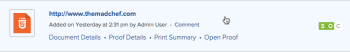

# Een statische proefdruk maken voor een website of andere webinhoud

U kunt een nieuwe statische proefdruk of een nieuwe versie van een bestaande statische proefdruk voor webinhoud produceren. De inhoud van het Web kan dingen zoals advertenties met het stromen video, de animatie van HTML, of interactieve banners omvatten, maar het zal in veelvoudige screenshots worden geknipt om statisch te laten proeven.

Houd rekening met het volgende wanneer u statische proefdrukken maakt voor een website of andere webinhoud:

## Toegangsvereisten

+++ Breid uit om de toegangseisen voor de functionaliteit in dit artikel weer te geven.

<table style="table-layout:auto"> 
 <col> 
 <col> 
 <tbody> 
  <tr> 
   <td role="rowheader">Adobe Workfront-pakket</td> 
   <td> 
Alle
 </td> 
  </tr> 
  <tr> 
   <td role="rowheader">Adobe Workfront-licentie*</td> 
   <td> 
   
Standard

   
Werken of plannen
 </td> 
  </tr> 
  <tr> 
   <td role="rowheader">Bewijs van machtigingsprofiel </td> 
   <td>Manager of hoger</td> 
  </tr> 
  <tr> 
   <td role="rowheader">Configuraties op toegangsniveau</td> 
   <td> 
Toegang tot documenten bewerken
 </td> 
  </tr> 
 </tbody> 
</table>

Voor informatie, zie [ vereisten van de Toegang in de documentatie van Workfront ](/help/quicksilver/administration-and-setup/add-users/access-levels-and-object-permissions/access-level-requirements-in-documentation.md).

+++

## Een statische proefdruk maken voor een website of andere webinhoud

Als u een statisch bewijs wilt maken, moet de website openbaar toegankelijk zijn (niet achter een firewall) of moet de lijst van gewenste personen van uw organisatie het Workfront-domein bevatten. Workfront kan een met een wachtwoord beveiligde website niet vastleggen als een statisch bewijs.

>[!TIP]
>
>We raden interactieve proefdrukken aan in plaats van statische proefdrukken voor interne pagina&#39;s waarvoor verificatie en met een wachtwoord beveiligde pagina&#39;s vereist zijn. Voor meer informatie, zie [ Interactieve inhoudsproeven overzicht ](../../../review-and-approve-work/proofing/proofing-overview/interactive-content-proofs.md).

1. Ga naar het project, de taak of de uitgave waar u een nieuwe websiteproef of een nieuwe versie van bestaande wilt tot stand brengen.
1. Klik **Documenten** in het linkerpaneel.
1. (Voorwaardelijk) als u een nieuwe proef creeert, klik **voeg Nieuw** toe, dan klik **Bewijs** in het menu dat verschijnt.
1. (Voorwaardelijk) Als u een nieuwe versie van een bestaand bewijs creeert:

   1. Plaats de muisaanwijzer boven de URL-proefdruk waarvoor u een nieuwe versie wilt maken en selecteer deze door op de lichtblauwe achtergrond eromheen te klikken.

      

   1. Klik **toevoegen nieuw** > **Versie** > **Bewijs**.

1. Typ URL van de website u in **wilt aantonen voeg Dossiers** gebied toe, dan druk **binnengaan**.

   >[!NOTE]
   >
   > De URL moet uit minder dan 2000 tekens bestaan.

1. Klik op de URL die u hebt toegevoegd.

   Er worden opties weergegeven voor het configureren van de proefdruk van de website.

   

1. (Facultatief) als u de naam van de proef van website URL in iets anders wilt veranderen, typ a **naam van het Bewijs.**
1. Zorg ervoor **het schermschot van de Vangst** wordt geselecteerd en gebruik om het even welke volgende opties:

   <table style="table-layout:auto"> 
    <col> 
    <col> 
    <tbody> 
     <tr> 
      <td role="rowheader"><strong> resolutie van het Schermafbeelding </strong> </td> 
      <td> 
Pas de resolutie van de inhoud aan wanneer revisoren de proefdruk bekijken, zodat ze kunnen zien hoe deze wordt weergegeven op apparaten van verschillende formaten, zoals telefoons, tablets en monitoren.
 
Als u meerdere resoluties selecteert, wordt voor elke resolutie die u selecteert een afzonderlijke proefdruk gemaakt.
 
Opmerking: wanneer een revisor opmerkingen maakt over de proefdruk, bevat de opmerking de resolutie die aangeeft wanneer de opmerking is gemaakt, zodat andere revisoren weten welke resolutie aan de opmerking is gekoppeld. 
 </td> 
     </tr> 
     <tr> 
      <td role="rowheader"><strong> zoek subpages </strong> </td> 
      <td> 
Leg de subpagina's van de website en de hoofdpagina's vast. U kunt op Alles selecteren klikken om alle pagina's op te nemen of u kunt alleen op bepaalde pagina's klikken die u wilt opnemen. Met de plus- en minknoppen kunt u de subpaginagebieden van de website uitvouwen en sluiten.
 </td> 
     </tr> 
    </tbody> 
   </table>

   >[!IMPORTANT]
   >
   >U kunt de instelling voor schermopname vastleggen niet wijzigen voor volgende versies van de proefdruk die u maakt.

1. Klik **Gedaan**.

   Als u in stap 8 meerdere schermresoluties hebt geselecteerd, bevat de lijst een reeks schermafbeeldingen voor elke resolutie. U kunt deze schermafbeeldingen genereren als afzonderlijke proefdrukken of deze combineren tot één proefdruk (zie  in .). We raden u aan deze te combineren, vooral als u een statische proefdruk maakt voor websites.

   >[!NOTE]
   >
   >Als u een nieuwe versie toevoegt aan een bestaande URL-proefdruk, blijven de opties die op de oorspronkelijke proefdruk of vorige versie zijn geconfigureerd, behouden in deze versie.

1. Klik **creeer proef** om een eenvoudige proef zonder overzichtsproces tot stand te brengen.\
   of\
   Doorgaan met het configureren van een geavanceerde proefdruk:

   * [Een geavanceerde proefdruk maken met een standaardworkflow](../../../review-and-approve-work/proofing/creating-proofs-within-workfront/configure-basic-proof-workflow.md)
   * [Een geavanceerde proefdruk maken met een geautomatiseerde workflow](../../../review-and-approve-work/proofing/creating-proofs-within-workfront/create-automated-proof-workflow.md)
