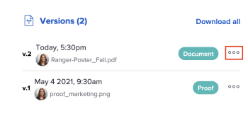

# Proefversies weergeven

U kunt eerdere versies van een proefdruk weergeven.

## Toegangsvereisten

+++ Breid uit om de toegangseisen voor de functionaliteit in dit artikel weer te geven.

U moet de volgende toegang hebben om de stappen in dit artikel uit te voeren:

<table style="table-layout:auto"> 
 <col> 
 <col> 
 <tbody> 
  <tr> 
   <td role="rowheader">Adobe Workfront-abonnement*</td> 
   <td> 
Huidig abonnement: Pro of hoger
 
of
 
Verouderd abonnement: Selecteren of Premium
 
Voor meer informatie over het proefdrukken van toegang met de verschillende plannen, zie <a href="/help/quicksilver/administration-and-setup/manage-workfront/configure-proofing/access-to-proofing-functionality.md" class="MCXref xref"> Toegang tot het proefdrukken van functionaliteit in Workfront </a>.
 </td> 
  </tr> 
  <tr> 
   <td role="rowheader">Adobe Workfront-licentie*</td> 
   <td> 
Huidig plan: Werk of Plan
 
Ouder plan: Willekeurig (proefdrukken moet zijn ingeschakeld voor de gebruiker)
 </td> 
  </tr> 
  <tr> 
   <td role="rowheader">Bewijs van machtigingsprofiel </td> 
   <td>Manager of hoger</td> 
  </tr> 
  <tr> 
   <td role="rowheader">Configuraties op toegangsniveau*</td> 
   <td> 
Toegang tot documenten bewerken
 
Voor informatie bij het vragen van om extra toegang, zie <a href="../../../../workfront-basics/grant-and-request-access-to-objects/request-access.md" class="MCXref xref"> de toegang van het Verzoek tot voorwerpen </a>.
 </td> 
  </tr> 
 </tbody> 
</table>

&#42; om te weten te komen welk plan, rol, of Profiel van de Toestemming van het Bewijs u hebt, contacteer uw beheerder van Workfront of van Workfront Proof.

+++

## Een lijst met alle proefversies weergeven

1. Ga naar de documentlijst en selecteer de proefdruk.
1. In Samenvatting, scrol aan de mening **Alle Versies** sectie. Hier kunt u alle versies van de proefdruk bekijken.

   

## Een voorbeeld van een vorige proefdrukversie weergeven

Bestanden waarvan geen voorvertoning kan worden weergegeven (zoals XLSX en DOC), worden gedownload.

1. Ga naar de documentlijst en selecteer een proefdruk.
1. In Samenvatting, scrol neer aan **Versies**, klik **Meer** menu, dan uitgezochte **Voorproef**.

   

## Vorige proefdrukversie weergeven

Elke gebruiker in Workfront met View-toegang tot het document kan eerdere versies van een proefdocument bekijken. Het is niet vereist dat de gebruiker een bewijs van bevoegdheid heeft.

1. Ga naar het project, de taak, of de kwestie die het document bevat, dan selecteren **Documenten**.
1. Zoek de proefdruk die u nodig hebt.
1. In Samenvatting, scrol neer aan **Versies**, klik **Meer** menu, dan selecteren **Open proef**.

   
