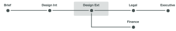

# Overzicht van geautomatiseerde werkstroomfasen

Proeffasen zijn tijdsegmenten waarin verschillende gebruikers een proefdruk controleren. Als de proefdruk van de ene fase naar de volgende gaat, geeft Adobe Workfront een melding aan de controleurs om hen te vertellen wanneer het tijd is om eraan te werken.

Fases vinden plaats in twee verschillende situaties:

* [&#x200B; creeer een proef met een Geautomatiseerd werkschema &#x200B;](#create-a-proof-with-an-automated-workflow)
* [Termijnen aan verschillende revisoren toewijzen op een proefdruk](#assign-deadlines-for-different-reviewers-on-a-proof)

## Een proefdruk maken met een geautomatiseerde workflow {#create-a-proof-with-an-automated-workflow}

Wanneer u een geautomatiseerde workflow toevoegt aan een proefdruk, stelt u de stappen in van het controlewerk dat u wilt uitvoeren.

Wanneer u fasen instelt voor een proefdruk met een automatische workflow:

* U kunt de stappen vormen om achtereenvolgens of gelijktijdig te lopen.
* U kunt bepaalde fasen zodanig configureren dat deze pas actief worden nadat een vorige fase is voltooid.
* U kunt sommige fasen privé maken. Dit is bijvoorbeeld handig voor een instantie die een proefdruk controleert voordat deze met een klant wordt gedeeld en die de resulterende opmerkingen niet zichtbaar wil maken voor de klant.

Voor instructies bij het creëren van stadia voor een proef met een geautomatiseerd werkschema, zie [&#x200B; een geavanceerde proef met een Geautomatiseerd werkschema &#x200B;](../../../review-and-approve-work/proofing/creating-proofs-within-workfront/create-automated-proof-workflow.md) creëren.

>[!NOTE]
>
>Als een gebruiker niet op om het even welke stadia inbegrepen is maar toegang tot het document heeft en de proef opent, leidt het systeem tot een stadium genoemd *Workfront*.
>
>Aan de gebruiker die de proefdruk heeft geopend, wordt de rol toegewezen die is opgegeven in Instellen > Revisie en goedkeuring > Rollen voor niet-ontvangers die een proefdruk van een document openen.

## Termijnen aan verschillende revisoren toewijzen op een proefdruk {#assign-deadlines-for-different-reviewers-on-a-proof}

Wanneer u de controleurs verschillende proeftijdslimieten toewijst op een bewijs, creëert het systeem een stadium voor elke deadline en groepeert het de controleurs voor elke deadline in het corresponderende stadium. 

**Voorbeeld:** bijvoorbeeld, als u een proef met vier recensenten creeert:

* Voor revisoren Olivia en Tony geeft u een deadline van 14:00 uur voor een paar dagen.
* Voor Aaron en Amy, specificeert u een termijn voor 17:00 een paar dagen later.
* U geeft zelf geen deadline op.

Het systeem maakt een werkgebied voor elk van deze drie &quot;groepen&quot; van controleurs:

Als u de proefdruk deelt met een andere controleur en geen deadline opgeeft, voegt Workfront de gebruiker toe aan fase 3, waar geen deadline is. 
