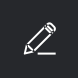

# Opmerking over een proefdruk

<!-- Audited: 5/2025 -->

Met opmerkingen kunt u feedback geven op inhoud en samenwerken met andere gebruikers in de conceptviewer.

Wanneer u gebruikers codeert in opmerkingen op een proefdruk, kunnen de gebruikers die u kunt labelen verschillen, afhankelijk van verschillende factoren, zoals de individuele gebruikersmachtigingen en uw lidmaatschap van de organisatie:

* Als u de maker of eigenaar van de proefdruk bent of specifieke machtigingen hebt ingeschakeld, kunt u gebruikers buiten de proefdrukworkflow een label geven en de proefdruk met hen delen.
* Als u als externe gebruiker aan de proefdruk bent toegevoegd en u lid bent van een andere omgeving met een andere proefdrukaccount, kunt u alleen die gebruikers van uw oorspronkelijke omgeving een tag toewijzen. <!--For more information, see [Proofing collaboration limitations with people outside of your organization](../../../../review-and-approve-work/proofing/tips-tricks-and-troubleshooting/collaboration-with-members-outside-of-your-organization.md)-->

## Toegangsvereisten

+++ Breid uit om de toegangseisen voor de functionaliteit in dit artikel weer te geven.

<table style="table-layout:auto"> 
 <col> 
 <col> 
 <tbody> 
  <tr> 
   <td role="rowheader">Adobe Workfront-pakket</td> 
   <td> 
Alle
 </td> 
  </tr> 
  <tr> 
   <td role="rowheader">Adobe Workfront-licentie</td> 
   <td>
   
Alle

   </td> 
  </tr> 
  <tr> 
   <td role="rowheader">Bewijs van machtigingsprofiel </td> 
   <td>Manager of hoger</td> 
  </tr> 
  <tr> 
   <td role="rowheader">Proefdrukrol</td> 
   <td>Revisor, Reviewer en fiatteur, Moderator, Auteur</td> 
  </tr> 
  <tr> 
   <td role="rowheader">Configuraties op toegangsniveau</td> 
   <td> 
Toegang tot documenten bewerken
</td> 
  </tr> 
 </tbody> 
</table>

Voor informatie, zie [ vereisten van de Toegang in de documentatie van Workfront ](/help/quicksilver/administration-and-setup/add-users/access-levels-and-object-permissions/access-level-requirements-in-documentation.md).

+++

## Opmerking over een proefdruk

1. Ga naar het project, de taak, of de kwestie die het document bevat, dan selecteren **Documenten**.
1. Beweeg over de proef u nodig hebt, dan klik **Open proef**.

1. Bij de bovenkant van de het proeven kijker, voegt de klik **commentaar** toe.
1. (Voorwaardelijk) als dit een videoproef is, speel de videoproef, dan klik **toevoegen commentaar** op het punt in de video waar u de commentaar gebruikend playhead wilt.

   >[!TIP]
   >
   >1. Voor meer gebruiksgemak moet u de video pauzeren en in de tijdlijn klikken waar u de opmerking wilt plaatsen.
   >1. Voor een betere nauwkeurigheid kunt u op de waarden boven de afspeelkop klikken en nieuwe waarden typen.
   >1. Als u commentaar wilt leveren op een reeks videobeelden, sleept u de afspeelkop naar links en rechts in de tijdlijn om een reeks beeldmateriaal aan te geven waarop u een opmerking wilt plaatsen.
   >1. Als u commentaar wilt leveren op een reeks videobeelden, sleept u de afspeelkop naar links en rechts in de tijdlijn om een reeks beeldmateriaal aan te geven waarop u een opmerking wilt plaatsen.

1. Als u de aandacht wilt vestigen op een specifieke locatie op de proefdruk, klikt u op het markeringsgereedschap in de werkbalk en markeert u vervolgens het gedeelte van de proefdruk waarop u een opmerking wilt plaatsen:

   <table style="table-layout:auto"> 
    <col> 
    <col> 
    <col> 
    <tbody> 
     <tr> 
      <td role="rowheader"><strong> trek een vrije lijn </strong> </td> 
      <td>  </td> 
      <td>Voeg een vrije lijn op het geselecteerde gebied toe.</td> 
     </tr> 
     <tr> 
      <td role="rowheader"><strong> trek een lijn </strong> </td> 
      <td>  </td> 
      <td>Teken een lijn in het geselecteerde gebied.</td> 
     </tr> 
     <tr> 
      <td role="rowheader"><strong> trek een pijl </strong> </td> 
      <td>  </td> 
      <td>Voeg een pijl toe aan een gebied dat u selecteert.</td> 
     </tr> 
     <tr> 
      <td role="rowheader"><strong> hoogtepunt een gebied </strong> </td> 
      <td>  </td> 
      <td>Markeer een gebied dat u selecteert.</td> 
     </tr> 
     <tr> 
      <td role="rowheader"><strong> trek een rechthoek </strong> </td> 
      <td>  </td> 
      <td>Teken een rechthoek rond een gebied.</td> 
     </tr> 
     <tr> 
      <td role="rowheader"><strong> Polyline </strong> </td> 
      <td>  </td> 
      <td> 
Teken een verbonden opeenvolging van lijnsegmenten die u open of dicht als vorm kunt verlaten. U kunt alle toegevoegde punten verplaatsen of verwijderen. 
 
Dit gereedschap is handig voor het werken met technische en architectonische afbeeldingen.
 </td> 
     </tr> 
     <tr> 
      <td role="rowheader"><strong> de markeringskleur, de dikte, of de opaciteit van de Verandering </strong> </td> 
      <td>  </td> 
      <td>Wijzig de kleur, dikte en dekking van de markeringsgereedschappen.</td> 
     </tr> 
     <tr> 
      <td role="rowheader"><strong> Tekst </strong> </td> 
      <td>  </td> 
      <td> 
Dit gereedschap wordt aan de linkerkant van de andere gereedschappen weergegeven als de proefdruk een op tekst gebaseerd document is. Het biedt opmaakgereedschappen voor het plaatsen van opmerkingen over tekst in proefdrukken.  
 
Wanneer u op dit gereedschap klikt en vervolgens tekst op de proefdruk selecteert, worden annotatieopties onder de geselecteerde tekst weergegeven. 
 </td> 
     </tr> 
    </tbody> 
   </table>

1. (Optioneel en Voorwaardelijk) In statische proefdrukken kunt u meerdere gebieden op meerdere pagina&#39;s markeren voor één opmerking. Als u bijvoorbeeld dezelfde opmerking op meerdere pagina&#39;s wilt maken, selecteert u een gebied op één pagina en gaat u naar de volgende pagina waar u dezelfde opmerking wilt maken en selecteert u daar een gebied.

   >[!NOTE]
   >
   >Dit geldt alleen voor de standaardgereedschappen voor annotatiemarkeringen, niet voor de gereedschappen voor tekstopmaak.

1. Typ uw commentaar in **voeg commentaar** doos op het recht toe.
1. (Optioneel) Als u een andere gebruiker in de opmerking wilt labelen en toevoegen aan de workflow van de proefdruk, typt u @ in het opmerkingsvak, typt u vervolgens de naam of het e-mailadres van de gebruiker en selecteert u de gebruiker in het menu dat verschijnt. Voor meer informatie, zie [ de gebruikers van de Markering om een proef ](../../../../review-and-approve-work/proofing/reviewing-proofs-within-workfront/comment-on-a-proof/tag-users-to-share-proof.md) te delen.
1. (Optioneel) Voer een van de volgende twee handelingen uit om een bestand aan een opmerking te koppelen:

   * Klik op het pictogram van de papierclip in de rechterbovenhoek van de opmerking en zoek en selecteer het bestand dat u wilt uploaden.
   * Sleep een bestand van een locatie op de computer naar het opmerkingengebied.

1. Klik **Post**.
