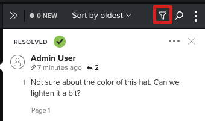

# Zoeken, filteren en sorteren, proefdrukopmerkingen

U kunt opmerkingen met een proefdruk zoeken, filteren en sorteren, zodat u eenvoudig door feedback op inhoud kunt navigeren.

## Toegangsvereisten

+++ Breid uit om de toegangseisen voor de functionaliteit in dit artikel weer te geven.

U moet de volgende toegang hebben om de stappen in dit artikel uit te voeren:

<table style="table-layout:auto"> 
 <col> 
 <col> 
 <tbody> 
  <tr> 
   <td role="rowheader">Adobe Workfront-abonnement*</td> 
   <td> 
Huidig abonnement: Pro of hoger
 
of
 
Verouderd abonnement: Selecteren of Premium
 
Voor meer informatie over het proefdrukken van toegang met de verschillende plannen, zie <a href="/help/quicksilver/administration-and-setup/manage-workfront/configure-proofing/access-to-proofing-functionality.md" class="MCXref xref"> Toegang tot het proefdrukken van functionaliteit in Workfront </a>.
 </td> 
  </tr> 
  <tr> 
   <td role="rowheader">Adobe Workfront-licentie*</td> 
   <td> 
Huidig plan: Werk of Plan
 
Ouder plan: Willekeurig (proefdrukken moet zijn ingeschakeld voor de gebruiker)
 </td> 
  </tr> 
  <tr> 
   <td role="rowheader">Bewijs van machtigingsprofiel </td> 
   <td>Manager of hoger</td> 
  </tr> 
  <tr> 
   <td role="rowheader">Configuraties op toegangsniveau*</td> 
   <td> 
Toegang tot documenten bewerken
 
Voor informatie bij het vragen van om extra toegang, zie <a href="../../../../workfront-basics/grant-and-request-access-to-objects/request-access.md" class="MCXref xref"> de toegang van het Verzoek tot voorwerpen </a>.
 </td> 
  </tr> 
 </tbody> 
</table>

&#42; om te weten te komen welk plan, rol, of Profiel van de Toestemming van het Bewijs u hebt, contacteer uw beheerder van Workfront of van Workfront Proof.

+++

## De lijst met opmerkingen doorzoeken

U kunt in de lijst met opmerkingen zoeken naar tekst in de opmerking zelf, het nummer van de opmerking of het gebruik dat de opmerking heeft gemaakt.

1. Ga naar het project, de taak, of de kwestie die het document bevat, dan selecteren **Documenten**.
1. Vind de proef u nodig hebt, dan klik **Open proef**.

1. (Voorwaardelijk) als het commentaargebied niet open is, klik **commentaren van de Mening** in de hoger-juiste hoek.
1. Klik het **pictogram van het Onderzoek** om de onderzoeksdoos te tonen.

1. Voer een van de volgende twee handelingen uit:

   * De tekst waarnaar u wilt zoeken. De lijst met opmerkingen filtert terwijl u typt, te beginnen met het eerste teken dat u invoert.
   * Het nummer van de opmerking die u wilt weergeven.
   * De gebruiker die de opmerking heeft gemaakt.

1. (Optioneel) Klik op de opmerking om een lijn weer te geven die de opmerking verbindt met het verwante gebied op de proefdruk.
1. Wanneer u klaar bent met zoeken en alle opmerkingen wilt weergeven, klikt u op de X aan het einde van het zoekvak.

## De opmerkingenlijst filteren

U kunt de opmerkingen die worden weergegeven, filteren door filterparameter zoals gebruiker, handelingen, ongelezen status en meer te definiëren.

1. Open de proefdruk op de plaats waar u de opmerkingen wilt filteren.
1. (Voorwaardelijk) als het commentaargebied niet open is, klik **commentaren van de Mening** in de hoger-juiste hoek.
1. Op het commentaargebied, klik het **pictogram van de Filter**.

   

1. Gebruik de opties die onder het **pictogram van de Filter** verschijnen om de commentaren door om het even welke volgende criteria te filtreren:

   <table style="table-layout:auto"> 
    <col> 
    <col> 
    <tbody> 
     <tr> 
      <td role="rowheader"><strong> Auteurs </strong> </td> 
      <td>Hiermee geeft u alleen opmerkingen en reacties op opmerkingen weer die zijn gemaakt door gebruikers die u opgeeft. </td> 
     </tr> 
     <tr> 
      <td role="rowheader"><strong> Acties </strong> </td> 
      <td>Hiermee geeft u alleen opmerkingen weer die overeenkomen met de actie die u selecteert. Geen actie. Handelingen moeten in uw systeem zijn ingeschakeld. Zie voor meer informatie.<!--
        &nbsp;
       --></td> 
     </tr> 
     <tr> 
      <td role="rowheader"><strong> Algemene het filtreren opties </strong> </td> 
      <td> 
       <ul> 
        <li><strong> Onopgelost </strong>: Vertoningen slechts commentaren die nog niet worden opgelost. </li> 
        <li><strong> Ongelezen </strong>: Vertoningen slechts commentaren die u nog niet hebt gelezen. </li> 
        <li><strong> met gehechtheid </strong>: Toont slechts commentaren die een gehechtheid bevatten, of commentaren die een antwoord omvatten dat een gehechtheid bevat.</li> 
        <li><strong> Huidige pagina slechts </strong>:De vertoningen slechts commentaren van de pagina u momenteel bekijkt. De lijst met opmerkingen wordt vernieuwd wanneer u de zichtbare pagina wijzigt. Alleen beschikbaar voor statische en interactieve proefdrukken.</li> 
       </ul> </td> 
     </tr> 
    </tbody> 
   </table>

1. Klik **toepassen** of klik het **pictogram van de Filter** om de commentaarlijst met uw toegepaste filtercriteria te bekijken. Het pictogram Filter wordt weergegeven met een blauwe stip om aan te geven dat een filter wordt toegepast.

1. Wanneer u gebeëindigd het filtreren bent en u alle commentaren wilt zien, klik het **pictogram van de Filter**, klik **Terugstellen**, dan klik opnieuw het **** pictogram van de Filter {.

## De lijst met opmerkingen sorteren

Wanneer u de lijst met opmerkingen sorteert, wordt de gekozen sorteeroptie onthouden wanneer u een proef opnieuw opent in de proefdrukviewer die u gebruikt.

1. Open de proefdruk op de plaats waar u de opmerkingen wilt sorteren.
1. Als het commentaargebied niet open is, klik **commentaren van de Mening** in de hoger-juiste hoek.

1. Klik op het sorteermenu om het te openen.
1. 

1. Selecteer een van de volgende sorteeropties:

   <table style="table-layout:auto"> 
    <col> 
    <col> 
    <col> 
    <tbody> 
     <tr> 
      <td role="rowheader">Laatste</td> 
      <td>Hiermee geeft u de meest recente opmerkingen weer boven aan de lijst met opmerkingen.</td> 
      <td>Beschikbaar voor alle proefdrukken</td> 
     </tr> 
     <tr> 
      <td role="rowheader">Oudst</td> 
      <td>Hiermee geeft u de oudste opmerkingen weer boven aan de lijst met opmerkingen. Dit is de standaardinstelling. </td> 
      <td>Beschikbaar voor alle proefdrukken</td> 
     </tr> 
     <tr> 
      <td role="rowheader">Maker A-Z</td> 
      <td>Hiermee geeft u opmerkingen weer die zijn gegroepeerd door de gebruiker die de opmerking heeft gemaakt en die in alfabetische volgorde worden vermeld.</td> 
      <td>Beschikbaar voor alle proefdrukken</td> 
     </tr> 
     <tr> 
      <td role="rowheader">Maker Z-A</td> 
      <td>Hiermee geeft u opmerkingen weer die zijn gegroepeerd door de gebruiker die de opmerking heeft gemaakt en die in omgekeerde alfabetische volgorde worden vermeld.</td> 
      <td>Beschikbaar voor alle proefdrukken</td> 
     </tr> 
     <tr> 
      <td role="rowheader">Pagina (omlaag, omhoog)</td> 
      <td>Hiermee geeft u opmerkingen weer in de volgorde waarin ze worden weergegeven ten opzichte van het paginanummer of de videotijdlijn. </td> 
      <td>Alleen beschikbaar voor statische proefdrukken.</td> 
     </tr> 
     <tr> 
      <td role="rowheader">Tijdstempel (omlaag)</td> 
      <td>Hiermee geeft u opmerkingen weer in de volgorde waarin ze worden weergegeven ten opzichte van de videotijdlijn. Opmerkingen die verderop in de tijdlijnweergave worden gemaakt, worden eerst weergegeven. </td> 
      <td>Alleen beschikbaar voor videoproefdrukken.</td> 
     </tr> 
     <tr> 
      <td role="rowheader">Tijdstempel (omhoog)</td> 
      <td>Hiermee geeft u opmerkingen weer in de volgorde waarin ze worden weergegeven ten opzichte van de videotijdlijn. Opmerkingen die eerder in de tijdlijnweergave zijn gemaakt, worden eerst weergegeven. </td> 
      <td>Alleen beschikbaar voor videoproefdrukken.</td> 
     </tr> 
     <tr> 
      <td role="rowheader">Apparaat (omhoog)</td> 
      <td>Hiermee geeft u opmerkingen weer op volgorde volgens het apparaat dat u hebt geselecteerd toen de opmerking werd gemaakt. Opmerkingen over lagere resoluties worden eerst weergegeven.</td> 
      <td>Alleen beschikbaar voor interactieve proefdrukken.</td> 
     </tr> 
     <tr> 
      <td role="rowheader">Apparaat (omlaag)</td> 
      <td> 
(Alleen beschikbaar voor interactieve proefdrukken.) Hiermee geeft u de opmerkingen op volgorde weer volgens de resolutie die is geselecteerd toen de opmerking werd gemaakt. Opmerkingen over hogere resoluties worden eerst weergegeven.
 
Voor informatie over het veranderen van de resolutie in een interactieve proef, zie <a href="../../../../review-and-approve-work/proofing/reviewing-proofs-within-workfront/review-a-proof/view-interactive-content-as-it-appears-in-device.md" class="MCXref xref"> de interactieve proefdrukresolutie van de Verandering in de het proef kijker </a>.
 </td> 
      <td>Alleen beschikbaar voor interactieve proefdrukken.</td> 
     </tr> 
    </tbody> 
   </table>
