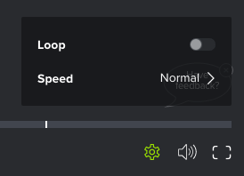

# Lijn in een videoproefdruk inschakelen

U kunt de video zo configureren dat deze continu wordt afgespeeld (de video wordt opnieuw afgespeeld nadat deze is voltooid). 

## Toegangsvereisten

U moet de volgende toegang hebben om de stappen in dit artikel uit te voeren:

<table style="table-layout:auto"> 
 <col> 
 <col> 
 <tbody> 
  <tr> 
   <td role="rowheader">Adobe Workfront-abonnement*</td> 
   <td> 
Huidig plan: Pro of hoger
 
of
 
Ouder plan: Selecteren of Premium
 
Voor meer informatie over het proefdrukken van toegang met de verschillende plannen, zie <a href="/help/quicksilver/administration-and-setup/manage-workfront/configure-proofing/access-to-proofing-functionality.md" class="MCXref xref">Toegang tot proefdrukfunctionaliteit in Workfront</a>.
 </td> 
  </tr> 
  <tr> 
   <td role="rowheader">Adobe Workfront-licentie*</td> 
   <td> 
Huidig plan: Werken of plannen
 
Ouder plan: Willekeurig (proefdrukken moet zijn ingeschakeld voor de gebruiker)
 </td> 
  </tr> 
  <tr> 
   <td role="rowheader">Bewijs van machtigingsprofiel </td> 
   <td>Manager of hoger</td> 
  </tr> 
  <tr> 
   <td role="rowheader">Configuraties op toegangsniveau*</td> 
   <td> 
Toegang tot documenten bewerken
 
Voor informatie over het aanvragen van aanvullende toegang raadpleegt u <a href="../../../../workfront-basics/grant-and-request-access-to-objects/request-access.md" class="MCXref xref">Toegang tot objecten aanvragen </a>.
 </td> 
  </tr> 
 </tbody> 
</table>

&#42;Neem contact op met de beheerder van de Workfront of Workfront-proefdrukken als u wilt weten welk plan, welke rol of welk proefdrukprofiel u hebt.

## Lijn in een videoproefdruk inschakelen

1. Ga naar het project, de taak, of de kwestie die het document bevat, dan uitgezocht **Documenten**.
1. Zoek de proefdruk die u nodig hebt en klik op **Proef openen**.

1. Klik in de rechterbenedenhoek van de proefdrukviewer op de knop **Instellingen** pictogram.

   

1. De optie **Lus** optie.
