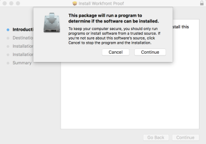

# De Desktop Proofing Viewer installeren

<!--Audited: 12/2023-->

De Desktop Proofing Viewer, die voornamelijk is ontworpen voor het controleren van interactieve inhoud, is een toepassing die op uw lokale computer moet worden geïnstalleerd.

## Systeemvereisten

Deze toepassing wordt ondersteund door de volgende besturingssystemen:

* Windows 7 en hoger, 32 en 64 bits
* Mac OS X 10.9 en hoger, 64-bits

{{latest-version}}

## Toegangsvereisten

+++ Breid uit om de toegangseisen voor de functionaliteit in dit artikel weer te geven.

U moet de volgende toegang hebben om de stappen in dit artikel uit te voeren:

<table style="table-layout:auto"> 
 <col> 
 <col> 
 <tbody> 
  <tr> 
   <td role="rowheader">Adobe Workfront-plan</td> 
   <td> 
Nieuw: alle
 
of
 
Huidig: Pro of hoger
 </td> 
  </tr> 
  <tr> 
   <td role="rowheader">Adobe Workfront-licentie</td> 
   <td> 
Alle
</td> 
  </tr> 
 </tbody> 
</table>

Voor meer detail over de informatie in deze lijst, zie [ vereisten van de Toegang in de documentatie van Workfront ](/help/quicksilver/administration-and-setup/add-users/access-levels-and-object-permissions/access-level-requirements-in-documentation.md).

+++

## De Desktop Proofing Viewer installeren op Mac

Als uw Adobe Workfront-beheerder of Workfront Proof-beheerder de app op uw werkstation heeft gedownload en de Desktop Proofing Viewer heeft geconfigureerd als de standaardviewer voor interactieve proefdrukken, kunt u de installatie voltooien door een interactieve proefdruk te openen in het gebied Documenten.

Als dit niet het geval is, kunt u de onderstaande stappen volgen.

1. Voer een van de volgende handelingen uit om de app te downloaden:

   * Als u het milieu van de Productie gebruikt, klik [ de Download van de Productie van Mac voor de Desktop het Proofing Kijker.](https://assets.proofhq.com/nativeviewer/desktop_viewer/Workfront+Proof-2.1.35.pkg)
   * Als u het milieu van de Voorproef gebruikt, klik [ de Download van de Voorproef van Mac voor de Kijker van het Proofing van de Desktop.](https://assets.preview.proofhq.com/nativeviewer/desktop_viewer/Workfront+Proof+Preview-2.1.35.pkg)

1. Open het bestand dat u zojuist hebt gedownload om de installatie te starten.
1. Voor de installatievak die verschijnt, ga **** voort, dan klik **installeer**.

   

1. Open een interactieve proefdruk vanuit het gebied Documenten.

>[!NOTE]
>
>Als de Desktop Proofing Kijker niet lanceert wanneer u een interactieve proef opent, betekent dit waarschijnlijk dat uw Workfront of beheerder van Workfront Proof de Kijker van het Proofing van de Desktop als standaardkijker voor interactieve proefdrukken moet vormen, zoals die in [ wordt beschreven Gebruiker die voor het openen van niet-Interactieve Proofs in de Kijker van het Proofing van de Desktop ](../../../workfront-proof/wp-work-proofsfiles/review-proofs-dpv/destop-proofing-viewer.md#user-setting-for-opening-non-interactive-proofs-in-the-desktop-proofing-viewer) plaatst.

## De Desktop Proofing Viewer installeren in Windows

Als uw Workfront- of Workfront Proof-beheerder de app op uw werkstation heeft gedownload en de Desktop Proofing Viewer heeft geconfigureerd als de standaardviewer voor interactieve proefdrukken, kunt u de installatie voltooien door een interactieve proefdruk te openen in het gebied Documenten.

>[!TIP]
>
>U kunt de opdrachtregel gebruiken om de Desktop Proofing Viewer te installeren door `Workfront Proof Setup 2.1.34.exe" /S` uit te voeren

1. Voer een van de volgende handelingen uit om de app te downloaden:

   * In het milieu van de Productie, klik [ download van de Productie van Vensters voor de Desktop het Proofing Kijker.](https://assets.proofhq.com/nativeviewer/desktop_viewer/Workfront+Proof+Setup+2.1.35.exe)
   * In het milieu van de Voorproef, klik [ download van de Voorproef van Vensters voor de Kijker van het Proofing van de Desktop ](https://assets.preview.proofhq.com/nativeviewer/desktop_viewer/Workfront+Proof+Preview+Setup+2.1.35.exe)

1. Open het bestand dat u zojuist hebt gedownload om de installatie te starten.
1. Open in het installatievak dat wordt weergegeven het bestand dat u net hebt gedownload om de installatie te starten.

   

1. In de doos van de veiligheidswaarschuwing die verschijnt, klik **Looppas**. De Desktop Proofing Viewer wordt automatisch geïnstalleerd en uitgevoerd.
1. (Voorwaardelijk) Als u de toepassing installeert met Internet Explorer, vernieuwt u de startpagina in de browser nadat de toepassing is geïnstalleerd.
1. Open een interactieve proefdruk vanuit het gebied Documenten.

Nadat de Desktop Proofing Viewer is geïnstalleerd, worden alle interactieve proefdrukken geopend in de Desktop Proofing Viewer. Als de Desktop Proofing Kijker niet lanceert wanneer u een interactieve proef opent, betekent dit waarschijnlijk dat uw Workfront of beheerder van Workfront Proof de Kijker van het Proofing van de Desktop als standaardkijker voor interactieve proefdrukken moet vormen, zoals die in [ wordt beschreven Gebruiker die voor het openen van niet-Interactieve Proofs in de Kijker van het Proofing van de Desktop ](../../../workfront-proof/wp-work-proofsfiles/review-proofs-dpv/destop-proofing-viewer.md#user-setting-for-launching-non-interactive-proofs) plaatst.
