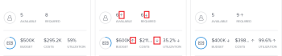

# Planscenario&#39;s maken en vergelijken in de [!DNL Scenario Planner]

<!--Audited: 07/2024-->

Wanneer u de langetermijnstrategie van uw bedrijf plant, is er veel informatie die u niet zou kunnen hebben of aan het begin denken. Het kost tijd en experimenten om tot een definitieve strategie te komen die uw belanghebbenden kunnen accepteren. Het voeren van een &quot;wat als&quot;analyse om veelvoudige scenario&#39;s voor uw plan tot stand te brengen kan u helpen potentiële omstandigheden nauwkeurig voorspellen en evalueren en uiteindelijk het best mogelijke plan ontwikkelen.

## Toegangsvereisten

+++ Breid uit om de toegangseisen voor de functionaliteit in dit artikel weer te geven.

<table style="table-layout:auto"> 
 <col> 
 <col> 
 <tbody> 
  <tr> 
   <td> 
[!DNL Adobe Workfront] plan*
 </td> 
   <td> 
Huidig: [!UICONTROL Business] of hoger

   
Nieuw: Ultimate 

   </td> 
  </tr> 
  <tr> 
   <td> 
[!DNL Adobe Workfront] licentie*
 </td> 
   <td> 
Nieuw: Licht of hoger
 
   
Huidig: [!UICONTROL Review] of hoger
 </td> 
  </tr> 
  <tr> 
   <td>Product* </td> 
   <td> 
   
Voor de huidige plannen van Workfront: 

   
U moet een extra licentie voor de [!DNL Adobe Workfront Scenario Planner] aanschaffen om toegang te krijgen tot de functionaliteit die in dit artikel wordt beschreven.
 
Voor informatie over toegang en toestemmingen voor [!DNL Workfront Scenario Planner], zie <a href="../scenario-planner/access-needed-to-use-sp.md" class="MCXref xref"> Toegang nodig om [!DNL Scenario Planner]</a> te gebruiken. 
 </td> 
  </tr> 
  <tr data-mc-conditions=""> 
   <td>Toegangsniveau </td> 
   <td> 
[!UICONTROL Edit] toegang tot de [!DNL Scenario Planner]
 </td> 
  </tr> 
  <tr data-mc-conditions=""> 
   <td> 
Objectmachtigingen 
 </td> 
   <td> 
[!UICONTROL Manage] machtigingen voor een abonnement
 
Voor informatie bij het vragen van om extra toegang tot een plan, zie <a href="../scenario-planner/request-access-to-plan.md" class="MCXref xref"> de toegang van het Verzoek tot een plan in [!DNL Scenario Planner]</a>.
 </td> 
  </tr> 
 </tbody> 
</table>

*For informatie, zie [ vereisten van de Toegang tot de documentatie van Workfront ](/help/quicksilver/administration-and-setup/add-users/access-levels-and-object-permissions/access-level-requirements-in-documentation.md).

+++

## Scènes maken

Een scenario is een exemplaar van een plan. U kunt zoveel scenario&#39;s maken als u nodig hebt. Nochtans, adviseren wij dat u het aantal scenario&#39;s tot een minimum beperkt zodat u hen kunt gemakkelijk vergelijken.

{{step1-to-scenario-planner}}

1. Maak een abonnement of klik op de naam van een bestaand abonnement.

   Voor informatie over het creëren van plannen, zie [ plannen in  [!DNL Scenario Planner]](../scenario-planner/create-and-edit-plans.md) creëren en uitgeven.

   Het eerste plan u creeert wordt automatisch bewaard als &quot;[!UICONTROL Initial scenario].&quot;

1. Klik op de pijl omlaag naast een bestaand scenario en klik vervolgens op het pictogram **[!UICONTROL Copy]** .

   

   Dit leidt tot een nieuw scenario met de zelfde informatie zoals het gekopieerde scenario. Het wordt automatisch genoemd &quot;[!UICONTROL Scenario 2]&quot;als het het tweede scenario van uw plan, &quot;[!UICONTROL Scenario 3]&quot;is als het de derde, etc. is. U kunt de naam van uw scenario&#39;s niet wijzigen. Er is geen limiet voor het aantal exemplaren dat u kunt maken.

   <!--
   <MadCap:conditionalText data-mc-conditions="QuicksilverOrClassic.Draft mode">
   (NOTE:this might change)
   </MadCap:conditionalText>
   -->

1. Werk uw nieuw scenario op om het even welke volgende manieren bij:

   * Initiatieven maken, bijwerken of verwijderen

     >[!TIP]
     >
     >Wanneer u een initiatief in een scenario schrapt wordt het verwijderd slechts uit het geselecteerde scenario, niet uit alle scenario&#39;s.

     Voor informatie over het creëren van initiatieven, zie [ initiatieven in  [!DNL Scenario Planner]](../scenario-planner/create-and-edit-initiatives.md) creëren en uitgeven.

   * De prioriteiten van uw initiatieven bijwerken
   * Personen of begrotingsgegevens aanpassen
   * Initiatiefconflicten in uw scenario bekijken en aanpassen

     Voor informatie over het oplossen van conflicten, zie [ initiatiefconflicten oplossen in  [!DNL Scenario Planner]](../scenario-planner/resolve-conflicts-in-sp.md).

1. Klik op **[!UICONTROL Save Plan]** om de wijzigingen op te slaan.

## Vergelijk scenario&#39;s

Nadat u uw scenario&#39;s hebt gemaakt, kunt u deze vergelijken om de beste voor uw organisatie te vinden.

1. Ga naar het plan waarvoor u scenario&#39;s wilt vergelijken.
1. Klik op **[!UICONTROL Compare scenarios]**. De pagina van de de scenariovergelijking toont.

   Alle bestaande scenario&#39;s voor de planvertoning in een zij-aan-zij kaartformaat. Het aanvankelijke scenario wordt altijd eerst vermeld en het is statisch.

   

1. (Optioneel) Schuif naar rechts om alle scenario-kaarten weer te geven.

   De volgende informatie toont op een scenario kaart:

   <table style="table-layout:auto"> 
    <col> 
    <col> 
    <tbody> 
     <tr> 
      <td>Naam van het scenario</td> 
      <td> 
Een automatisch door Workfront gegenereerde naam kan niet worden bewerkt. Bijvoorbeeld, "[!UICONTROL Initial scenario]", "[!UICONTROL Scenario 2]", etc. 
 </td> 
     </tr> 
     <tr> 
      <td>Beschrijving van scenario</td> 
      <td>Een handmatige invoer waarin u details over het scenario kunt beschrijven. </td> 
     </tr> 
     <tr> 
      <td>Beschikbare taakrollen</td> 
      <td>Het aantal vacatures dat beschikbaar is uit de begroting van het plan voor de duur van het plan. </td> 
     </tr> 
     <tr> 
      <td>Vereiste taakrollen</td> 
      <td>Het aantal vereiste functies op basis van uw initiatieven. </td> 
     </tr> 
     <tr> 
      <td>Begroting</td> 
      <td>Het totale budget dat in dit scenario voor de regeling is vastgesteld. Voor begrotingsinformatie over plannen, zie <a href="../scenario-planner/plans-overview.md" class="MCXref xref"> Overzicht van Abonnementen in [!DNL Scenario Planner]</a>. </td> 
     </tr> 
     <tr> 
      <td>Kosten</td> 
      <td>De kosten die verbonden zijn aan de initiatieven met betrekking tot het scenario. Voor informatie over kosten, zie <a href="../scenario-planner/initiatives-overview.md" class="MCXref xref"> Overzicht van Initiatieven in [!DNL Scenario Planner]</a>. </td> 
     </tr> 
     <tr> 
      <td>Gebruik</td> 
      <td>Het [!UICONTROL Budget Utilization] percentage voor het abonnement in dit scenario. Voor informatie over het [!UICONTROL Budget Utilization] percentage, zie <a href="../scenario-planner/plans-overview.md" class="MCXref xref"> Overzicht van Abonnementen in [!DNL Scenario Planner]</a>. </td> 
     </tr> 
     <tr> 
      <td>Nettowaarde</td> 
      <td>De [!UICONTROL Net Value] van het plan in dit scenario. Voor informatie over [!UICONTROL Net Value] van een plan, zie <a href="../scenario-planner/plans-overview.md" class="MCXref xref"> Overzicht van Abonnementen in [!DNL Scenario Planner]</a>. </td> 
     </tr> 
     <tr> 
      <td>Initiatieven</td> 
      <td>Het aantal initiatieven voor het plan in dit scenario.</td> 
     </tr> 
     <tr> 
      <td>Conflicterend</td> 
      <td>Het aantal initiatieven die om het even welk type van conflicten in het plan voor dit scenario tonen. Voor informatie over initiatiefconflicten, zie <a href="../scenario-planner/resolve-conflicts-in-sp.md" class="MCXref xref"> initiatiefconflicten in [!DNL Scenario Planner]</a> oplossen. </td> 
     </tr> 
    </tbody> 
   </table>

   >[!NOTE]
   >
   >Wanneer de informatie tussen het aanvankelijke scenario en extra scenario&#39;s verschilt, een omhoog of omlaag pijlvertoningen naast de waarde die om op een verhoging of een daling van die waarde, in vergelijking met het aanvankelijke scenario wordt veranderd te wijzen.
   >
   >
   >
   >
   >Bijvoorbeeld de begroting, het aantal functies, het aantal initiatieven kan van het ene scenario naar het andere veranderen.

1. Klik op de naam van een scenario om het te openen en er wijzigingen in aan te brengen.

   Voor meer informatie, zie [ scenario&#39;s ](#create-scenarios) sectie in dit artikel creëren.

1. Klik op **[!UICONTROL Add description]** om een beschrijving voor het scenario toe te voegen

   of

   Klik op het beschrijvingsveld om het bij te werken en klik vervolgens ergens op het scherm om de wijzigingen op te slaan.

1. (Optioneel) Klik op het **[!UICONTROL More]** menu  naar **[!UICONTROL Copy]** of **[!UICONTROL Delete]** het scenario.

   

   Wanneer u een scenario kopieert, verschijnt het automatisch op de kaartpagina en volgens dit patroon anders genoemd: &quot;[!UICONTROL Scenario] `<next number in order>`&quot;.

1. (Voorwaardelijk) Als u op **[!UICONTROL Delete]** hebt geklikt, klikt u op **[!UICONTROL Yes, delete it]** om te bevestigen.

   Verwijderde scenario&#39;s kunnen niet worden hersteld.

   Voor informatie over het schrappen van scenario&#39;s, zie [ plannen van de Schrapping in  [!DNL Scenario Planner]](../scenario-planner/delete-plans.md).

1. Klik **[!UICONTROL Save Plan]** om uw scenario&#39;s en uw plan te bewaren.
