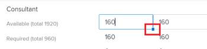
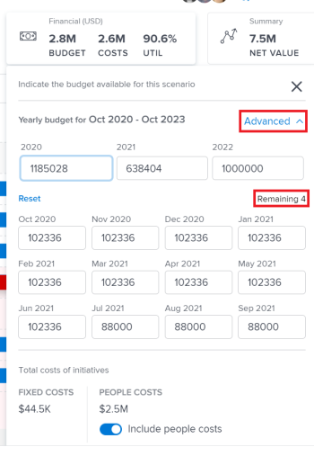

# Abonnementen maken en bewerken in het dialoogvenster [!DNL Scenario Planner]

U kunt plannen als deel van het gebruiken van [!DNL Workfront Scenario Planner] tot stand brengen, wanneer het prioriteren van de strategie op hoog niveau van uw bedrijf. Voor meer informatie over plannen, zie [ Overzicht van Abonnementen in  [!DNL Scenario Planner]](../scenario-planner/plans-overview.md).

<!--

(NOTE: talk about:

- Show people conflicts >> this impacts the conflicts calculation for initiatives>> link to the conflicts article

- explain what hovering over the green upward-pointing arrow does, with screen shot)

-->

## Toegangsvereisten

+++ Breid uit om de toegangseisen voor de functionaliteit in dit artikel weer te geven.

<table style="table-layout:auto"> 
 <col> 
 <col> 
 <tbody> 
  <tr> 
   <td> 
[!DNL Adobe Workfront] plan*
 </td> 
   <td> 
Huidig: [!UICONTROL Business] of hoger

   
Nieuw: Ultimate 

   </td> 
  </tr> 
  <tr> 
   <td> 
[!DNL Adobe Workfront] licentie*
 </td> 
   <td> 
Nieuw: Licht of hoger
 
   
Huidig: [!UICONTROL Review] of hoger
 </td> 
  </tr> 
  <tr> 
   <td>Product* </td> 
   <td> 
   
Voor de huidige plannen van Workfront: 

   
U moet een extra licentie voor de [!DNL Adobe Workfront Scenario Planner] aanschaffen om toegang te krijgen tot de functionaliteit die in dit artikel wordt beschreven.
 
Voor informatie over toegang en toestemmingen voor [!DNL Workfront Scenario Planner], zie <a href="../scenario-planner/access-needed-to-use-sp.md" class="MCXref xref"> Toegang nodig om [!DNL Scenario Planner]</a> te gebruiken. 
 </td> 
  </tr> 
  <tr data-mc-conditions=""> 
   <td>Toegangsniveau </td> 
   <td> 
[!UICONTROL Edit] toegang tot de [!DNL Scenario Planner]
 </td> 
  </tr> 
  <tr data-mc-conditions=""> 
   <td> 
Objectmachtigingen 
 </td> 
   <td> 
[!UICONTROL Manage] machtigingen voor een abonnement
 
Voor informatie bij het vragen van om extra toegang tot een plan, zie <a href="../scenario-planner/request-access-to-plan.md" class="MCXref xref"> de toegang van het Verzoek tot een plan in [!DNL Scenario Planner]</a>.
 </td> 
  </tr> 
 </tbody> 
</table>

*For informatie, zie [ vereisten van de Toegang tot de documentatie van Workfront ](/help/quicksilver/administration-and-setup/add-users/access-levels-and-object-permissions/access-level-requirements-in-documentation.md).

+++

## Abonnementen maken of bewerken

U kunt een geheel nieuw plan maken of een bestaand plan bewerken dat met u is gedeeld.

>[!NOTE]
>
>Nadat u een plan creeert, wordt u beschouwd als de planmaker en de eigenaar. Wanneer een gebruiker wordt gedeactiveerd, heeft het plan geen eigenaar en is niet zichtbaar aan iedereen tenzij eerder gedeeld met een verbinding.

In dit artikel wordt beschreven hoe u een geheel nieuw plan kunt maken of hoe u een bestaand plan kunt bewerken.

Voor alle overwegingen over plannen met inbegrip van de informatie beschikbaar voor een plan, zie [ Overzicht van Abonnementen in  [!DNL Scenario Planner]](../scenario-planner/plans-overview.md).

Voor informatie over het schrappen van plannen, zie [ plannen van de Schrapping in  [!DNL Scenario Planner]](../scenario-planner/delete-plans.md).

Een abonnement maken of bewerken:

{{step1-to-scenario-planner}}

Een lijst met bestaande plannen die u hebt gemaakt, wordt weergegeven in de [!DNL Workfront Scenario Planner] .

1. (Optioneel) Klik op het **[!UICONTROL Filter]** pictogram  in de rechterbovenhoek van de overzichtslijst en selecteer een van de volgende opties:

   | Filter | Beschrijving |
   |---|---|
   | [!UICONTROL All] | Toont alle plannen die u creeerde of die met u zijn gedeeld. |
   | [!UICONTROL My plans] | Geeft de plannen weer die u hebt gemaakt. |
   | [!UICONTROL Shared with me] | Hiermee geeft u plannen weer die met u worden gedeeld. |

   

1. (Optioneel) Klik op het pictogram **[!UICONTROL Search]**  om een trefwoord te typen en snel een abonnement in de lijst te zoeken.

1. Klik op de naam van een bestaand abonnement om het te bewerken en door te gaan met stap 7.

   <!--
   
(NOTE: is the step still accurate) 

   -->

   of

   Klik op **[!UICONTROL New Plan]** in de linkerbovenhoek om een abonnement te maken en verder te gaan met stap 5.

   <!--
   
(NOTE: is the step still accurate)

   -->

   

   Het vak [!UICONTROL New Plan] wordt weergegeven.

   

1. (Voorwaardelijk) Wanneer u een nieuw plan creeert, specificeer de volgende informatie:

   <table style="table-layout:auto"> 
    <col> 
    <col> 
    <tbody> 
     <tr> 
      <td role="rowheader">[!UICONTROL Name]</td> 
      <td>Typ een naam voor het abonnement. Dit is een verplicht veld.</td> 
     </tr> 
     <tr> 
      <td role="rowheader" colspan="2"> 
Belangrijk:  u kunt niet de volgende selecties wijzigen nadat u creeert en het plan bewaart. 
 </td> 
     </tr> 
     <tr data-mc-conditions=""> 
      <td role="rowheader"> FTE ([!UICONTROL Full Time Equivalent]) of [!UICONTROL Hours] </td> 
      <td> 
 selecteer één van de volgende opties om erop te wijzen hoe u de informatie van de baanrol voor dit plan wilt schatten: 
 
       <ul> 
      <li> 
 <strong> FTE </strong>. Dit is de standaardinstelling  
 
      
<b>BELANGRIJK</b>
  
      
Voor alle berekeningen in de [!DNL Scenario Planner] gebruikt [!DNL Workfront] de volgende waarde: 1 FTE = 8 uur. 
 </li> 
      <li> 
<strong>[!UICONTROL Hours]</strong> 
 </li> 
       </ul> 
<b>BELANGRIJK</b>

   De optie u hier selecteert bepaalt hoe de informatie van de baanrol voor het plan, de scenario&#39;s van het plan, en initiatieven toont
 </td>
   </tr> 
     <tr> 
      <td role="rowheader">[!UICONTROL Start date]</td> 
      <td> 
Selecteer de maand en het jaar waarin het abonnement moet worden gestart. U kunt slechts maanden selecteren in dit veld. [!DNL Workfront] gaat ervan uit dat de begindatum van het abonnement de eerste dag van de geselecteerde maand is en de einddatum de laatste dag van het einde van de maand in de duur is. 
 </td> 
     </tr> 
     <tr> 
      <td role="rowheader">[!UICONTROL Duration]</td> 
      <td> 
Selecteer een van de volgende tijdsduur in het keuzemenu:
 
       <ul> 
        <li>1 jaar. Dit is de standaardduur. </li> 
        <li>3 jaar</li> 
        <li> 
5 jaar
 </li> 
       </ul> </td> 
     </tr> 
    </tbody> 
   </table>

<!--for table above - how FTE is calcualted: NOTE: snippet below: this is per Ani; it does NOT look at the system FTE.) 
-->

1. (Voorwaardelijk) Klik op **[!UICONTROL Next]** .

   De tijdlijn van het plan wordt weergegeven als de **[!UICONTROL Initial scenario]** .

   Voor informatie over het creëren van extra scenario&#39;s, zie [ planscenario&#39;s in  [!DNL Scenario Planner]](../scenario-planner/create-and-compare-scenarios-for-a-plan.md) creëren en vergelijken.

1. (Optioneel) Selecteer in het keuzemenu Tijdlijn een van de opties in de volgende tabel om de manier te wijzigen waarop u de tijdlijn van het plan weergeeft.

   

   | Vervolgkeuzemenu, optie | Beschrijving |
   |---|---|
   | [!UICONTROL Month] | Geeft de tijdlijn per maand weer. Dit is de standaardinstelling en de enige optie voor een jaarabonnement. |
   | [!UICONTROL Quarter] | Geeft de tijdlijn per kwartaal weer. Deze optie is alleen beschikbaar als de [!UICONTROL Duration] van het abonnement 3 of 5 jaar is. Dit is de standaardoptie voor een driejarenplan. |
   | [!UICONTROL Year] | Geeft de tijdlijn per jaar weer. Deze optie is alleen beschikbaar als de [!UICONTROL Duration] van het abonnement 5 jaar is. Dit is de standaardoptie voor een vijfjarenplan. |

1. (Optioneel) Schuif van links naar rechts om de volledige duur van het abonnement weer te geven.
1. (Optioneel) Klik op de indicatorregel **[!UICONTROL Today]** om terug te keren naar de huidige dag.

   

1. Klik op het vak **[!UICONTROL Job Roles]** in de koptekst van het abonnement om taakrollen toe te voegen die beschikbaar zijn om het abonnement uit te voeren.

   De details van de weergave van het vak [!UICONTROL Job Roles] .

   >[!TIP]
   >
   >De eenheid voor roltoewijzing (FTE of uren) die [!DNL Workfront] gebruikt voor dit abonnement, wordt tussen haakjes weergegeven in de titel van het vak.

   

1. Klik op het veld **[!UICONTROL Start typing job role]** en selecteer een rol in de lijst of typ de naam van een actieve taakrol.

   Alle actieve baanrollen in het systeem zijn vermeld wanneer u dit gebied klikt.

   Hiermee voegt u de taakrol toe aan de kolom Taakrollen.

1. Werk de volgende informatie voor de taakrol bij of bekijk deze:

   <table style="table-layout:auto"> 
    <col> 
    <col> 
    <tbody> 
     <tr> 
      <td role="rowheader"> 
[!UICONTROL Max available] (voor FTE) 
 
of 
 
[!UICONTROL Total available] (voor uren)  
 </td> 
      <td> 
 afhankelijk van of u selecteerde om uren of FTE voor uw plan te gebruiken, type  het aantal baanrol FTEs  of uren  die beschikbaar zijn om het werk op het plan op de volgende gebieden uit te voeren: 
 
       <ul> 
        <li> 
<strong>[!UICONTROL Total available]</strong> (voor uren): vermeld het totale aantal uren voor alle maanden gedurende de duur van het scenario. Standaard verdeelt [!DNL Workfront] het totaal beschikbare aantal over alle maanden in de duur van het scenario. 
 
Example: </b>"><b> Voorbeeld: </b> als u 1200 uren voor een Designer ingaat, betekent dit Designer voor 100 uren voor elke maand tijdens de duur van het plan beschikbaar is, wanneer het plan [!UICONTROL Duration] 1 jaar is. 
 </li> 
        <li> 
<b>[!UICONTROL Max available]</b> (voor VTE): vermeld het aantal VTE's dat de functie beschikbaar is voor elke maand tijdens de looptijd van het plan. Door gebrek, <strong> Workfront </strong> wijst het [!UICONTROL Max available] aantal aan elke maand in de duur van het scenario toe.
 
Example: </b>"><b> Voorbeeld: </b> als u 1 VTE voor een Consultant ingaat, betekent dit de Consultant voor 1 VTE voor elke maand tijdens de duur van het plan beschikbaar is. 
 
U kunt een getal invoeren dat lager is dan 1 FTE. 
 
Example: </b>"><b> Voorbeeld: </b> A 0.5 de functie van de Consultant zou betekenen dat een consultant de helft van zijn VTE (typisch, 4 uren, waar 8 uren 1 VTE) aan het werken aan dit plan zou wijden. Voor alle berekeningen in de Planner van het Scenario, gebruikt Workfront de volgende waarde: 1 FTE = 8 Uren. 
 </li> 
       </ul> </td> 
     </tr> 
     <tr> 
      <td role="rowheader"> 
[!UICONTROL Max required] (voor FTE)
 
of 
 
[!UICONTROL Total required] (voor uren)  
 </td> 
      <td> 
 afhankelijk van of u selecteerde om uren of FTE voor uw plan te gebruiken, herzie  het aantal baanrol FTEs  of uren  die worden vereist om de initiatieven in het scenario te voltooien. Bekijk de volgende velden:
 
       <ul> 
        <li> 
<strong>[!UICONTROL Total required]</strong> (voor uren): het totale aantal uren dat gedurende alle maanden tijdens de looptijd van het plan is vereist.
 </li> 
        <li> 
<strong>[!UICONTROL Max required]</strong> (voor FTE): het maximumaantal VTE's dat gedurende een van de maanden tijdens de looptijd van het plan vereist is. 
 </li> 
       </ul> 
Tip: Het  maximum  aantal FTEs  of het totale aantal uren  wordt vereist voor de vertoningen van die baanrol nadat u initiatieven begint toe te voegen. Voor informatie over het toevoegen van initiatieven aan een plan, zie <a href="../scenario-planner/create-and-edit-initiatives.md" class="MCXref xref"> initiatieven in [!DNL Scenario Planner]</a> creëren en uitgeven.
 </td> 
     </tr> <!--
      <tr data-mc-conditions="QuicksilverOrClassic.Draft mode"> 
       <td role="rowheader">[!UICONTROL Avg utilization]</td> 
       <td> 
(NOTE: this field was removed in 21.2 - May 2021) 
 
[!DNL Workfront] calculates the average utilization for each job role using the job role FTEs associated with initiatives (required) and the job role FTEs associated with the plan (available). 
 
 [!DNL Workfront] calculates the job role utilization percentage for a plan using the following formula: 
 
<code>Job role utilization percentage = Sum [(Required job roles for each month of the plan *100)/ (Available job roles for each month of the plan)] / Number of months in the Duration of the plan</code> 
 
        
Example: </b>"> <b>Example: </b> 
         
For example, if you have a plan with a duration of 12 months and an initiative with the duration of 2 months, where you use 1 Designer for your initiative (required job role) and there are 2 Designers available on the plan (available), the Utilization percentage for the Designer job role is calculated as follows:
 
         
<code>Designer utilization percentage = [(1/2 + 1/2) * 100] / 12 = 100 / 12 = 8.3%</code> 
 
        
 
As you add job roles to the plan and indicate the Available amount for each one, the [!UICONTROL Utilization] value for each role also updates and [!DNL Workfront] calculates a utilization percentage for the plan. For information about how [!DNL Workfront] calculates the Job Role Utilization for a plan, see <a href="../scenario-planner/plans-overview.md" class="MCXref xref">Plans overview in the [!DNL Scenario Planner]</a>. 
 
Tip: The Utilization percentage is rounded and has one decimal. 
 </td> 
      </tr>
     --> 
     <tr> 
      <td role="rowheader">[!UICONTROL Hourly rate]</td> 
      <td> 
Dit is de [!UICONTROL Cost Hour] frequentie voor de rol van de taak. De uurkoers wordt weergegeven in de valuta van uw systeem. Voor informatie over vestiging zien de Tarieven van de Uitwisseling voor uw systeem, <a href="../administration-and-setup/manage-workfront/exchange-rates/set-up-exchange-rates.md" class="MCXref xref"> de wisselkoersen van de Opstelling </a>.
 </td> 
     </tr> 
    </tbody> 
   </table>

1. (Optioneel) Houd de aanwijzer boven de naam van een taakrol of klik op de tab nadat u de rolinformatie hebt bijgewerkt. Klik vervolgens op **[!UICONTROL trash can icon]**  om deze uit het abonnement te verwijderen.
1. Klik op **[!UICONTROL Job role distribution]**.

   Het deelvenster voor taakverdeling wordt gedurende alle maanden in de duur van het scenario weergegeven.

   

1. Typ de naam van een taakrol om deze toe te voegen aan het abonnement in de **[!UICONTROL Start typing job role field]** en klik vervolgens op Enter wanneer deze wordt weergegeven in de lijst. Hiermee voegt u de taakrol toe aan de kolom [!UICONTROL Job Roles] .
1. Werk of herzie de volgende informatie voor elke maand van het scenario bij:

   <table style="table-layout:auto"> 
    <col> 
    <col> 
    <tbody> 
     <tr> 
      <td role="rowheader">[!UICONTROL Job Roles] (VTE of uren)</td> 
      <td>Zowel de baanrol beschikbaar voor het scenario als die vereist voor de initiatieven op het scenario tonen in het paneel van de taakverdeling. Er is een aanwijzing of de ramingen van de baanrol in FTEs of uren in de kolomkopbal zijn. </td> 
     </tr> 
     <tr> 
      <td role="rowheader"> 
[!UICONTROL Available] (max. &lt;aantal FTE's&gt;) 
 
       
 
        
of
 
        
[!UICONTROL Available] (totaal &lt;aantal uren&gt;) 
 
       
 </td> 
      <td> 
 afhankelijk van of u selecteerde om uren of FTE voor uw plan te gebruiken, herzie of werk  het maandelijkse aantal van baanrol FTEs  of uren  beschikbaar voor het scenario op de volgende gebieden bij:
 
       <ul> 
        <li> 
<strong>[!UICONTROL Available] (max &lt;number of FTEs&gt;) </strong>: Het aantal tussen haakjes toont het maximumaantal rollen beschikbaar voor om het even welk van de maanden voor het scenario. Controleer of werk het aantal VTE's voor elke maand van het scenario bij. Als u de maandelijkse toewijzing wijzigt, kan het aantal VTE's tussen de haakjes worden bijgewerkt. 
 </li> 
        <li> 
 <strong>[!UICONTROL Available] (totaal &lt;aantal uren&gt;) </strong>: Het aantal tussen haakjes toont het totale aantal uren beschikbaar voor alle maanden in het scenario. Controleer of werk het aantal uren voor elke maand van het scenario bij. Als u de maandelijkse toewijzing wijzigt, wordt het aantal uren tussen de haakjes bijgewerkt. 
 </li> 
       </ul> 
Het handmatig bijwerken van de maandelijkse taakrollentoewijzingen is een andere manier om taakrolconflicten tussen initiatieven op het scenario op te lossen. 
 
Tip:   
 om de maandelijkse rolbeschikbaarheid voor verscheidene maanden bij te werken, typ het aantal uren of FTEs op het [!UICONTROL Available] gebied van om het even welke maand, dan sleep de hoek van het gebied over de aangrenzende maanden om de zelfde waarde voor elke maand te kopiëren. Zet het neer om alle maanden bij te werken. 
 
  
 
 </td> 
     </tr> 
     <tr> 
      <td role="rowheader"> 
[!UICONTROL Required] (max &lt;number&gt;)
 
       
 
        
of
 
        
[!UICONTROL Required] (totaal &lt;aantal&gt;)
 
       
 </td> 
      <td> 
 afhankelijk van of u selecteerde om uren of FTE voor uw plan te gebruiken, herzie  het maandelijkse aantal baanrol FTEs of uren die voor het scenario op de volgende gebieden worden vereist: 
 
       <ul> 
        <li> 
<strong>[!UICONTROL Required] (max &lt;number of FTEs&gt;) </strong>: Het aantal tussen haakjes toont het maximumaantal rollen die voor om het even welk van de maanden voor het scenario worden vereist. 
 </li> 
        <li> 
 <strong>[!UICONTROL Required] (totaal &lt;aantal uren&gt;) </strong>: Het aantal tussen haakjes toont het totale aantal uren dat voor alle maanden in het scenario wordt vereist. 
 </li> 
       </ul> 
Tip: U kunt niet het Vereiste aantal FTEs  of uren  voor de baanrol wijzigen. Dit aantal bevolkt voor het scenario nadat u initiatieven en hun baanrolvereisten begint toe te voegen. 
 </td> 
     </tr> 
     <tr> 
      <td role="rowheader">[!UICONTROL Difference]</td> 
      <td> 
       
 
        
Het maandelijkse verschil tussen de bedragen van vereiste en beschikbare baanrollen voor het scenario. [!DNL Workfront] berekent het verschil voor elke baanrol voor elke maand gebruikend de volgende formule:
 
        
<code>Monthly role difference = Monthly required roles - Monthly available roles</code> (in VTE's of uren) 
 
        
Tip: wanneer het verschil een negatief aantal toont, vereist het scenario meer baanrollen dan het plan beschikbaar heeft. Uw middelen zijn oververdeeld. 
 
       
 </td> 
     </tr> 
     <tr> 
      <td role="rowheader">[!UICONTROL Utilization] %</td> 
      <td> 
       
 
        
Het percentage van gebruik toont hoeveel van de beschikbare baanrollen eigenlijk (of vereist) op de initiatieven in het scenario worden gebruikt. 
 
        
[!DNL Workfront] berekent het gebruik per baanrol per maand gebruikend de volgende formule: 
 
        
<code>Monthly role utilization % = Monthly required roles / Monthly available roles * 100</code> 
 
        
Het gebruikspercentage wordt mogelijk in de volgende kleuren weergegeven, afhankelijk van de toewijzing van uw bronnen:
 
        <ul> 
         <li> 
<b> Groen </b>: De beschikbare en vereiste aantallen baanrollen passen aan. De middelen zijn volledig toegewezen en het gebruikspercentage is 100%. 
 </li> 
         <li> 
<b> Rood </b>: Er zijn meer vereiste baanrollen dan het plan beschikbaar heeft. De middelen zijn oververdeeld en het gebruikspercentage is hoger dan 100%.
 </li> 
         <li> 
<b> Blauw </b>: Er zijn meer beschikbare baanrollen dan zij worden vereist. De middelen zijn onderverdeeld en het bestedingspercentage is lager dan 100%. 
 </li> 
        </ul> 
       
 
  
 </td> 
     </tr> 
    </tbody> 
   </table>

1. Klik op **[!UICONTROL Apply]** om de maandelijkse taakverdeling op te slaan

   of

   Klik op **[!UICONTROL Cancel]** om de lijst met taakrolverdeling te sluiten en terug te keren naar het scenario.

1. Klik op het vak **[!UICONTROL Financial]** in de kop van het abonnement om het budget voor dit abonnement toe te voegen.

   De details van de weergave van het vak [!UICONTROL Financial] .

   >[!TIP]
   >
   >De valuta die [!DNL Workfront] gebruikt voor dit abonnement, wordt tussen haakjes weergegeven in de titel van het vak.

1. Geef de waarde **[!UICONTROL Yearly budget]** op.

   >[!NOTE]
   >
   >Als uw plan meerdere jaren omvat, moet u een begrotingsbedrag voor elk jaar specificeren.

1. Druk op Enter om het jaarbudget op te slaan en op [!UICONTROL Tab] om naar het volgende jaar te gaan.

   De jaarlijkse begroting wordt automatisch gelijkelijk verdeeld voor elke maand van het geselecteerde jaar.

1. Klik op **[!UICONTROL Advanced]** om de maandelijkse budgetverdeling weer te geven. De jaarlijkse en maandelijkse begrotingen zijn altijd afgerond. Wanneer het begrotingsbedrag vanwege decimalen niet gelijkelijk over alle maanden in een jaar kan worden verdeeld, wordt een **[!UICONTROL Remaining]** -indicator weergegeven onder de jaarlijkse begrotingsverdeling.

   

1. Pas handmatig de maandelijkse budgetten aan om de overschrijdingen te elimineren.

   Wanneer het totaal van alle maandelijkse begrotingsbedragen groter is dan het jaarlijkse budget, wordt een **[!UICONTROL Exceeding]** waarschuwingsindicator weergegeven onder de jaarlijkse begrotingsverdeling. Pas de maandelijkse begrotingsbedragen handmatig aan totdat ze gelijk zijn aan of lager zijn dan het beschikbare budget voor het plan.

   

1. Schakel de instelling **[!UICONTROL Include people costs]** uit om kosten die aan taakrollen zijn gekoppeld, niet mee te tellen bij de totale kosten van het abonnement. Vaste kosten tellen altijd mee voor de totale kosten van de regeling. Dit plaatsen wordt toegelaten door gebrek en beïnvloedt alle scenario&#39;s op het plan.
1. Klik ergens buiten het vak [!UICONTROL Financial] om het te sluiten. De gegevens die u hebt ingevoerd, worden automatisch opgeslagen.

   U kunt nu de initiatieven voor het plan beginnen te creëren, en scenario&#39;s toevoegen.

1. (Aanbevolen) Klik op **[!UICONTROL New initiative]** om een nieuw initiatief toe te voegen.

   <!--
   
(NOTE: Should this include information on how to create scenarios - see also information about scenarios in Manage Plans?)

   -->

   Voor informatie over het toevoegen van initiatieven, zie het artikel [ creeer en geef initiatieven in  [!DNL Scenario Planner]](../scenario-planner/create-and-edit-initiatives.md) uit.

1. (Optioneel) Maak een kopie van het bestaande scenario om een nieuw scenario van hetzelfde plan te maken. Voor meer informatie over het creëren van en het werken met veelvoudige scenario&#39;s, zie [ planscenario&#39;s in  [!DNL Scenario Planner]](../scenario-planner/create-and-compare-scenarios-for-a-plan.md) creëren en vergelijken.
1. Klik op **[!UICONTROL Save Plan]**.

   Uw abonnement is gemaakt of bijgewerkt.

1. (Optioneel) Klik op **[!UICONTROL Favorites icon]**  rechts van de naam van het abonnement om het abonnement toe te voegen aan de lijst Favorieten.

1. (Optioneel) Kopieer de URL van het abonnement en verstuur het naar een andere gebruiker die het mogelijk moet controleren of bijwerken. Zij moeten minstens [!UICONTROL View] toegang in hun toegangsniveau hebben om het plan te kunnen bekijken. Ze moeten [!UICONTROL Edit] toegang hebben om het bestand te kunnen bewerken. Als zij financiële informatie over het plan, zoals begrotingen, kosten, en de informatie van het baanroltarief moeten herzien, moeten zij tot [!UICONTROL Financial Data] in hun niveau van de Toegang ook toegang hebben. Voor informatie over de toegang nodig voor [!DNL Scenario Planner], zie [ Toegang nodig om  [!DNL Scenario Planner]](../scenario-planner/access-needed-to-use-sp.md) te gebruiken.
