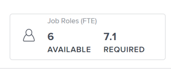
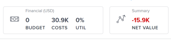

# Overzicht van plannen in [!DNL Scenario Planner]

Als bedrijfsmanager, kunt u [!DNL Adobe Workfront Scenario Planner] gebruiken om de strategie voor de nabije en lange toekomst van uw organisatie te schetsen door zijn plannen van één, drie, of vijf jaar te schetsen.

## Toegangsvereisten

Voor informatie over toegangsvereisten om tot de Planner van het Scenario toegang te hebben, zie [&#x200B; Toegang nodig om de Planner van het Scenario te gebruiken &#x200B;](/help/quicksilver/scenario-planner/access-needed-to-use-sp.md).

## Overzicht van plannen

<!--

(NOTE: add information about utilization percentage for job roles - per this story?? - https://hub.workfront.com/task/5eb0784900083e1f2cabb60d6e0d04d3/overview)

-->

U kunt elk organisatieresultaat op hoog niveau identificeren en dit als een plan toevoegen aan de [!DNL Workfront Scenario Planner] . Een plan is het grootste het werkpunt in [!DNL Scenario Planner]. Om het gemakkelijker te maken om het plan te verwezenlijken, kunt u het in verscheidene initiatieven verdelen, om te wijzen welke stappen individuele organisatorische eenheden moeten nemen om tot zijn voltooiing te komen.

U kunt initiatieven dan met echte projecten verbinden om erop te wijzen hoe de echte het werkfactoren in de daadwerkelijke voltooiing van het plan. Dit artikel bevat algemene informatie over plannen. Voor informatie over initiatieven, zie [&#x200B; Overzicht van Initiatieven in  [!DNL Scenario Planner]](../scenario-planner/initiatives-overview.md).

U kunt de benodigde arbeids- en financiële middelen definiëren om het werk dat in het plan wordt genoemd, te voltooien. U kunt ook de arbeids- en financiële middelen bekijken die de initiatieven in het plan nodig hebben om ze te kunnen voltooien.

U kunt de volgende informatie voor elk abonnement schatten en herzien:

* Schatting van het type en het aantal baanrollen die beschikbaar zijn om het plan uit te voeren.
* Schatting van het budget dat uw bedrijf nodig heeft om het plan te voltooien.
* Herzie het gebruikspercentage van elke baanrol tegen de vereiste baanrollen verbonden aan de initiatieven.
* Herzie het gebruikspercentage van het budget van uw plan tegen de kosten verbonden aan de initiatieven.
* Herzie de Netto Waarde van het plan op om het even welk bepaald tijdstip.
* De plan-vlakke informatie verandert wanneer u verschillende scenario&#39;s selecteert. Elk scenario heeft verschillende begroting en mensen informatie.

Voor informatie over het creëren van plannen, zie het artikel [&#x200B; plannen in  [!DNL Scenario Planner]](../scenario-planner/create-and-edit-plans.md) creëren en uitgeven.

Voor informatie over het creëren van scenario&#39;s, zie [&#x200B; planscenario&#39;s in  [!DNL Scenario Planner]](../scenario-planner/create-and-compare-scenarios-for-a-plan.md) creëren en vergelijken.

## Overwegingen bij plannen

Houd rekening met het volgende wanneer u plannen maakt:

* U kunt plannen voor een team, een volledige afdeling, of zelfs uw volledig bedrijf bouwen. De plannen zijn grote planningseenheden die de strategie van een bedrijf op hoog niveau schetsen.
* Het kortste plan kan een duur van één jaar hebben. Het langste plan kan een duur van 5 jaar hebben.
* U kunt geen echt werk aan een plan doen. U kunt ruwweg inschatten of u de middelen en het budget hebt nodig om met planningswerk te beginnen. Bijvoorbeeld, als uw bedrijf een nieuw bureau in een nieuwe plaats wil uitbreiden en verwerven, de stappen die worden vereist om te verwezenlijken die eerst in een plan op het hoger-beheersniveau kunnen worden geschetst.
* U kunt veelvoudige scenario&#39;s van het zelfde plan tot stand brengen. Wanneer uw oorspronkelijke plan teveel conflicterende initiatieven heeft, zult u verscheidene scenario&#39;s willen creëren waar u initiatieven of begrotingen en kosten kunt uitgeven om te zien wat de ideale situatie voor het verwezenlijken van het plan is. Initiatieven kunnen met elkaar in conflict komen wanneer ze dezelfde bronnen proberen te gebruiken tijdens hetzelfde tijdsbestek. U kunt dan scenario&#39;s vergelijken om te zien wat het meest steek houdt en welke één uw bedrijf zou moeten goedkeuren, alvorens zij beginnen het daadwerkelijke werk toe te voegen om het te verwezenlijken. Voor informatie over het creëren van scenario&#39;s, zie artikel [&#x200B; planscenario&#39;s in  [!DNL Scenario Planner]](../scenario-planner/create-and-compare-scenarios-for-a-plan.md) creëren en vergelijken.
* U kunt meerdere initiatieven toevoegen aan een plan om aan te geven hoe kleinere planningseenheden zullen bijdragen aan de voltooiing van het plan. Bijvoorbeeld, wanneer u van plan bent om zich in een specifieke markt uit te breiden, kunt u veelvoudige initiatieven op het afdelingsniveau hebben die uiteindelijk tot het verwezenlijken van de uitbreiding op alle niveaus van de organisatie bijdragen. Voor informatie over het creëren van initiatieven, zie het artikel [&#x200B; initiatieven in  [!DNL Scenario Planner]](../scenario-planner/create-and-edit-initiatives.md) creëren en uitgeven.
* Wanneer u een plan creeert, bent u de enige persoon die het kan bekijken. U moet het plan met andere gebruikers en zij kunnen tot het toegang hebben als zij minstens de toegang van de Mening tot [!DNL Scenario Planner] in hun toegangsniveau hebben.

## Functierolinformatie voor plannen

U kunt de algemene informatie van de baanrol voor plannen herzien die op de hoeveelheid baanrollen beschikbaar voor het plan, evenals de hoeveelheid baanrollen wijst die voor de initiatieven worden vereist om te voltooien. U kunt deze informatie bekijken in het vak [!UICONTROL Job Roles] in de koptekst van het abonnement.

U kunt het volgende weergeven in het vak met de taakrol:

| Informatie | Beschrijving |
|---|---|
| FTE/Uren-indicator | De ([!UICONTROL FTE]) of ([!UICONTROL Hours]) indicator naast de &quot;[!UICONTROL Job Role]&quot;titel wijst erop of de regeling opstelling was om FTEs of Uren te gebruiken toen het werd gecreeerd. Het plan, alle scenario&#39;s, en de initiatieven gebruiken deze eenheid. |
| [!UICONTROL Available] | Het aantal banen rol FTEs of uren die voor het huidige scenario beschikbaar zijn. |
| Vereist | Het aantal banen rol FTEs of uren die door alle initiatieven in het huidige scenario worden vereist zodat zij kunnen worden voltooid. |

Voor informatie over de toegang tot van een plan en het bekijken van gedetailleerde informatie over baanrollen, zie [&#x200B; plannen in  [!DNL Scenario Planner]](../scenario-planner/create-and-edit-plans.md) creëren en uitgeven.

## Financiële informatie voor plannen

U kunt financiële informatie over een plan, specifiek zijn gepland budget, bekijken hoe dat budget wordt gebruikt en wat de Netto Waarde van het plan is. De Nettowaarde van een plan is gebaseerd op de Netto Waarde van zijn initiatieven. U kunt deze informatie weergeven in de vakken [!UICONTROL Financial] en [!UICONTROL Summary] in de koptekst van het abonnement.

U kunt het volgende weergeven in de vakken [!UICONTROL Financial] en [!UICONTROL Summary] op het abonnement:

<table style="table-layout:auto"> 
 <col> 
 <col> 
 <tbody> 
  <tr> 
   <td role="rowheader"> 
[!UICONTROL Budget] 
 
 
 </td> 
   <td>Dit is het geldbedrag dat uw bedrijf bepaalt dat beschikbaar is voor de uitvoering van het plan. Workfront verdeelt de begroting voor elke maand binnen de looptijd van het plan gelijkmatig. Begrotingen worden doorgaans voor een jaar vastgesteld, maar kunnen ook voor een periode van drie of vijf jaar worden vastgesteld. De valuta tussen de haakjes links van de titel van het financiële vak geeft de valuta van uw systeem aan. </td> 
  </tr> 
  <tr> 
   <td role="rowheader">[!UICONTROL Costs]</td> 
   <td> 
Dit is het totale bedrag van de kosten die voortvloeien uit alle initiatieven in het kader van het plan. Workfront berekent de kosten van het plan aan de hand van de volgende formule:
 
<code>Plan Costs = SUM(Initiative Costs)</code> 
 
Voor informatie over hoe de Kosten van het Initiatief worden berekend, zie <a href="../scenario-planner/create-and-edit-initiatives.md" class="MCXref xref"> initiatieven in [!DNL Scenario Planner]</a> creëren en uitgeven. 
 </td> 
  </tr> 
  <tr> 
   <td role="rowheader">UTIL (bestedingspercentage van de begroting)</td> 
   <td> 
Dit is een berekend percentage tussen de kosten van initiatieven en de begroting die voor het plan is vastgesteld. 
 
[!DNL Workfront] berekent het bestedingspercentage van de begroting voor een plan met behulp van de volgende formule: 
 
<code>Utilization percentage = (Plan Costs* 100))/ Plan Budget</code> 
 
De kosten worden berekend aan de hand van de volgende formule:
 
<code>Plan Costs = SUM(Initiatives People Costs, Initiatives Fixed Costs)</code> 
 
Tip: het gebruikspercentage wordt afgerond en heeft één decimaal. 
 </td> 
  </tr> 
  <tr> 
   <td role="rowheader"> 
[!UICONTROL Net Value] gebied  in [!UICONTROL Summary] doos 
 
 
 </td> 
   <td> 
Dit is een berekening van alle Netto Waarden van alle initiatieven in het plan. 
 
Workfront berekent de Nettowaarde voor het plan gebruikend de volgende formule: 
 
<code>Plan Net Value = SUM(Initiative Planned Benefit - People Costs)</code> 
 
of
 
<code>Plan Net Value = SUM(Initiative Net Value)</code> 
 
Voor informatie over de Netto Waarden van Initiatieven, zie het artikel <a href="../scenario-planner/initiatives-overview.md" class="MCXref xref"> Overzicht van Initiatieven in [!DNL Scenario Planner]</a>.
 </td> 
  </tr> 
 </tbody> 
</table>

Voor informatie over de toegang tot van een plan en het bekijken van gedetailleerde financiële informatie over het, zie [&#x200B; plannen in  [!DNL Scenario Planner]](../scenario-planner/create-and-edit-plans.md) creëren en uitgeven.

