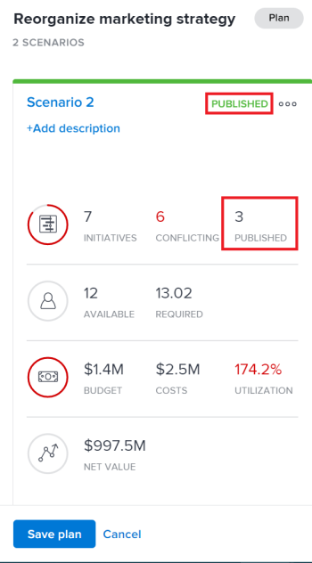

# Werk of creeer projecten bij door initiatieven in te publiceren [!DNL Scenario Planner]

Een scenario publiceren vanuit het dialoogvenster [!DNL Adobe Workfront Scenario Planner] verwezenlijkt het volgende:

* Creeert projecten van de initiatieven op het scenario en verbindt hen samen.
* Werkt projecten bij die al gekoppeld zijn aan initiatieven over het scenario met informatie uit het gekoppelde initiatief. Projecten kunnen ook aan initiatieven worden gekoppeld wanneer u ze in een plan importeert. Zie voor meer informatie [Projecten importeren naar plannen in het dialoogvenster [!DNL Scenario Planner]](../scenario-planner/import-projects-to-plans.md)

## Toegangsvereisten

U moet het volgende hebben:

<table style="table-layout:auto"> 
 <col> 
 <col> 
 <tbody> 
  <tr> 
   <td> 
[!DNL Adobe Workfront] plan*
 </td> 
   <td>[!UICONTROL Business] of hoger</td> 
  </tr> 
  <tr> 
   <td> 
[!DNL Adobe Workfront] licentie*
 </td> 
   <td> 
[!UICONTROL Review] of hoger
 </td> 
  </tr> 
  <tr> 
   <td>Product </td> 
   <td> 
U moet een extra licentie aanschaffen voor de [!DNL Adobe Workfront Scenario Planner] om toegang te krijgen tot de functionaliteit die in dit artikel wordt beschreven.
 
Voor informatie over het verkrijgen van de [!DNL Workfront Scenario Planner], zie <a href="../scenario-planner/access-needed-to-use-sp.md" class="MCXref xref">Toegang nodig om de [!DNL Scenario Planner]</a>. 
 </td> 
  </tr> 
  <tr data-mc-conditions=""> 
   <td> 

 
Toegangsniveau*
 </td> 
   <td> 
    <ul> 
    <li>[!UICONTROL Edit] toegang voor [!DNL Scenario Planner] en projecten</li></ul>

<b>OPMERKING</b>

Als u nog steeds geen toegang hebt, vraagt u [!DNL Workfront] beheerder als zij extra beperkingen in uw toegangsniveau plaatsen. Voor informatie over hoe een [!DNL Workfront] de beheerder kan uw toegangsniveau veranderen, zie <a href="../administration-and-setup/add-users/configure-and-grant-access/create-modify-access-levels.md" class="MCXref xref">Aangepaste toegangsniveaus maken of wijzigen</a>.
 </td>
</tr> 
  <tr data-mc-conditions=""> 
   <td> 
Objectmachtigingen
 </td> 
   <td> 
    <ul> 
     <li>[!UICONTROL Manage] machtigingen voor het abonnement </li> 
     <li>[!UICONTROL Manage] machtigingen voor gepubliceerde projecten</li> 
    </ul> 
Voor informatie over het vragen van extra toegang tot projecten, zie <a href="../workfront-basics/grant-and-request-access-to-objects/request-access.md" class="MCXref xref">Toegang tot objecten aanvragen </a>.
 
Voor informatie over het vragen van om extra toegang tot een plan, zie <a href="../scenario-planner/request-access-to-plan.md" class="MCXref xref">Toegang aanvragen tot een abonnement in de [!DNL Scenario Planner]</a>.
 </td> 
  </tr> 
 </tbody> 
</table>

&#42;Neem contact op met uw [!DNL Workfront] beheerder.

Voor meer informatie over de toegang tot de [!DNL Workfront Scenario Planner], zie [Toegang nodig om de [!DNL Scenario Planner]](../scenario-planner/access-needed-to-use-sp.md).

## Vereisten

Voordat u begint:

* U moet een abonnement maken en opslaan voordat u er initiatieven van kunt publiceren.
* Toestaan de gebruikers om projecten tot stand te brengen zonder een malplaatje te gebruiken dat moet worden toegelaten in uw gebied van de Voorkeur van het Project van de Opstelling. Zie voor meer informatie [Projectvoorkeuren voor het hele systeem configureren](/help/quicksilver/administration-and-setup/set-up-workfront/configure-system-defaults/set-project-preferences.md).

## Overwegingen bij het publiceren van initiatieven voor projecten

* U kunt slechts één scenario van een plan publiceren.
* Eén initiatief kan slechts aan één project worden gekoppeld.
* Eén project kan aan meerdere initiatieven worden gekoppeld wanneer de initiatieven tot verschillende plannen behoren.

  >[!TIP]
  >
  >Wanneer een project op veelvoudige plannen bestaat en u informatie aan het project van alle plannen publiceert, publiceert het recentste publiceren overschrijft het bestaande [!DNL Scenario Planner] informatie over het project.

* Als er initiatieven in het kader van het plan worden genomen door projecten in het plan te importeren, worden de gekoppelde projecten door de publicatie van het initiatief ook bijgewerkt met informatie over initiatieven.

  >[!TIP]
  >
  >U kunt het zelfde project in veelvoudige plannen invoeren. Publiceren kan de initiatiefinformatie over een project overschrijven die aan meerdere initiatieven is gekoppeld.

  Voor informatie over het creëren van initiatieven door projecten in te voeren, zie [Projecten importeren naar plannen in het dialoogvenster [!DNL Scenario Planner]](../scenario-planner/import-projects-to-plans.md).

* Wijzigingen die in het project worden aangebracht, worden niet doorgevoerd in het gekoppelde initiatief.

## Initiatieven publiceren

>[!IMPORTANT]
>
>Als u wijzigingen aanbrengt aan initiatieven in het plan, inclusief het oplossen van conflicten, moet u het initiatief opnieuw publiceren om de nieuwe informatie over het project zichtbaar te maken. Deze informatie geeft alleen weer over de projecten in verband met initiatieven wanneer u het desbetreffende initiatief publiceert. Voor informatie over het oplossen van conflicten tussen initiatieven, zie [Initiatiefconflicten oplossen in de [!DNL Scenario Planner]](../scenario-planner/resolve-conflicts-in-sp.md)

1. Klik op de knop **[!UICONTROL Main Menu]** pictogram  in de rechterbovenhoek van Workfront klikt u op **[!UICONTROL Scenarios]**
1. (Optioneel en voorwaardelijk) Als u vanuit een bestaand abonnement wilt publiceren, klikt u op de knop **[!UICONTROL Filter]** pictogram  in de rechterbovenhoek van het abonnement en selecteer een van de volgende opties:

   <table style="table-layout:auto"> 
    <col> 
    <col> 
    <tbody> 
     <tr> 
      <td role="rowheader">[!UICONTROL All]</td> 
      <td>Toont alle plannen die u bezit of met u wordt gedeeld. Dit is de standaardinstelling. </td> 
     </tr> 
     <tr> 
      <td role="rowheader">[!UICONTROL My plans]</td> 
      <td>Geeft de plannen weer die u hebt gemaakt.</td> 
     </tr> 
     <tr> 
      <td role="rowheader">[!UICONTROL Shared with me]</td> 
      <td> 
Hier worden de plannen weergegeven die u niet hebt gemaakt, maar met u hebt gedeeld.
 
Belangrijk: u moet [!UICONTROL Manage] machtigingen voor plannen die met u worden gedeeld om deze te kunnen publiceren. 
 </td> 
     </tr> 
    </tbody> 
   </table>

   

1. (Optioneel) Klik op de knop **[!UICONTROL Search]** pictogram  en typ de naam van een abonnement om het snel in de lijst te vinden.
1. (Voorwaardelijk) om van een nieuw plan te publiceren, creeer een plan.

   Voor informatie over het maken van plannen raadpleegt u [Plannen maken en bewerken in het dialoogvenster [!DNL Scenario Planner]](../scenario-planner/create-and-edit-plans.md) .

1. (Optioneel) Klik op de naam van een bestaand plan en maak nieuwe scenario&#39;s voor het plan.

   Voor informatie over het creëren van scenario&#39;s voor een plan, zie [Plan-scenario&#39;s maken en vergelijken in het dialoogvenster [!DNL Scenario Planner]](../scenario-planner/create-and-compare-scenarios-for-a-plan.md).

1. (Optioneel) Werk de initiatieven van een bestaand of een nieuw plan bij of maak nieuwe.

   Zie voor informatie over het maken van initiatieven [Initiatieven maken en bewerken in het dialoogvenster [!DNL Scenario Planner]](../scenario-planner/create-and-edit-initiatives.md).

1. Klik op **[!UICONTROL Save plan]**.
1. Selecteer het scenario u van het **[!UICONTROL Initial scenario]** vervolgkeuzemenu en vervolgens op **[!UICONTROL Go to Publish]**  in de rechterbovenhoek.

   of

   Klikken **[!UICONTROL Compare scenarios]** Houd de muisaanwijzer boven de scenario-kaart die u wilt publiceren en klik vervolgens op **[!UICONTROL Go to Publish]** .

   De [!UICONTROL Publish initiatives] wordt weergegeven met een lijst van alle initiatieven in het scenario. Als een van de initiatieven eerder is gepubliceerd, wordt het projectpictogram weergegeven  worden weergegeven na hun naam en de **[!UICONTROL Last published]** datum wordt ingevuld in de lijst.

   >[!TIP]
   >
   >De initiatieven die door het invoeren van projecten zijn gecreeerd tonen ook het projectpictogram  rechts van hun naam

   

1. (Optioneel en voorwaardelijk) Als u vanuit een bestaand abonnement wilt publiceren, klikt u op de knop **[!UICONTROL Filter]** pictogram  in de rechterbovenhoek van het abonnement en selecteer een van de volgende opties:

   <table style="table-layout:auto"> 
    <col> 
    <col> 
    <tbody> 
     <tr> 
      <td role="rowheader">[!UICONTROL All]</td> 
      <td>Toont alle initiatieven van het geselecteerde scenario. </td> 
     </tr> 
     <tr> 
      <td role="rowheader">[!UICONTROL Published]</td> 
      <td>Geeft initiatieven weer die u of een andere gebruiker eerder heeft gepubliceerd. </td> 
     </tr> 
     <tr> 
      <td role="rowheader">[!UICONTROL Unpublished]</td> 
      <td> 
Geeft ongepubliceerde initiatieven weer. 
 </td> 
     </tr> 
    </tbody> 
   </table>

   

1. (Optioneel) Klik op de knop **[!UICONTROL Search]** pictogram  en typ de naam van een initiatief om het snel in de lijst te vinden.
1. Selecteer een of meerdere initiatieven om projecten te publiceren en te maken of bij te werken, en klik vervolgens op **[!UICONTROL Publish initiatives]**.

   Dit leidt tot een nieuw project van elke geselecteerde initiatieven of werkt de bestaande verwante projecten bij, als de gepubliceerde initiatieven reeds met een project verbonden waren.

   >[!TIP]
   >
   >Nieuwe projecten hebben dezelfde naam als de gepubliceerde initiatieven.

1. (Voorwaardelijk) Voer een van de volgende handelingen uit:

   * Als u een initiatief hebt gepubliceerd, klikt u op **[!UICONTROL See associated project]** het project te openen dat is gemaakt of bijgewerkt op basis van het initiatief.
   * Als u meerdere initiatieven hebt gepubliceerd, klikt u op **[!UICONTROL See associated projects]** een lijst op te stellen van projecten die zijn gepubliceerd op basis van initiatieven . [!DNL Workfront] past de [!DNL Scenario Planner] Projecten filteren standaard naar de lijst met projecten. De projecten die het laatst zijn gepubliceerd, worden boven aan de lijst weergegeven.

     

1. Ga naar de volgende gebieden om initiatiefinformatie over het project te bekijken:

   * **De [!UICONTROL Updates] sectie**: Er wordt een update gepubliceerd om aan te geven dat het project is gemaakt of bijgewerkt op basis van het initiatief. De update bevat de naam van het initiatief dat het project heeft gemaakt of bijgewerkt en de gekoppelde naam van het plan dat het initiatief bevat. U kunt op de naam van het abonnement in de update klikken om het abonnement te openen in het dialoogvenster [!DNL Scenario Planner].

     

   * **De [!UICONTROL Overview] gebied van de [!UICONTROL Project Details] sectie**: Een nieuwe [!DNL Scenario Planner] op dit gebied wordt een gedeelte gemaakt dat informatie bevat van het gekoppelde initiatief.

     

     De volgende informatie over het initiatief wordt gepubliceerd in het [!DNL Scenario Planner] gebied van de [!UICONTROL Project Details] sectie:

     <table style="table-layout:auto"> 
      <col> 
      <col> 
      <tbody> 
       <tr> 
        <td role="rowheader">[!UICONTROL Initiative Duration] </td> 
        <td>De duur van het desbetreffende initiatief wanneer het project verband houdt met een initiatief. Dit veld kan niet worden bewerkt. </td> 
       </tr> 
       <tr> 
        <td role="rowheader">[!UICONTROL Last Published Date] </td> 
        <td>De datum waarop het project voor het laatst is gepubliceerd op basis van een overeenkomstig initiatief. </td> 
       </tr> 
       <tr> 
        <td role="rowheader">[!UICONTROL Initiative Start Date] </td> 
        <td>De eerste dag van de startmaand van het initiatief, wanneer het project aan een initiatief is gekoppeld. </td> 
       </tr> 
       <tr> 
        <td role="rowheader">[!UICONTROL Initiative End Date] </td> 
        <td>De laatste dag van de laatste maand van het initiatief, wanneer het project gekoppeld is aan een initiatief.  </td> 
       </tr> 
       <tr> 
        <td role="rowheader">[!UICONTROL Initiative Job Roles in FTEs and Hours] </td> 
        <td> 
Informatie over de bijbehorende functies en de tijdstoewijzingen voor het initiatief. Dit omvat:
 
         <ul> 
          <li>Functienaam</li> 
          <li>Aantal FTE's</li> 
          <li> 
Aantal uren voor alle VTE's
 
U kunt de hoeveelheid baanrollen schatten nodig voor uw plan of initiatief gebruikend uren of FTEs.
 
Zie voor meer informatie <a href="../scenario-planner/create-and-edit-plans.md" class="MCXref xref">Abonnementen maken en bewerken in Scenario Planner</a>. 
 </li> 
         </ul> 
      
<b>TIP</b>

     Als het aantal functies per maand in het initiatief verschilt, wordt in dit veld het maximale aantal rollen weergegeven dat nodig is voor het initiatief. Bijvoorbeeld, als u 1 Consultant voor Januari en 2 voor Februari nodig hebt, toont de kolom 2FTE en de overeenkomstige hoeveelheid uren voor 2 FTEs voor alle maanden.
 </td>
     </tr> 
      </tbody> 
     </table>

     >[!NOTE]
     >
     >Alle gebruikers met [!UICONTROL View] de toegang tot het project kan zien [!DNL Scenario Planner] in de [!UICONTROL Overview] gebied. U kunt bepalen of dit gebied wordt weergegeven in het dialoogvenster [!UICONTROL Details] met een lay-outsjabloon. Als gebruikers geen lay-outmalplaatje hebben verbonden aan hen, toont dit gebied door gebrek.
     >
     >   
     >   
     >   * Voor informatie over het toevoegen of verwijderen van gebieden in het dialoogvenster [!UICONTROL Details] sectie met een lay-outsjabloon, zie [De [!UICONTROL Details] weergeven met een lay-outsjabloon](../administration-and-setup/customize-workfront/use-layout-templates/customize-details-view-layout-template.md).
     >   * Voor meer informatie over het weergeven van informatie in het dialoogvenster [!UICONTROL Overview] gebied van de [!UICONTROL Project Details], zie [[!UICONTROL Manage] informatie in het project [!UICONTROL Overview] gebied](../manage-work/projects/manage-projects/understand-project-overview-area.md).
     >   
     >

   * **De [!UICONTROL Role Allocation] in het deelvenster [!UICONTROL Workload Balancer] of de takenlijst van het project** Betreft: Informatie over de toewijzing van rol aan het initiatief vult op dit gebied, naast de toewijzing van rol aan het project.

     Zie voor meer informatie [Overzicht van de afstemming van de toewijzingen van middelen tussen projecten en initiatieven](../scenario-planner/overview-reconcile-allocations-between-projects-initiatives.md).

     

     Wijzigingen in de data of middelen van het project hebben geen invloed op het desbetreffende initiatief of op de gebieden van het project die initiatiefinformatie bevatten.

   * **De [!UICONTROL Resource Budgeting] gebied van de [!UICONTROL Business Case] van het project**: Een nieuwe optie voor het beheer van projectbronnen met [!DNL Scenario Planner] informatie wordt toegevoegd in het [!UICONTROL Resource Budgeting] gebied van de [!UICONTROL Business Case] van het project.

     Zie voor meer informatie [Begrotingsmiddelen in de [!UICONTROL Business Case] met de [!DNL Scenario Planner]](../manage-work/projects/define-a-business-case/budget-resources-in-business-case-use-scenario-planner.md).

     

1. (Optioneel) Bekijk de volgende informatie in het dialoogvenster [!DNL Scenario Planner] nadat u een scenario hebt gepubliceerd:

   * Het gepubliceerde scenario wordt het eerste scenario nadat u initiatieven van het publiceert.
   * U kunt niet van een ander scenario publiceren nadat u een scenario minstens eens hebt gepubliceerd.
   * De [!UICONTROL Go to Publish] de optie wordt uit alle andere scenario&#39;s verwijderd nadat ten minste één initiatief uit een scenario is gepubliceerd.
   * Naast de projectpictogrammen van de gepubliceerde initiatieven in het plan wordt een groene indicator weergegeven.

     

   * Een groene &quot;Gepubliceerde&quot;indicatorvertoningen bij de bovenkant van het scenario en op de scenario kaart en het Gepubliceerde gebied wordt bevolkt op de scenario kaart die op het aantal initiatieven in het scenario wijst die zijn gepubliceerd.

     

     >[!TIP]
     >
     >Als alle projecten die uit de initiatieven van het scenario worden gepubliceerd, worden geschrapt, wordt de aanwijzing dat het scenario is gepubliceerd geschrapt. Zie voor meer informatie [Projecten verwijderen](../manage-work/projects/manage-projects/delete-projects.md).

1. (Optioneel) Werk de informatie over het initiatief bij en herhaal het hierboven beschreven proces om het initiatief opnieuw te publiceren en actualiseer de initiatiefinformatie over het gekoppelde project.

   Zie voor informatie over het bewerken van initiatieven [Initiatieven maken en bewerken in het dialoogvenster [!DNL Scenario Planner]](../scenario-planner/create-and-edit-initiatives.md).

