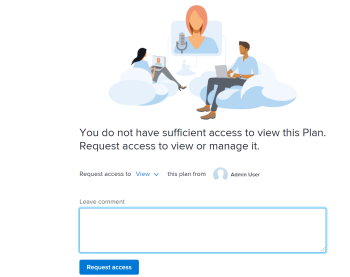

# Toegang aanvragen tot een abonnement in de [!DNL Scenario Planner]

U kunt toegang tot een abonnement aanvragen in de [!DNL Adobe Workfront Scenario Planner] als de koppeling naar het abonnement met u wordt gedeeld.

## Toegangsvereisten

U moet het volgende hebben:

<table style="table-layout:auto"> 
 <col> 
 <col> 
 <tbody> 
  <tr> 
   <td> 
[!DNL Adobe Workfront]<b> plan* </b> 
 </td> 
   <td>[!UICONTROL Business] of hoger</td> 
  </tr> 
  <tr> 
   <td> 
[!DNL Adobe Workfront]<b> license* </b> 
 </td> 
   <td> 
[!UICONTROL Review], [!UICONTROL Work] of [!UICONTROL Plan]
 </td> 
  </tr> 
  <tr> 
   <td><strong> Product* </strong> </td> 
   <td> 
U moet een extra licentie voor de [!DNL Adobe Workfront Scenario Planner] aanschaffen om toegang te krijgen tot de functionaliteit die in dit artikel wordt beschreven.
 
Voor informatie over het verkrijgen van [!DNL Workfront Scenario Planner], zie <a href="../scenario-planner/access-needed-to-use-sp.md" class="MCXref xref"> Toegang nodig om [!UICONTROL Scenario Planner]</a> te gebruiken. 
 </td> 
  </tr> 
  <tr data-mc-conditions=""> 
   <td><strong> het niveauconfiguraties van de Toegang* </strong> </td> 
   <td> 
Toegang tot de [!DNL Scenario Planner]
 
Opmerking: als u nog steeds geen toegang hebt, vraag dan aan de [!DNL Workfront] -beheerder of deze aanvullende beperkingen op uw toegangsniveau heeft ingesteld. Voor informatie over hoe een [!DNL Workfront] beheerder uw toegangsniveau kan veranderen, zie <a href="../administration-and-setup/add-users/configure-and-grant-access/create-modify-access-levels.md" class="MCXref xref"> tot douanetoegangsniveaus </a> leiden of wijzigen.
 </td> 
  </tr> 
 </tbody> 
</table>

&#42; om te weten te komen welk plan, licentietype, of toegang u hebt, of als uw bedrijf [!DNL Workfront Scenario Planner] heeft gekocht, contacteer uw [!DNL Workfront] beheerder.

## Vereisten

Voordat u toegang kunt aanvragen tot een abonnement in de [!DNL Scenario Planner] , moet u over het volgende beschikken:

* Een link naar het plan.

>[!NOTE]
>
>Als u geen toegangsniveaurechten voor [!DNL Scenario Planner] hebt en u probeert om tot een plan van een verbinding toegang te hebben, kunt u geen toegang tot het plan verzoeken. In plaats daarvan wordt een scherm weergegeven waarin u wordt geïnformeerd contact op te nemen met de [!DNL Workfront] -beheerder.

## Toegang aanvragen voor abonnementen in de [!DNL Workfront Scenario Planner]

Als u nog geen toestemmingen aan een plan hebt en u aan het van een verbinding navigeert die met u wordt gedeeld, toont het scherm om u mee te delen dat u geen toestemmingen hebt om het plan te bekijken. U wordt ertoe aangezet om toestemmingen van de planmaker te verzoeken.

>[!TIP]
>
>U kunt alleen machtigingen aanvragen bij de eigenaar of maker van een abonnement. U kunt geen toestemmingen van andere gebruikers vragen die ook toegang tot het plan hebben.

Machtigingen aanvragen:

1. Klik op een koppeling naar een abonnement.

   

1. Geef in het vervolgkeuzemenu **[!UICONTROL Request access to]** aan welk niveau van de machtigingen u wilt verlenen. Selecteer een van de volgende opties:

   * [!UICONTROL View]
   * [!UICONTROL Manage]

   U kunt geen toestemming vragen die hoger is dan uw toegangsniveau tot [!DNL Scenario Planner]. U kunt bijvoorbeeld geen [!UICONTROL Manage] -machtigingen aanvragen als u toegang tot Weergave hebt tot [!DNL Scenario Planner] .

   Voor informatie over de verschillende niveaus van toestemmingen, zie [ een plan in  [!DNL Scenario Planner]](../scenario-planner/share-a-plan.md) delen.

   Voor informatie over een beheerder van Workfront kan toegang tot [!DNL Scenario Planner] beheren, zie [ de toegang van de Verlening tot  [!DNL Scenario Planner]](../administration-and-setup/add-users/configure-and-grant-access/grant-access-sp.md).

1. (Optioneel) Voer in de **[!UICONTROL Leave comment box]** een opmerking of aanvraag in en klik op **[!UICONTROL Request access]** .

   Het volgende gebeurt:

   * [!DNL Workfront] verzendt een e-mailbericht naar de eigenaar van het abonnement waar zij de gevraagde machtigingen kunnen verlenen.\
     

   * Nadat de eigenaar van het abonnement de aangevraagde machtigingen heeft verleend, ontvangt u een e-mail met de mededeling dat de machtigingen zijn verleend als voor de beheerder van [!DNL Workfront] de optie Object delen is ingeschakeld in uw systeem en u schakelt de e-mailmelding van [!UICONTROL Someone shares an object with me] in uw profiel in.

     

   * U kunt ook machtigingen verlenen voor plannen vanuit [!UICONTROL Home] en vanuit de mobiele app van [!DNL Workfront] .

   Voor informatie over het toelaten van systeemberichten, zie [ gebeurtenisberichten voor iedereen in het systeem ](../administration-and-setup/manage-workfront/emails/configure-event-notifications-for-everyone-in-the-system.md) vormen.

   Voor informatie over het toelaten van berichten in uw profiel, zie [ Meldingen: Diverse informatie ](../workfront-basics/using-notifications/notifications-misc-information.md).
