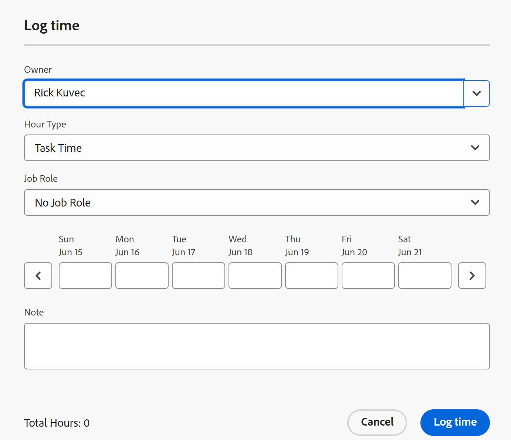

# Logtijd

<!--Audited: 12/2023-->

<!--remove all preview and production references from this article with 23.3 release-->

<!--
The highlighted information on this page refers to functionality not yet generally available. It is available only in the Preview environment for all customers. After the monthly releases to Production, the same features are also available in the Production environment for customers who enabled fast releases.   
For information about fast releases, see [Enable or disable fast releases for your organization](../../administration-and-setup/set-up-workfront/configure-system-defaults/enable-fast-release-process.md). 

For information about the current release schedule, see [Fourth Quarter 2023 release overview](../../product-announcements/product-releases/23-q4-release-activity/23-q4-release-overview.md) 
-->

U kunt de tijd voor het werk in Adobe Workfront registreren om op het aantal uren te wijzen u het werken aan hen doorwerkt. U kunt tijd ook registreren die niet met het werk, zoals vakantie, zieke tijd, of tijd verwant is u in vergaderingen doorbrengt. De tijd u registreert toont in uw timesheet.

Voor meer informatie over het type uren dat u kunt aanmelden in Workfront, raadpleegt u [Uurtypen beheren](../../administration-and-setup/set-up-workfront/configure-timesheets-schedules/hour-types.md).

## Toegangsvereisten

<!--drafted for P&P - replace the table:

<table style="table-layout:auto"> 
 <col> 
 <col> 
 <tbody> 
  <tr> 
   <td role="rowheader">Adobe Workfront plan*</td> 
   <td> 
Any
 </td> 
  </tr> 
  <tr> 
   <td role="rowheader">Adobe Workfront license*</td> 
   <td> 
Current license: Light or higher

   
Legacy license: 
   <ul><li>Review or higher to log General Hours in a timesheet</li>
   <li>Work or higher to log hours on a project, task, or issue</li></ul> </td> 
  </tr> 
  <tr> 
   <td role="rowheader">Access level configurations*</td> 
   <td> 
Edit access to the type of work item you log time for 
 
For example, you need Edit access to Issues, to log time for issues
 
If you still don't have access, ask your Workfront administrator if they set additional restrictions in your access level. For information on how a Workfront administrator can modify your access level, see <a href="../../administration-and-setup/add-users/configure-and-grant-access/create-modify-access-levels.md" class="MCXref xref">Create or modify custom access levels</a>.
 </td> 
  </tr> 
  <tr> 
   <td role="rowheader">Object permissions</td> 
   <td> 
Contribute or higher permissions on the work item you log time for that includes permissions to Log Hours
 
For information on requesting additional access, see <a href="../../workfront-basics/grant-and-request-access-to-objects/request-access.md" class="MCXref xref">Request access to objects </a>.
 </td> 
  </tr> 
 </tbody> 
</table>
-->

U moet de volgende toegang hebben om de stappen in dit artikel uit te voeren en de Specifieke uren van het Project te registreren:

<table style="table-layout:auto"> 
 <col> 
 <col> 
 <tbody> 
  <tr> 
   <td role="rowheader">Adobe Workfront-abonnement*</td> 
   <td> 
Alle
 </td> 
  </tr> 
  <tr> 
   <td role="rowheader">Adobe Workfront-licentie*</td> 
   <td> 
Nieuw:<ul><li>Licht of hoger aan logboek Algemene Uren in een timsheet</li>

   <li> Norm of hoger om uren op een project, een taak of een kwestie te registreren</li></ul>

   
of

   
Huidige:<ul><li>Controle of hoger aan logboek Algemene Uren in een timesheet</li>

   <li> Werk of hoger om uren aan een project, een taak of een kwestie te registreren</li></ul>

   </td> 
  </tr> 
  <tr> 
   <td role="rowheader">Configuraties op toegangsniveau*</td> 
   <td> 
Geef toegang tot het type van het werkpunt uit u tijd voor registreert 
 
U hebt bijvoorbeeld toegang tot problemen bewerken nodig om u aan te melden bij problemen
 
Als u nog steeds geen toegang hebt, vraagt u de Workfront-beheerder of deze aanvullende beperkingen op uw toegangsniveau instelt. Voor informatie over hoe een beheerder van Workfront uw toegangsniveau kan wijzigen, zie <a href="../../administration-and-setup/add-users/configure-and-grant-access/create-modify-access-levels.md" class="MCXref xref">Aangepaste toegangsniveaus maken of wijzigen</a>.
 </td> 
  </tr> 
  <tr> 
   <td role="rowheader">Objectmachtigingen</td> 
   <td> 
Contribute of hogere machtigingen voor het werkitem waarvoor u de tijd registreert, zijn onder meer machtigingen voor Log Hours.
 
Voor informatie over het aanvragen van aanvullende toegang raadpleegt u <a href="../../workfront-basics/grant-and-request-access-to-objects/request-access.md" class="MCXref xref">Toegang tot objecten aanvragen </a>.
 </td> 
  </tr> 
 </tbody> 
</table>

*Neem contact op met uw Workfront-beheerder om te weten te komen welk abonnement, licentietype of toegang u hebt.

## Overwegingen bij het aanmelden in Workfront

* U kunt tijd voor projecten, taken, of kwesties registreren, of u kunt tijd in uw timesheet direct registreren.

  Voor informatie over het creëren van timesheets, zie [Een timesheet voor eenmalig gebruik maken](../../timesheets/create-and-manage-timesheets/create-tmshts.md).

* Alle tijd die door hulpmiddelen buiten timesheet wordt geregistreerd verschijnt in timesheet voor de overeenkomstige tijdspanne.
* Taken en problemen met een project dat niet actueel is, worden niet vooraf in een tijdspagina geplaatst.
* De tijd die in timesheet wordt geregistreerd wordt onmiddellijk toegepast op de taak, de kwestie, of het project.
* De tijdbladen bevatten de totale tijd voor alle geregistreerde datums. Weekends worden altijd opgenomen, zelfs als tijdlijnberekeningen zijn geconfigureerd om ze uit te sluiten (zoals beschreven in [Projectvoorkeuren voor het hele systeem configureren](../../administration-and-setup/set-up-workfront/configure-system-defaults/set-project-preferences.md)).
* Het maximumaantal punten dat in een timesheet wordt getoond is 45. Als er meer dan 45 punten zijn de waarvan data het timesheet tijdkader aanpassen, slechts de onlangs bijgewerkte punten tonen.
* Uur-items die in factureringsrecords zijn opgenomen, worden grijs weergegeven en kunnen niet worden bewerkt in de tijdpagina. Zie voor meer informatie [Factureringsrecords maken](../../manage-work/projects/project-finances/create-billing-records.md).
* De persoonlijke taken tonen niet in timesheet door gebrek. De persoonlijke taken tonen in timesheet slechts wanneer zij tijd het programma wordt geopend. Nadat u de tijd op een persoonlijke taak registreert, kunt u de taak aan timesheet vastzetten en het zal op timesheet blijven als het vastgezet blijft. Zie voor meer informatie [Werkitems maken vanuit het gebied Home](../../workfront-basics/using-home/using-the-home-area/create-work-items-in-home.md).

## Logtijd {#log-time-section}

U kunt zich in Workfront aanmelden in de volgende gebieden:

* [Tijdschema](#timesheet)
* [Home](#home)
* [Project, taak of uitgave](#project-task-or-issue)
* [Het deelvenster Samenvatting](#summary-panel)
* [Borden](#boards)
* [Mobiele app](#mobile-app)

### Tijdschema {#timesheet}

#### De tijd van het logboek op een timesheet {#log-time-on-a-timesheet}

U kunt tijd aan de volgende punten in timesheet registreren:

* Taken, problemen en projecten die vooraf zijn ingevuld, worden automatisch weergegeven op basis van de manier waarop uw Workfront-beheerder de voorkeuren voor de tijdpagina instelt. Voor informatie over hoe timesheets vooraf ingevuld zijn, zie [Voorkeuren voor tijdpagina&#39;s en uren configureren](../../administration-and-setup/set-up-workfront/configure-timesheets-schedules/timesheet-and-hour-preferences.md).

  Alleen de taken en problemen die aan u zijn toegewezen, worden vooraf ingevuld in uw overzicht. De taken en de kwesties die aan uw teams of baanrollen worden toegewezen bevolken automatisch niet uw timesheet.

  Als u op het item klikt op het item dat aan uw teams is toegewezen, wordt het item aan u toegewezen en wordt het item in uw tijdspagina weergegeven.

* Taken, problemen of projecten die u handmatig toevoegt.
* Taken, kwesties, of projecten waarvoor u reeds tijd elders in Workfront registreerde.
* Algemene tijd (vakantie, opleiding, overheadtijd).

>[!NOTE]
>
>Gebruikers die een tijdlijnprofiel hebben toegewezen, kunnen het gedeelte Timesheets zien en de algemene uren van het logbestand. Nochtans, kunnen zij geen uren op om het even welke taken of kwesties registreren die aan hen worden toegewezen die op timesheet verschijnen.

Aan logboektijd op een timesheet:

1. Klik op de knop **[!UICONTROL Main Menu]** pictogram  in de rechterbovenhoek van Adobe Workfront of (indien beschikbaar) op de knop **[!UICONTROL Main Menu]** pictogram  in de linkerbovenhoek

1. Klikken [!UICONTROL **Timesheets**]. Uw huidige timesheet wordt standaard weergegeven.
   

1. (Optioneel) Klik op de knop **volledig scherm** pictogram  om timesheet op volledig-schermwijze te tonen, dan klik **afsluiten op volledig scherm**  om terug te keren naar de tijdpagina.

   <!-- drafted for the resize columns in timesheet story: 1. (optional) Click on the separator lines between weeks or between the time frame area and the work item area to resize the columns of the timesheet.-->

1. (Optioneel) Als u een project, taak of uitgave wilt toevoegen aan de tijdpagina, klikt u op de knop **Item toevoegen** vervolgkeuzemenu in de linkerbovenhoek van de tijdpagina en klik vervolgens op **Projecten toevoegen**, **Taken toevoegen**, of **Problemen toevoegen**.

   Er wordt een lijst met projecten, taken of problemen weergegeven.

   <!--drafted for full screen mode for add projects story - align it with the rest of the steps when you enable this:: 1. (Optional) Click the **full-screen** icon  to display the list of objects in full-screen mode.-->

1. (Optioneel) Klik op het zoekpictogram  om naar een specifiek punt te zoeken gebruikend een sleutelwoord om aan timesheet toe te voegen.

1. (Optioneel) Vouw de vervolgkeuzemenu&#39;s voor het filter, de weergave of de groepering uit om er een toe te passen of aan te passen en om de gewenste iteminformatie weer te geven.

1. Selecteer een of meerdere items in de lijst en klik op **Toevoegen**.

   Als u minder dan 50 punten in één keer hebt toegevoegd, worden de punten toegevoegd aan timesheet. De taken en de kwesties zijn vermeld onder de naam van het project.

   >[!NOTE]
   >
   >Wanneer u taken of kwesties aan timesheet toevoegt, wordt het project ook toegevoegd.

1. (Voorwaardelijk) als u 50 of meer punten in één keer toevoegt, een bevestigingsbericht die het aantal punten toont die aan uw timesheet worden toegevoegd.

   Klikken **Alles toevoegen** om alle items toe te voegen of klik op **Annuleren** om het toevoegen van de geselecteerde items te stoppen, **Annuleren** om de lijst met items te sluiten.

   De taken en de kwesties zijn vermeld onder de naam van het project.

   >[!NOTE]
   >
   >De punten die u manueel aan timesheet toevoegt worden vastgezet en zullen op huidige en toekomstige chronologie blijven tot u hen manueel losmaakt om hen te verwijderen. Voor informatie over het ongedaan maken van punten om hen uit timesheet te verwijderen, ga met Stap 10 verder.

   <!--(ensure this stays accurate)-->

1. (Optioneel) Klik op de knop **Samenvouwen**  of **Uitbreiden**  pictogrammen naast de projectnaam om de lijst met taken en problemen voor het project weer te geven of te verbergen.

   >[!TIP]
   >
   >   Wanneer het gebruiken van een standaardQWERTY toetsenbord, en na het klikken van de naam van een project in timesheet, druk de volgende reeks sleutels om het project samen te vouwen of uit te breiden:
   >   * Het project uitbreiden en zijn het werkpunten tonen:
   >     * Shift + Alt + pijl-omhoog voor Windows-computers
   >     * Shift + Option + pijl-omhoog voor Mac-computers
   >   * Het project samenvouwen en de bijbehorende werkitems verbergen:
   >     * Shift + Alt + pijl-omlaag voor Windows-computers
   >     * Shift + Option + pijl-omlaag voor Mac-computers.

1. (Optioneel) Als u een item dat automatisch wordt weergegeven op het tijdblad handmatig wilt vastzetten, houdt u de muisaanwijzer boven de naam van het item en klikt u op de knop **speld** pictogram .

   >[!TIP]
   >
   >   Wanneer u een standaard QWERTY-toetsenbord gebruikt nadat u op een item in de tijdpagina hebt geklikt, drukt u op de volgende toetsen om een item vast te zetten:
   >   * Option + P voor zowel Windows- als Mac-computers.

1. (Optioneel) Klik op het zoekpictogram  en beginnen een sleutelwoord te typen om een project, een taak, of een kwestie op timesheet te vinden.

1. (Voorwaardelijk) Als uw Workfront of groepsbeheerder de optie **Taken handmatig toewijzen aan uren** Selecteer een taakrol in het keuzemenu. De rol die wordt gespecificeerd wanneer u aan de het werkpuntvertoningen door gebrek wordt toegewezen. Als u geen rol op het voorwerp wordt toegewezen, toont uw Primaire Rol als gebrek. Raadpleeg het artikel voor meer informatie over deze instelling [Voorkeuren voor tijdpagina&#39;s en uren configureren](../../administration-and-setup/set-up-workfront/configure-timesheets-schedules/timesheet-and-hour-preferences.md).

   

1. (Optioneel) Klik op de knop **+** om nog een rij toe te voegen, selecteert u vervolgens een nieuw uurtype in het keuzemenu in het dialoogvenster [!UICONTROL Hour Type] kolom aan logboektijd voor een verschillend uurtype.

   

   >[!TIP]
   >
   >   Afhankelijk van uw besturingssysteem of browser en wanneer u een standaard QWERTY-toetsenbord gebruikt, drukt u op de volgende toetsen om nog een rij toe te voegen:
   >   * Ctrl + Option + voor Windows-computers
   >   * Cmd + Option + + voor Mac-computers

   De types van uren zijn beschikbaar afhankelijk van wat op het systeem, het project, en gebruikersniveaus, zoals die in wordt beschreven [Bepaal uurtypes en beschikbaarheid voor timesheets](define-hour-types-and-availability.md).

   Het uurtype kan niet worden veranderd nadat een timesheet wordt gesloten.

   >[!TIP]
   >
   >Als u eerder registreerde tijd en het geselecteerde uurtype nu wordt gedeactiveerd, wordt de volledige rij voor de geregistreerde tijd gedimd. Als u een ander uurtype selecteert en de pagina vernieuwt, wordt de optie voor het gedeactiveerde uurtype verwijderd uit de vervolgkeuzelijst, zodat u geen extra uren aan dat uurtype kunt toevoegen.
   >
   >Denk na toevoegend een nieuwe lijn voor het het werkpunt u extra tijd voor en het selecteren van een nieuw uurtype wilt registreren, als u het gedeactiveerde uurtype verbonden aan de afgelopen geregistreerde tijd wilt houden.

1. Klik op de knop **delete** pictogram   naast de taakrol om deze te verwijderen. De tijd die voor de rol wordt geregistreerd, wordt ook verwijderd.

   >[!TIP]
   >
   >   Afhankelijk van uw besturingssysteem of browser en wanneer u een standaard QWERTY-toetsenbord gebruikt, drukt u op de volgende toetsen om een rij te verwijderen:
   >   * Ctrl + Option + - voor Windows-computers
   >   * Cmd + Option + - voor Mac-computers

1. Geef op hoeveel tijd u zich op een bepaalde dag in het tijdlijngedeelte van het tijdlijnvak wilt aanmelden en klik vervolgens buiten het uurvak om het uuritem op te slaan. De uren worden automatisch opgeslagen. De rij waarvoor u logboektijd wordt benadrukt in lichtblauw en de doos van de ureningang wordt geschetst in donkerblauw.

   

   U meldt de tijd in uren of dagen. Dit plaatsen wordt gevormd door gebruikers met een vergunning van het Plan of de systeembeheerder, zoals die in wordt beschreven [Configureer of de tijd uren of dagen is aangemeld](../../timesheets/config-timesheet-prefs/config-time-logged-hrs-days.md).

   >[!IMPORTANT]
   >
   >U moet timesheet manueel bewaren als om het even welke volgende scenario&#39;s voorkomen:
   >
   >* De rol van de baan verbonden aan tijd die u eerder registreerde is veranderd en **Taken handmatig toewijzen aan uren** instellen is uitgeschakeld. De tijd van het registreren voor nieuwe data zal het met een verschillende baanrol associëren.
   >   
   >   Als de rol is gewijzigd en de **Taken handmatig toewijzen aan uren** Als deze instelling is ingeschakeld, kunt u de tijd vastleggen of de rol bijwerken en worden uw wijzigingen automatisch opgeslagen.
   >
   >* De taakrol die aan een taak of kwestie wordt toegewezen is verschillend dan de baanrol de timesheet eigenaar registreert tijd met <!--or assigned to them_ this last  piece came from a Support note but but sure what role it's referring to. Leaving it out for now.-->.
   >
   >De tijdpagina bespaart de tijd automatisch opnieuw wanneer er geen conflicterende ingangen meer tussen de twee rollen zijn.
   >

1. (Optioneel) Geef de hoeveelheid overwerk op in het veld Overwerk in de koptekst van het tijdblad.

   >[!TIP]
   >
   >U kunt geen groter aantal overuren dan de huidige totale uren op timesheet registreren. Bijvoorbeeld, als u 7 uren op timesheet tot dusver het programma opende, kunt u 8 uren van overwerk niet registreren.

1. (Optioneel) Klik op **Opmerking** om een opmerking toe te voegen voor het invoeren van het uur.

   

   >[!TIP]
   >
   >   Als u een standaard QWERTY-toetsenbord gebruikt nadat u op het invoervak voor uren hebt geklikt, drukt u op de volgende toetsen om het opmerkingsvak te openen:
   >   * Shift + F2 voor zowel Windows- als Mac-computers.

1. Klikken **Gereed** om de opmerking op te slaan.

   >[!TIP]
   >
   >   Als u een standaard QWERTY-toetsenbord gebruikt, drukt u vanuit het vak Opmerking op de volgende toetsen om de opmerking op te slaan:
   >   * Ctrl + Enter voor Windows-computers.
   >   * Cmd + Return voor Mac-computers.

1. (Optioneel) Klik op **Opmerkingen tonen** in de werkbalk om opmerkingen over het ingangspunt in uren weer te geven onder het werkitem.

   

   >[!TIP]
   >
   >   Alle wijzigingen die u aanbrengt in de tijdpagina, worden automatisch opgeslagen.

1. (Optioneel) Klik op de rij van een taak of uitgave en klik vervolgens op **Samenvatting openen** in de rechterbovenhoek van het tijdspad om een update toe te voegen of om informatie over de taak of kwestie bij te werken. Het deelvenster Samenvatting wordt aan de rechterkant geopend.

   

   Uw update wordt weergegeven in het gedeelte Updates van het werkitem dat is gekoppeld aan de geregistreerde tijd.

   >[!TIP]
   >
   >U kunt geen opmerkingen maken over projecten of de items voor algemene tijd.

1. Klikken [!UICONTROL **Samenvatting sluiten**] om het deelvenster Samenvatting te sluiten en terug te keren naar de tijdpagina.

1. (Optioneel) Klik op [!UICONTROL **Updates**] in het linkerpaneel, dan voeg een update aan timesheet toe. Ga voor meer informatie over Workfront-updates naar [Werk bijwerken](../../workfront-basics/updating-work-items-and-viewing-updates/update-work.md).

   

1. (Optioneel) Ga terug naar de **Tijdschema** te sluiten of uw timesheet in te dienen.

   * **Sluiten**: Sluit de tijdpagina wanneer u klaar bent met het bijwerken. Deze optie is alleen beschikbaar wanneer uw tijdspagina niet aan een fiatteur is gekoppeld.

   * **Ter goedkeuring indienen:** Deze optie is beschikbaar slechts als er een fiatteur op timesheet is. Sla uw wijzigingen op en verzend deze ter goedkeuring. U kunt de tijdpagina openen nadat u deze hebt gesloten door op **Herstellen**, indien nog geen goedkeuring is verleend. Zie voor meer informatie [Een tijdschema ter goedkeuring indienen](../../timesheets/create-and-manage-timesheets/submit-timesheet-for-approval.md).

   * **Afwijzen**: Deze optie wordt weergegeven wanneer u een fiatteur van het tijdspad bent en het tijdblad ter goedkeuring aan u is voorgelegd. Als u erop klikt, wordt de status van de tijdlijn gewijzigd in Geweigerd en blijft de tijdlijn geopend.

   * **Goedkeuren**: Deze optie wordt weergegeven wanneer u een fiatteur van het tijdspad bent en het tijdblad ter goedkeuring aan u is voorgelegd. Als u erop klikt, wordt de status van de tijdlijn gewijzigd in Goedgekeurd en wordt de tijdlijn gesloten.

   >[!TIP]
   >
   >De opties Afwijzen en Goedkeuren worden ook op uw tijdspagina weergegeven wanneer u een systeembeheerder bent en het tijdsplaat is gekoppeld aan een fiatteur.

1. (Voorwaardelijk) Als u of gesloten of uw timesheet voor goedkeuring hebt voorgelegd, klik één van de volgende opties:

   * **Opnieuw openen**: Deze optie is beschikbaar voor timesheets die u reeds hebt gesloten en die geen fiatteurs, of timesheets hebben die reeds zijn goedgekeurd. Open de tijdpagina opnieuw om de uren te wijzigen.
   * **Herstellen**: Deze optie is beschikbaar voor timesheets die ter goedkeuring zijn ingediend maar nog niet zijn goedgekeurd of afgewezen. Klikken **Herstellen** om timesheet opnieuw te openen en uuringangen te wijzigen.

#### Een item verwijderen uit de tijdpagina

U kunt een uuringang of een punt (project, taak, of kwestie) uit een timesheet verwijderen.

Een uuringang uit een timesheet verwijderen:

1. Ga naar het timesheet en vind de uuringang u wilt verwijderen.
1. Vervang de uren ingegaan met 0 of verwijder de uren en vervang hen met 0, dan druk binnengaan.

   De uren worden verwijderd en de tijdpagina wordt automatisch opgeslagen.

U kunt een punt (project, taak, of kwestie) uit timesheet verwijderen door het los te maken, als u nog niet tijd voor het hebt geregistreerd, en als u manueel het punt (zoals die in Stappen 4-8 in wordt beschreven) toevoegde [De tijd van het logboek op een timesheet](#log-time-on-a-timesheet) in dit artikel). <!--ensure this stays accurate-->

U kunt geen punten verwijderen die in timesheet volgens timesheet voorkeur in uw systeem of groep van Workfront worden omvat die worden gevormd om de timesheets (zoals beschreven in [Voorkeuren voor tijdpagina&#39;s en uren configureren](../../administration-and-setup/set-up-workfront/configure-timesheets-schedules/timesheet-and-hour-preferences.md)). De punten houden pre-bevolkend timesheet op wanneer de data van de punten buiten het tijdkader van timesheet zijn.

Om een punt uit timesheet te verwijderen dat manueel werd toegevoegd:

1. Zorg ervoor dat geen tijd tegen het punt wordt geregistreerd.
1. Klik op de knop **vrijmaken** pictogram  naast het punt om het punt van timesheet los te maken.

   >[!TIP]
   >
   >   Wanneer u een standaard QWERTY-toetsenbord gebruikt nadat u op een item in de tijdpagina hebt geklikt, drukt u op de volgende toetsen om het vastzetten van een item ongedaan te maken:
   > * Option + P voor zowel Windows- als Mac-computers.

   Het item wordt verwijderd uit de tijdpagina nadat u de pagina hebt vernieuwd.

### Home {#home}

U kunt project-specifieke tijd in Huis registreren.

Zie de volgende secties voor algemene informatie over het gebruik van het gebied Home:

* Ga voor informatie over het gebruik van het verouderde Home-gebied naar [Het gebied Home gebruiken](../../workfront-basics/using-home/using-the-home-area/use-the-home-area.md).
* Voor informatie over het gebruik van het nieuwe gebied Home raadpleegt u [Aan de slag met Nieuwe startpagina](../../workfront-basics/using-home/new-home/get-started-with-new-home.md).

#### De tijd van het logboek op een het werkpunt van het nieuwe gebied van het Huis

1. Ga naar de **Home** gebied.
1. Voeg een van de volgende widgets toe:

   * Mijn taken
   * Mijn problemen
   * Mijn werk
   * Mijn verzoeken
1. Selecteer een taak, kwestie, of verzoek in een lijst, dan klik **Samenvatting**

   of

   Klik op de knop **Samenvatting** pictogram  uit een taak of een probleem in de widget Mijn werk.

   Het deelvenster Samenvatting wordt rechts geopend.

   
1. Doorgaan met logtijd in het deelvenster Samenvatting, zoals wordt beschreven in [Overzicht van samenvattingen](../../workfront-basics/the-new-workfront-experience/summary-overview.md).

#### De tijd van het logboek op een het werkpunt van het erfenisHuis

1. In de **Werklijst** selecteert u het item waar u de tijd wilt vastleggen.
1. Klik in het rechterdeelvenster op **Logtijd**.

   

1. In de **Uren invoeren** selecteert u het gewenste uurtype.\
   De types van uren zijn beschikbaar afhankelijk van wat op het systeem, het project, en gebruikersniveaus, zoals die in wordt beschreven [Bepaal uurtypes en beschikbaarheid voor timesheets](../../timesheets/create-and-manage-timesheets/define-hour-types-and-availability.md).
1. (Voorwaardelijk) Als uw Workfront of groepsbeheerder de optie **Taken handmatig toewijzen aan uren** Selecteer een taakrol in het keuzemenu. De rol die wordt gespecificeerd wanneer u aan de het werkpuntvertoningen door gebrek wordt toegewezen. Als u geen rol op het voorwerp wordt toegewezen, toont uw Primaire Rol als gebrek. Raadpleeg het artikel voor meer informatie over deze instelling [Voorkeuren voor tijdpagina&#39;s en uren configureren](../../administration-and-setup/set-up-workfront/configure-timesheets-schedules/timesheet-and-hour-preferences.md).
1. Geef de tijd op die u wilt vastleggen en klik vervolgens op **Logtijd**.

### Project, taak of uitgave {#project-task-or-issue}

U kunt projectspecifieke tijd op een project, een taak, of een kwestie in de volgende secties registreren:

* [Sectie Updates](#updates-section)
* [Uren, sectie](#hours-section)

#### Sectie Updates{#updates-section}

Om tijd in de sectie van Updates van een project, een taak, of een kwestie te registreren, moet u het volgende hebben:

* Een licentie voor werken of plannen.
* Draag of hogere toestemmingen aan het project, de taak, of de kwestie met toegang tot de Uren van het Logboek bij.\
  Voor meer informatie over het verlenen van toestemmingen op projecten, zie [Een project delen in Adobe Workfront](../../workfront-basics/grant-and-request-access-to-objects/share-a-project.md).

* Uw Workfront-beheerder moet de logtijd rechtstreeks inschakelen voor projecten die zijn ingesteld onder [!UICONTROL **Tijdschema en uren**]> [!UICONTROL **Voorkeuren**], als u tijd aan een project direct wilt registreren.

  Voor meer informatie over het toestaan van gebruikers om uren aan projecten direct te registreren, zie [Voorkeuren voor tijdpagina&#39;s en uren configureren](../../administration-and-setup/set-up-workfront/configure-timesheets-schedules/timesheet-and-hour-preferences.md).

Om tijd in de sectie van Updates van een project, een taak, of een kwestie te registreren:

1. Ga naar een project, taak of probleem.
1. Selecteer in het linkerdeelvenster de optie **Updates**.
1. Klikken **Logtijd**. <!-- did Anna B change the casing for this button? If yes and if she changed it for the other areas, update screen shot too-->

   Het dialoogvenster Logtijd wordt weergegeven.

   >[!TIP]
   >
   >   Als de voorkeur van uw profiel aan logboektijd in dagen wordt geplaatst, de Enter doos van Dagen toont.
   >   
   >   Rechtsboven in het vak Dagen invoeren ziet u hoeveel uren er in een dag staan.

   

1. Geef de volgende informatie op:

   * **Uurtype**: Selecteer een Type van Uur van het drop-down menu, als het van getoond door gebrek verschillend is.

     Afhankelijk van welke uurtypes in uw systeem worden gevormd, zouden de opties hier kunnen variëren. Voor meer informatie over het vormen van uurtypes, zie [Bepaal uurtypes en beschikbaarheid voor timesheets](../../timesheets/create-and-manage-timesheets/define-hour-types-and-availability.md).

   * **Functie**: (Voorwaardelijk) Als uw Workfront of groepsbeheerder de optie **Taken handmatig toewijzen aan uren** instellen, selecteert u **Functie** in het keuzemenu. De rol die wordt opgegeven wanneer u aan het object bent toegewezen, wordt standaard weergegeven. Als u geen Rol op het voorwerp wordt toegewezen, toont uw Primaire Rol als gebrek. Raadpleeg het artikel voor meer informatie over deze instelling [Voorkeuren voor tijdpagina&#39;s en uren configureren](../../administration-and-setup/set-up-workfront/configure-timesheets-schedules/timesheet-and-hour-preferences.md).

   * **Uren**: Voer het aantal uren in voor het project, de taak of de uitgave.

1. Klikken **Logtijd**.

#### Uren, sectie{#hours-section}

U moet een beheerder van Workfront zijn om tijd voor projecten, taken, en kwesties in de sectie van Uren te registreren,

of

U moet alle volgende opties hebben:

* Een licentie voor abonnementen met beheerdersrechten voor timesheets en -uren. Voor meer informatie over het verlenen van administratieve toegang tot Tijdopnamen &amp; uren, zie [Gebruikers administratieve toegang verlenen tot bepaalde gebieden](../../administration-and-setup/add-users/configure-and-grant-access/grant-users-admin-access-certain-areas.md).
* Draag of hogere toestemmingen aan het project met toegang tot de Uren van het Logboek bij. Voor meer informatie over het verlenen van toestemmingen op projecten, zie [Een project delen in Adobe Workfront](../../workfront-basics/grant-and-request-access-to-objects/share-a-project.md).
* Uw Workfront-beheerder moet de logtijd rechtstreeks inschakelen voor projecten die zijn ingesteld onder Tijdschema en Uren > Voorkeuren als u de tijd rechtstreeks wilt aanmelden bij een project. Voor meer informatie over het toestaan van gebruikers om uren aan projecten direct te registreren, zie [Voorkeuren voor tijdpagina&#39;s en uren configureren](../../administration-and-setup/set-up-workfront/configure-timesheets-schedules/timesheet-and-hour-preferences.md).

Om tijd in de sectie van Uren van een project, een taak, of een kwestie te registreren:

1. Ga naar een project, taak of probleem.
1. Klik in het linkerdeelvenster op **Uren**.
1. Klikken **Logtijd**.

   Het dialoogvenster Logboekuren wordt weergegeven.

1. Geef de volgende informatie op:

   * **Eigenaar:** Standaard wordt uw naam in dit veld weergegeven.\
     Als u de uren voor een andere gebruiker registreert, specificeer hun naam.

   * **Uurtype**: Selecteer een Type van Uur van het drop-down menu, als het van getoond door gebrek verschillend is.

     Afhankelijk van welke uurtypes in uw systeem worden gevormd, zouden de opties hier kunnen variëren. Voor meer informatie over het vormen van uurtypes, zie [Bepaal uurtypes en beschikbaarheid voor timesheets](../../timesheets/create-and-manage-timesheets/define-hour-types-and-availability.md).

   * **Functie**: (Voorwaardelijk) Als uw Workfront of groepsbeheerder de optie **Taken handmatig toewijzen aan uren** instellen, selecteert u **Functie** in het keuzemenu. De rol die wordt opgegeven wanneer u aan het object bent toegewezen, wordt standaard weergegeven. Als u geen Rol op het voorwerp wordt toegewezen, toont uw Primaire Rol als gebrek. Raadpleeg het artikel voor meer informatie over deze instelling [Voorkeuren voor tijdpagina&#39;s en uren configureren](../../administration-and-setup/set-up-workfront/configure-timesheets-schedules/timesheet-and-hour-preferences.md).

     
   * **Uren**: Voer het aantal uren in voor het project, de taak of de uitgave.

1. Klikken **Logtijd**.

### Het deelvenster Samenvatting

U kunt tijd voor taken en kwesties in het Summiere paneel registreren.
Zie voor meer informatie [Overzicht van samenvattingen](../../workfront-basics/the-new-workfront-experience/summary-overview.md).

### Borden {#boards}

U kunt zich aanmelden op verbonden kaarten op een Workfront-board. Dit is hetzelfde proces als het aanmelden bij een taak of uitgave en de uren die op de kaart zijn aangemeld, worden opgeslagen op de aangesloten taak of uitgave.
Zie voor meer informatie [Gekoppelde kaarten op borden gebruiken](/help/quicksilver/agile/get-started-with-boards/connected-cards.md).

### Mobiele app {#mobile-app}

U kunt de tijd vastleggen via de mobiele app van Workfront.
Zie voor meer informatie [Adobe Workfront voor Android](/help/quicksilver/workfront-basics/mobile-apps/using-the-workfront-mobile-app/workfront-for-android.md) of [Adobe Workfront voor iOS](/help/quicksilver/workfront-basics/mobile-apps/using-the-workfront-mobile-app/workfront-for-ios.md).
