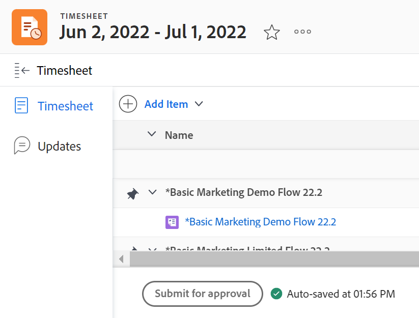

# Een tijdschema ter goedkeuring indienen

Door uw tijdspagina ter goedkeuring in te dienen, krijgt uw manager inzicht in uw werkuren. De fiatteurs kunnen verifiëren dat alle geregistreerde tijd in de juiste gebieden is toegewezen en dat er gedurende de periode een voldoende aantal uren is geregistreerd.

## Toegangsvereisten

U moet de volgende toegang hebben om de stappen in dit artikel uit te voeren:

<table style="table-layout:auto"> 
 <col> 
 <col> 
 <tbody> 
  <tr> 
   <td role="rowheader">Adobe Workfront-abonnement*</td> 
   <td> 
Alle
 </td> 
  </tr> 
  <tr> 
   <td role="rowheader">Adobe Workfront-licentie*</td> 
   <td> 
Controleren of hoger
 </td> 
  </tr> 
  <tr> 
   <td role="rowheader">Configuraties op toegangsniveau*</td> 
   <td> 
Toegang tot of hoger weergeven voor Taken en problemen
 
Als u nog steeds geen toegang hebt, vraagt u de Workfront-beheerder of deze aanvullende beperkingen op uw toegangsniveau instelt. Voor informatie over hoe een beheerder van Workfront uw toegangsniveau kan wijzigen, zie <a href="../../administration-and-setup/add-users/configure-and-grant-access/create-modify-access-levels.md" class="MCXref xref"> tot douanetoegangsniveaus </a> leiden of wijzigen.
 </td> 
  </tr> 
  <tr> 
   <td role="rowheader">Objectmachtigingen</td> 
   <td> 
Machtigingen weergeven of hoger voor taken en problemen
 
Voor informatie bij het vragen van om extra toegang, zie <a href="../../workfront-basics/grant-and-request-access-to-objects/request-access.md" class="MCXref xref"> de toegang van het Verzoek tot voorwerpen </a>.
 </td> 
  </tr> 
 </tbody> 
</table>

*Neem contact op met uw Workfront-beheerder om te weten te komen welk abonnement, licentietype of toegang u hebt.

## Een tijdschema ter goedkeuring indienen

* [ voorlegt een timesheet voor goedkeuring ](#submit-a-timesheet-for-approval)
* [De status van een verzonden tijdsplaat weergeven](#view-the-status-of-a-submitted-timesheet)

### Een tijdschema ter goedkeuring indienen

Nadat een timesheet fiatteur wordt geplaatst (zoals die in de sectie [ wordt beschreven wijs timesheet goedkeurt ](../../timesheets/create-and-manage-timesheets/timesheet-approvals.md#designating-a-timesheet-approver) in het artikel [ een timesheet ](../../timesheets/create-and-manage-timesheets/timesheet-approvals.md) goed), **dicht** knoop bij de bodem van de timesheet verandert in a **voorleggen voor Goedkeuring** knoop.

Een tijdschema ter goedkeuring indienen:

1. Ga naar een timesheet dat is gevormd om een fiatteur te hebben.
1. De tijd van het logboek, zoals die in [ wordt beschreven tijd van het Logboek ](../../timesheets/create-and-manage-timesheets/log-time.md).
1. Klik **voorleggen voor Goedkeuring** om het proces van de timesbladgoedkeuring te lanceren.

   

   **legt voor Goedkeuring** knoop wordt vervangen door **goedkeuren**, **verwerping**, en **Recall** knopen. Het statuut van timesheet verandert in **Voorgelegd**.

   Wanneer uw timesheet voor goedkeuring wordt voorgelegd, ziet de fiatteur timesheet dat in het **wordt vermeld goedkeurt** gebied op de **3} pagina van het Huis.** De volgende dingen kunnen zich voordoen:

   * Als zij het goedkeuren, verandert de **Herinnerde** knoop in **heropenen** en de updates van de timesheet status aan **Open**.
   * Als zij het verwerpen, **voorlegt voor Goedkeuring** knoop vervangt de **Recall** knoop en de updates van de timesheet status aan **Verworpen**.

1. (Facultatief) klik **Herinneren** als u timesheet moet heropenen en uw tijd bijwerken. Voor informatie, zie [ Rappel een timesheet ](#recall-a-timesheet) sectie in dit artikel.

### De status van een verzonden tijdsplaat weergeven {#view-the-status-of-a-submitted-timesheet}

U kunt de status van een tijdblad bekijken nadat u het hebt verzonden.

Als de beheerder van Workfront de Goedkeuring van de Tijdopmaak aan Gebruiker en de Afwijzing van de Chronologie aan de gebeurtenismanagers van de Gebruiker heeft toegelaten, wordt u op de hoogte gebracht nadat timesheet wordt goedgekeurd of verworpen. Voor informatie over het toelaten van gebeurtenisberichten, zie [ de berichttypes van de Gebeurtenis ](../../administration-and-setup/manage-workfront/emails/event-notifications-available-in-wf.md).

Zonder deze berichten, kunt u over de status van uw voorgelegde chronologie in het gebied van de Chronologie van Workfront leren.

U kunt als volgt de status van een tijdblad weergeven:

1. Klik het **Belangrijkste pictogram van het Menu**  in de hoger-juiste hoek van Adobe Workfront.
1. Klik **Tijdopnemers**. Het **Al** filter wordt geselecteerd door gebrek.

   

1. (Optioneel) Voer een van de volgende handelingen uit om het filter in de lijst met tijdbladen bij te werken:

   * Selecteer **Mijn Goedkeuringen van het Chronologie** in de hoger-juiste hoek van de pagina om slechts timesheets te bekijken die u goedkeurt

     of

     Selecteer **Mijn Chronologie** om slechts uw timesheets te bekijken.

     Dit past Mijn Goedkeuringen Timesheet of de Mijn filters Timesheet op de lijst van timesheets toe.

     

   * Klik op het pictogram Filter  om een ander filter toe te passen of een nieuw filter te maken. Voor informatie over het creëren van of het bijwerken van filters, zie [ filters in Adobe Workfront ](../../reports-and-dashboards/reports/reporting-elements/create-filters.md) creëren of uitgeven.

   >[!NOTE]
   >
   >De Mijn Goedkeuringen Timesheet en Mijn opties Timesheets tonen niet bij de bovenkant van timesheet lijst of in de lijst van filters als uw beheerder van Workfront of een groepsbeheerder de Mijn Goedkeuringen Timesheet en de Mijn filters van Timesheets van of de Controles van de Lijst in het gebied van de Opstelling of van uw Malplaatje van de Lay-out verwijderde. Zie de volgende artikelen voor meer informatie:
   >
   >   
   >   
   >   * [ pas Filters, Weergaven, en Groepen aan gebruikend een lay-outmalplaatje ](../../administration-and-setup/customize-workfront/use-layout-templates/customize-fvg-list-controls-layout-template.md)
   >   
   >

1. (Voorwaardelijk) als u **Mijn Tijdopnemers** selecteerde, zorg ervoor dat de **Standaard** mening wordt toegepast en merk de **Status** kolom op.

   Timesheets kunnen de volgende statussen hebben:

   <table style="table-layout:auto"> 
    <col> 
    <col> 
    <tbody> 
     <tr> 
      <td role="rowheader">Openen</td> 
      <td> 
Uw timesheet is momenteel open en u kunt tijd registreren. 
 
Er wordt een teruggeroepen tijdlijnvenster weergegeven met de status Open. Voor informatie, zie <a href="#recall-a-timesheet" class="MCXref xref"> Rappel een timesheet </a> sectie in dit artikel. 
 </td> 
     </tr> 
     <tr> 
      <td role="rowheader">Verzonden</td> 
      <td>U hebt uw tijdschema ter goedkeuring ingediend, maar het is nog niet goedgekeurd. U kunt een voorgelegde tijdkaart herinneren om het verder uit te geven. Voor informatie, zie <a href="#recall-a-timesheet" class="MCXref xref"> Rappel een timesheet </a> sectie in dit artikel. </td> 
     </tr> 
     <tr> 
      <td role="rowheader">Gesloten</td> 
      <td> 
De volgende scenario's bestaan:
 
       <ul> 
        <li> 
Als de tijdpagina geen fiatteur heeft, hebt u de tijd opgeslagen en gesloten.
 </li> 
        <li> 
Als het tijdschema een fiatteur heeft, hebt u het ter goedkeuring ingediend en is het goedgekeurd.
 </li> 
       </ul> </td> 
     </tr> 
     <tr> 
      <td role="rowheader">Geweigerd</td> 
      <td>U hebt het tijdschema ter goedkeuring ingediend en de fiatteur heeft het afgewezen.</td> 
     </tr> 
    </tbody> 
   </table>

## Een tijdblad terugdraaien {#recall-a-timesheet}

U kunt zich een overzicht herinneren dat reeds ter goedkeuring is voorgelegd. Alleen timesheets die niet zijn goedgekeurd, kunnen worden teruggeroepen.

U kunt als volgt een tijdschema weergeven:

1. Klik het **Belangrijkste pictogram van het Menu**  in de hoger-juiste hoek van Adobe Workfront.

1. Klik **Tijdopnemers**.
1. Klik **Mijn Tijdopnemers** in de hoger-juiste hoek van het scherm of selecteer **Mijn Tijdopnemers** van het **Filter**  drop-down menu.
1. Klik het tijdkader voor een timesheet met een status van **voorgelegde**.
1. Klik **Herinneren**.

   Tijdschema wordt editable opnieuw en zijn statusveranderingen in **Open**.
