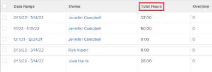

# Totale uren weergeven op het tijdblad

U kunt het totale aantal uren op uw timesheet bekijken. Het totale aantal timesheet uren omvat uren die voor projecten, taken, kwesties, en alle algemene uren worden geregistreerd.

De totale uren weerspiegelen uren die door timesheet, het gebied van Updates, of in het gebied van Uren voor projecten, taken, of kwesties worden voorgelegd.

## Toegangsvereisten

U moet de volgende toegang hebben om de stappen in dit artikel uit te voeren:

<table style="table-layout:auto"> 
 <col> 
 <col> 
 <tbody> 
  <tr> 
   <td role="rowheader">Adobe Workfront-abonnement*</td> 
   <td> 
Alle
 </td> 
  </tr> 
  <tr> 
   <td role="rowheader">Adobe Workfront-licentie*</td> 
   <td> 
Controleren 
 </td> 
  </tr> 
  <tr> 
   <td role="rowheader">Configuraties op toegangsniveau*</td> 
   <td> 
De toegang van de mening of hoger tot Taken en Kwesties
 
Als u nog steeds geen toegang hebt, vraagt u de Workfront-beheerder of deze aanvullende beperkingen op uw toegangsniveau instelt. Voor informatie over hoe een beheerder van Workfront uw toegangsniveau kan wijzigen, zie <a href="../../administration-and-setup/add-users/configure-and-grant-access/create-modify-access-levels.md" class="MCXref xref">Aangepaste toegangsniveaus maken of wijzigen</a>.
 </td> 
  </tr> 
  <tr> 
   <td role="rowheader">Objectmachtigingen</td> 
   <td> 
Machtigingen weergeven of hoger voor taken en problemen
 
Voor informatie over het aanvragen van aanvullende toegang raadpleegt u <a href="../../workfront-basics/grant-and-request-access-to-objects/request-access.md" class="MCXref xref">Toegang tot objecten aanvragen </a>.
 </td> 
  </tr> 
 </tbody> 
</table>

*Neem contact op met uw Workfront-beheerder om te weten te komen welk abonnement- of licentietype u hebt.

## De totale uren van een timesheet weergeven in de koptekst van de tijdpagina

U kunt de Totale Uren van een timesheet in de timesheet bekijken.

## Bekijk de totale uren op uw timesheet in een lijst van timesheets

1. Klik op de knop **Hoofdmenu** pictogram  in de rechterbovenhoek van Adobe Workfront klikt u op **Timesheets**. De **Alles** is standaard geselecteerd en worden alle tijdbladen weergegeven die u kunt bekijken.

   

1. (Optioneel) Voer een van de volgende handelingen uit om het filter in de lijst met tijdbladen bij te werken:

   * Selecteren **Goedkeuringen van mijn tijdsplaat** in de rechterbovenhoek van de pagina om alleen de door u goedgekeurde tijdbladen weer te geven

      of

      Selecteren **Mijn tijdbladen** om alleen uw tijdbladen weer te geven.

      Dit past Mijn Goedkeuringen Timesheet of de Mijn filters Timesheet op de lijst van timesheets toe.

      

   * Klik op het pictogram Filter  om een ander filter toe te passen, of creeer nieuwe. Voor informatie over het maken of bijwerken van filters raadpleegt u [Filters maken of bewerken in Adobe Workfront](../../reports-and-dashboards/reports/reporting-elements/create-filters.md).
   >[!NOTE]
   >
   >De Mijn Goedkeuringen Timesheet en Mijn opties Timesheets tonen niet bij de bovenkant van timesheet lijst of in de lijst van filters als uw beheerder van Workfront of een groepsbeheerder de Mijn Goedkeuringen Timesheet en de Mijn filters van Timesheets van of de Controles van de Lijst in het gebied van de Opstelling of van uw Malplaatje van de Lay-out verwijderde. Zie de volgende artikelen voor meer informatie:
   * [Filters, weergaven en groepen aanpassen met een lay-outsjabloon](../../administration-and-setup/customize-workfront/use-layout-templates/customize-fvg-list-controls-layout-template.md)

1. (Optioneel) Klik op de knop **Weergave**  of **Groepering**  pictogrammen om een andere weergave of groep toe te passen of om een nieuwe weergave of groep te maken.

   Zie de volgende artikelen voor informatie over het maken van filters, weergaven of groepen:

   * [Filters maken of bewerken in Adobe Workfront](../../reports-and-dashboards/reports/reporting-elements/create-filters.md)
   * [Weergaven maken of bewerken in Adobe Workfront](../../reports-and-dashboards/reports/reporting-elements/create-edit-views.md)
   * [Groepen maken in Adobe Workfront](../../reports-and-dashboards/reports/reporting-elements/create-groupings.md)

1. Het totale aantal uren voor elk timesheet toont in **Totaal aantal uren** kolom.

   

   >[!TIP]
   Wanneer het gebruiken van de Standaardmening voor een lijst van timesheets, de Totale kolomvertoningen van Uren in rood als de tijd die voor de punten op timesheet wordt geregistreerd het aantal uren in het tijdkader van timesheet overschrijdt. Zie voor meer informatie het veld &quot;Totaal aantal uren&quot; in [Woordenlijst met Adobe Workfront-terminologie](../../workfront-basics/navigate-workfront/workfront-navigation/workfront-terminology-glossary.md).
