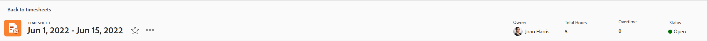
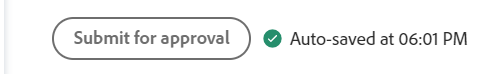

# Overzicht van de tijdlijnindeling

<!-- Audited: 12/2023 -->

In dit artikel wordt de lay-out van tijdbladen in Adobe Workfront beschreven, zodat u beter kunt begrijpen hoe u tijdbladen kunt aanpassen en gebruiken om tijd op te nemen.

Met de voorkeuren voor tijdbladen en uren bepaalt u wat er op een tijdblad wordt weergegeven. Dit artikel biedt een overzicht van alle beschikbare opties. Zie voor informatie over het selecteren van de opties [Voorkeuren voor tijdpagina&#39;s en uren configureren](../../administration-and-setup/set-up-workfront/configure-timesheets-schedules/timesheet-and-hour-preferences.md).

Voor informatie over hoe te om tijd op een tijdblad te registreren, zie [Logtijd](../../timesheets/create-and-manage-timesheets/log-time.md).

Hieronder vindt u de gebieden van een tijdspad:

* [Tijdbladkoptekst](#timesheet-header)
* [Het linkerdeelvenster](#the-left-panel)
* [Werkitems](#work-items)
* [Werkbalk](#toolbar)
* [Tijdlijnvoettekst](#timesheet-footer)
* [Functie](#job-role)
* [Uurtype](#hour-type)
* [Het gebied Updates in het linkerdeelvenster](#updates-area-in-the-left-panel)
* [Het deelvenster Samenvatting](#summary-panel)
* [Tijdskader en invoergebied in uur](#time-frame-and-hour-entry-area)
* [Uur-commentaar](#hour-entry-comments)
* [Uren](#hours)
* [Totalen](#totals)

## Tijdbladkoptekst

De koptekst van de tijdpagina bevat de volgende informatie:

* Het tijdkader van timesheet.
* Het gebied Acties dat het volgende omvat:
   * Een sterpictogram om de tijdbladen aan uw lijst Favorieten toe te voegen.
   * Het pictogram Meer met een optie van de Schrapping die u toestaat om timesheet te schrappen.
* De naam van de eigenaar van het tijdblad.
* Het totale aantal uren voor uren die voor punten worden geregistreerd die in timesheet worden getoond.
* Het aantal overuren. Dit is een handmatige invoer die alleen zichtbaar is als de **Overwerk** het plaatsen wordt toegelaten op een timesheet. Zie voor meer informatie [Tijdlijngegevens bewerken](../create-and-manage-timesheets/edit-timesheets.md).

>[!TIP]
>
>U kunt geen groter aantal overuren dan de huidige totale uren op timesheet registreren. Bijvoorbeeld, als u 7 uren op timesheet tot dusver het programma opende, kunt u 8 uren van overwerk niet registreren.

* De tijdbladstatus.

## Het linkerdeelvenster

In het linkerdeelvenster hebt u toegang tot de volgende secties:

* **Tijdschema**: Geeft de werkelijke tijdpagina weer.
* **Updates**: Hiermee geeft u opmerkingen en systeemupdates voor de tijdpagina weer. Zie de klasse [Het gebied Updates in het linkerdeelvenster](#updates-area-in-the-left-panel) in dit artikel.

## Werkitems

De het werkpunten zijn de projecten, de taken en de kwesties die u tijd voor wilt registreren. Als u op de pijl omlaag klikt in de koptekstrij, worden de projecten en de taken en problemen die eronder worden vermeld, samengevouwen. Als u op de pijl omlaag klikt naast de naam van een project, worden de werkitems voor dat project samengevouwen.

Taken, kwesties, en projecten waar de tijd buiten timesheet of punten wordt geregistreerd die tijdens het tijdsbestek van timesheet worden gepland verschijnen hier automatisch.

## Werkbalk

De werkbalk bevat de volgende opties:

* De **Item toevoegen** knop waarmee u projecten, taken of problemen kunt toevoegen.
* Het snelle filterpictogram om naar taken of kwesties in timesheet te zoeken.
* De **Opmerkingen tonen** het plaatsen die u toestaat om uurcommentaren te bekijken of te verbergen die voor project, taak, of de ingangen van het uitgifteuur worden geregistreerd.
* Het pictogram voor het volledige scherm om de tijdpagina in de modus Volledig scherm weer te geven.
* De **Samenvatting openen** (of **Samenvatting sluiten**) om het deelvenster Samenvatting te openen of te sluiten. Deze knop is niet beschikbaar voor projecten.

Zie voor meer informatie [Logtijd](../create-and-manage-timesheets/log-time.md).

## Tijdlijnvoettekst

U kunt op de knop **Ter goedkeuring verzenden**, **Sluiten**, **Goedkeuren**, en **Afwijzen** op dit gebied om een tijdlijngoedkeuring te sluiten of te verwerpen.

Dit gebied bevat ook informatie over wanneer timesheet voor het laatst is opgeslagen. Alle wijzigingen die u aanbrengt in de gegevens in de tijdpagina, worden automatisch opgeslagen.

## Functie

U kunt een andere taakrol selecteren die u aan de uurvermeldingen wilt koppelen. Uw Workfront-beheerder moet de **Taken toewijzen aan uren** handmatig instellen. De taakrol die u hebt opgegeven wanneer u aan de taak bent toegewezen of de uitgave wordt standaard weergegeven. Als u geen taakrol aan de taak of de kwestie wordt toegewezen, toont uw Primaire Rol als gebrek. Zie voor meer informatie [Voorkeuren voor tijdpagina&#39;s en uren configureren](../../administration-and-setup/set-up-workfront/configure-timesheets-schedules/timesheet-and-hour-preferences.md).

U kunt veelvoudige uuringangen voor het zelfde het werkpunt voor verschillende rollen registreren. Zie voor meer informatie [Logtijd](../create-and-manage-timesheets/log-time.md).

## Uurtype

U kunt verschillende uurtypen selecteren die u aan uw uuritems voor elk onderdeel wilt koppelen. Dit gebied toont slechts wanneer de beheerder van Workfront het voor uw milieu toelaat. Zie voor meer informatie [Voorkeuren voor tijdpagina&#39;s en uren configureren](../../administration-and-setup/set-up-workfront/configure-timesheets-schedules/timesheet-and-hour-preferences.md).

U kunt meerdere uurvermeldingen voor hetzelfde werkitem voor verschillende uurstypen vastleggen. Zie voor meer informatie [Logtijd](../create-and-manage-timesheets/log-time.md).

## Het gebied Updates in het linkerdeelvenster

U kunt commentaren op een timesheet maken om met uw timesheet fiatteurs of andere gebruikers in de sectie van Updates in het linkerpaneel te communiceren.

Eventuele opmerkingen die zijn gemaakt op de tijdlijnweergave in dit gebied, onder aan het tijdlijnoverzicht. Dit gebied wordt onder de tijdlijn en boven de voettekst van het tijdblad weergegeven. Zie voor meer informatie [Opmerkingen weergeven en beheren op een tijdblad](../create-and-manage-timesheets/view-and-manage-comments-timesheets.md).

## Het deelvenster Samenvatting

U kunt het deelvenster Samenvatting openen voor taken of problemen die in een tijdblad worden weergegeven. Hier kunt u opmerkingen maken over taken en problemen, of de gegevens van deze taken en problemen bijwerken. Zie voor meer informatie [Overzicht van samenvattingen](../../workfront-basics/the-new-workfront-experience/summary-overview.md).

De opmerkingen die u invoert voor werkitems in het deelvenster Overzicht van het tijdlijnvenster worden weergegeven in het gedeelte Updates van de taak of het probleem. Het deelvenster Samenvatting is niet beschikbaar voor projecten.

## Tijdskader en invoergebied in uur

Het tijdkader van timesheet toont rechts van de het werkpunten.

U kunt timesheets maken voor één, twee of vier weken.

Het tijdkader wordt in stappen van een volledige week weergegeven. De dagen buiten het gespecificeerde timesheet tijdkader worden gedimd. U kunt geen tijd voor dagen registreren die buiten het tijdkader van timesheet zijn.

Zie voor meer informatie [Een timesheet voor eenmalig gebruik maken](../create-and-manage-timesheets/create-tmshts.md) of [Werkbladprofielen maken, bewerken en toewijzen](../create-and-manage-timesheets/create-timesheet-profiles.md).

<!--drafted for the resize columns in timesheets story - make this blurb a TIP when the story is released: 
You can resize the columns that display different weeks, the time frame, or the work item areas by dragging and dropping the vertical lines that separate them.-->

## Uur-commentaar

U kunt een commentaar voor elk uuringang toevoegen dat u aan uw timesheet toevoegt.

De commentaren u in de de ingangscommentaardoos van uur ingaat tonen in timesheet, onder elk het werkpunt waar u het tijdstip registreerde **Opmerkingen tonen** deze instelling is ingeschakeld op de werkbalk.

## Uren

Het timesheet verstrekt inputgebieden voor elk het werkpunt en dag van timesheet waaier om tijd te registreren die het werken aan het punt wordt doorgebracht. Terwijl u zich aanmeldt bij tijd, wordt het item waarvan u de tijd inlogt voor hooglichten in lichtblauw en het uurvak in donkerblauw weergegeven.

## Totalen

Controleer de som van alle uren ingegaan op timesheet, samengevat door dag (in de kopbal van timesheet) evenals door voorwerp (in de laatste kolom).
