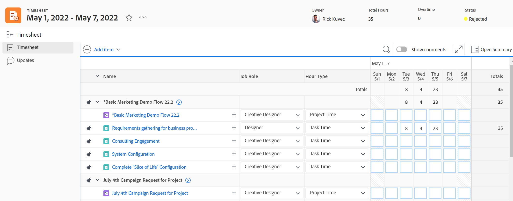

# Overzicht van tijdbladen

U kunt timesheets gebruiken om de tijd te volgen die u aan het werk in Adobe Workfront doorbrengt.

Als Workfront- of groepsbeheerder kunt u tijdbladen maken en deze koppelen aan uw gebruikers. Voor informatie over het creëren van timesheets, zie [Tijdschema&#39;s maken en beheren](../create-and-manage-timesheets/create-and-manage-timesheets.md).

Een timesheet is een rasterachtige tabel waarin de werkitems en een kalendergebied worden weergegeven. U kunt tijd voor punten registreren en het associëren met de dag waarin het werk werd uitgevoerd. Dit houdt je werktijd bij in Workfront. Er is ook een gebied in timesheet waar u tijd voor niet op het werk betrekking hebbende punten, zoals vergaderingen, opleiding, of tijd buiten het bureau kunt registreren.

Voor informatie over de lay-out van timesheet in Adobe Workfront raadpleegt u [De lay-out Timesheet begrijpen](../../timesheets/timesheets/timesheet-layout.md).

U kunt de tijd in Workfront op diverse manieren, gewoonlijk op het niveau van het project, de taak, of de kwestie registreren waar het werk wordt uitgevoerd. De tijd die tegen taken, kwesties, en projecten wordt geregistreerd toont ook in uw timesheet.

U kunt tijd voor niet projectwerk, onder Algemene Uren ook registreren. De tijd van het algemene uur kan slechts in uw timesheet worden geregistreerd.

Ga voor meer informatie over waar u zich kunt aanmelden in Workfront naar [Logtijd](../../timesheets/create-and-manage-timesheets/log-time.md).

>[!TIP]
>
>Met de mobiele app van Workfront kunt u ook updates posten, geregistreerde tijd wijzigen, opmerkingen invoeren en uw tijdspagina sluiten.

## Toegangsvereisten

U moet het volgende hebben om de stappen in dit artikel uit te voeren:

<table style="table-layout:auto"> 
 <col> 
 <col> 
 <tbody> 
  <tr> 
   <td role="rowheader">Adobe Workfront-plan</td> 
   <td> 
Alle
 </td> 
  </tr> 
  <tr> 
   <td role="rowheader">Adobe Workfront-licentie</td> 
   <td> 
Plan 
 </td> 
  </tr> 
  <tr> 
   <td role="rowheader">Configuraties op toegangsniveau*</td> 
   <td> 
U moet administratieve toegang tot Chronologie hebben. 
 
Zie voor meer informatie <a href="../../administration-and-setup/add-users/configure-and-grant-access/grant-users-admin-access-certain-areas.md" class="MCXref xref">Gebruikers administratieve toegang verlenen tot bepaalde gebieden</a>.
 
<b>OPMERKING</b>

Als u nog steeds geen toegang hebt, vraagt u de Workfront-beheerder of deze aanvullende beperkingen op uw toegangsniveau instelt. Voor informatie over hoe een beheerder van Workfront uw toegangsniveau kan wijzigen, zie <a href="../../administration-and-setup/add-users/configure-and-grant-access/create-modify-access-levels.md" class="MCXref xref">Aangepaste toegangsniveaus maken of wijzigen</a>.
 </td>
</tr> 
 </tbody> 
</table>

&#42;Neem contact op met uw Workfront-beheerder om te weten te komen welk plan, licentietype of toegang u hebt.

## Begrijp projecttijd versus niet projecttijd

De chronologie voorziet gebruikers van een eenvoudige manier om tijd voor zowel project als niet projectwerk te volgen:

* **Projecttijd:** Direct vanuit de taak of het project waar u de tijd wilt volgen.

  De uren die naar taken, kwesties, en projecten door een timesheet worden geregistreerd worden geassocieerd met de respectieve het werkpunten om een nauwkeurige vertegenwoordiging van inspanning te verstrekken die aan projecten en taken wordt besteed. Zonder nauwkeurige tijdinvoer zijn uw gegevens mogelijk niet correct als deze bestemd zijn voor factureringsdoeleinden.

  Bovendien, wanneer een middel uren op taken, kwesties en projecten direct registreert verschijnen wanneer de gebruiker tot timesheet toegang heeft. Dit veronderstelt de timesheet datumwaaier de data overspant de uren werden geregistreerd.

* **Tijd buiten project:** Rechtstreeks op het gebruikerstimesheet. Voor meer informatie over het bijhouden van de tijd in Workfront raadpleegt u   [Logtijd](../../timesheets/create-and-manage-timesheets/log-time.md).

  Op een timesheet, kan een middel vakantieuren, zieke uren registreren, uren doorgebracht in doorreis, uren doorgebracht het repareren of onderhouden van materiaal, of om het even welke algemene types van overheaduren u wenst om tot stand te brengen.

## Toegangstijdbladen in het gebied Timesheets

Ga voor meer informatie over alle gebieden van Workfront waar u zich kunt aanmelden naar [Logtijd](../../timesheets/create-and-manage-timesheets/log-time.md).

U kunt als volgt een tijdpagina openen:

1. Klik op de knop **Hoofdmenu** pictogram  in de rechterbovenhoek, of de **Hoofdmenu** pictogram  in de linkerbovenhoek van Workfront, indien beschikbaar, klikt u op Tijdbladen.

   In het gebied Timesheets worden standaard alle tijdbladen weergegeven die bij u horen of die u kunt weergeven.

   

1. Klik op een van de volgende opties in de rechterbovenhoek om een beperkt aantal tijdbladen weer te geven:

   * **Mijn tijdbladen** om alleen uw tijdbladen weer te geven.

   

   * **Goedkeuringen van mijn tijdsplaat** om alleen tijdbladen weer te geven die u goedkeurt.

     

   Een gefilterde lijst van timesheets toont.

1. (Optioneel) Werk de weergave, het filter en de groepering boven aan de lijst met tijdbladen bij. Zie voor meer informatie [Elementen rapporteren: filters, weergaven en groepen](../../reports-and-dashboards/reports/reporting-elements/reporting-elements-overview.md).

1. Klik op de knop **Datumbereik** van een tijdschema om het te openen.

   Elk timesheet toont alle taken, kwesties, en projecten die u tijd voor hebt geregistreerd. Een timesheet toont ook tot 45 taken, kwesties, of projecten die aan u met data binnen het tijdkader van timesheet worden toegewezen, maar waarvoor u geen tijd nog zou kunnen geregistreerd hebben.

   Zie voor meer informatie [Voorkeuren voor tijdpagina&#39;s en uren configureren](../../administration-and-setup/set-up-workfront/configure-timesheets-schedules/timesheet-and-hour-preferences.md).

