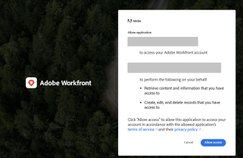

# Vorm en gebruik de douane OAuth 2 van uw organisatie toepassingen gebruikend de stroom van de vergunningscode

Als u wilt integreren met Workfront en uw clienttoepassing in staat wilt stellen namens de gebruiker te communiceren met Workfront, moet u:

* Een OAuth2-toepassing maken
* De toepassing van derden configureren
* Koppeling maken naar de pagina Autoriseren voor uw gebruikers
* Stroom van machtigingscode instellen: gebruikers melden zich aan bij de Workfront-instantie en gaan ermee akkoord dat de clienttoepassing namens hen verbinding maakt met Workfront. Dientengevolge, krijgt u een vergunningscode die u met toegang zult ruilen en tokens verfrist.
* Opstelling verfrist Symbolische Stroom: In deze stroom gebruikt u verfrist token om een nieuw toegangstoken te krijgen wanneer oude wordt verlopen.

## Een OAuth2-toepassing maken

Voor instructies over het maken van de OAuth2-toepassing raadpleegt u [Een OAuth2-toepassing maken met gebruikersgegevens (doorloop machtigingscode)](../../administration-and-setup/configure-integrations/create-oauth-application.md#create3) in [OAuth2-toepassingen maken voor Workfront-integratie](../../administration-and-setup/configure-integrations/create-oauth-application.md)

## Koppeling maken naar de pagina Autoriseren voor uw gebruikers

Uw gebruikers moeten zich aanmelden om deze integratie in hun eigen account te autoriseren. De pagina die ze moeten autoriseren, heeft een specifieke indeling, zoals hier wordt beschreven. Gebruik deze informatie om het adres van de machtigingspagina voor de app te bepalen en geef uw gebruikers dit adres of een koppeling naar dit adres.

* De volledige URL van het domein van uw organisatie. Voorbeeld:

  ```
  https://myorganization.my.workfront.com
  ```


* `client_id`: Dit is de client-id die is gegenereerd toen u de OAuth2-app in Workfront maakte.

* `redirect_uri`: Dit is de omleidings-URL die u hebt ingevoerd bij het maken van de app. Uw gebruikers worden naar deze pagina geleid nadat zij de app voor hun account hebben geautoriseerd.

* `response_type`: Dit moet de waarde hebben `code`.

De URL voor de machtigingspagina is daarom:

```
https://<URL of your organization's domain>/integrations/oauth2/authorize?client_id=<Your ClientID>&redirect_uri=<Your redirect URL>&response_type=code
```

>[!NOTE]
>
>We raden u aan een knop of andere koppeling te maken waarop uw gebruikers kunnen klikken om naar deze pagina te worden geleid.

## De toepassing van derden configureren

De externe toepassing kan configuratie vereisen. De volgende lijst bevat informatie over gebieden die kunnen worden vereist wanneer u de derdetoepassing vormt.

<table style="table-layout:auto"> 
 <col> 
 <col> 
 <tbody> 
  <tr> 
   <td role="rowheader">Autorisatie-URI</td> 
   <td> <p><code>https://&lt;the full URL of your organization's domain&gt;/integrations/oauth2/authorize</code> </p> <p class="example" data-mc-autonum="<b>Example: </b>"><span class="autonumber"><span><b>Voorbeeld: </b></span></span><code> https://myorganization.my.workfront.com/integrations/oauth2/authorize</code> </p> </td> 
  </tr> 
  <tr> 
   <td role="rowheader">Token-URL</td> 
   <td> <p><code>https://&lt;the full URL of your organization's domain&gt;/integrations/oauth2/api/v1/token</code> </p> <p class="example" data-mc-autonum="<b>Example: </b>"><span class="autonumber"><span><b>Voorbeeld: </b></span></span><code>https://myorganization.my.workfront.com/integrations/oauth2/api/v1/token</code> </p> </td> 
  </tr> 
  <tr> 
   <td role="rowheader">Segmenten</td> 
   <td>U hoeft geen bereik op te geven. </td> 
  </tr> 
 </tbody> 
</table>

## Stroom van machtigingscode instellen


Om uw gebruikers binnen met OAuth2 te registreren, gebruik het volgende proces:

1. Wanneer de gebruiker de machtigingspagina opent, wordt deze omgeleid naar de Workfront-aanmeldingspagina, zodat de gebruiker zich kan aanmelden bij Workfront. Als de gebruiker een SSO-configuratie heeft, wordt de aanmeldingspagina van de identiteitsprovider geopend.

   Als de gebruiker al is aangemeld bij Workfront op dezelfde browser of als de gebruiker zich met succes heeft aangemeld bij Workfront, wordt de gebruiker omgeleid naar het instemmingsscherm:

   

1. Als de gebruiker de toegang toestaat, wordt de pagina omgeleid naar `redirect_url`. Het omleiden moet de volgende vraagparameters omvatten:

* `code`: De vergunningscode die voor het krijgen van het toegangs/verfrist teken wordt vereist.
* `domain`: Het domein van uw organisatie. Voorbeeld: in `myorganization.my.workfront.com`, is het domein `myorganization`.
* `lane`: de weg van het verzoek. Voorbeeld: in `myorganization.preview.workfront.com`, is de weg `preview`.

  >[!IMPORTANT]
  >
  >De `code` is slechts 2 minuten geldig. Daarom moet u verfrissen krijgen en toegang tokens binnen die tijd.

1. Wanneer u een code hebt, kunt u verzoeken om vernieuwings- en toegangstokens door de code samen met de gegevens van de clienttoepassing naar de `/integrations/oauth2/api/v1/token` eindpunt.

   De volledige token request-URL is

   ```
   https://<URL of your organization's domain></span>/integrations/oauth2/api/v1/token
   ```

   **Voorbeelden:**  Voorbeeld van CURL-aanroep naar token-eindpunt:

   Voorbeeld 1

   ```
      curl --location --request POST '**<workfront host>**/integrations/oauth2/api/v1/token' \
      --header 'Authorization: Basic **<base64(client_id:client_secret)>**' \
      --header 'Content-Type: application/json' \
      --data-raw '{
      "code": "**<code>**",
      "grant_type": "**authorization_code**",
      "redirect_uri": "**<redirect_url>**"
      }'
   ```

   Voorbeeld 2

   ```
      curl --location --request POST '**<workfront host>**/integrations/oauth2/api/v1/token' \
      --header 'Content-Type: application/x-www-form-urlencoded' \
      --data-urlencode 'grant_type=**authorization_code**' \
      --data-urlencode 'redirect_uri=**<redirect_url>**' \
      --data-urlencode 'code=**<code>**' \
      --data-urlencode 'client_id=**<client_id>**' \
      --data-urlencode 'client_secret=**<client_secret>**'  
   ```


   >[!IMPORTANT]
   >
   > Het clientgeheim is gegenereerd bij de registratie van de app in Workfront. U moet de oplossing op een veilige plaats bewaren, omdat deze niet kan worden hersteld als deze verdwijnt.

   Wanneer alle overgegaane parameters correct zijn, keert het symbolische eindpunt de volgende nuttige lading terug:

   ```
   {
      "token_type": "sessionID",
      "access_token": "string", // the value of sessionID
      "refresh_token": "string",
      "expires_in": 0,
      "wid": "string"
   }
   ```

   Het toegangstoken is het zelfde als ```sessionID```, en het verloopt op dezelfde manier als normaal ```sessionID```

   >[!IMPORTANT]
   >
   > Sla het token vernieuwen op een veilige plaats op. U hebt deze nodig om een nieuw token te krijgen wanneer de oude verlopen is. Workfront slaat uw token voor vernieuwen niet op.

1. Wanneer u een toegangstoken hebt, kunt u API-aanroepen naar Workfront uitvoeren

   ```
   curl --request GET 'https://<workfront host>/attask/api/v14.0/proj/search \
   --header 'sessionID: <access_token>'
   ```

## Toegangstoken vernieuwen instellen


Om access_token te verfrissen moeten wij opnieuw een &quot;POST&quot;vraag aan het symbolische eindpunt doen. Deze keer sturen we een andere formuliergegevens als volgt:

```
curl --location --request POST '<workfront host>/integrations/oauth2/api/v1/token' \
--header 'Authorization: Basic <base64(client_id:client_secret)>' \
--header 'Content-Type: application/json' \
--data-raw '{
   "grant_type": "refresh_token",
   "refresh_token": "<refresh_token>"
}'

###### OR

curl --location --request POST '<workfront host>/integrations/oauth2/api/v1/token' \
--header 'Content-Type: application/x-www-form-urlencoded' \
--data-urlencode 'grant_type=refresh_token' \
--data-urlencode 'redirect_uri=<redirect_url>' \
--data-urlencode 'refresh_token=<refresh_token>' \
--data-urlencode 'client_id=<client_id>' \
--data-urlencode 'client_secret=<client_secret>'
```

Het retourneert het volgende resultaat:

```
{
  "token_type": "sessionID",
  "access_token": "string", // the value of sessionID
  "refresh_token": "string",
  "expires_in": 0,
  "wid": "string"
}
```

Nogmaals, het toegangstoken is het `sessionID` die kan worden gebruikt om een API-aanvraag in te dienen bij Workfront.
