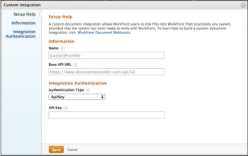

# Registreer een Integratie Webhaak

Adobe Workfront-beheerders kunnen een aangepaste webshintegratie voor hun bedrijf toevoegen door te navigeren naar Setup > Documenten > Aangepaste integratie in Workfront. Van de pagina van de Integratie van de Douane binnen Opstelling, kunnen de beheerders een lijst van bestaande integratie van documentWebHaak bekijken. Vanaf deze pagina kunnen integraties worden toegevoegd, bewerkt, ingeschakeld en uitgeschakeld.

Om een integratie toe te voegen, klik **voegt de Integratie van de Douane** toe.

 toe

## Beschikbare velden

Wanneer de beheerder een integratie toevoegt, zal hij waarden voor de volgende gebieden ingaan.

<table style="table-layout:auto"> 
 <col> 
 <col> 
 <thead> 
  <tr> 
   <th>Veldnaam</th> 
   <th>Beschrijving</th> 
  </tr> 
 </thead> 
 <tbody> 
  <tr> 
   <td>Naam</td> 
   <td>De naam van deze integratie.</td> 
  </tr> 
  <tr> 
   <td>Basis-API-URL</td> 
   <td> 
De locatie van de callback-API. Wanneer het maken van vraag aan het externe systeem, zal Workfront eenvoudig de eindpuntnaam aan dit adres toevoegen. Als de beheerder bijvoorbeeld de URL van de basis-API, " https://www.mycompany.com/api/v1 " invoert, gebruikt Workfront de volgende URL om de metagegevens van een document op te halen: https://www.mycompany.com/api/v1/metadata?id=1234.
 </td> 
  </tr> 
  <tr> 
   <td>Parameters aanvragen</td> 
   <td> 
Optionele waarden die aan de querytekenreeks van elke API-aanroep moeten worden toegevoegd. Bijvoorbeeld access_type=offline. 
 </td> 
  </tr> 
  <tr> 
   <td>Type verificatie</td> 
   <td>OAuth2 of ApiKey</td> 
  </tr> 
  <tr> 
   <td>Verificatie-URL</td> 
   <td> 
(Alleen OAuth2) De volledige URL die wordt gebruikt voor gebruikersverificatie. Workfront navigeert gebruikers naar dit adres als onderdeel van het OAuth-inrichtingsproces. Opmerking: Workfront voegt een parameter "state" toe aan de queryreeks. De provider moet dit bestand teruggeven aan Workfront door het toe te voegen aan de Workfront Redirect URI.
 </td> 
  </tr> 
  <tr> 
   <td>URL van token-eindpunt</td> 
   <td> 
(Alleen OAuth2) De volledige API-URL waarmee OAuth2-tokens worden opgehaald. Dit wordt gehost door de websiteprovider of externe documentprovider
 </td> 
  </tr> 
  <tr> 
   <td>Client-id</td> 
   <td>(Alleen OAuth2) De OAuth2 Client ID voor deze integratie</td> 
  </tr> 
  <tr> 
   <td>Clientgeheim</td> 
   <td> 
(Alleen OAuth2) Het OAuth2-clientgeheim voor deze integratie
 </td> 
  </tr> 
  <tr> 
   <td>Workfront Redirect URI</td> 
   <td>(Alleen OAuth2) Dit is een alleen-lezen veld en wordt gegenereerd door Workfront. Deze waarde wordt gebruikt om deze integratie bij de externe documentprovider te registreren. Opmerking: zoals hierboven beschreven voor verificatie-URL, moet de provider de parameter "state" en de bijbehorende waarde toevoegen aan de querytekenreeks wanneer de omleiding wordt uitgevoerd.</td> 
  </tr> 
  <tr> 
   <td>ApiKey</td> 
   <td> 
(Alleen ApiKey) Wordt gebruikt om geoorloofde API-aanroepen uit te voeren naar de websiteprovider. De API-sleutel die door de websiteprovider is uitgegeven.
 </td> 
  </tr> 
 </tbody> 
</table>
