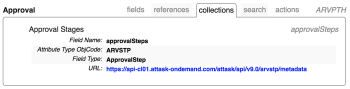

# De API Explorer gebruiken

Wanneer u de Adobe Workfront Core API gebruikt, is de API Explorer een verouderd naslagprogramma waarmee de relaties tussen ondersteunde bronnen, parameters en variabelen worden gecatalogiseerd.

## Open de API Explorer:

1. Met een webbrowser naar de [API Explorer](https://one.workfront.com/s/api-explorer)\
   

1. Selecteer in de rechterbovenhoek van de API Explorer de gewensteWorkfront **API-versie** Standaard wordt de meest actuele versie automatisch geselecteerd
1. De **Filter** veld, kan worden gebruikt om de objecten te filteren die op naam worden vermeld en wordt de lijst met objecten die op basis van naam worden weergegeven, afgekapt:

   

   * **Velden**: Beschikbare velden binnen het opgegeven object.
   * **Verwijzingen**: Beschikbare referentievariabelen voor het opgegeven object. Een verwijzing is een alias voor een variabele. Na initialisatie kan een verwijzing worden gebruikt met de variabelenaam. Een verwijzing gebruikt geïnitialiseerd geheugen.
   * **Verzamelingen**: Beschikbare verzamelingen voor het object. Verzamelingen zijn variabelen die een een-op-een relatie tussen het object en de bron vertegenwoordigen.
   * **Zoeken**: Beschikbare zoekbronnen voor het object. De resultaten van een onderzoek zijn gebaseerd op de vraagparameters die door het onderzoeksmiddel in het API verzoek worden gespecificeerd.
   * **Handelingen**: Ondersteunde acties voor het object. Handelingen kunnen eenvoudige of complexe procedures zijn die worden uitgevoerd met behulp van een bron of een reeks bronnen. Een bepaalde actie kan ook gevolgen hebben voor de bijbehorende middelen.

1. Open een tabblad en klik vervolgens op Object-id om de toepasselijke variabelen weer te geven.\
   \
   Afhankelijk van het geselecteerde object kunnen de volgende variabelen worden toegepast:

   | Variabele | Definitie |
   |---|---|
   | Veldnaam | De naam van een veld dat wordt gebruikt in een bewerking binnen de Workfront API. |
   | Veldtype | Het type waarden dat in een specifiek veld in een gegevenstabel kan worden ingevoerd. Mogelijke veldtypewaarden zijn string, double, int, dateTime. |
   | Opsommingstype | Het type waarden dat kan worden gebruikt om een gegevenstype te identificeren. |
   | Mogelijke waarden | Acceptabele waarden voor het object. |
   | Kenmerktype ObjCode | Kenmerken die kunnen worden gebruikt om de objectklasse te wijzigen. |
   | URL | Het ingangspad waarmee uw toepassing kan communiceren met de Workfront API. |
   | Argumenten | De objectvariabelen die tussen de toepassing en Workfront kunnen worden doorgegeven. |
   | Resultaattype | Toegestane gegevenstypen die door een methode kunnen worden geretourneerd. |
