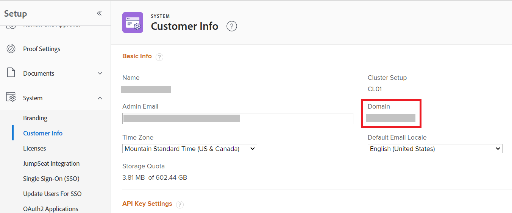

# Domeinindeling voor Adobe Workfront API-aanroepen

Wanneer u een API-aanroep naar de Workfront API maakt, gebruikt u het domein van uw organisatie in de aanroep. Het formaat voor dit domein URL verschilt gebaseerd op of uw organisatie aan Adobe Verenigde Shell is genegeerd.

Om te weten of uw organisatie op Adobe Verenigde Shell is, onderzoek URL die toont wanneer u een pagina van Workfront bekijkt.

| Workfront URL begint met: | URL voor API-aanroepen: |
|---|---|
| `experience.adobe.com` | `<yourdomain>.my.workfront.adobe.com` |

## Toegangsvereisten

+++ Breid uit om de toegangseisen voor de functionaliteit in dit artikel weer te geven.

<table style="table-layout:auto"> 
 <col> 
 <col> 
 <tbody> 
  <tr> 
   <td role="rowheader">Adobe Workfront-pakket</td> 
   <td> 
Alle 
 </td> 
  </tr> 
  <tr> 
   <td role="rowheader">Adobe Workfront-licentie</td> 
   <td>
Standard

   
Plan
</td> 
  </tr> 
  <tr> 
   <td role="rowheader">Configuraties op toegangsniveau</td> 
   <td> 
U moet een Workfront-beheerder zijn
 </td> 
  </tr> 
 </tbody> 
</table>

Voor informatie, zie [ vereisten van de Toegang in de documentatie van Workfront ](/help/quicksilver/administration-and-setup/add-users/access-levels-and-object-permissions/access-level-requirements-in-documentation.md).

+++

Ga als volgt te werk om uw domein te zoeken:

1. Klik het **[!UICONTROL Main Menu]** pictogram  in de hoger-juiste hoek van Adobe Workfront, of (als beschikbaar), klik het **[!UICONTROL Main Menu]** pictogram  in de upper-left hoek, dan klik **[!UICONTROL Setup]** .
1. Selecteer **Systeem**, dan uitgezochte **Info van de Klant**.

   Uw domein wordt vermeld op het recht van het scherm.

   

