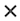

# Overzicht van projectgezondheid

>[!IMPORTANT]
>
>De functie Projectgezondheid is momenteel alleen beschikbaar voor gebruikers die deelnemen aan de bètafase.

De functie Projectgezondheid van Adobe Workfront maakt gebruik van de kracht van AI Assistant om u direct een beoordeling te geven van de manier waarop uw projecten presteren, welke gebieden uw aandacht behoeven en hoe u problemen kunt vermijden die u tijd en geld kunnen kosten.

De Medewerker van AI kan een Beoordeling van de Gezondheid van het Project voor de volgende voorwerpen produceren:

* Eén project
* Eén enkel programma
* Meerdere projecten

Voor meer informatie over AI Medewerker, zie [&#x200B; AI Hulpoverzicht &#x200B;](/help/quicksilver/workfront-basics/ai-assistant/ai-assistant-overview.md).

+++ Breid uit om de toegangseisen voor de functionaliteit in dit artikel weer te geven.

<table style="table-layout:auto"> 
<col> 
</col> 
<col> 
</col> 
<tbody> 
<tr> 
   <td role="rowheader">
Adobe Workfront-pakket
</td> 
   <td> 

Selecteren of hoger 
 

Werkstroom selecteren of hoger

   </td> 
<tr> 
 <tr> 
   <td role="rowheader">
Adobe Workfront-licentie
</td> 
   <td> 

Standard
 
   </td> 
   </tr> 
  </tr> 
  <tr> 
   <td role="rowheader">
Configuraties op toegangsniveau
</td> 
   <td>
U moet een systeembeheerder zijn om de configuraties van de Gezondheid van het Project te beheren 

   
Toegang tot projecten bewerken om projectgezondheidsconfiguraties toe te passen 

     
Toegang tot projecten weergeven om de configuraties van Projectgezondheid weer te geven 

     
Toegang tot programma's bekijken om de Projectgezondheid voor alle projecten in een programma te gebruiken

  </td> 
  <tr> 
   <td role="rowheader">
Objectmachtigingen
</td> 
   <td>
Rechten voor projecten beheren om projectgezondheidsconfiguraties toe te passen 

     
Toestemmingen aan projecten bekijken om de configuraties van de Gezondheid van het Project te bekijken 

  </td> 
  </tr> 
  </tr>  
    </tr>  
</tbody> 
</table>

Voor meer detail over de informatie in deze lijst, zie [&#x200B; vereisten van de Toegang in de documentatie van Workfront &#x200B;](/help/quicksilver/administration-and-setup/add-users/access-levels-and-object-permissions/access-level-requirements-in-documentation.md).
+++

## Inschrijven in de bètaversie van de projectgezondheid

Uw organisatie moet AI Medewerker hebben toegelaten om de Gezondheid van het Project te kunnen gebruiken.

Als u AI Assistant en Projectgezondheid voor uw organisatie wilt inschakelen, moet u het volgende toepassen:

* Uw organisatie moet zijn gemigreerd naar het Adobe Identity Management System (IMS).
* Uw organisatie moet beschikken over een Workfront- of Workflow Select-, Prime- of Ultimate-pakket.
* De Adobe Unified Experience moet zijn ingeschakeld.
* Adobe moet een ondertekende Adobe Gen AI-overeenkomst in het bestand hebben.
* De Workfront-beheerder moet de AI-assistent inschakelen voor gebruikers in uw organisatie. De Medewerker van AI wordt toegelaten door toegangsniveaus.
* U moet zowel de opties AI inschakelen als Projectgezondheid selecteren in het gedeelte AI-voorkeuren van het gedeelte Systeemvoorkeuren in Setup.

  

Voor meer informatie, zie [&#x200B; AI Hulpoverzicht &#x200B;](/help/quicksilver/workfront-basics/ai-assistant/ai-assistant-overview.md) en [&#x200B; vorm systeemvoorkeur &#x200B;](/help/quicksilver/administration-and-setup/manage-workfront/security/configure-security-preferences.md).

## Hoe de projectgezondheid wordt berekend

De Medewerker van AI geeft u een snelle beoordeling van de algemene staat van een project door het toe te wijzen één van de beschikbare staten van de Gezondheid van het Project:

* Op doel
* Risico
* In problemen

Deze status wordt berekend met behulp van projectcomponenten, zoals voortgang van het project, onderschat werk en meer. Voor een volledige lijst van de componenten die worden gebruikt om de Gezondheid van het Project te meten, zie de [&#x200B; van het Project en van de programmalanden lijst &#x200B;](#project-and-program-states-list) sectie.

Aan elke projectcomponent wordt een numerieke risicoscore toegewezen die van (0-100) gaat, die dan wordt gemiddeld om de algemene staat van de Gezondheid van het Project tot stand te brengen:

* Op Doel (75 of hoger): De projectprestaties liggen binnen de verwachte drempelwaarden.
* Risico (50-74): opkomende problemen worden gedetecteerd die de projectprestaties kunnen beïnvloeden.
* In het geval van problemen (49 of minder): de projectprestaties zijn beneden aanvaardbare drempels en vereisen onmiddellijke aandacht.

>[!NOTE]
>
>* AI Assistant evalueert momenteel alleen de gegevens van het geselecteerde project.
>* Cross-project of historische analyse is nog niet opgenomen in de berekening van de projectgezondheid.

### Voorbeelden van het berekenen van de projectgezondheid voor een project

In het eerste voorbeeld worden vier projectcomponenten geëvalueerd en worden hun individuele risicocijfers als volgt berekend:

* 2 Op doel (90 risicorescore)
* 1 Risicoscore (45 risicoscore)
* 1 Bij problemen (20 risicoscore)

Als je deze scores gemiddeld maakt, is het resultaat 61. Op basis van de hierboven vermelde criteria voor projectgezondheid wordt dit project in de risicopositie gebracht.

In het volgende voorbeeld is een wijziging in het schema van 1 dag voorgekomen in de tijdlijn van het project. In dit scenario evalueert AI Assistant zowel de timing als de impact van de wijziging ten opzichte van de totale duur van het project:

* Een 1-dag planningsverschuiving vroeg in een projectchronologie van 60 dagen is minder belangrijk en typisch gegraveerd zoals Op Doel.
* Een tijdsverschuiving van één dag in de buurt van de einddatum van een project is storender en kan bij risico of in Problemen worden genoteerd.

Aangezien de verandering klein was en vroeg in de projectchronologie voorkwam, plaatst dit het project in de status Op Doel.

Als de veelvoudige programmaveranderingen binnen de chronologie van een project voorkomen, worden deze veranderingen geschat en dan gemiddeld alvorens zij op de berekening van de Gezondheid van het Project worden toegepast.

## Inzicht in het verschil tussen projectvoorwaarden en projectgezondheid

Projectvoorwaarden en Projectgezondheid zijn vergelijkbare concepten in Workfront en hebben dezelfde standaardnamen om de projectconditie of -status (On Target, At Risk en In Trouble) te beschrijven, maar ze dienen verschillende doelen.

De voorwaarden van het project geven een basismomentopname op hoe een project momenteel presteert gebaseerd slechts op de geplande, de geplande, en geschatte data. Deze kan handmatig worden ingesteld door de eigenaar van het project of automatisch door Workfront op basis van de projecttaken. Alternatief, is de Gezondheid van het Project vollediger en beoordeelt extra factoren, die u een hoger-niveauinzicht geven in hoe het presteert.

Raadpleeg de volgende artikelen voor meer informatie over projectvoorwaarden:

* [Voorwaarde voor bijwerken voor een project](/help/quicksilver/manage-work/projects/updating-work-in-a-project/update-condition-on-project.md)
* [&#x200B; de voorwaarden van de Douane &#x200B;](/help/quicksilver/administration-and-setup/customize-workfront/create-manage-custom-conditions/custom-conditions.md).

## Project- en programmalijst Projectgezondheidsstaten

De onderstaande tabel bevat een uitsplitsing van de beschikbare staten die door AI Assistant aan uw project of programma worden toegewezen bij het genereren van een projectevaluatie.

<table>
    <tr>
        <td><b>Projectstatus</b></td>
        <td><b>Definitie</b></td>
        <td><b>Factoren</b></td>
    </tr>
    <tr>
        <td>Op doel</td>
        <td>Dit wordt toegekend wanneer het gemiddelde risiconiveau voor de volgende factoren binnen de gezonde drempel valt.
        </td>
        <td> 
        <ul><li>kneep</li>
        <li>Ontbrekende velden</li>
        <li>Wijzigingen plannen</li>
        <li>Onderschat werk</li>
        <li>Voortgang van project</li>
        <li>Achterstallige taken</li>
        <li>Begroting</li>
        </ul></td>
    </tr>
    <tr>
        <td>Risico</td>
        <td>Dit wordt toegekend wanneer het gemiddelde risiconiveau voor de volgende factoren net onder de gezonde drempel daalt.</td>
        <td>
        <ul><li>kneep</li>
        <li>Ontbrekende velden</li>
        <li>Wijzigingen plannen</li>
        <li>Onderschat werk</li>
        <li>Voortgang van project</li>
        <li>Achterstallige taken</li>
        <li>Begroting</li>
        </ul></td>
    </tr>
    <tr>
        <td>In problemen</td>
        <td>Dit wordt toegekend wanneer het gemiddelde risiconiveau voor de volgende factoren onder de gezonde drempel daalt.</td>
        <td>
        <ul><li>kneep</li>
        <li>Ontbrekende velden</li>
        <li>Wijzigingen plannen</li>
        <li>Onderschat werk</li>
        <li>Voortgang van project</li>
        <li>Achterstallige taken</li>
        <li>Begroting</li>
        </ul></td>
    </tr>
    </tr>
   </table>

## Lijst met vragen voor AI Assistant

Hieronder ziet u een lijst met aanwijzingen die u kunt gebruiken om de AI-assistent te vragen een beoordeling van de gezondheid van het project te genereren voor een project, programma of alle projecten die u kunt bekijken.

<table>
    <tr>
        <td><b>Locatie</b></td>
        <td><b>Vragen</b></td>
    </tr>
    <tr>
        <td>Een specifieke pagina met projectdetails</td>
        <td><em>Wat is de gezondheid van dit project?</em></td>
    </tr>
    <tr>
        <td>Elke pagina in Workfront </td>
        <td><em>Wat is de gezondheid van project [NAAM VAN PROJECT]?</em></td>
    </tr>
    <tr>
        <td>Elke pagina in Workfront </td>
        <td><em>Wat is de gezondheid van mijn projecten?</em></td>
    </tr>
       <tr>
        <td>Een pagina met specifieke programmagegevens</td>
        <td><em>Wat is de gezondheid van dit programma?</em></td>
    </tr>
       <tr>
        <td>Elke pagina in Workfront </td>
        <td><em>Wat is de gezondheid van programma [NAAM VAN PROGRAMMA]?</em></td>
    </tr>
   </table>

## Projectgezondheidsconfiguraties beheren

U moet een Beheerder van het Systeem zijn om de configuraties van de Gezondheid van het Project te beheren.

Een configuratie van de projectgezondheid bevat specifieke criteria die bepalen hoe uw projectgezondheid wordt berekend. Nadat de beheerder van Workfront een configuratie creeert, kunt u het op een project dan toepassen.

U kunt veelvoudige configuraties van de Gezondheid van het Project in uw systeem hebben.

{{step-1-to-setup}}

1. Klik **Voorkeur van het Project** in het linkerpaneel, dan selecteer **Gezondheid van het Project**.

1. In de hoger-juiste hoek van de pagina, klik **Nieuwe Configuratie**.

   De **AI pagina van Montages** opent.

1. (Facultatief) klik binnen de **Naamloze 1&rbrace; titel van de Configuratie om de configuratie anders te noemen.**

1. In **welke factoren u in de sectie van de projectgezondheid** zou willen omvatten, schrap om het even welke factor u inbegrepen niet wilt wanneer het bepalen van uw criteria van de projectgezondheid:
   * **kneep van het werkingsgebied**: Hoeveel het projectwerkingsgebied is uitgebreid sinds het begon.

   * **Vereiste gebieden**: Als om het even welke vereiste gebieden (b.v. projectbeschrijving) ontbreken. Deze vereiste gebieden bepalen projectvolledigheid en worden gespecificeerd in **Welke gebieden wilt u volledigheid controleren?** -configuratiesectie verderop.

   * **veranderingen van het Programma**: Hoeveel programmaveranderingen zijn voorgekomen sinds het begonnen project.

   * **Taakraming**: Hoe nauwkeurig is het taakwerk geschat (b.v. geen achterstallige taken momenteel in het project).

   * **Ingang van de Taak**: Hoe het projectwerk in vergelijking met de projectchronologie vordert.

   * **achterstallige taken**: Hoeveel taken zijn momenteel voorbij hun vervaldatum.

   * **Kosten**: Als het project momenteel over begroting is.

1. In **wanneer begint uw project officieel?** selecteert u in de vervolgkeuzelijst de gebeurtenis die het begin van het project aangeeft.

1. In **hoe schat u het werkingsgebied aan een project?** selecteert u welke projectfactor wordt verhoogd naarmate het projectbereik wordt vergroot.

1. In **wat wilt u vereiste gebieden controleren?** selecteert u een of meer velden die een waarde voor het project moeten bevatten.

   

1. Klik **toevoegen** aan meer inheems of douaneproject of taakgebieden.

1. Klik **sparen** in de hoger-juiste hoek.

## Projectgezondheidsconfiguraties toepassen

Nadat de beheerder van Workfront een configuratie van de Gezondheid van het Project heeft gecreeerd, kunt u het op een project toepassen, als u beheertoestemmingen op een project hebt.

{{step1-to-projects}}

1. Voor de **pagina van Projecten**, selecteer een project.

1. Klik het **Meer** pictogram  aan het recht van de projectnaam, dan uitgezocht **geef** uit. Het **geeft de doos van het Project** uit opent.

1. In het linkerpaneel, klik **Montages van het Project**.

1. Op het **gebied van de Configuratie van de Gezondheid van het 0&rbrace; Project, selecteer de configuratie u op dit project wilt toepassen.**

   

1. Klik **sparen** in de laag-linkerhoek van de pagina.

## Een projectevaluatie genereren voor een project of programma

U kunt een beoordeling van de gezondheid van het Project van AI Medewerker op de volgende gebieden produceren:

* Voor een project, kunt u de beoordeling of van de projectpagina produceren, of door de projectnaam van verwijzingen te voorzien wanneer u de medewerker vraagt hoe een specifiek project presteert.

* Voor een programma kunt u de beoordeling genereren op de pagina Details van het programma.

>[!NOTE]
>
>* U hebt weergavemachtigingen voor het project of het programma nodig om een evaluatie te genereren.
>* Een beoordeling van de gezondheid van het Project kan niet voor een project worden geproduceerd tot het project is begonnen. U kunt configureren welke gebeurtenis een project activeert om te beginnen in de projectvoorkeuren

Voor meer informatie, zie [&#x200B; de configuraties van de projectgezondheid &#x200B;](#manage-project-health-configurations) sectie in dit artikel beheren.

Een projectevaluatie voor een project of programma genereren:

1. Navigeer naar het project of het programma waarvoor u een beoordeling van de Gezondheid van het Project wilt produceren.

1. Voor de pagina van project/programmadetails, klik het **pictogram AI van de Medewerker** AI Medewerker pictogram  AI Assistant wordt geopend.

1. Typ het volgende op **Vraag me over Workfront** gebied: *wat is de gezondheid van dit project?*

   of

   Typ het volgende op **Vraag me over Workfront** gebied: *wat is de gezondheid van dit programma?*

   >[!NOTE]
   >
   >Als u tot AI Medewerker van een verschillende pagina in Workfront toegang hebt, kunt u *typen wat de gezondheid van de NAAM van het project [ PROJECT ] is?* of *wat is de gezondheid van de NAAM van het programma [ PROGRAMMA ]?*  
   >Voor een volledige lijst van de huidige herinneringen kunt u ingaan, zie de sectie [&#x200B; AI Medewerker herinneringenlijst &#x200B;](#ai-assistant-prompts-list) in dit artikel.

1. Klik **verzenden** pictogram . De projectevaluatie wordt gegenereerd en in het deelvenster weergegeven. Een badge toont bij de bovenkant van elke beoordeling van de Gezondheid van het Project, die op de huidige voorwaarde van het project wijst.

   

   Als u een beoordeling voor een programma produceert, zullen de veelvoudige badges worden vermeld die de voorwaarde van elk project in het programma tonen. Voor meer informatie over de badgeetiketten, zie de sectie [&#x200B; lijst van project en van de programmastaten &#x200B;](#project-and-program-states-list) in dit artikel.

1. (Optioneel) Klik op een van de evaluatiepunten om de details ervan uit te breiden.

1. (Optioneel) Klik in de modus Uitgebreide details op de projectkoppeling om de details van het project te openen.

   

1. Na het herzien van de details van de projectgezondheid, klik het **Dichte** pictogram  in de hoger-juiste hoek van AI Medewerker.

## Een projectevaluatie genereren voor meerdere projecten

U kunt een gecombineerde beoordeling van de Gezondheid van het Project voor alle projecten produceren waarvoor u momenteel de toestemmingen van de Mening of hoger hebt.

Een project wordt alleen opgenomen in de gecombineerde projectevaluatie als het project is gestart. U kunt vormen welke gebeurtenis een project teweegbrengt om in projectmontages te beginnen. Voor meer informatie, zie de sectie [&#x200B; de configuraties van de projectgezondheid &#x200B;](#manage-project-health-configurations) in dit artikel beheren.

1. Klik het **pictogram AI van de Medewerker** AI Hulppictogram  AI Assistant wordt geopend.

1. Typ het volgende in het **vraagt me over het gebied van Workfront**: *wat is de gezondheid van mijn projecten?*

   Voor een volledige lijst van de huidige herinneringen kunt u ingaan, zie de volgende sectie in dit artikel: [&#x200B; AI Medewerker zet lijst &#x200B;](#ai-assistant-prompts-list) ertoe aan.

1. Klik **verzenden** pictogram . De projectevaluatie wordt gegenereerd en in het deelvenster weergegeven.

   

   Wanneer het produceren van een beoordeling voor veelvoudige projecten, AI Medewerker groepeert de resultaten die op hoe de projecten momenteel presteren worden gebaseerd.

1. (Optioneel) Klik op een van de badges voor de gezondheidsvoorwaarde van het project om de projectlijst uit te breiden en selecteer vervolgens een koppeling voor een specifiek project om naar de detailpagina van dat project te gaan.

1. Na het herzien van de de gezondheidsdetails van projecten, klik het **dichte pictogram** dicht pictogram 

<!--

## Build a Project Health table report in a Canvas Dashboard

>[!IMPORTANT]
>
>The Canvas Dashboards feature is currently only available for users participating in the beta stage. For more information, see [Canvas Dashboards beta information](/help/quicksilver/product-announcements/betas/canvas-dashboards-beta/canvas-dashboards-beta-information.md). 

You can add a table report to a Canvas Dashboard in order to easily visualize your Project Health data in a table format.  

### Prerequisites 

You must create a dashboard before you can build a table report. 

For more, see [Create a Canvas Dashboard](/help/quicksilver/reports-and-dashboards/canvas-dashboards/create-dashboards/create-dashboards.md).

### Build a Project Health table report 

There are many configuration options available for building a Project Health table report. In this section, we'll walk you through the process of creating one that displays the following columns: 

* **Name**: Contains the project name. 
* **Project Health Analysis**: Contains a summary of the Project Health assessment. 
* **Project Health Created At**: Contains the date/time when the Project Health assessment was last generated. 
* **Project Health Label**: Contains the project's label (e.g. On Target, At Risk, or In Trouble).

{{step1-to-dashboards}}

1. In the left panel, click **Canvas Dashboards**. 
1. In the upper-right corner, click **New Dashboard**. 
1. In the **Create dashboard** box, enter the dashboard's **Name** and **Description**. 
1. Click **Create**. 
1. In the **Add report** box, select **Create report**. 
1. On the left side, select **Table**. 
1. In the upper-right corner, click **Create report**. 
1. (Optional) Follow the steps below to configure the **Details**  section: 
    1. Enter a report **Name**. 
    1. Enter a report **Description**. 
1. Follow the steps below to configure the **Build table**  section: 
    1. In the left panel, click the **Table columns** icon. 
    1. Click **Add column**, then select **Project** > **Name**. 
    1. Click **Add column**, then select **Project** > **Project Health** > **Health Analysis**. 
    1. Click **Add column**, then select **Project** > **Project Health** > **Created At**. 
    1. Click **Add column**, then select **Project** > **Project Health** > **Health Label**. 

1. Follow the steps below to configure the **Filter**  section: 
    1. In the left panel, click the **Filter** icon. 
    1. Select **Edit filter**. 
    1. Click **Add condition** and then specify the field you want to filter by and the modifier that defines what kind of condition the field must meet. The column appears in the preview section on the right.
    1. (Optional) Click **Add filter group** to add another set of filtering criteria. The default operator between the sets is AND. Click the operator to change it to OR. 

1. Follow the steps below to configure the **Drilldown Group Settings**  section: 
    1. In the left panel, click the **Group Settings** icon. 
    1. Click the **Add grouping** button and then select the field you want to create as a grouping. The grouping column appears in the preview section on the right. 

1. Click **Save** to create the report.

-->
