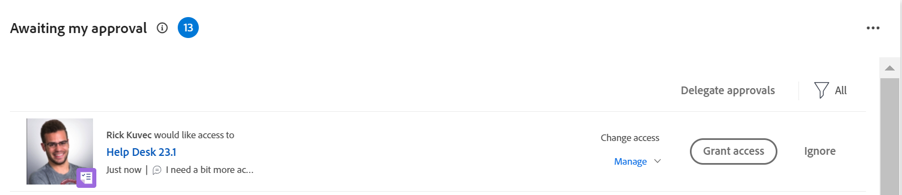

# Toegang verlenen tot objecten in het gebied Home

<!--Audited: 10/2024-->

Gebruikers kunnen toegang aanvragen tot objecten in Adobe Workfront.

Voor meer informatie over het verzoeken van toegang, zie [&#x200B; Toegang van het Verzoek tot voorwerpen &#x200B;](../../workfront-basics/grant-and-request-access-to-objects/request-access.md).

Als u de eigenaar van een object bent, kunt u toegang tot items vanuit uw thuisgebied verlenen of weigeren.

## Toegangsvereisten

+++ Breid uit om de toegangseisen voor de functionaliteit in dit artikel weer te geven. 

<table style="table-layout:auto"> 
 <col> 
 <col> 
 <tbody> 
  <tr> 
   <td role="rowheader">Adobe Workfront-pakket</td> 
   <td> 
Alle 
 </td> 
  </tr> 
  <tr> 
   <td role="rowheader">Adobe Workfront-licentie</td> 
   <td> 
Standard
 
   
Werk of hoger

   </td> 
  </tr> 
  <tr> 
   <td role="rowheader">Configuraties op toegangsniveau</td> 
   <td> 
Toegang tot of hoger weergeven voor projecten, taken, problemen of documenten
 </td> 
  </tr> 
  <tr> 
   <td role="rowheader">Objectmachtigingen</td> 
   <td> 
Machtigingen of hoger weergeven voor projecten, taken, problemen of documenten
 </td> 
  </tr> 
 </tbody> 
</table>

Voor meer detail over de informatie in deze lijst, zie [&#x200B; vereisten van de Toegang in de documentatie van Workfront &#x200B;](/help/quicksilver/administration-and-setup/add-users/access-levels-and-object-permissions/access-level-requirements-in-documentation.md).

+++

## Toegang verlenen tot objecten in het gebied Home

1. Klik het **Belangrijkste menu**  in de hoger-juiste hoek van het scherm, of het **Belangrijkste menu**  in de upper-left hoek, als beschikbaar, dan klik **Huis**
of
Klik het **Punt** pictogram van het Huis  in de upper-left hoek van Adobe Workfront.

   >[!NOTE]
   >
   >Uw Workfront-beheerder kan de volgende wijzigingen aanbrengen in het pictogram Home in uw omgeving:
   >
   >* Vervang deze door een afbeelding die is aangepast om uw organisatie te illustreren. In dit geval ziet het pictogram er anders uit dan in dit artikel.
   >* De gekoppelde pagina vervangen door een andere pagina. In dit geval, klik het **Belangrijkste Menu**  in de hoger-juiste hoek van de pagina, dan klik **Huis**.

1. Ga als volgt te werk:

   1. Ga naar **Mijn goedkeurt** widget en vind het verzoek om meer toegang, dan klik **de toegang van de Verlening**.

       goed

   1. (Facultatief) om een verschillend niveau van toegang te verlenen dan gevraagd, klik het drop-down menu links van de de toegangsknoop van de Verlening en selecteer de nieuwe toegang, dan klik de toegang van de Verlening **.**

      Het toegangsverzoek wordt verleend en het verdwijnt uit de lijst van goedkeuringsverzoeken.

1. (Facultatief) klik **negeren** om toegang te ontkennen. Het toegangsverzoek wordt niet verleend en het verzoek verdwijnt uit de lijst van goedkeuringsverzoeken.

## E-mailmeldingen configureren voor verzoeken om toegang

U kunt configureren of u e-mailmeldingen ontvangt voor toegangsverzoeken. Uw beheerder van Workfront kan deze functionaliteit onbruikbaar maken (zoals die in [&#x200B; wordt beschreven vormt gebeurtenisberichten voor iedereen in het systeem &#x200B;](../../administration-and-setup/manage-workfront/emails/configure-event-notifications-for-everyone-in-the-system.md)).

1. Ga naar uw gebruikersprofiel door één van het volgende te doen:

   * Klik het **Belangrijkste menu**  in de hoger-juiste hoek van het scherm, dan klik uw naam.
   * Klik het 2&rbrace; het profielpictogram van Adobe **Belangrijkste menu** &lbrace;in de hoger-juiste hoek, als beschikbaar, dan klik .**&#x200B;**

1. Klik **Meer** menu  aan het recht van uw naam in de kopbal, dan klik **uitgeven**.
1. Klik **Meldingen**, en selecteer of schrap **Iemand verzoekt toegang van me** in de **Nodig Actie** sectie, afhankelijk van of u e-mailberichten wilt ontvangen wanneer een andere gebruiker toegang van u vraagt of niet.

   U kunt een dagelijkse of onmiddellijke melding inschakelen.

1. Klik **sparen Veranderingen**.
